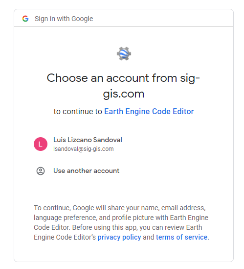
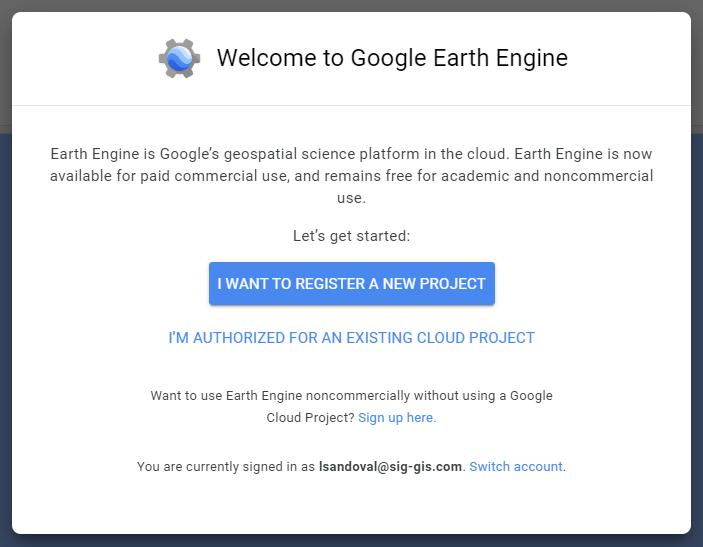
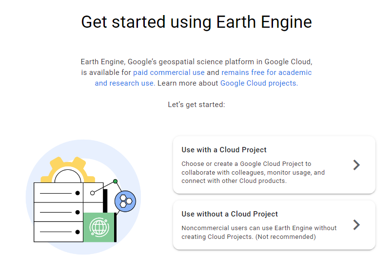
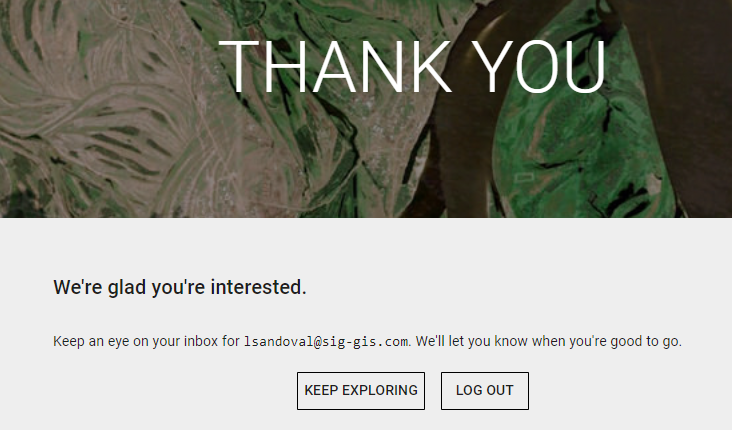
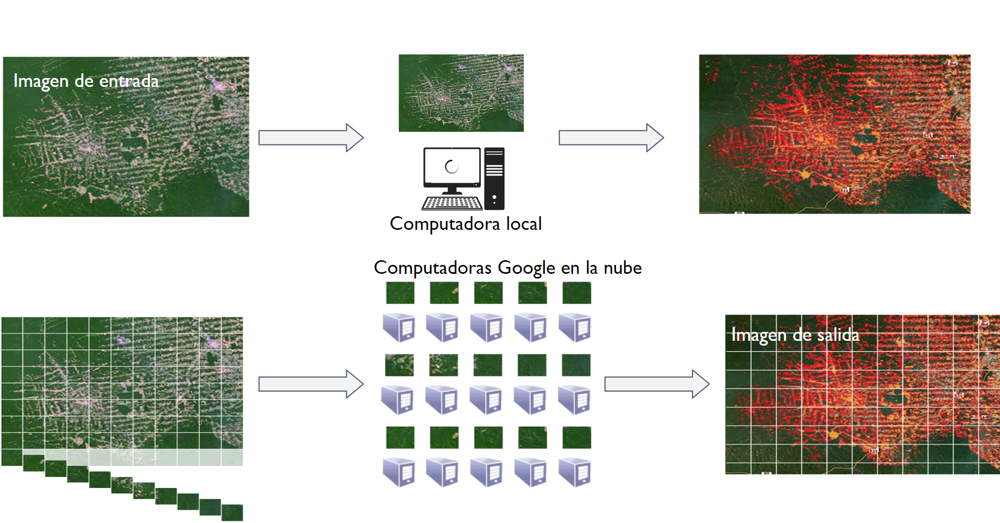
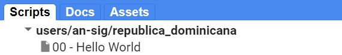

# Introducción

¡Bienvenido a una Introducción a Google Earth Engine (GEE)! Este taller brindará una descripción general de la plataforma geoespacial basada en la nube Google Earth Engine, sus beneficios sobre el software geoespacial de escritorio, el acceso a un gran catálogo de conjuntos de datos de teledetección, apllicativos en GEE, los fundamentos de la programación del lenguaje y principais conceptos. Mucho del contenido está basado en el libro [EEFA](https://eefabook.org).

## Configuración prévia

1. Crear una [cuenta de Google Earth Engine](https://code.earthengine.google.com/register). Necesitas una [cuenta Google](https://accounts.google.com/signup). Crear una cuenta GEE para fines no comerciales.



2. Aparecerá una ventana sugiriendo registrar un nuevo proyecto.



3. Pero podemos avanzar sin querer registrar un proyecto de Google Cloud.



4. Posteriormente aparecerá el formulario para registrarse. La aprobación puede tomar unos minutos o días.


5. Solo queda esperar el email de aprobación de nuestra cuenta para usar Google Earth Engine.




## Objetivos

1. Familiarizarse con la plataforma GEE y su entorno de programación.
2. Comprender el paradigma y los fundamentos de la programación utilizando la lenguaje JavaScript.
3. Aprender los principales objetos, comandos y procedimientos para recuperar, geoprocesar, visualizar y exportar imágenes.

## ¿Que es Google Earth Engine?

“Una plataforma de escala planetária para datos y análisis geoespaciales”.

Google Earth Engine combina un catálogo de varios petabytes de imágenes satelitales y conjuntos de datos geoespaciales con capacidades de análisis a escala planetaria. Los científicos, investigadores y desarrolladores usan Earth Engine para detectar cambios, mapear tendencias y cuantificar diferencias en la superficie de la Tierra. Earth Engine ahora está disponible para uso comercial y sigue siendo gratuito para uso académico y de investigación.

La infraestructura de procesamiento paraleliza automáticamente el análisis en muchos procesadores en muchas computadoras en los centros de datos de Google. Eso resulta en
reducción de los tiempos de procesamiento en órdenes de magnitud mediante el uso de potencia informática distribuida y basada en la nube. Además los datos están todos centralizados en la nube.



<font size=2> Fuente: Google </font>

Objetivos:

"Nuestra misión es organizar la información geospacial del mundo para que sea universalmente accesible y útil para todos."


- Facilitar
- Escalonamento, compartimento de scripts
- Acceso a todos

Focado en problemas actuales:

- Talla
- Desastres
- Cambio climático
- Sequía
- Enfermidades
- Sostenabilidad

## Conjunto de datos

El archivo de datos públicos de Earth Engine incluye más de cuarenta años de imágenes históricas y conjuntos de datos científicos, actualizados y ampliados diariamente.

- Más de 800 conjuntos de datos públicos
- Más de 70 petabytes de datos
- Más de 100 conjuntos de datos agregados anualmente
- 1+ PB de datos nuevos cada mes

(esos números están siempre siendo actualizados)

Tipos de datos:

- Imágenes de diferentes satélites
- Datos geofísicos (topografía, hidrología)
- Uso y cobertura de la tierra
- Clima y tiempo
- Datos vectoriales (Cuencas, red de transporte, etc)


<font size=2> Fuente: Google </font>

Para explorar todos los conjuntos de datos:

- [https://developers.google.com/earth-engine/datasets](https://developers.google.com/earth-engine/datasets)
- [https://developers.google.com/earth-engine/datasets/catalog](https://developers.google.com/earth-engine/datasets/catalog)


<font size=2> Fuente: Google </font>

## API

Una API es una forma de comunicarse con los servidores de Earth Engine. Le permite especificar qué cálculo le gustaría hacer y luego recibir los resultados. La API está diseñada para que los usuarios no tengan que preocuparse por cómo se distribuye el cálculo en un grupo de máquinas y cómo se ensamblan los resultados. Los usuarios de la API simplemente especifican lo que se debe hacer. Esto simplifica enormemente el código al ocultar los detalles de implementación a los usuarios. También hace que Earth Engine sea muy accesible para los usuarios que no están familiarizados con la escritura de código.

La API de Earth Engine está diseñada para ser independiente del idioma. Google proporciona bibliotecas de clientes oficiales para usar la API desde JavaScript y Python. La API sigue siendo prácticamente la misma independientemente del lenguaje de programación que utilice. La principal diferencia es la sintaxis utilizada para llamar a las funciones de la API. Una vez que aprenda la sintaxis de los lenguajes de programación, su código se puede adaptar fácilmente porque todos usan las mismas funciones API.

## Apps

Códigos pueden ser convertidos en aplicaciones mantenidas en Google Earth Engine. También puedes utilizar el API Python para desarrollar una aplicación web, con gran control de la interfaz del app.


<font size=2> Aplicación Earth Engine: MODIS Ocean Temperature - Time Series Inspector. Fuente: https://google.earthengine.app/view/ocean. </font>

Algunas de las aplicaciones de GEE incluyen:

- Clasificación de usos y coberturas de la tierra
- Mapeo de pérdida de bosques
- Detección de cambios en usos y coberturas de la tierra
- Mapeo de cultivos agrícolas
- Mapeo de fuegos
- Monitoreo de la calidad del aire
- Mapeo de cuerpos de agua

Ejemplos de aplicaciones desarrollados por SERVIR basados o que utilizan GEE:

- [RAMI](https://rami.servirglobal.net/) - SERVIR-Amazonia
- [RLCMS](https://landcovermapping.org/en/landcover/) - SERVIR-Mekong & SERVIR-HKH
- [Collect Earth Online](https://collect.earth) - SERVIR Global
- [HYDRAFloods](http://hydrafloods-servir.adpc.net/mapviewer/) - SERVIR-Mekong
- [EcoDash](http://ecodash-servir.adpc.net/) - SERVIR-Mekong
- [Mapeo de Trigo](http://geoapps.icimod.org/afwheat/) - SERVIR-HKH
- [Aptitud para Incendios](https://servir-amazonia.earthengine.app/view/aptitud-incendios) - SERVIR-Amazonia

Ejemplos generales:

- [Monitoreo de Fuegos en la Amazonia](https://gis-acca.users.earthengine.app/view/amazon-fire-tracker) - Monitoring of the Andean Amazon Project
- [Global Forest Change](https://glad.earthengine.app/view/global-forest-change) - University of Maryland
- [Global Forest Watch](https://www.globalforestwatch.org/) - World Resources Institute
- [Global Surface Water](https://global-surface-water.appspot.com/map) - Joint Research Center (JRC)
- [Monitoreo de Tigres](https://www.science.org/doi/10.1126/sciadv.1501675) - University of Minnesota and others
- [Map of Life](https://species.mol.org/species/map/Perdix_dauurica)
- [Mapeo del Riesgo de Malaria](http://www.shrinkingthemalariamap.org/) - University of California San Francisco
- [MapBiomas](https://mapbiomas.org)

## Interfaz

El Editor de código (Code Editor) es un entorno de desarrollo integrado para la API JavaScript de Earth Engine. Ofrece una manera fácil de escribir, depurar, ejecutar y administrar código. Una vez que haya seguido la documentación de Google sobre el registro de una cuenta de Earth Engine, debe seguir la documentación para abrir el [Code Editor](https://code.earthengine.google.com/). Cuando visite por primera vez el Editor de código, verá una pantalla como la que se muestra abajo.


El menú de la izquierda consta de tres pestañas: `Scripts`, `Docs`, `Assets`: En la sección Scripts tienes todo tu código almacenado y organizado en repositorios, carpetas, subcarpetas y archivos. Puede organizar sus scripts por proyecto y también puede compartir permisos de acceso o edición con otros usuarios de GEE. Docs es la [Documentación del API](https://developers.google.com/earth-engine/) con funciones y sus explicaciones. En Assets puedes almacenar y organizar archivos que carga desde su computadora o que descarga de GEE. En el centro, encontrará el editor de código basado en la web donde puede insertar su código JavaScript sin ninguna instalación previa de software. Con el botón `Apps`, puede desarrollar pequeñas aplicaciones automatizadas para procesar y visualizar datos de una manera e interfaz más fáciles de usar, mientras que el botón Run ejecuta el código. A la izquierda, tenemos tres paneles principales: `Inspector`, `Console` y `Tasks`. En la zona Consola podemos ver errores de código o valores impresos, esto nos permite depurar nuestro script. Veremos la funcionalidad de estos a medida que realicemos los próximos ejercicios.


## Ejercicio: mi primero script

El Editor de código le permite escribir código JavaScript y ejecutarlo. Cuando está aprendiendo un nuevo idioma por primera vez y acostumbrándose a un nuevo entorno de programación, es costumbre hacer un programa para mostrar las palabras "Hello World". Esta es una forma divertida de comenzar a codificar que le muestra cómo dar entrada al programa y cómo ejecutarlo. También podemos ver dónde el programa muestra la salida. Hacer esto en JavaScript es bastante simple. Copie el siguiente código en el panel central.

```javascript
print('Hello World');
```

La línea de código anterior utiliza la función de impresión de JavaScript (`print`) para imprimir el texto "Hello World" en la pantalla. Una vez que ingrese el código, haga clic en el botón `Run`. La salida se mostrará en el panel superior derecho en la pestaña `Console`.


Ahora sabe dónde escribir su código, cómo ejecutarlo y dónde buscar el resultado. Acabas de escribir tu primer script de Earth Engine, así que guardémoslo. Haga clic en el botón `Save`.


Si es su primera vez en Code Editor, una pantalla va a aparecer para crear su directorio principal: Su directorio principal es un ID único. Desde aquí puedes crear carpetas y repositorios de códigos. Puede elegir un nombre de su elección, pero recuerde que no se puede cambiar y siempre estará asociado con su cuenta. Una buena elección para el nombre sería el nombre de usuario de su cuenta de Google.


Una vez que se crea su carpeta de inicio, se le pedirá que ingrese a un nuevo repositorio. Un repositorio puede ayudarlo a organizar y compartir código. Su cuenta puede tener múltiples repositorios y cada repositorio puede tener múltiples scripts en su interior.


Finalmente, podrá guardar su script dentro del repositorio recién creado. Ingrese el nombre de su preferencia y haga clic en `OK`.


Una vez que se guarde el script, aparecerá en el panel del administrador de scripts (bajo `Owner`). Los scripts se guardan en la nube y siempre estarán disponibles para usted cuando abra el Editor de código.



¡Felicitaciones! Tu has creado su primeiro script.

# Repositorio

Todos los códigos creados en este taller están disponibles en este repositorio: [https://code.earthengine.google.com/?accept_repo=users/an-sig/republica-dominicana](https://code.earthengine.google.com/?accept_repo=users/an-sig/republica-dominicana), carpeta `T2`.
