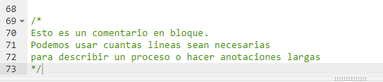
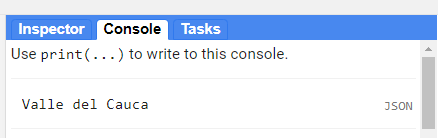
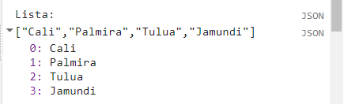
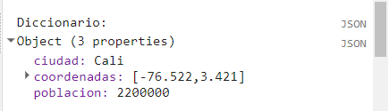
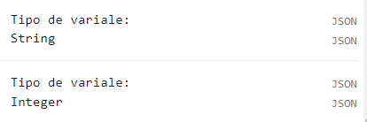
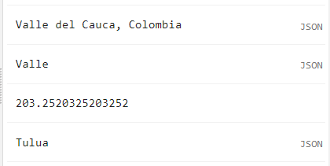
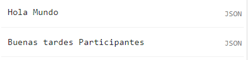

# Introducción al JavaScript y Conceptos de Earth Engine

Para poder construir un script para su análisis, necesitará usar JavaScript. Esta sección cubre la sintaxis de JavaScript y las estructuras de datos básicas en Earth Engine.

## Script
El script completo que se usará en esta sección esta disponible [aquí](https://code.earthengine.google.com/2efb29a872e0cebe2c67de29e81bd615).

## JavaScript

### Comentarios

Mientras escribe el código, es útil agregar un poco de texto para explicar el código o dejar una nota para usted. Es una buena práctica de programación agregar siempre comentarios en el código explicando cada paso. En JavaScript, puede prefijar cualquier línea con dos barras diagonales // para convertirlo en un comentario. El intérprete ignorará el texto del comentario y no se ejecutará.

```javascript
// ¡Esto es un comentario!
```

El Editor de código también proporciona un acceso directo (Ctrl + / en Windows, Cmd + / en Mac) para comentar o descomentar varias líneas a la vez. Puede seleccionar varias líneas y presionar la combinación de teclas para hacer que todos sean comentarios. Pulse de nuevo para invertir la operación. Esto es útil cuando se depura el código para detener la ejecución de ciertas partes del script.


Adicionalmente puede crear comentarios en bloque usando `/*` para abrir bloque y `*/` para cerrar bloque:



### Variables

En un lenguaje de programación, las variables se utilizan para almacenar valores de datos. En JavaScript, una variable se define usando la palabra clave `var` seguida del nombre de la variable. El siguiente código asigna el texto "Valle del Cauca" a la variable denominada `departamento`. Tenga en cuenta que la cadena de texto en el código debe estar entre comillas. Puede usar ' (comillas simples) o " (comillas dobles), y deben coincidir al principio y al final de cada cadena. En sus programas, es recomendable ser coherente: use comillas simples o comillas dobles en todo una secuencia de comandos determinada. Cada declaración de su secuencia de comandos debe terminar normalmente con un punto y coma, aunque el editor de código de Earth Engine no lo requiere.

```javascript
// Variable tipo texto o 'string'
var departamento = 'Valle del Cauca';
```

Si imprime la variable `departamento`, obtendrá el valor almacenado en la variable (Valle del Cauca) impreso en el Console.

```javascript
print(departamento);
```


Cuando asigna un valor de texto, a la variable se le asigna automáticamente el tipo *string*. También puede asignar números a variables y crear variables de tipo *número*. El siguiente código crea una nueva variable llamada `poblacion` y le asigna un número como su valor.

```javascript
// Variable tipo numero
var poblacion = 4500000;
print(poblacion);
```

### Listas

Es útil poder almacenar múltiples valores en una sola variable. JavaScript proporciona una estructura de datos llamada "lista" que puede contener múltiples valores. Podemos crear una nueva lista usando los corchetes [] y agregando múltiples valores separados por una coma.

```javascript
// Variable tipo lista.
var ciudades = ['Cali', 'Palmira', 'Tulua', 'Jamundi'];
print(ciudades);
```

Si observa la salida en la Consola, verá "`List`" con una flecha de expansión (▹) al lado. Al hacer clic en la flecha, se expandirá la lista y se le mostrará su contenido. Notará que junto con los cuatro elementos de la lista, hay un número al lado de cada valor. Este es el índice de cada artículo. Le permite hacer referencia a cada elemento de la lista mediante un valor numérico que indica su posición en la lista.



### Objetos JavaScript

Las listas le permiten almacenar múltiples valores en una sola variable de contenedor. Si bien es útil, no es apropiado para almacenar datos estructurados. Es útil poder hacer referencia a cada elemento con su nombre en lugar de su posición. Los objetos en JavaScript le permiten almacenar pares clave-valor, donde se puede hacer referencia a cada valor por su clave. Puede crear un `diccionario` usando las llaves {}. El siguiente código crea un objeto llamado `datosCiudad` con información sobre Cali.

Tenga en cuenta algunas cosas importantes sobre la sintaxis de JavaScript aquí. Primero, podemos usar varias líneas para definir el objeto. Solo cuando ponemos el punto y coma (;) el comando se considera completo. Esto ayuda a formatear el código para que sea más legible. También tenga en cuenta la elección del nombre de variable `datosCiudad`. La variable contiene dos palabras. La primera palabra está en minúsculas y la primera letra de la segunda palabra en mayúsculas. Este tipo de esquema de nomenclatura de unir varias palabras en un solo nombre de variable se denomina "camel case" (case camello). Si bien no es obligatorio nombrar sus variables usando este esquema, se considera una buena práctica a seguir. Las funciones y los parámetros en la API de Earth Engine siguen esta convención, por lo que su código será mucho más legible si también la sigue.

```javascript
var datosCiudad = {
    'ciudad': 'Cali',
    'coordinadas': [-76.522, 3.421],
    'poblacion': 2200000
};
print(datosCiudad);
```

El objeto se imprimirá en el `Console`. Puede ver que en lugar de un índice numérico, cada elemento tiene una etiqueta. Esto se conoce como la clave ('key') y se puede utilizar para recuperar el valor de un objeto.



Una forma programática de saber exactamente que tipo de variable se esta usando es usar la función `ee.Algorithms.ObjectType()`:
```javascript
// Las siguientes funciones son utiles para saber el tipo de variables que hay:
print('Tipo de variale:', ee.Algorithms.ObjectType(departamento));
print('Tipo de variale:', ee.Algorithms.ObjectType(poblacion));
```


Típicamente se pueden manipular variables sencillas de manera similar a otro lenguaje de programación. Por ejemplo estas son algunas acciones sencillas que se pueden ejecutar sin usar lenguaje Earth Engine (Server Side) en exceso:

```javascript
// El contenido de las variables puede ser manipulado:
var nuevoTexto    = departamento + ', Colombia' // Añadir contenido a texto
print(nuevoTexto);
var cortarTexto   = departamento.slice(0,5)     // Cortar porciones de texto
print(cortarTexto);
var nuevoNumero   = poblacion / 22140           // Operaciones matemáticas (de lado del cliente)
print(nuevoNumero);
var selectLista   = ciudades[2]                 // Seleccionar un elemento de una lista
print(selectLista);
var selectDicc    = datosCiudad['coordenadas']  // Seleccionar un elemento de un diccionario
print(selectDicc);
```



### Funciones

Mientras usa Earth Engine, deberá definir sus propias funciones. Las funciones toman las entradas del usuario, las usan para realizar algunos cálculos y envían una salida. Las funciones le permiten agrupar un conjunto de operaciones y repetir las mismas operaciones con diferentes parámetros sin tener que volver a escribirlas cada vez. Las funciones se definen utilizando la palabra clave `function`. El siguiente código define una función llamada `saludo` que toma una entrada llamada `nombre` y devuelve un saludo con el prefijo `Hola`. Tenga en cuenta que podemos llamar a la función con diferentes entradas y genera diferentes salidas con el mismo código.

```javascript
// Funciones
var saludo = function(x) {
    return 'Hola ' + x;
};
print(saludo('Mundo'));

// Otra forma de escribir una función:
function saludo2(x){
      return 'Buenas tardes ' + x;
}
print(saludo2('Participantes'));
```


