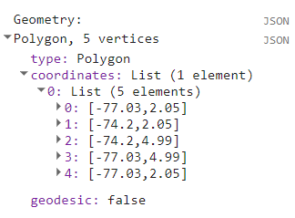
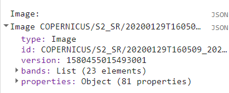
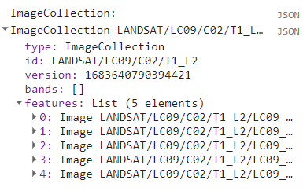
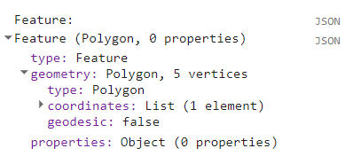
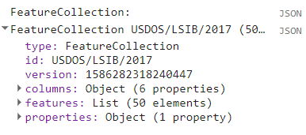
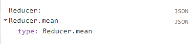
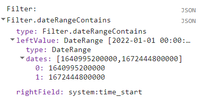
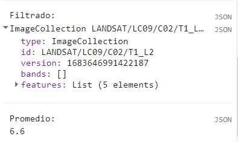
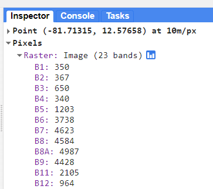
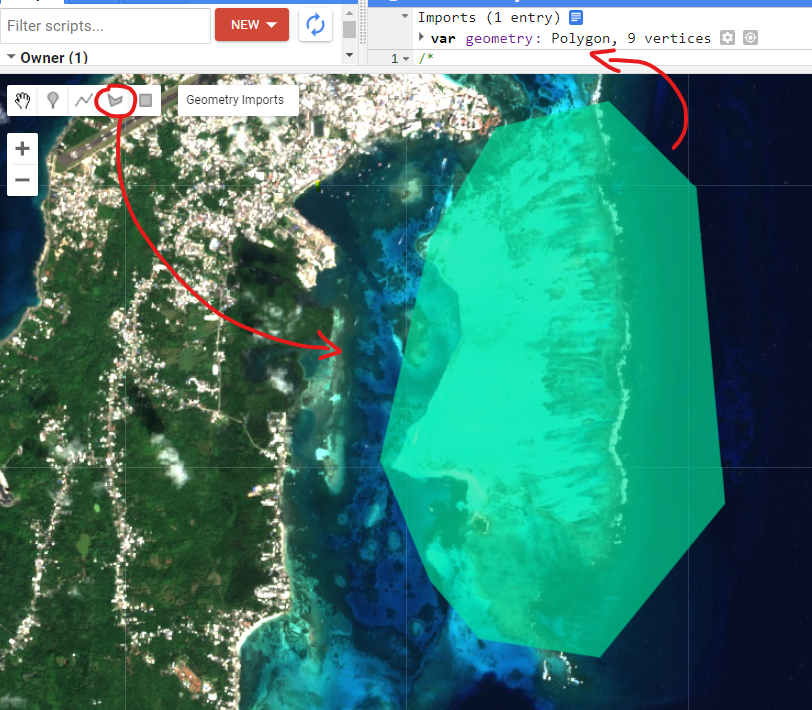

## Script
El script completo que se usará en esta sección esta disponible [aquí](https://code.earthengine.google.com/5c0c1eaa9d927e9e20ce2d66119d4b84).

# API de Earth Engine (Server Side)

La API de Earth Engine es amplia y proporciona objetos y métodos para hacer de todo, desde operaciones matemáticas sencillas hasta algoritmos avanzados para el procesamiento de imágenes. En el Editor de código, puede cambiar a la pestaña `Docs` para ver las funciones de la API agrupadas por tipos de objetos (o en la [documentación de Earth Engine](https://developers.google.com/earth-engine/apidocs)). Las funciones de la API tienen el prefijo `ee` (por Earth Engine).

 

Las diferentes tipos de variables también pueden ser definidas usando el lenguaje del API (Server Side):

```javascript
var eeNumber      = ee.Number(58);
var eeString      = ee.String('EE STRING');
var eeList        = ee.List([4,5,8,7,9]);
var eeDictionary  = ee.Dictionary({"a": 1, "b": 5, "c": 10});
var eeArray       = ee.Array([[0,1,0], [1,5,2], [5,7,9]]);
```

Es muy recomendable aprender a usar la API. Suponga que desea sumar dos números, representados por las variables a y b , como se muestra a continuación. Cree un nuevo script e ingrese lo siguiente:

```javascript
var a = 1;
var b = 2;
```

Anteriormente, aprendiste cómo almacenar números en variables, pero no cómo hacer ningún cálculo. Esto se debe a que cuando utiliza Earth Engine, no realiza sumas mediante operadores de JavaScript. Por ejemplo, no escribirías `var c = a + b` para sumar los dos números. En su lugar, la API de Earth Engine le brinda funciones para hacer esto, y es importante que use las funciones de la API siempre que pueda. Puede parecer incómodo al principio, pero usar las funciones, como lo describiremos a continuación, lo ayudará a evitar tiempos de espera y crear código eficiente.

Mirando la pestaña `Docs`, encontrará un grupo de métodos que se pueden llamar en un `ee.Number`. Expanda para ver las diversas funciones disponibles para trabajar con números. Verá la función `ee.Number` que crea un objeto de número de Earth Engine a partir de un valor. En la lista de funciones, hay una función de suma (`add`) para sumar dos números. Eso es lo que usas para sumar `a` y `b`.

 

Para sumar `a` y `b`, primero creamos un objeto `ee.Number` a partir de la variable a con `ee.Number(a)`. Y luego podemos usar la llamada `add(b)` para agregarle el valor de `b`. El siguiente código muestra la sintaxis e imprime el resultado que, por supuesto, es el valor 3.

```javascript
var resultado = ee.Number(a).add(b);
print(resultado);
```

Es posible que ya te hayas dado cuenta de que cuando aprendes a programar en Earth Engine, no necesitas aprender JavaScript o Python en profundidad, sino que son formas de acceder a la API de Earth Engine. Esta API es la misma ya sea que se llame desde JavaScript o Python.

Aquí hay otro ejemplo para llevar este punto a casa. Supongamos que está trabajando en una tarea que requiere que cree una lista de años desde 1980 hasta 2020 con un intervalo de cinco años. Si se enfrenta a esta tarea, el primer paso es cambiar a la pestaña `Docs` y abrir el módulo `ee.List`. Navegue a través de las funciones y vea si hay alguna función que pueda ayudar. Notará una función `ee.List.sequence`. Al hacer clic en él, aparecerá la documentación de la función.

 

La función `ee.List.sequence` puede generar una secuencia de números desde un valor inicial dado hasta el valor final. También tiene un paso de parámetro opcional para indicar el incremento entre cada número. Podemos crear una `ee.List` de números que representen los años desde 1980 hasta 2020, contando de 5 en 5, llamando a esta función predefinida con los siguientes valores: `start` = 1980, `end` = 2020 y `step` = 5.

```javascript
var secuencia = ee.List.sequence(1980, 2020, 5);
print(secuencia);
```

El resultado impreso en el `Console` mostrará que la variable `secuencia` contiene la lista de años con el intervalo correcto.

 

## Objetos más comunes en Earth Engine

Los conceptos fundamentales de Earth Engine con respecto a la teledetección incluyen:

- Geometría (`ee.Geometry`): El tipo de dato vectorial fundamental en Earth Engine. Línea / Punto / Polígono / etc.

    

```javascript
// ee.Geometry:
var polygon = 
    ee.Geometry.Polygon(
        [[[-77.03, 4.99],
          [-77.03, 2.05],
          [-74.20, 2.05],
          [-74.20, 4.99]]], null, false);
print('Geometry:',polygon); // La consola mostrará el tipo de objeto que es al imprimir una variable de estas. 
```
 

- Imagen (`ee.Image`): El tipo de dato raster fundamental en Earth Engine. Imagen con un grupo de bandas georreferenciadas. Cada banda tiene la su máscara, proyección, resolución, y una lista de propiedades que incluyen fecha, cuadro delimitador, etc.

    

```javascript
// ee.Image:
var image = ee.Image("COPERNICUS/S2_SR/20200129T160509_20200129T160512_T17RLK");
print('Image:',image);
```
 

- Colección de Imágenes (`ee.ImageCollection`): Una colección de imágenes

    

```javascript
// ee.ImageCollection:
var imageCollection = ee.ImageCollection("LANDSAT/LC09/C02/T1_L2").limit(5); //Limitar coleccion a 5 elemntos
print('ImageCollection:',imageCollection);
```

 

- Feature (`ee.Feture`): Una geometria con propriedades. Línea / Punto / Polígono / etc,
Lista de Propiedades

    

```javascript
// ee.Feature:
var feature = ee.Feature(polygon); // Podemos usar la geometría anterior para convertirla en ee.Feature
print('Feature:',feature);
```

 

- Colección de Features (`ee.FeatureCollection`): Una colección de Features (geometrias con propriedades)

    

```javascript
// ee.FeatureCollection:
var featureCollection = ee.FeatureCollection("USDOS/LSIB/2017").limit(50); //Limitar coleccion a 50 elemntos
print('FeatureCollection:',featureCollection);
```

 

- Reductores (`ee.Reducer`): Objeto utilizado para agregaciones y cálculos numéricos (para bandas, séries temporales, features...)

    
    

```javascript
// ee.Reducer:
var reducer = ee.Reducer.mean();
print('Reducer:',reducer);
```

 

- Filtros (`ee.Filter`): Objeto para filtrar colecciones de imágenes o features de acuerdo a sus propiedades.

```javascript
// ee.Filter:
var filter = ee.Filter.date('2022-01-01','2022-12-31');
print('Filter:',filter); // Las fechas se muestran en formato de milisegundos.
```

 

Para más informaciones acceder al [sitio EE de objetos y métodos](https://developers.google.com/earth-engine/guides/objects_methods_overview).

Ya que los reductores y filtros son objetos que deben ser usados sobre otros objetos para poder producir un valor o información adecuada, veremos estos ejemplos sobre cómo aplicarlos correctamente:

```javascript
// Aplicamos un filtro a la variable "imageCollection" y un reductor a una lista "eeList", creados anteriormente:
var filtrado = imageCollection.filter(filter); // Aplicando filtro a un ee.ImageCollection
print('Filtrado:',filtrado);
var promedio = eeList.reduce(reducer);         // Aplicando Reducer a un ee.List
print('Promedio:',promedio);
```

 


## Objetos Geospaciales: Véctor & Ráster

Los objetos rásters en Earth Engine están agrupados en imágenes satelitales, modelos de elevación, etc. Es considerado ráster todo elemento georreferenciado que contenga información númerica en pixeles. El formato típico de estos elementos en GEE es GeoTIFF. En Google Earth Engine se puede usar la herramienta `Inspector` para obtener información de cada pixel al hacer click en cualquier parte de la imagen. La función `Map.addLayer()` es la usada para visualizar los objetos geospaciales en el mapa de GEE.

```javascript
var image = ee.Image("COPERNICUS/S2_SR_HARMONIZED/20230117T155519_20230117T155804_T17PMP");
Map.addLayer(image,{bands:['B4','B3','B2'],min:0,max:2000},'Raster');
```

 

Por otro lado los objetos vectoriales en Earth Engine son todos aquellos que tienen una geomtería de puntos, líneas, o polígonos, y además estan georreferenciados. Estos elementos tambien pueden contener información de forma tabular y pueden ser importados/exportados en formato SHP o CSV. Además estos objetos pueden ser creados manualmente en la pataforma de GEE con las herramientas de la barra superior izquierda en el mapa. Al crear una geometría nueva, se creará automaticamente una variable llamada `geometry` almacenada en la parte superior del `code editor`. Esta variable puede ser renombrada al dar click sobre su nombre.

 


### Desafío 1

Suponga que tiene las siguientes dos variables de cadena definidas en el código a continuación. Usa la API de Earth Engine para crear una nueva variable de cadena llamada `resultado` combinando estes dos `Strings`. Imprímelo en el `Console`. El valor impreso debe decir "Sentinel2A".

```javascript
var mision = ee.String('Sentinel');
var satelite = ee.String('2A');
```

*Sugerencia*: use la función `cat` del módulo `ee.String` para "concatenar" (unir) los dos `strings`. Encontrará más información sobre todas las funciones disponibles en la pestaña `Docs` del Editor de códigos.

 

### Desafío 2

Crear un diccionario llamado `misInformaciones` utilizando el objeto `ee.Dictionary` con sus informaciones personales: `nombre`, `edad`, y una lista de sus 3 películas preferidas `peliculas`. Imprímelo en el `Console`.

### Desafío 3

Obtener el valor guardado en el `edad` y guardarlo en una variable con un nuevo nombre (ejemplo: `miEdad`). Imprímelo en el `Console`.

*Sugerencia*: utilice la función `get()` del objeto `ee.Dictionary`.

Observe que el valor impreso es del tipo `Computed Object`. Eso significa que no es un objeto EE aún. Si tuviera que realizar una operación matemática con este número, necesitaría "lanzarlo" (cast) al objeto `ee.Number`.

### Desafío 4

Obtener el segundo valor de la lista abajo y guardarlo en una variable.
Dividir ese número por 2. Imprimir el resultado en el `Console`.

*Sugerencia*: busque informaciones para la función `get()` de `ee.List`. Tenga en cuenta que la indexación comienza en 0.

```javascript
var miLista = ee.List([1, 2, 5, 4]);
```

### Desafío 5

Multiplicar el segundo valor de `miLista` por 5 y guardarlo en una variable (ejemplo: `resultado`). Imprímelo en el `Console`.

*Sugerencia*: buscar por la función `multiply()` de `ee.Number`. Es necesario convertir (cast) el segundo valor de `miLista` a un `ee.Number` primero, antes de que se puedan usar las funciones numéricas. Tenga en cuenta que nos es necesário convertir (cast) el número 5 adentro de `multiply` - Earth Engine ya converte ese número para `ee.Number` una vez que estamos utilizando la función del API.

### Desafío 6

Multiplica cada número en `miLista` por 3. Guarda el resultado en una nueva variable llamada `nuevaLista` e imprímelo.

*Sugerencia*: complete la función `triplicar` a continuación. Use `map()` para aplicar la función a cada elemento de la lista. No te olvides del casting.

```javascript
function triplicar(numero) {
  return ; // completar esa función.
}
```

### Desafío 7

Calcula la suma de todos los Números en `nuevaLista`. Guardar y imprimir ese valor como `suma`.
