# Colecciones en Google Earth Engine

El archivo de datos públicos de Earth Engine incluye más de cuarenta años de imágenes históricas y conjuntos de datos científicos, actualizados y ampliados diariamente.

Las colecciones ráster y vectoriales que ofrece GEE pueden ser exploradas desde su catálogo [aquí](https://developers.google.com/earth-engine/datasets/), o buscadas por palabra clave en la barra de búsqueda superior del`code editor`.

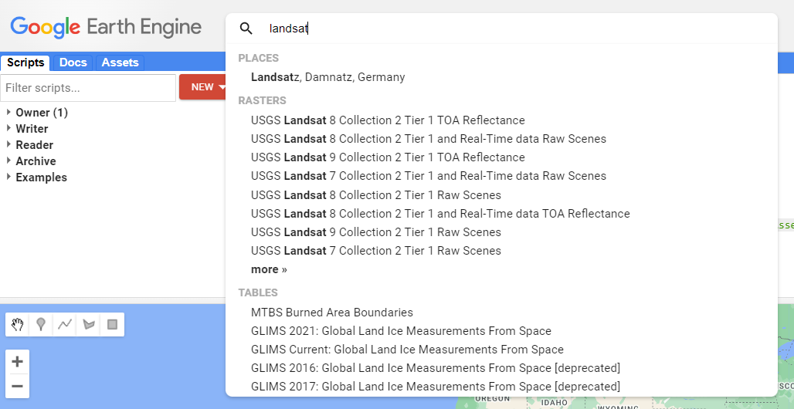 

## Importar colecciones

Las colecciones pueden ser importadas llamandolas a través de la función que corresponde si son datos ráster (`ee.ImageCollection()`) o vectoriales (`ee.FeatureCollection`), seguido por el ID específico para la colección de interés.

Por ejemplo el ID de una de las colecciones de Sentinel-2 se puede visualizar en la parte inferior izquierda de la ventana de información de esa colección:

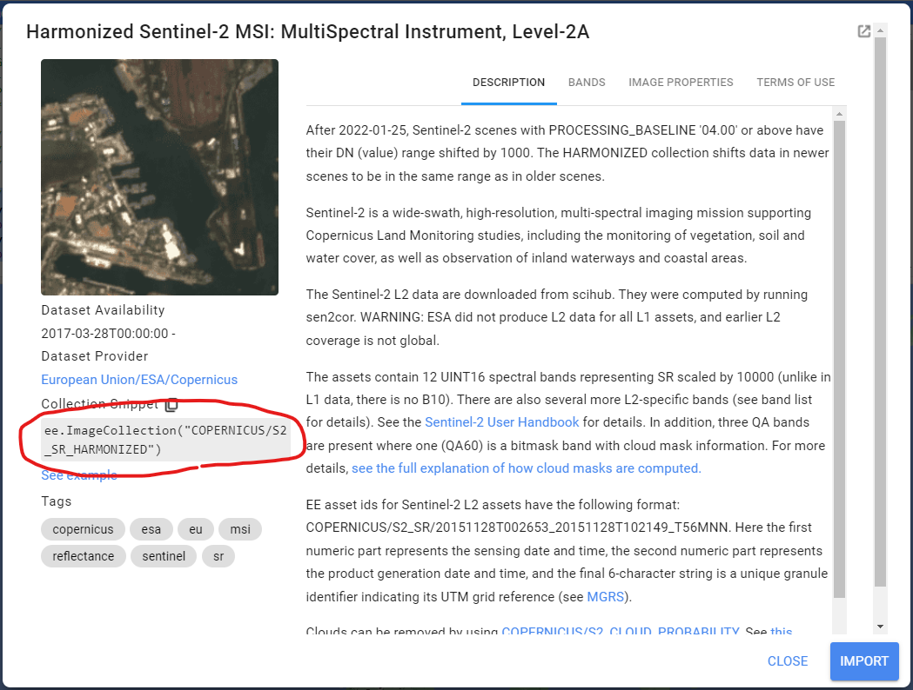 

De igual forma, una colección, imágen, o incluso datos vectoriales pueden ser importados desde nuestros Assets. Por ejemplo, el siguiente es un ee.FeatureCollection que contiene multiples polígonos de los Parques Nacionales Naturales de Colombia, el cual fue descargado, comprimido como ZIP y subido a GEE como SHP. Como se puede observar esta colección tiene metadatos asociados a cada Feature (o polígono). Este archivo se puede descargar desde el repositorio github [aquí](https://github.com/SERVIR-Amazonia/colombia-training/tree/ce5c227b1e0b05423c2ad7f2fe4a9b87cd14fb6d/files).

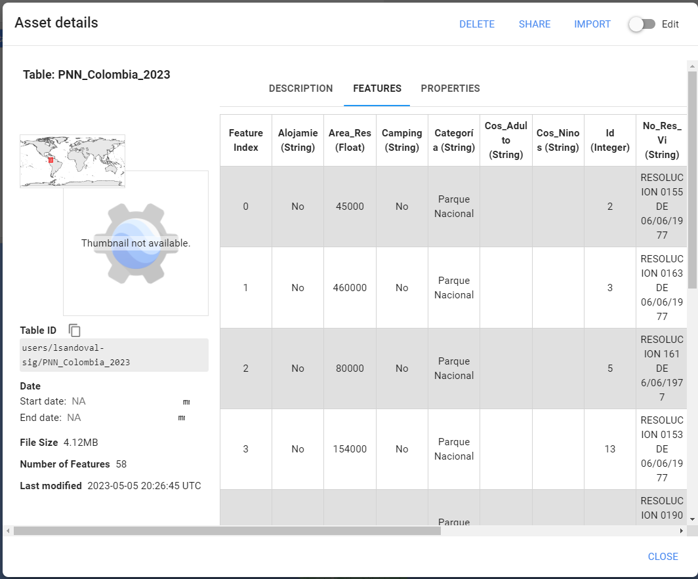 

```javascript
// Una colección puede ser importada desde el catálogo de GEE o nuestros Assets:
var sentinel2 = ee.ImageCollection("COPERNICUS/S2_SR_HARMONIZED"); // Catálogo EE
print('Sentinel-2:',sentinel2.limit(10));

var pnn = ee.FeatureCollection('users/lsandoval-sig/PNN_Colombia_2023');
print('PNN Colombia:',pnn);
```
Como se puede observar los archivos en nuestros Assets pueden ser privados, compartidos con usuarios o apps específicos, o pueden ser totalmente públicos. En este caso, la colección de PNN de Colombia está configurada como pública, por lo tanto cualquier usuario puede importarla usando la dirección adecuada `'users/lsandoval-sig/PNN_Colombia_2023'`.

## Uso de propiedades o metadatos

Los objetos ráster y vectoriales contienen propiedades o metadatos que son de utilidad para identificar, filtrar, localizar, e incluso hacer procesos más complejos de los elementos en una colección.

En este ejemplo hemos seleccionado el primer elemento de cada colección para conocer cuales son sus propiedades. Estas propiedades deben ser consistentes a la largo de todos los elementos de una colección.

```javascript
// Propiedades de cada elemento en la colección:
print('Propiedades Sentinel-2:',sentinel2.first().propertyNames()); // ImageCollection
print('Propiedades PNN:',pnn.first().propertyNames());              // FeatureCollection
```

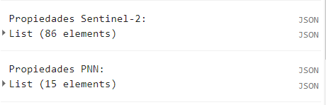 

Adicionalmente, en objetos ráster podemos saber el nombre de las bandas disponibles:

```javascript
// Nombres de bandas:
print('Nombres de Bandas S2:',sentinel2.first().bandNames());
```

El tamaño de una colección puede conocerse también. En este ejemplo limitamos la colección de Sentinel-2 a 10 elementos, dado que si la imprimimos completa en la consola nos regresaría un error de tiempo `time out error` debido a que es una cantidad muy grande de imágenes de todo el mundo durante varios años.

```javascript
// Tamaño de Colección:
// Al usar en colecciones muy grandes puede causar un error de tiempo de carga.
// Para este ejemplo se limita una coleccion a 10 elementos
print('Numero de Imagenes S2:',sentinel2.limit(10).size());
print('Numero de PNN:',pnn.size());
```

Otra función muy útil para sacarle provecho a los metadatos es la extracción de IDs, con esto podemos identificar el nombre de cada elemento dentro de una colección, e incluso filtrar por nombres.

```javascript
// Obtener ID de cada elemento en la colección:
print('Sentinel-2 IDs: ', sentinel2.limit(10).aggregate_array('system:index'));
print('PNN IDs: ', pnn.aggregate_array('Nombre'));
```

## Visualización


## Imágenes satelitales

Las imágenes satelitales están en el corazón del poder de Google Earth Engine. Esta sección le enseña cómo inspeccionar y visualizar datos almacenados en bandas de imágenes. Primero visualizamos bandas individuales como capas de mapa separadas y luego exploramos un método para visualizar tres bandas diferentes en una sola capa compuesta. Comparamos diferentes tipos de compuestos para bandas satelitales que miden la radiación electromagnética en el espectro visible y no visible.

Primero vamos visualizar una imagen de Landsat 9 de 26 de Julio de 2022 de la parte oeste de la República Dominicana. Puede explorar la imagen de varias maneras. Para comenzar, puede recuperar metadatos (datos descriptivos sobre la imagen) imprimiendo la imagen.

```javascript
var primeraImagen = ee.Image('LANDSAT/LC09/C02/T1_L2/LC09_009058_20230226');
print(primeraImagen);
```

En el `Console`, debe hacer clic en las flechas de expansión para mostrar la información. Vemos que esta imagen consta de 19 bandas diferentes. Para cada banda, los metadatos enumeran cuatro propiedades, pero por ahora simplemente notemos que la primera propiedad es un nombre o etiqueta para la banda entre comillas. Por ejemplo, el nombre de la primera banda es “SR_B1”.

 

Ahora agreguemos una de las bandas al mapa como una capa para que podamos verla.

```javascript
Map.addLayer(
    primeraImagen, //  dato para visualizar
    {
        bands: ['SR_B1'], //  banda de imagen para visualizar
        min: 6000, //  rango de visualización 
        max: 11000
    },
    'Capa 1' //  nombre que aparece en Layer Manager
);
```

El código aquí usa el método `addLayer` del mapa (`Map`). Hay cuatro componentes importantes del comando anterior:

- `primeraImagen`: este es el conjunto de datos que se mostrará en el mapa.
- `bands`: Estas son las bandas particulares del conjunto de datos para mostrar en el mapa. En nuestro ejemplo, mostramos una sola banda llamada "SR_B1".
- `min`, `max`: estos representan los límites inferior y superior de los valores de "SR_B1" para mostrar en la pantalla. De forma predeterminada, el valor mínimo proporcionado (6000) se asigna a negro y el valor máximo proporcionado (11000) se asigna a blanco. Los valores entre el mínimo y el máximo se asignan linealmente a una escala de grises entre blanco y negro. Los valores por debajo de 6000 se dibujan en negro. Los valores por encima de 11000 se dibujan en blanco. Juntos, los parámetros de bandas, mínimo y máximo definen parámetros de visualización o instrucciones para la visualización de datos.
- `'Capa 1'`: esta es una etiqueta para que la capa del mapa se muestre en el Administrador de capas (Layer Manager). Esta etiqueta aparece en el menú desplegable de capas en la parte superior derecha del mapa.

Cuando ejecuta el código, es posible que no note la imagen que se muestra a menos que se desplace y la busque. Para hacer esto, haga clic y arrastre el mapa hacia la República Dominicana (También puede saltar allí escribiendo "Dominican Republic" en el panel de búsqueda en la parte superior del Editor de código, donde el indicador dice "Search places and datasets"...) Utilice la herramienta de zoom para aumentar el nivel de zoom y hacer que el cuadrado parezca más grande.

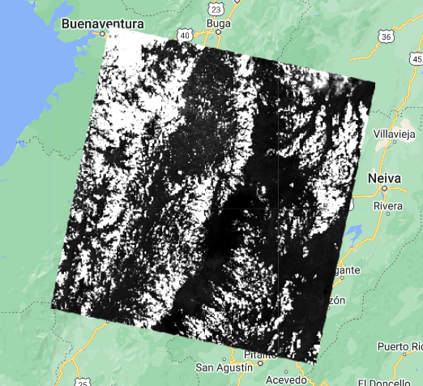 

¿Puedes reconocer alguna característica en la imagen?

Exploremos esta imagen con la herramienta `Inspector`. Cuando hace clic en la pestaña `Inspector` en el lado derecho del Editor de código, su cursor ahora debería verse como una cruz. Cuando hace clic en una ubicación en la imagen, el panel `Inspector` informará los datos de esa ubicación en tres categorías de la siguiente manera:

 

- Punto: datos sobre la ubicación en el mapa. Esto incluye la ubicación geográfica (longitud y latitud) y algunos datos sobre la visualización del mapa (nivel de zoom y escala).
- Píxeles: datos sobre el píxel en la capa. Si expande esto, verá el nombre de la capa del mapa, una descripción de la fuente de datos y un gráfico de barras. En nuestro ejemplo, vemos que la `"Capa 1"` se extrae de un conjunto de datos de imagen que contiene 19 bandas. Debajo del nombre de la capa, el gráfico muestra el valor de píxel en la ubicación en la que hizo clic para cada banda en el conjunto de datos. Cuando pasa el cursor sobre una barra, aparecerá un panel para mostrar el nombre de la banda y el "valor de la banda" (valor de píxel). Para encontrar el valor de píxel para "SR_B1", desplace el cursor sobre la primera barra de la izquierda. Alternativamente, al hacer clic en el pequeño ícono azul a la derecha de la `"Capa 1"` (B. en la imagen arriba), cambiará la visualización de un gráfico de barras a un diccionario que informa el valor de píxel para cada banda.
- Objetos: datos sobre el conjunto de datos de origen. Aquí encontrará metadatos sobre la imagen que se parece mucho a lo que recuperó anteriormente cuando le indicó a Earth Engine que imprimiera la imagen en el `Console`.

Podemos usar el color para comparar estas diferencias visuales en los valores de píxeles de cada capa de banda a la vez como un compuesto RGB. Este método utiliza los tres colores primarios (rojo, verde y azul) para mostrar los valores de cada píxel en tres bandas.

Para probar esto, agregue este código y ejecútelo.

```javascript
Map.addLayer(
    primeraImagen,
    {
        bands: ['SR_B4', 'SR_B3', 'SR_B2'],
        min: 7000,
        max: 12000
    },
    'Color Natural');
```

El resultado se parece al mundo que vemos y se denomina compuesto de color natural, porque empareja naturalmente los rangos espectrales de las bandas de la imagen para mostrar los colores. Esta imagen, también denominada composición de color verdadero, muestra la banda espectral roja con tonos de rojo, la banda verde con tonos de verde y la banda azul con tonos de azul. Especificamos el emparejamiento simplemente a través del orden de las bandas en la lista: B4, B3, B2. Debido a que las bandas 4, 3 y 2 de Landsat 9 corresponden a los colores del mundo real de rojo, verde y azul, la imagen se asemeja al mundo que veríamos fuera de la ventana de un avión o con un dron volando bajo.

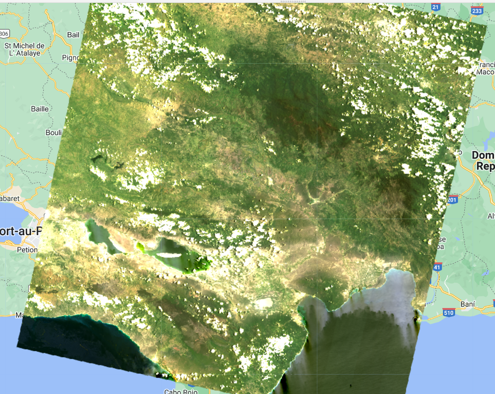 

Para usar las unidades correctas podemos buscar las propiedades de esta colección, y saber si se requiere aplicar una escala específica. Para la colección de Landsat-9 L2 se debe aplicar la siguiente escala a las bandas multiespectrales y las bandas térmicas:

```javascript
// Función para aplicar factores de escala a images de Landsat-9
function applyScaleFactors(image) {
  var opticalBands = image.select('SR_B.').multiply(0.0000275).add(-0.2);
  var thermalBands = image.select('ST_B.*').multiply(0.00341802).add(149.0);
  return image.addBands(opticalBands, null, true)
              .addBands(thermalBands, null, true);
}

// Aplicar función a imagen
primeraImagen = applyScaleFactors(primeraImagen);

// Visualizar
// El rango para visualizar imagenes RGB que han sido escaladas es usualmente entre 0.0 y 0.2-0.3.
Map.addLayer(
    primeraImagen,
    {
        bands: ['SR_B4', 'SR_B3', 'SR_B2'],
        min: 0.0,
        max: 0.2
    },
    'Color Natural');
```

Ahora, podemos agregar más dos capas, pero con colores falsos, utilizando las bandas `SR_5`, `SR_4`, `SR_3` y `SR_6`, `SR_5`, `SR_4`.

```javascript
Map.addLayer(
    primeraImagen,
    {
        bands: ['SR_B5', 'SR_B4', 'SR_B3'],
        min: 6000,
        max: 18000
    },
    'Color falso');

Map.addLayer(
    primeraImagen,
    {
        bands: ['SR_B6', 'SR_B3', 'SR_B2'],
        min: 6000,
        max: 20000
    },
    'Color falso infrarrojo corto');
```

¿Qué coberturas se sobresalen en estas combinaciones de bandas?

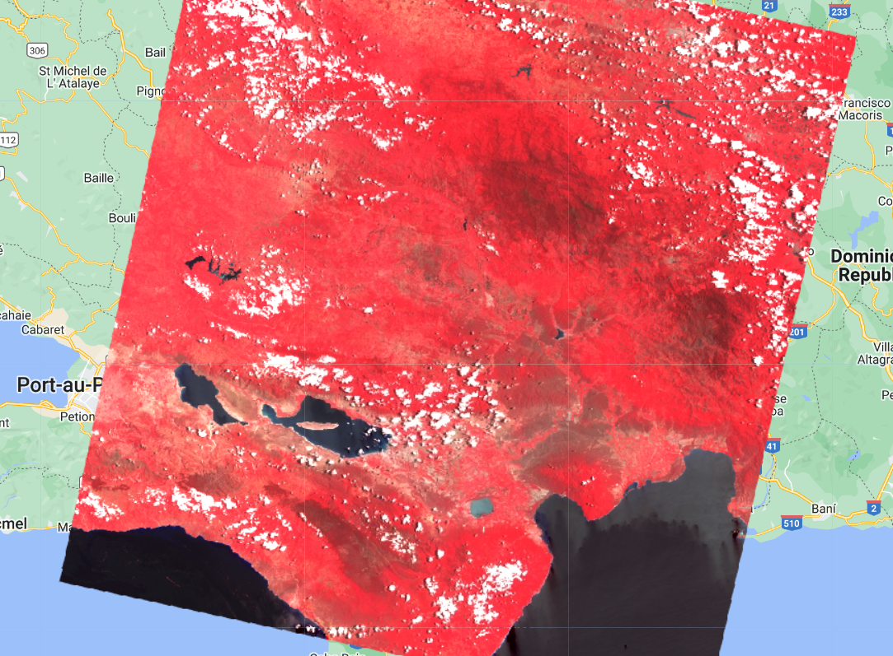 
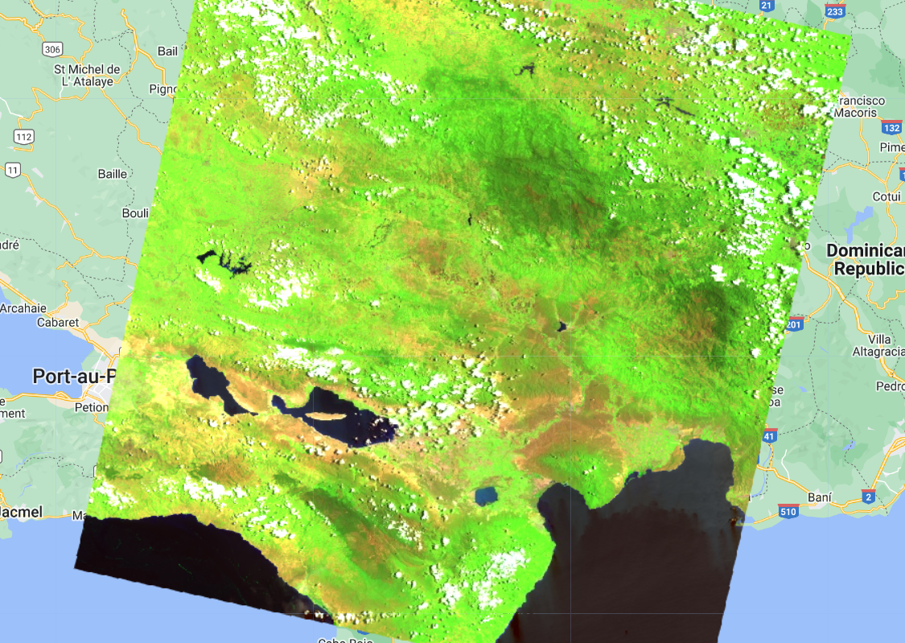 

### Código completo

Script "`4 Visualización de Imagen`" del repositorio y la carpeta `T2` o link directo:
[https://code.earthengine.google.com/bdf85f5ec78e23bb6ab20c1987214710](https://code.earthengine.google.com/bdf85f5ec78e23bb6ab20c1987214710).

## Datos vectoriales

Hay también otros tipos de datos en Earth Engine, como datos vectoriales, vamos utilizar un conjunto de datos de la Organización de las Naciones Unidas para la Alimentación y la Agricultura (FAO) para seleccionar los limites administrativos de la República Dominicana (extraer un polígono). Este conjunto de datos contiene vectores de limites de todos los países del mundo y es una colección de features (`ee.FeatureCollection`). Creando un nuevo script:

```javascript
var paises = ee.FeatureCollection('FAO/GAUL_SIMPLIFIED_500m/2015/level0');

Map.addLayer(paises, {}, 'paises');
```

 

Una de las propiedades deste conjunto de datos se llama `ADM0_NAME` que corresponde al nombre del país. Vamos filtrar este conjunto de datos para obtener la geometría de la República Dominicana. Para eso, utilizaremos la función `filter` y eligiremos el filtro `ee.Filter.eq` ya que queremos buscar el `ee.Feature` que tenga el nombre igual a "República Dominicana" (`eq` de egualdad). Mire en los `Docs` más informaciones sobre la función `filter` abajo `ee.FeatureCollection` y sobre el objeto `ee.Filter`.

Antes, cambie la última línea del código para que la variable `paises` no se cargue al mapa automaticamente - hacemos eso agregando el parámetro `false` al final de `Map.addLayer`.

```javascript
Map.addLayer(paises, {}, 'paises', false);
```

Así, la capa estará disponible en el Administrador de capas pero no se carga al mapa una vez que corre el código.

Ahora, podemos filtrar la colección de features. También vamos utilizar la función `Map.centerObject` para centrar el mapa a la República Dominicana. Elegimos un nível de zoom 8. Níveles de zoom son de 1 hasta 24.

```javascript
var republicaDominicana = paises.filter(ee.Filter.eq('ADM0_NAME', 'Dominican Republic'));
Map.centerObject(republicaDominicana, 8);
Map.addLayer(republicaDominicana, {}, 'República Dominicana');
```

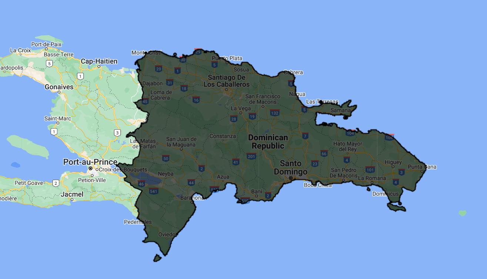 

Note que la capa paises está en el Administrador de capas pero apagada.

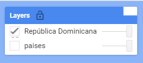 

Puedes cambiar la color del feature agregando el parámetro `color` y elegindo un color (ejemplo para rojo): `Map.addLayer(republicaDominicana, {color: 'red'}, 'República Dominicana')`;

Ahora vamos utilizar datos vectoriales en conjunto con imágenes.

### Código completo

Script "`5 Datos vectoriales`" del repositorio y la carpeta `T2` o link directo:
[https://code.earthengine.google.com/9e7e01899e6531bf5bb5b1ef6243dbff](https://code.earthengine.google.com/9e7e01899e6531bf5bb5b1ef6243dbff).

## Colección de imágenes satelitales y compuestos

Dependiendo de cuánto tiempo haya estado en funcionamiento una plataforma de teledetección, puede haber miles o millones de imágenes recopiladas de la Tierra (e.g. Landsat). En Earth Engine, estos se organizan en `ee.ImageCollection`, un tipo de datos especializado que tiene operaciones específicas disponibles en la API de Earth Engine. Al igual que las imágenes individuales, se pueden ver con `Map.addLayer`, filtrar utilizando la función `filter`, y mapear funciones com `map`.

Vamos filtrar la colección Landsat 8 Collection 2, Tier 1, Level 2, a los limites de la República Dominicana, utilizando la función `filterBounds` e por fechas para obtener imágenes de Enero de 2020 hasta Deciembre de 2021, utilizando la función `filterDate`.

```javascript
var paises = ee.FeatureCollection('FAO/GAUL_SIMPLIFIED_500m/2015/level0');
var republicaDominicana = paises.filter(ee.Filter.eq('ADM0_NAME', 'Dominican Republic'));
Map.centerObject(republicaDominicana, 7);

var landsat8 = ee.ImageCollection('LANDSAT/LC08/C02/T1_L2');

var coleccion = landsat8
    .filterDate('2020-01-01', '2022-01-01')
    .filterBounds(republicaDominicana);

Map.addLayer(coleccion, {bands: ['SR_B4', 'SR_B3', 'SR_B2'], min: 7000, max: 12000}, 'Coleccion Landsat 8');

print(coleccion);
```

El resultado es imágenes superpuestas unas a las otras y un total de 432 imágenes. Tenga en cuenta que las imágenes que aparecen al topo están de acuerdo con la orden de las imágenes adentro de la colección. En el `Console` puedes mirar el orden de las imágenes.

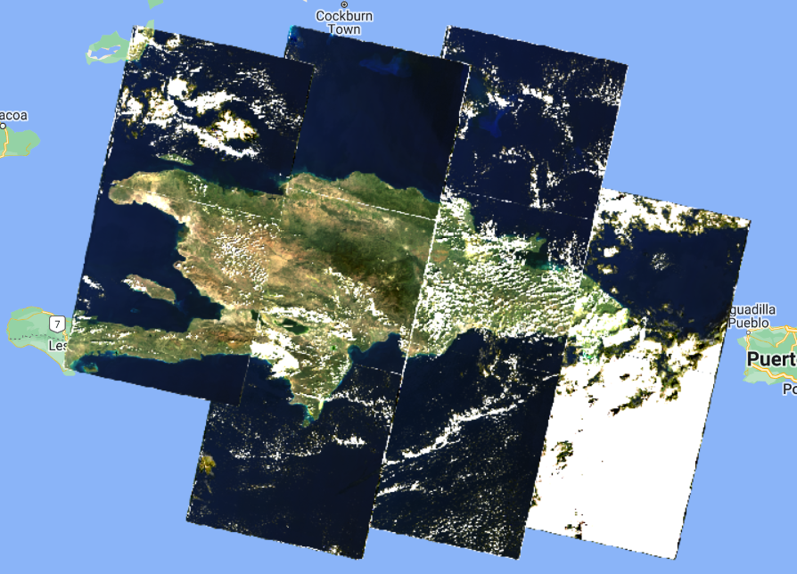

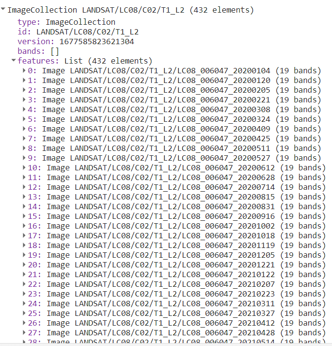

Podemos filtrar la colección por cobertura de nubes también. Para eso, agregamos más uno filtro en la variable `landsat8` y utilizamos la propiedad `CLOUD_COVER` que contiene información de percentaje de cobertura de nube por imagen. Cambie la variable `coleccion`:

```javascript
var coleccion = landsat8
    .filterDate('2020-01-01', '2021-01-01')
    .filterBounds(republicaDominicana)
    .filter(ee.Filter.lt('CLOUD_COVER', 10));
```

Utilizamos el `ee.Filter.lt` para obtener imágenes que tengam cobertura de nubes "menor que" 10%. Note que ahora tenemos 99 imágenes.

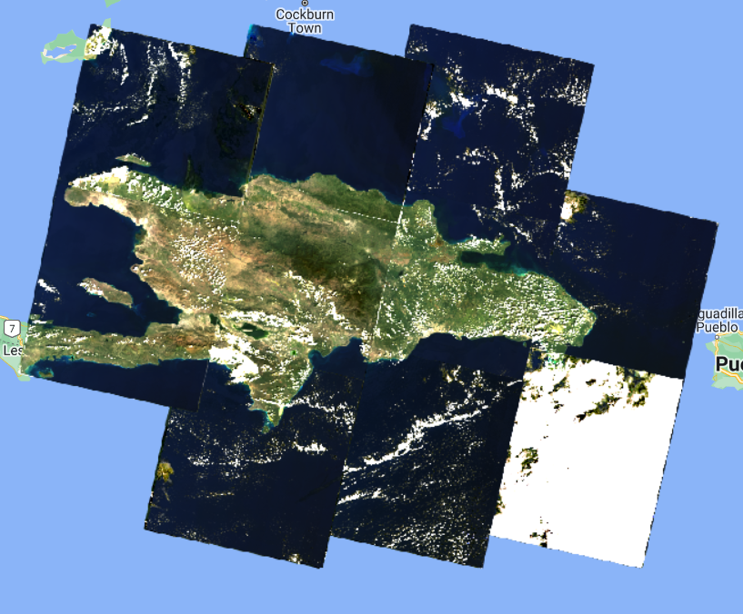

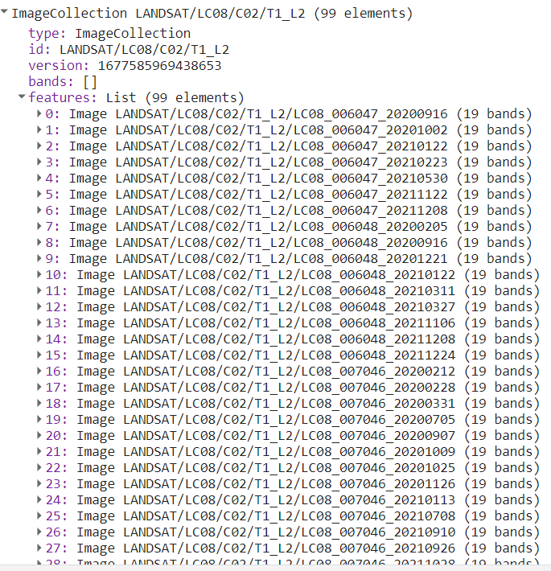

Ahora, vamos aplicar una función para enmascaramiento de nubes. Las nubes y las sombras de las nubes reducen la vista de los sensores ópticos y bloquean u oscurecen por completo la respuesta espectral de la superficie de la Tierra. Trabajar con píxeles que están contaminados por nubes puede influir significativamente en la precisión y el contenido de la información de los productos derivados de una variedad de actividades de detección remota, incluida la clasificación de la cobertura terrestre, el modelado de la vegetación y, especialmente, la detección de cambios, donde las nubes no detectadas pueden mapearse como cambios falsos. Por lo tanto, la información proporcionada por los algoritmos de detección de nubes es fundamental para excluir las nubes y las sombras de las nubes de los pasos de procesamiento posteriores.

Primero, escalonamos las imágenes ya que es recomendado por el desarrollador ([https://developers.google.com/earth-engine/datasets/catalog/LANDSAT_LC08_C02_T1_L2](https://developers.google.com/earth-engine/datasets/catalog/LANDSAT_LC08_C02_T1_L2)). Se debe aplicar un factor de escala tanto a la Colección 1 como a la Colección 2 Landsat Nivel-2 de reflectancia superficial y productos de temperatura superficial antes de usar los datos. Tenga en cuenta: los productos científicos Landsat Collection 1 y Collection 2 de nivel 2 tienen diferentes factores de escala, valores de relleno y tipos de datos diferentes ([https://www.usgs.gov/faqs/how-do-i-use-scale-factor-landsat-level-2-science-products](https://www.usgs.gov/faqs/how-do-i-use-scale-factor-landsat-level-2-science-products)).

Creamos una función para la aplicación de los factores de escala:

```javascript
function escalonamiento(imagen) {
  var bandasOpticas = imagen.select('SR_B.').multiply(0.0000275).add(-0.2);
  var bandasTermicas = imagen.select('ST_B.*').multiply(0.00341802).add(149.0);
  return imagen.addBands(bandasOpticas, null, true)
               .addBands(bandasTermicas, null, true);
}
```

Y una función para el enmascaramiento de nubes:

```javascript
function mascaraNubesL8(image) {
    // Bit 0 - Llenar
    // Bit 1 - Nubes dilatadas
    // Bit 2 - Cirrus
    // Bit 3 - Nubes
    // Bit 4 - Sombra de la nubes
    var mascaraQA = image.select('QA_PIXEL').bitwiseAnd(parseInt('11111',
        2)).eq(0);
    var mascaraSat = image.select('QA_RADSAT').eq(0);

    return image.updateMask(mascaraQA)
                .updateMask(mascaraSat);
}
```

Ahora, aplicamos las dos funciones a la colección:

```javascript
var preProcesado = coleccion.map(escalonamiento)
                            .map(mascaraNubesL8);
```

Podemos comparar los efectos de enmascaramiento de nubes comparando la misma imagen antes e despues del proceso:

```javascript
var primeraNoProcesada = coleccion.first();

var paramVisNoProcesada = {
  bands: ['SR_B4', 'SR_B3', 'SR_B2'],
  min: 4380,
  max: 22300
};

Map.addLayer(primeraNoProcesada, 
             paramVisNoProcesada, 
             'Primera Imagen No Procesada');


var primeraPreProcesada = preProcesado.first();

var paramVisPreProcesada = {
  bands: ['SR_B4', 'SR_B3', 'SR_B2'],
  min: 0,
  max: 0.15
};


Map.addLayer(primeraPreProcesada, 
             paramVisPreProcesada, 
             'Primera Imagen Preprocesada');
```

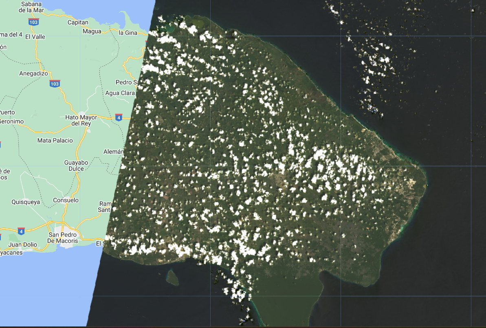

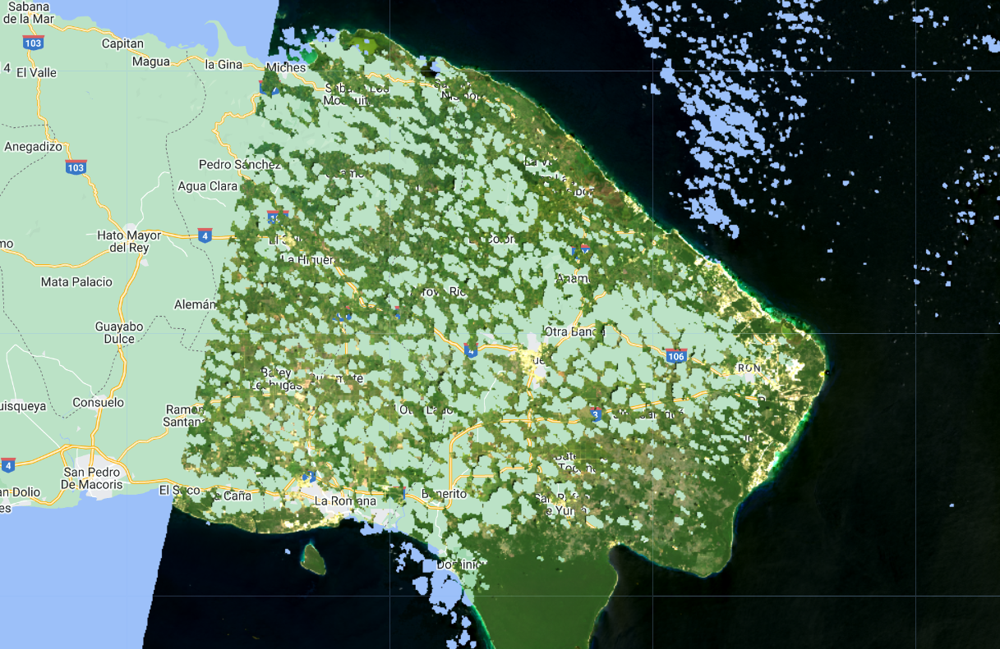

Ahora, podemos crear una composición mediana:

```javascript
var composicion = preProcesado.median().clip(republicaDominicana);

Map.addLayer(composicion, paramVisPreProcesada, 'Composición Preprocesada');
```

Tenga en cuenta que la función `median` es una forma corta de aplicar `reduce(ee.Reducer.median())`.

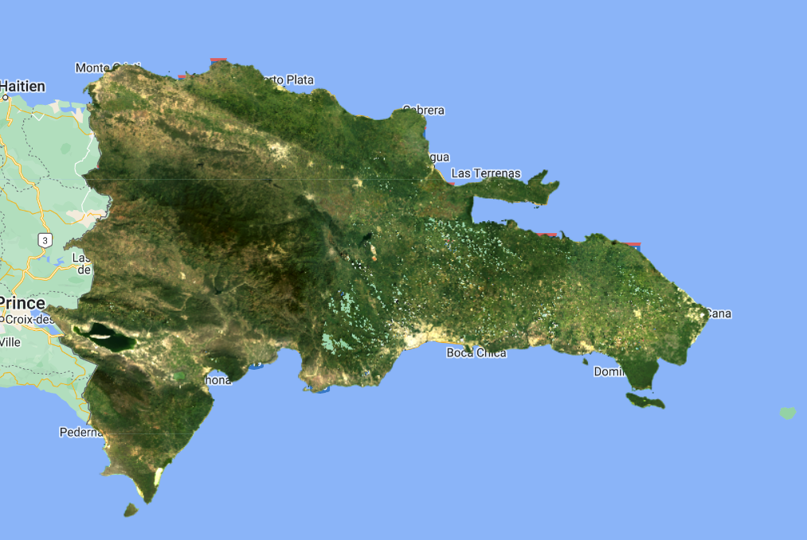

Y por final, exportar esta imagen al Google Drive o como un GEE Asset:

```javascript
// Exportar para Google Drive.
Export.image.toDrive({
  image: composicion.toFloat(),
  description: 'composicionMedianaLandsat8_2020-2021',
  fileNamePrefix: 'composicionMedianaLandsat8_2020-2021',
  region: republicaDominicana,
  scale: 30,
  maxPixels: 1e13
});

// Exportar como un GEE Asset.
Export.image.toAsset({
  image: republicaDominicana,
  description: 'composicionMedianaLandsat8_1921',
  assetId: 'projects/caribbean-trainings/assets/dominican-republic-2023/images/composicionMedianaLandsat8_2020-2021', //! ACTUALIZAR A RUTA PROPIA
  region: republicaDominicana,
  scale: 30,
  maxPixels: 1e13
});
```
