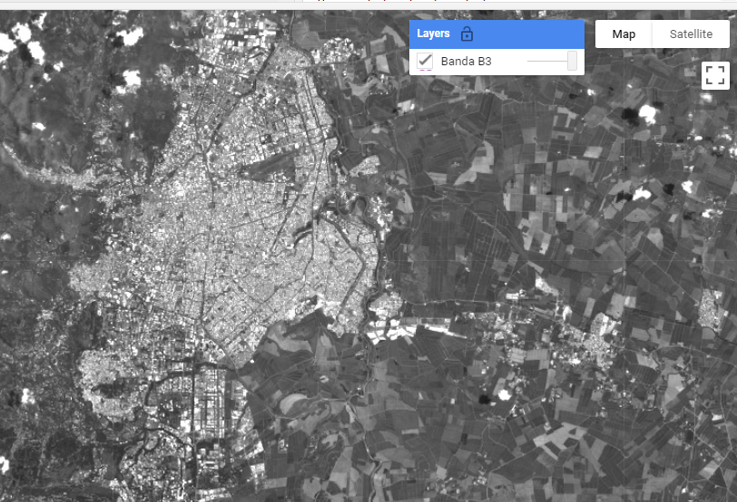
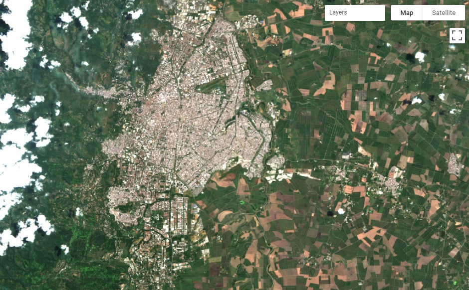
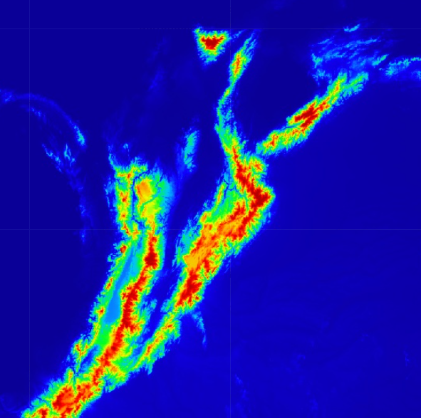
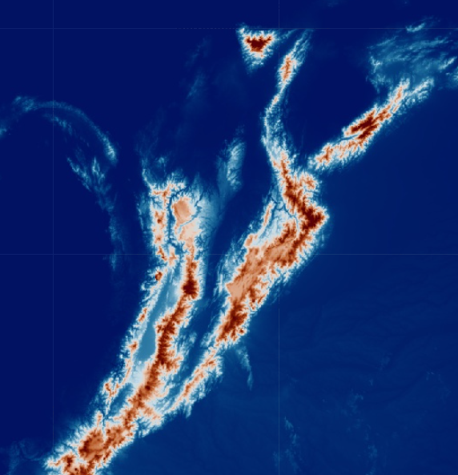
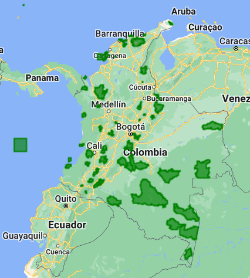

## Script
El script completo que se usará en esta sección esta disponible [aquí](https://code.earthengine.google.com/bd206c4b6bf2c437a592bf8462fb1f3e).

# Colecciones en Google Earth Engine

El archivo de datos públicos de Earth Engine incluye más de cuarenta años de imágenes históricas y conjuntos de datos científicos, actualizados y ampliados diariamente.

Las colecciones ráster y vectoriales que ofrece GEE pueden ser exploradas desde su catálogo [aquí](https://developers.google.com/earth-engine/datasets/), o buscadas por palabra clave en la barra de búsqueda superior del`code editor`.

 

## Importar colecciones

Las colecciones pueden ser importadas llamandolas a través de la función que corresponde si son datos ráster (`ee.ImageCollection()`) o vectoriales (`ee.FeatureCollection`), seguido por el ID específico para la colección de interés.

Por ejemplo el ID de una de las colecciones de Sentinel-2 se puede visualizar en la parte inferior izquierda de la ventana de información de esa colección:

 

De igual forma, una colección, imágen, o incluso datos vectoriales pueden ser importados desde nuestros Assets. Por ejemplo, el siguiente es un ee.FeatureCollection que contiene multiples polígonos de los Parques Nacionales Naturales de Colombia, el cual fue descargado, comprimido como ZIP y subido a GEE como SHP. Como se puede observar esta colección tiene metadatos asociados a cada Feature (o polígono). Este archivo se puede descargar desde el repositorio github [aquí](https://github.com/SERVIR-Amazonia/colombia-training/tree/ce5c227b1e0b05423c2ad7f2fe4a9b87cd14fb6d/files).

 

```javascript
// Una colección puede ser importada desde el catálogo de GEE o nuestros Assets:
var sentinel2 = ee.ImageCollection("COPERNICUS/S2_SR_HARMONIZED"); // Catálogo EE
print('Sentinel-2:',sentinel2.limit(10));

var pnn = ee.FeatureCollection('users/lsandoval-sig/PNN_Colombia_2023');
print('PNN Colombia:',pnn);
```
Como se puede observar los archivos en nuestros Assets pueden ser privados, compartidos con usuarios o apps específicos, o pueden ser totalmente públicos. En este caso, la colección de PNN de Colombia está configurada como pública, por lo tanto cualquier usuario puede importarla usando la dirección adecuada `'users/lsandoval-sig/PNN_Colombia_2023'`.

## Uso de propiedades o metadatos

Los objetos ráster y vectoriales contienen propiedades o metadatos que son de utilidad para identificar, filtrar, localizar, e incluso hacer procesos más complejos de los elementos en una colección.

En este ejemplo hemos seleccionado el primer elemento de cada colección para conocer cuales son sus propiedades. Estas propiedades deben ser consistentes a la largo de todos los elementos de una colección.

```javascript
// Propiedades de cada elemento en la colección:
print('Propiedades Sentinel-2:',sentinel2.first().propertyNames()); // ImageCollection
print('Propiedades PNN:',pnn.first().propertyNames());              // FeatureCollection
```

 

Adicionalmente, en objetos ráster podemos saber el nombre de las bandas disponibles:

```javascript
// Nombres de bandas:
print('Nombres de Bandas S2:',sentinel2.first().bandNames());
```

El tamaño de una colección puede conocerse también. En este ejemplo limitamos la colección de Sentinel-2 a 10 elementos, dado que si la imprimimos completa en la consola nos regresaría un error de tiempo `time out error` debido a que es una cantidad muy grande de imágenes de todo el mundo durante varios años.

```javascript
// Tamaño de Colección:
// Al usar en colecciones muy grandes puede causar un error de tiempo de carga.
// Para este ejemplo se limita una coleccion a 10 elementos
print('Numero de Imagenes S2:',sentinel2.limit(10).size());
print('Numero de PNN:',pnn.size());
```

Otra función muy útil para sacarle provecho a los metadatos es la extracción de IDs, con esto podemos identificar el nombre de cada elemento dentro de una colección, e incluso filtrar por nombres.

```javascript
// Obtener ID de cada elemento en la colección:
print('Sentinel-2 IDs: ', sentinel2.limit(10).aggregate_array('system:index'));
print('PNN IDs: ', pnn.aggregate_array('Nombre'));
```

## Visualización

Las imágenes satelitales están en el corazón del poder de Google Earth Engine. Esta sección le enseña cómo inspeccionar y visualizar datos almacenados en bandas de imágenes. Primero visualizamos bandas individuales como capas de mapa separadas y luego exploramos un método para visualizar tres bandas diferentes en una sola capa compuesta. Comparamos diferentes tipos de compuestos para bandas satelitales que miden la radiación electromagnética en el espectro visible y no visible.

Vamos a cargar una imágen de Sentinel-2 en la ciudad de Cali y la vamos a visualizar en el mapa con la función `Map.addLayer`. Esta es una función con la que familiarizará rápidamente, ya que es la que siempre vamos a usar para visualizar objetos en el mapa. El primer argumento es un objeto geoespacial (obligatorio), luego vienen dos argumentos opcionales my importantes que son los parámetros de visualización (bandas, rango de valores, colores) y el nombre de la capa. Al cargar la imágen hemos seleccionado todas las bandas multiespectrales. Para Sentinel-2 en especifico estas bandas empiezan con B, y van de B1 a B12, por lo tanto una opción de seleccionar todas sin necesidad de especificar una por una es usar `.select('B.*')`. Más ejemplos de la función `select()` están [aquí](https://developers.google.com/earth-engine/apidocs/ee-image-select). Posteriormente, visualizamos la banda B3 que corresponde a la región verde del espectro, configuramos un valor mínimo y máximo, y la llamamos 'Bandas B3'.

```javascript
// Cargar imagen S2
var img = ee.Image("COPERNICUS/S2_SR_HARMONIZED/20220824T153619_20220824T153619_T18NUJ")
          .select('B.*');

// Ver banda B3 (verde)
Map.addLayer(img,{bands:['B3'],min:0,max:2000},'Banda B3');
```

 

Ahora podemos también visualizar combinaciones de bandas. Por ejemplo, para visualizar una imágen satelital en color real o RGB se usan las bandas en el rojo, verde y azul, en este orden específico.

```javascript
// Visualizar imagenes en mapa
Map.addLayer(img,{bands:['B4','B3','B2'],min:0,max:2000},'RGB');
```

 

Otras combinanciones de bandas que pueden explorar son las siguientes. Estas combinanciones pueden almacenarse en una variable separada y ser usadas dentro de `Map.addLayer`. Qué diferencias pueden observar?

```javascript
// Combinaciones de bandas predefinidas
var ir = ['B8','B4','B3']       // Infrarojo
var veg = ['B11','B8A','B2']    // Vegetacion
var falso = ['B12','B11','B4']  // Falso color

// Visualizar imagenes en mapa
Map.addLayer(img,{bands:ir,min:0,max:3000},'Infrarojo');
Map.addLayer(img,{bands:veg,min:0,max:4000},'Vegetacion');
Map.addLayer(img,{bands:falso,min:0,max:4000},'Falso Color');
```

Ahora vamos a cargar datos de elevación (DEM) de la colección "NASA ETOPO", seleccionamos la banda correspondiente a la elevación, y vamos a visualizar estos datos definiendo rangos de elevación y paleta de colores. Si nos situamos sobre Colombia podremos visualizar las áreas más altas en rojo.

```javascript
// Visualizar elevación:
var dem = ee.Image("NOAA/NGDC/ETOPO1").select('bedrock');
var paleta = ['#0a0097','#1100ff','#00c3ff','#00ff21','#eeff00','#ff8300','#ff0000','#b40000'];
Map.addLayer(dem,{min:0,max:4000,palette:paleta},'Elevacion');
```

 

Las paletas de colores se pueden crear manualmente con tantos colores usted crea mejor. Sin embargo, existe un [repositorio](https://github.com/gee-community/ee-palettes) que ha creado diversas paletas predefinidas y pueden ser importadas a nuestro código. Primero debemos importar el paquete usando la función `require()`, cargamos una paleta de nuestro gusto, y visualizamos el resultado.

```javascript
var repo = require('users/gena/packages:palettes'); // Cargar repositorio
var paleta2 = repo.crameri.vik[10];
Map.addLayer(dem,{min:0,max:4000,palette:paleta2},'Elevacion2');
```

 

Finalmente, también podemos visualizar Features, e incluso darles un poco de color. Sin embargo, GEE no es una herramienta tan especializada como otros softwares geoespaciales que permiten seleccionar los elementos en tiempo real, mostrar etiquetas o información.

 

