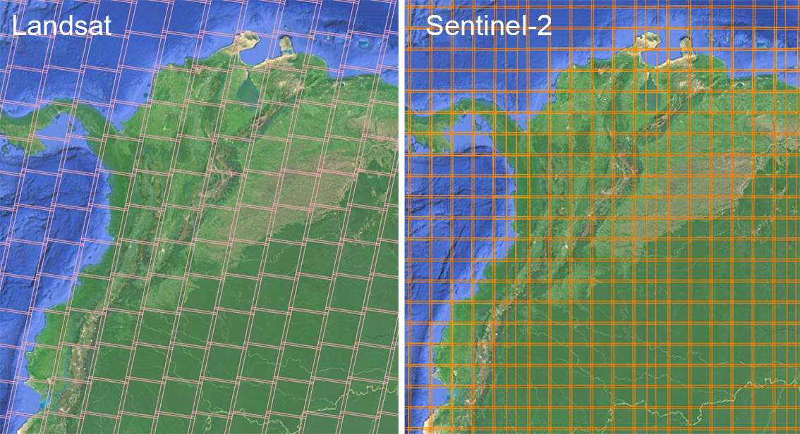
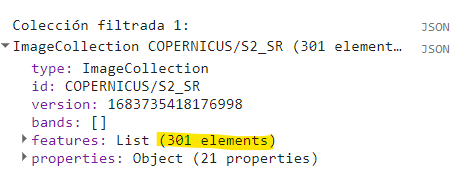
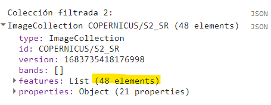
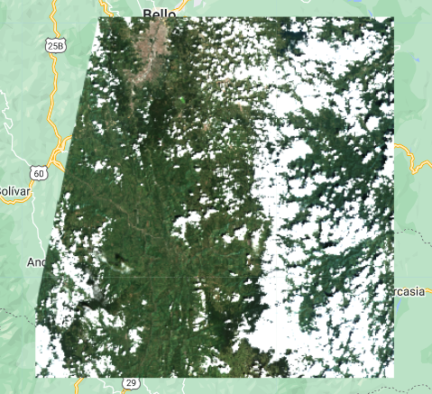
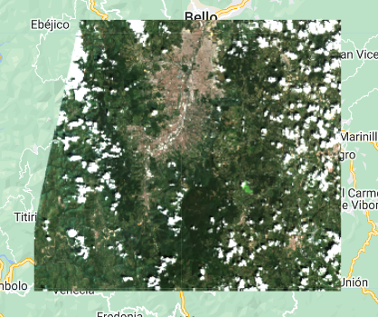
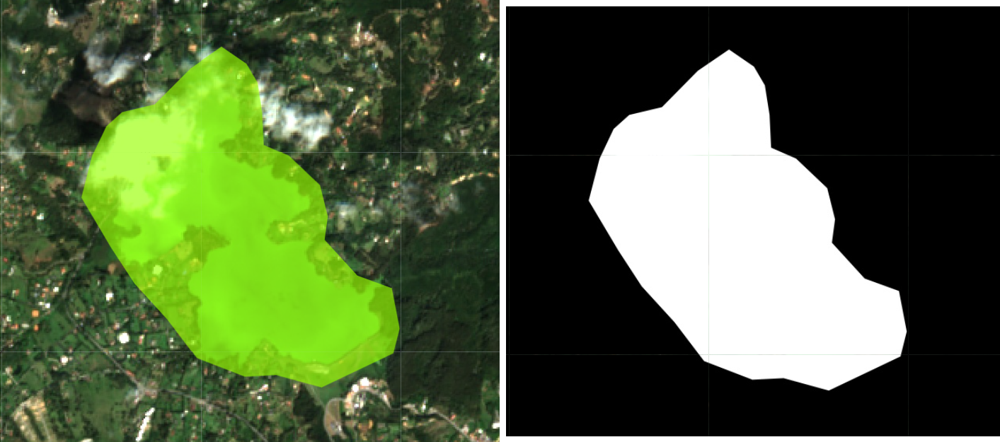
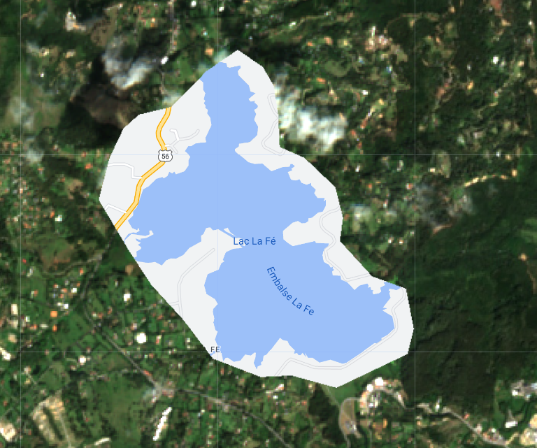
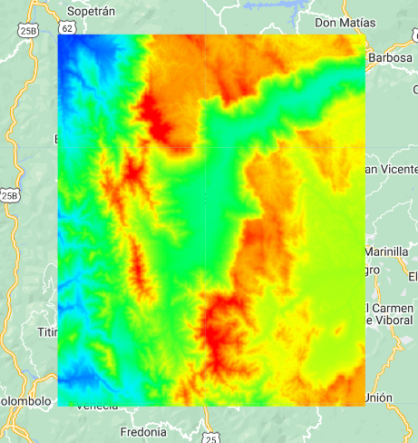
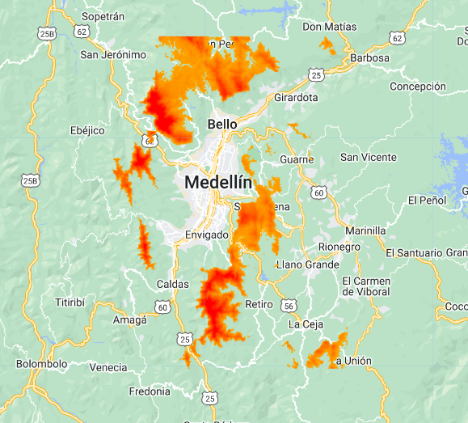
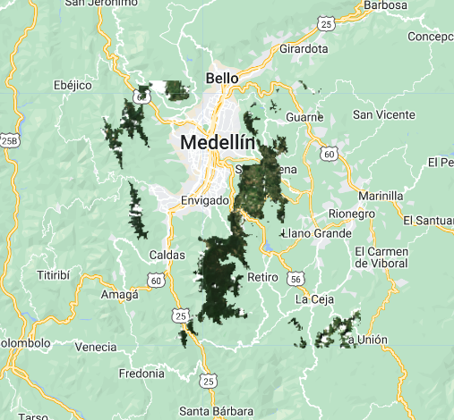

## Script
El script completo que se usará en esta sección esta disponible [aquí]().

# Filtrado de colecciones

Las colecciones puede ser filtradas de acuerdo a localización, fechas, y propiedades. Por ejemplo, hay colecciones que vienen segmentadas en escenas ('tiles') y es necesario usar un criterio válido para filtrar las escenas que nos interesan. Este es un punto de partida para casi cualquier proceso o estudio que deseen hacer. Aqui podemos ver la diferencia entre las escenas de Landsat y Sentinel-2.

 

Vamos a filtrar la colección de Sentinel-2 por localidad (Medellín), fecha, y porcentaje de nubes. Para filtrar por localidad podemos usar la funcion `filterBounds` la cual permite filtrar segun las coordenadas de una figura geométrica en un área de interés. Para esto vamos a dibujar un punto o polígono sobre Medellín y la vamos a renombrar "medellin" para ser usada en el siguiente ejemplo. Luego filtraremos por fecha usando la función `filterDate`, la cual permite filtrar elementos en un rango de fechas. La fecha debe ser escrita como texto y en formato YYYY-MM-DD.

```javascript
// Cargar Image Collection
var sentinel2 = ee.ImageCollection("COPERNICUS/S2_SR");

// Filtrar imágenes de colección por localidad y fecha.
var filtro1 = sentinel2.filterBounds(medellin).filterDate('2021-01-01','2021-12-31');

// Verificar cantidad de imágenes disponibles en esa localidad y fecha específicas:
print('Colección filtrada 1:',filtro1);
```



Esto nos arroja 301 imágenes para esa localidad y fecha específicas. Sin embargo, no todas las imágenes se pueden usar debido a que las nubes son un obstáculo para visulizar nuestra área de interés. Por lo tanto vamos a seguir filtrando aún más nuestra colección, esta vez por cantidad de nubes. Sentinel-2 tiene una propiedad llamada `CLOUDY_PIXEL_PERCENTAGE`, la cual indica el porcentaje de nubes presentes en una escena, y podemos usar esto para filtrar. Vamos a filtrar las imágenes con menos de 30% de cobertura de nubes por escena, usando el filtro `ee.Filter.lt` que básicamente significa "less than" o "menor que". Para usar los filtros `ee.Filter` es necesario usar la función `filter` antes.

```javascript
// Filtrar sub-colección usando sus propiedades.
// En este caso estamos interesados en imágenes con menos de 30% de cobertura de nubes por imágen.
var filtro2 = filtro1.filter(ee.Filter.lt('CLOUDY_PIXEL_PERCENTAGE',30));

// Verificar cantidad de imagénes:
print('Colección filtrada 2:',filtro2);
```



Ahora podriamos extraer una lista de nombres de las imágenes filtradas usando `aggregate_array('system:index')`:

```javascript
// Extraer lista de IDs:
print('Lista de IDS:', filtro2.aggregate_array('system:index'));
```

Luego podremos visualizar esa imágen si deseamos:

```javascript
// Visualizar imagen seleccionada
var image = ee.Image("COPERNICUS/S2_SR/20210118T152639_20210118T153102_T18NVM");
var params = {min:0,max:2000, bands:['B4','B3','B2']};
Map.addLayer(image,params,'Imagen S2');
```



# Conceptos de máscara
El propósito de una máscara es ocultar regiones o píxeles dentro de una imágen ráster. El proceso inverso (o máscara inversa) es llamado "clip", 
lo cual es un recorte del área que nos interesa. Una máscara puede ser creada manualmente a través de objetos geométricos (polígonos) y también con rango o umbrales de valor de pixel.

Ahora procedemos a recortar nuestra área de interés, la cual esta representada con un polígono sobre la ciudad de Medellín:

```javascript
// Recortar y visualizar área de interés:
var img_clip = image.clip(medellin);
Map.addLayer(img_clip,{bands:['B4','B3','B2'],min:0,max:2000},'Recorte');
```



Podemos convertir un recorte en una máscara. La máscara contiene pixeles con valores de 0 o 1, siendo los pixeles con valor de 1 los que conservarán información, si se aplica la máscara a una imágen. Vamos a crear un polígono llamado 'lago' sobre el cuerpo de agua al sureste de Medellín, luego vamos a crear la máscara, y la vamos a visualizar en un rango de 0 a 1.

```javascript
var lago_clip = image.clip(lago);
var lago_mask = lago_clip.mask();
Map.addLayer(lago_mask,{min:0,max:1},'Mask Lago');
```



Si aplicamos esta máscara a la imágen vamos a tener únicamente píxeles en el área del lago. Para aplicar la máscara usamos la función `updateMask` sobre la imágene de interés. 

```javascript
var new_img = img_clip.updateMask(lago_mask);
Map.addLayer(new_img,{bands:['B4','B3','B2'],min:0,max:2000},'Mask Aplicada');
```


Sin embargo, en este ejemplo el resultado es lo mismo que usar `clip`. Como nuestro objetivo es enmascarar o remover el lago de la imágen, aplicamos la función `not` sobre nuestra máscara. Esta función lo que va a hacer es invertir nuestra máscara, para obtener el resultado deseado.

```javascript
var new_img = img_clip.updateMask(lago_mask.not());
Map.addLayer(new_img,{bands:['B4','B3','B2'],min:0,max:2000},'Mask invertida');
```



Ya sabemos aplicar una máscara usando geometrías. Ahora, vamos a aplicar una máscara de acuerdo a valores o rangos de píxel. Para este ejemplo vamos a usar la colección de elevación de Copernicus `COPERNICUS/DEM/GLO30`. Esta colección es global y viene segmentada por escenas, por lo tanto vamos a usar la función `mosaic` para unificarla y convertirla a una sola imágen o `ee.Image`. Luego vamos a recortarla con nuestra área de interés y vamos a visualizarla en el mapa.

```javascript
// Cargar coleccion DEM de Copernicus 30m/pixel, seleccionar banda 'DEM', y convertir a ee.Image:
var dem = ee.ImageCollection("COPERNICUS/DEM/GLO30").select('DEM').mosaic();

// Recortar DEM usando área de interés y visualizar en mapa:
var clip_dem = dem.clip(medellin);
var dem_palette = ['#002bff','#00f3ff','#00ff37','#fbff00','#ff0000'];
Map.addLayer(clip_dem,{palette:dem_palette,min:500,max:2900},'DEM');
```



Ahora supongamos que se quiere hacer un estudio en alturas mayores a 2500 m, y queremos enmascarar la altitud usando rangos de valores. Para esto podemos usar la función `gte` directamente sobre la imágen DEM, la cual significa 'greater than and equal to'. Al usar este tipo de funciones se va a crear una imágen tipo máscara, por lo tanto no es necesario convertirla a máscara para poder aplicarla. Por último, procedemos a aplicar la máscara y a visualizar el resultado.

```javascript
// Enmascarar rangos de valores.
var mask_dem = clip_dem.gte(2500);
var new_dem = clip_dem.updateMask(mask_dem);
Map.addLayer(new_dem,{palette:dem_palette,min:500,max:2900},'Rango DEM');
```



Luego de esto, podriamos seguir usando aún más máscaras. La imágen de elevación procesada puede ser convertida a máscara y ser aplicada a nuestra imágen satelital de interés para hacer un recorte.

```javascript
// Convertir el DEM a máscara, y luego aplicar esa máscara a la imágen.
var new_dem_mask = new_dem.mask();
var img_final = new_img.updateMask(new_dem_mask);
Map.addLayer(img_final,{bands:['B4','B3','B2'],min:0,max:2000},'Imagen Final');
```



## Reto 1
```javascript
/*
Cómo aplicar filtros a un FeatureCollection?

1. Usar colección "LSIB 2017: Large Scale International Boundary Polygons, Simplified": 
   ee.FeatureCollection("USDOS/LSIB_SIMPLE/2017"). Esta colección incluye poligonos de
   paises.
2. Seleccionar (filtrar) únicamente el polígono de Colombia.
3. Visualizar en mapa.
*/
```

## Reto 2
```javascript
/*
Quiero estudiar las áreas entre 1500 y 2500 m de altitud en una imagén satélital.

1. Usando la imágen del ejemplo dictado, cómo obtener un "img_final" donde se 
   enmascaren todas las alturas por debajo de 1500 m y por encima de 2500 m? 
*/
```
