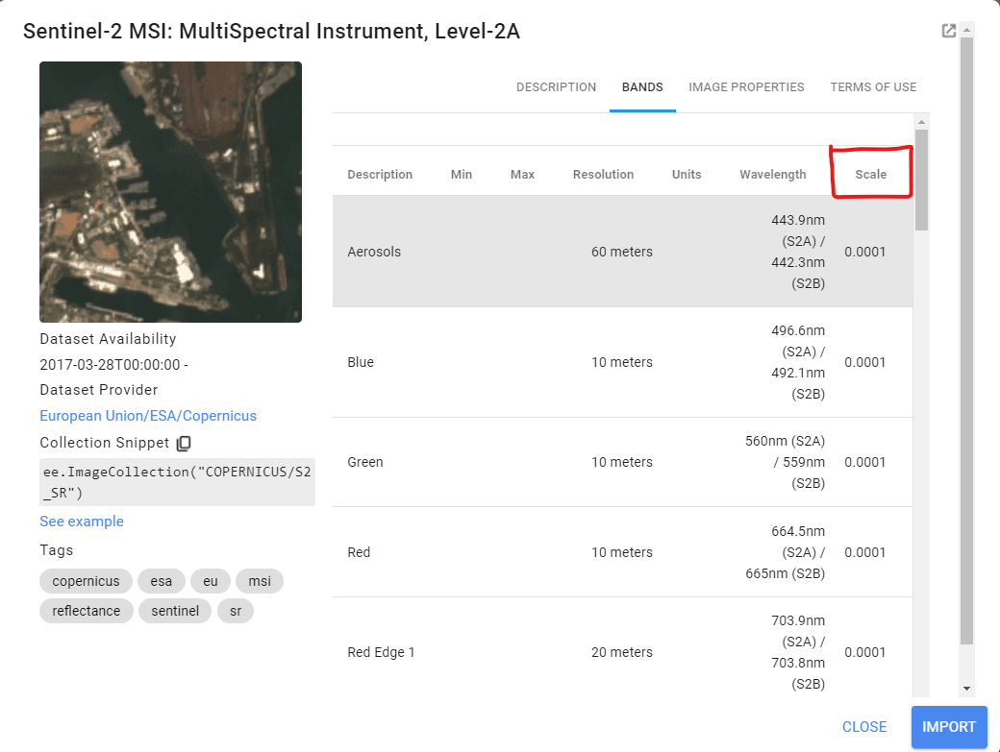
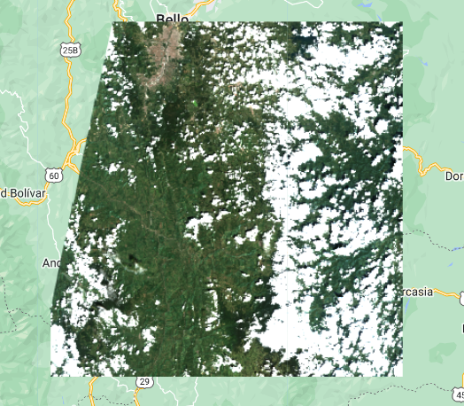
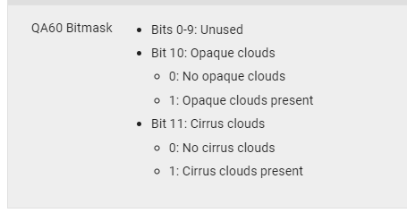
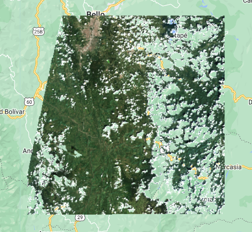
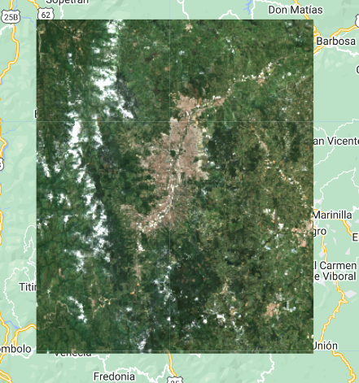

## Script
El script completo que se usará en esta sección esta disponible [aquí](https://code.earthengine.google.com/de439e6931e183d11e8cd9c6b84b39a3).

# Enmascaramiento de nubes y funciones avanzadas

Hasta ahora hemos aprendido como acceder a colecciones, conocer su propiedades, filtrarlas, y visualizarlas. Pero, para poder sacar más provecho a los datos geoespaciales hay que aprender procesarlos, y para esto hay que aprender a escribir nuestras propias funciones. En este segmento vamos a usar un grupo de imágenes Sentinel-2 sobre nuestra área de interés, y vamos a aplicar una serie de funciones para preparar nuestras imágenes antes de aplicar una máscara de nubes. Finalmente, realizaremos un mosaico compuesto final para observar nuestra área de interés casi limpia de nubes.

Podemos usar la parte inicial del código usado en la sección anterior. Cargaremos la coleccion de Sentinel-2 y filtramos sobre la ciudad de Medellín.

```javascript
// Cargar Image Collection
var sentinel2 = ee.ImageCollection("COPERNICUS/S2_SR");

// Filtrar imágenes de colección por localidad, fecha y cantidad de nubes.
var filtro = sentinel2.filterBounds(medellin).filterDate('2021-01-01','2021-12-31');
              .filter(ee.Filter.lt('CLOUDY_PIXEL_PERCENTAGE',30));

// Verificar cantidad de imagénes:
print('Colección filtrada:',filtro);

// Extraer lista de IDs:
print('Lista de IDS:', filtro.aggregate_array('system:index'));

// Sellecionar una imagen cualquiera:
var image = ee.Image("COPERNICUS/S2_SR/20210118T152639_20210118T153102_T18NVM");
```

Luego de seleccionar una imágen cualquiera de la lista, vamos a proceder a escalarla para poder obtener unidades de reflectancia correctas. Esto se puede verificar en la documentación de cada colección. No todas las colecciones tienen las mismas escalas o unidades, o incluso las bandas dentro de una misma colección pueden tener diferentes valores de escala. Esto hay que tenerlo presente y ser cuidadoso si vamos a usar imágenes sátelitales para análisis más avanzados.

 

Para Sentinel-2 el factor de escala en todas las bandas multiespectrales es de 0.0001. Vamos a usar la siguiente función para escalar las bandas multiespectrales. Sin embargo si solo hacemos esto, la función regresará una imágen con únicamente esas bandas. Por eso vamos a incluir otra línea de código para extraer las bandas QA que vamos a necesitar más adelante para enmascarar nubes.

```javascript
/// Función para re-escalar reflectancia de imagenes Sentinel-2:
var escalar_s2 = function(image){
  var opticalBands = image.select('B.').divide(10000); // o multiply(0.0001)
  var qaBands = image.select('QA.*');
  return image.addBands(opticalBands, null, true)
              .addBands(qaBands, null, true);
};
```

La función la podemos aplicar a un solo elemento o un ee.Image de la siguiente forma:

```javascript
// Aplicar función para escalar reflectancia de imagen S2:
var img_scaled = escalar_s2(image);

// Visualizar imagen:
var params = {min:0,max:0.2, bands:['B4','B3','B2']};
Map.addLayer(img_scaled,params,'Imagen S2');
```

La imagen fue escalada, y ahora el rango para visualizar la imágen RGB es 0 a 0.2, apróximadamente.

 

La función para enmascarar nubes usará la banda QA. Este es uno de los procesos de enmascaramiento de nubes más accesible y sencillo, ya que usamos la banda QA, la cual significa que el producto ya ha sido procesado y se ha hecho una exploración indicando la presencia de nubes a nivel de pixel en cada imágen. Las bandas QA Bitmask son comúnes en productos L2 y superior. Estas bandas pueden tener varios nombres: QA: Quality assesment, QC: Quality control, QF: Quality flags y proveen información binaria sobre nubes, nieve, datos inválidos, etc, para cada pixel. Más información sobre las máscaras de bits en este [foro] (https://stackoverflow.com/questions/31575691/what-is-a-bitmask-and-a-mask).

La siguiente es la función para enmascarar nubes en imágenes de Sentinel-2 específicamente. 

```javascript
// Función para enmascarar nubes 
function maskS2clouds(image) {
  var qa = image.select('QA60'); // Seleccionar la banda QA

  // Bits 10 y 11 son  nubes y cirros, respectivamente.
  // El signo << es un operador "bitwise shift"
  var cloudBitMask = 1 << 10;  // 1+10 ceros, igual a 1024, nubes opacas
  var cirrusBitMask = 1 << 11; // 1+11 ceros, igual a 2048, nubes cirros
  
  // Más información sobre el operador left shift:
  // https://developer.mozilla.org/en-US/docs/Web/JavaScript/Reference/Operators/Left_shift

  // Transformar bits a mascára, seleccionando valores de cero, igual a condiciones sin nubes.
  var mask = qa.bitwiseAnd(cloudBitMask).eq(0)
      .and(qa.bitwiseAnd(cirrusBitMask).eq(0));

  return image.updateMask(mask);
}
```

Como podemos observar, hemos usado la banda QA60, la cual provee información sobre nubes en los bits 10 y 11. 

 

Estos bits son iguales a 1 + 10 ceros y 1 + 11 ceros, en números binarios respectivamente. Estos números binarios son iguales a los números 1024 y 2048. La máscara de la banda QA debe ser procesada usando el operador `bitWiseAnd` el cual debe tomar como argumento los números binarios que hemos creado en las variables `cloudBitMask` y `cirrusBitMask`. Esta operación va a identificar los píxeles marcados como 1 y 0, en los bits 1<<10 y 1<<11. Es decir que al final vamos a estar intereados en los valores de píxel igual a cero, ya que estos no estarán marcados como nubes o cirros, por esta razón usamos el operador `.eq(0)`, y finalmente aplicamos la máscara. Pueden encontrar un poco más de información sobre los operadores `Bitwise` [aquí](https://en.wikipedia.org/wiki/Bitwise_operation).

Ahora, veamos como se ve nuestra imagen luego de aplicar la función de enmascarar nubes:

```javascript
Map.addLayer(maskS2clouds(img_scaled),params,'Imagen sin nubes');
```

 

Hasta ahora solo hemos aplicado funciones a una sola imagen (ee.Image), pero la verdadera ventaja de una función es su aplicabilidad a un conjunto
de imágenes (ee.ImageCollection), a través de la función `.map()`.

En los siguientes ejercicios vamos a:
1. Escalar un conjunto de imágenes.
2. Recortar nuestra área de interés.
3. Aplicar máscara de nubes.
4. Crear un mosaico final sin nubes.

Vamos a crear una función adicional para recortar el área de interés en cada imágen. Esta función será anidada:

```javascript
// Función anidada para recortar cada imagen con una geometría dada:
var recorte_funcion = function(geometry) {
  var function2 = function(image) {
    var recorte = ee.Image(image).clip(geometry);
    return recorte;
  };
  return function2;
};
```

Ahora podremos aplicar cada función para procesar nuestro conjunto de imágenes en la colección que llamamos `filtro` previamente y contiene 48 elementos. Para usar la función de recortar requerimos una geometría válida, la cual puede ser un rectángulo sobre la ciudad de Medellín.

```javascript
// 1. Escalar imágenes:
var coleccion_escaled = filtro2.map(escalar_s2);

// 2. Recortar colección (usando función anidada):
var coleccion_recorte = coleccion_escaled.map(recorte_funcion(medellin));

// 3. Enmascarar nubes:
var coleccion_nubes = coleccion_recorte.map(maskS2clouds);
```

La coleccion final será `coleccion_nubes`. De esta colección de imágenes procesadas vamos a hacer un mosaico compuesto usando la función `median()`. Está ayudará a limpiar aún un poco más los restos de nubes o píxeles anómalos que hayan quedado en el grupo de imágenes. El resultado será una sola imágen (ee.Image) la cual podremos visualizar.

```javascript
// 4. Crear mosaico final, sin nubes:
var mosaico = coleccion_nubes.median();

// Visualizar mosaico:
Map.addLayer(mosaico,params,'Mosaico');
```

 

El mosaico final quedó bastante limpio de nubes, pero algunas quedan aún. Esto es debido a que los algoritmos para detectar nubes no son perfectos y que la zona Andina y Pacífica de Colombia son lugares con muchas nubes a lo largo de todo el año. Por esto se dificulta obtener mosaicos sin nubes.

## Reto 1
Cómo podriamos hacer este mismo proceso con la colección de Landsat 8 L2?

1. Usar esta [colección](https://developers.google.com/earth-engine/datasets/catalog/LANDSAT_LC08_C02_T1_L2).
2. Filtrar colección por localidad, fecha, y cobertura de nubes (identificar nombre de propiedad).
3. Aplicar factores de escala específicos para esta colección. Modificar función de escalar de acuerdo a esto.
4. Identificar la banda QA y los bits adecuados para enmascarar nubes. Modificar la función de máscara de nubes de acuerdo a esto.
5. Correr funciones, hacer mosaico, y visualizar.
