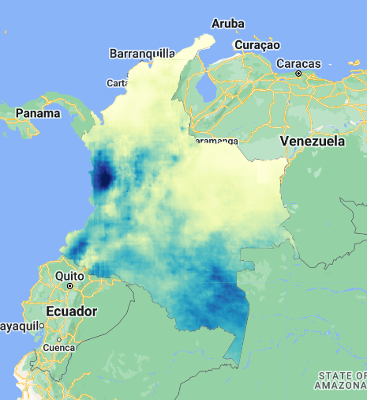
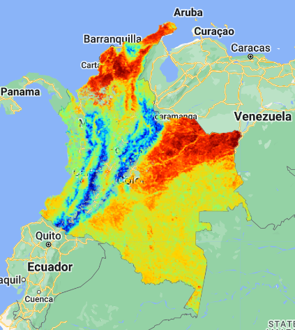
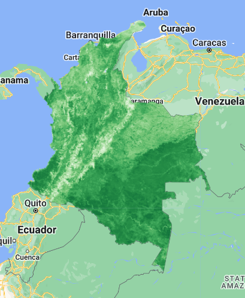
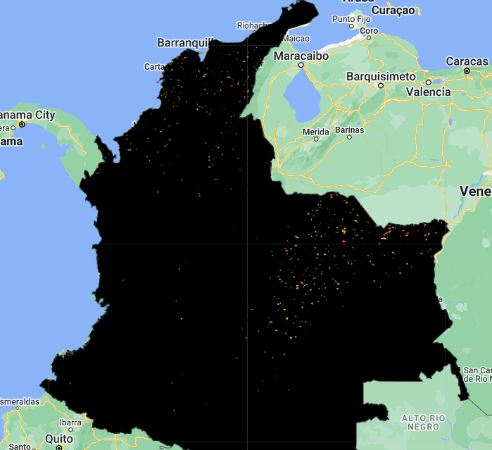
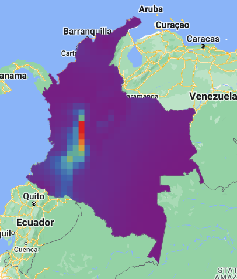
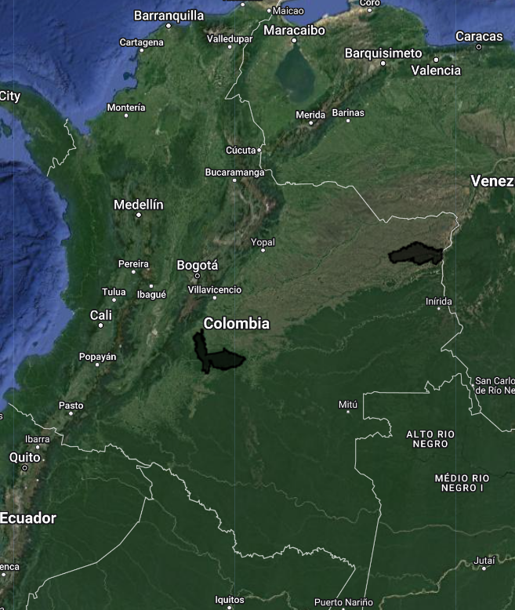
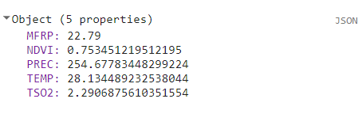
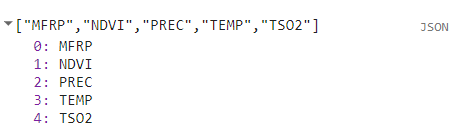
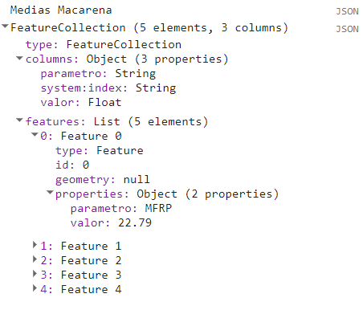
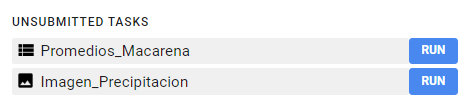

## Script
El script completo que se usará en esta sección esta disponible [aquí]().

# Productos ambientales y climáticos

Vamos a explorar diferentes productos ambientales y climáticos disponibles en GEE. Estos productos vienen en diferentes resoluciones temporales y espaciales, por tal razón el uso de cierto producto va a depender de modo, tiempo, lugar que queremos observar o monitorear. Adicionalmente se realizarán ejemplos aplicados para no solo visualizar estos productos, sino también sobre extraer información básica en áreas específicas, y sobre cómo exportar los datos.

Primero vamos a precargar algunas variables. Vamos a usar el polígono de Colombia para recortar las imágenes; cargaremos el paquete de paletas para ayudarnos a visualizar los productos; y vamos a predefinir el rango de fechas de interés para ser consistente a través de todas las colecciones:

```javascript
// Poligono de Colombia
var colombia = ee.FeatureCollection("USDOS/LSIB/2017").filter(ee.Filter.eq('COUNTRY_NA','Colombia'));

// Cargar paquete de paletas
// https://github.com/gee-community/ee-palettes
var repo = require('users/gena/packages:palettes');

// Fechas de interés:
var fechaIni = '2023-03-01';
var fechaFin = '2023-03-30';
```

## Precipitación

Vamos a usar la colección ["UCSB-CHG/CHIRPS/DAILY"](https://developers.google.com/earth-engine/datasets/catalog/UCSB-CHG_CHIRPS_DAILY), la cual es un producto de precipitación de CHIRPS con más de 30 años de datos globales. Esta colección tiene datos diarios a una resolución espacial de 5.5 km / píxel.

Esta colección la vamos a filtrar, vamos usar `sum()` para obtener la precipitación mensual, y recortaremos usando el polígono de Colombia. Es importante leer la documentación de cada colección para conocer cuántas bandas tiene, en qué unidades está, y qué factor de escala maneja. Esta colección está en mm/día y no requiere aplicar ningun factor de escala.

```javascript
// Cargar colección CHIRPS de precipitación diaria:
var chirps = ee.ImageCollection("UCSB-CHG/CHIRPS/DAILY");

// Filtrar colección, sumar precipitaciones del mes, y recortar:
var prec = chirps
            .filterDate(fechaIni,fechaFin)
            .filterBounds(colombia)
            .sum()
            .clip(colombia);

// Cargar paleta de color y visualizar capa:
var precPaleta = repo.colorbrewer.YlGnBu[9];
Map.addLayer(prec,{min:0, max:750, palette:precPaleta},'Precipitacion');
```

En solo unas líneas de código podemos visualizar nuestra imágen. En color más pálido los valores más bajos de precipitación (0 mm/mes) y en azul oscuro los valores más altos (750 mm/mes):



## Temperatura

Vamos a usar la colección ["MODIS/061/MOD11A1"](https://developers.google.com/earth-engine/datasets/catalog/MODIS_061_MOD11A1), producto de MODIS Terra que entrega datos diarios a 1km / pixel de tempereratura terrestre.

```javascript
// Cargar producto de Modis Terra MOD11A1.061 y seleccionar banda de temperatura
var mod11a1 = ee.ImageCollection("MODIS/061/MOD11A1").select('LST_Day_1km');

// Filtrar colección, sumar precipitaciones del mes, y recortar:
var temp = mod11a1
            .filterDate(fechaIni,fechaFin)
            .filterBounds(colombia);

// Aplicar factor de escala, convertir a Celsius, obtener promedio, y recortar figura:
var tempEscala = temp
                  .map(function(x){return x.multiply(0.02).subtract(273.15)})
                  .mean()
                  .clip(colombia);

// Cargar paleta de color y visualizar capa:
var tempPaleta = repo.misc.jet[7];
Map.addLayer(tempEscala,{min:10, max:40, palette:tempPaleta},'Temperatura');
```

Podemos observer en azul los pixeles con temperaturas más bajas (10 °C) y en rojo los pixeles más calientes (40 °C), correspondiente al mes de Marzo de 2023. Algunos vacíos de información se pueden observar, probablemente debido a la cantidad de nubes en esas regiones de Colombia.



## Vegetación

Nuevamente cargaremos un producto de MODIS Terra, esta vez el producto ["MODIS/061/MOD13Q1"](https://developers.google.com/earth-engine/datasets/catalog/MODIS_061_MOD13Q1) que entrega indices de vegetación (NDVI y EVI) cada 16 días a 250m / pixel. Usaremos la banda NDVI o Normalized Difference Vengetation Index.

```javascript
// Cargar producto de vegetación MOD13Q1 de Modis y seleccionamos banda NDVI:
var mod13q1 = ee.ImageCollection('MODIS/061/MOD13Q1').select('NDVI');

// Filtrar colección, sumar precipitaciones del mes, y recortar:
var ndvi = mod13q1
           .filterDate(fechaIni,fechaFin)
           .filterBounds(colombia);

// Escalar datos, estimadar promedio, y recortar figura
var ndviEscala = ndvi
                .map(function(x){return x.multiply(0.0001)})
                .mean()
                .clip(colombia);

// Cargar paleta de color y visualizar capa:
var ndviPaleta = repo.colorbrewer.Greens[7];
Map.addLayer(ndviEscala,{min:0, max:1, palette:ndviPaleta},'NDVI');
```

El índice tiene un rango de valores de 0 a 1. Los valores más cercanos a 1 indican una mayor densidad de vegetación, visualizados en color verde más oscuro.



## Incendios

Para detección de incendios existe el producto ["MODIS/061/MOD14A1"](https://developers.google.com/earth-engine/datasets/catalog/MODIS_061_MOD14A1) de MODIS. Este producto es diario con 1 km / pixel de resolución. Posee una máscara de bits llamada 'FireMask' indicando por valor de pixel que tipo de categoría es. Los pixeles de interés serían los del 7 al 9, que indican alguna probabilidad de fuego. Otra banda llamada 'MaxRFP' es complementaria, posee los mismos píxeles identifcados como fuego en la máscara de bits, pero estos poseen unidades de MW, es decir que mide el máximo poder radiativo del fuego. Esta ayudaría a detectar la intensidad del fuego. En este ejemplo vamos a cargar ambas bandas.

```javascript
// Cargar colección de incendios MOD14A1 de Modis:
var mod14a1 = ee.ImageCollection('MODIS/061/MOD14A1');

// Seleccionar la banda de Max Fire Radiative Power
var firePower = mod14a1.select('MaxFRP')
                .filter(ee.Filter.date(fechaIni, fechaFin))
                .map(function(x){return x.multiply(0.1)})
                .mean()
                .clip(colombia);

// Seleccionar la banda de Fire Mask
var fireMask = mod14a1.select('FireMask')
                .filter(ee.Filter.date(fechaIni, fechaFin))
                .max()
                .clip(colombia);

// Cargar paleta de color y visualizar capa:
var firePaleta = repo.colorbrewer.YlOrRd[7];
Map.addLayer(fireMask, {min:6, max:9, palette: ['#000000','#faff00','#ffa600','#ff0000']}, 'Fire Mask');
Map.addLayer(firePower, {min:3,max:180, palette:firePaleta}, 'Fire Power');
```

Podemos observar los píxeles con probabilidad de ser un incendio, del menos intenso (amarillo) al más intenso (rojo).



## Monitoreo atmósferico de Copernicus

Para este ejemplo vamos a usar la colección ["ECMWF/CAMS/NRT"](https://developers.google.com/earth-engine/datasets/catalog/ECMWF_CAMS_NRT?hl=en), que ofrece diversos datos atmosféricos en casi tiempo real a nivel global. Este producto entrega datos casi cada hora a una resolución de 44.5 km / píxel. En este ejemplo vamos a cargar la banda de dióxido de sulfuro total, el cual es un indicador de actividad volcánica.

```javascript
// Cargar colección
var cams = ee.ImageCollection('ECMWF/CAMS/NRT');
                  
// Seleccionar banda, filrar, cambiar unidades, promediar, y recortar figura.
var so2 = cams.select('total_column_sulphur_dioxide_surface')
          .filter(ee.Filter.date('2023-01-01', '2023-01-03'))
          .map(function(x){return x.multiply(1000000)}) // kg to mg
          .mean()
          .clip(colombia);

// Cargar paleta de color y visualizar capa:
var atmPaleta = repo.misc.tol_rainbow[7];
Map.addLayer(so2, {min:0.1,max:65,palette:atmPaleta}, 'Total Sulfur Dioxide');
```

Notamos que la mayor concentración de SO2 en la columna de aire se localiza cerca al Nevado del Ruíz y un poco menos cerca al Nevado del Huila.



# Extraer datos

Tener acceso a millones de datos en GEE y visulizarlos no es la única ventaja que ofrece esta plataforma. Vamos usar un ejemplo para extraer datos de área de las colecciones que acabamos de cargar. Para esto supongamos que queremos hacer una caracterización de dos PNN: Sierra de la Macarena y El Tuparro.

```javascript
// Vamos a filtrar el PNN Sierra de la Macarena y el PNN El Tuparro
var pnn = ee.FeatureCollection('users/lsandoval-sig/PNN_Colombia_2023');
var macarena = pnn.filter(ee.Filter.eq('Nombre','SIERRA DE LA MACARENA'));
var tuparro = pnn.filter(ee.Filter.eq('Nombre','EL TUPARRO'));
Map.addLayer(macarena.merge(tuparro),{},'PNN'); // Unimos los dos features en uno usando 'merge'.
```



Para evitar repetir el proceso de extracción imagen por imagen, vamos a unir todas las imágenes en una sola pero como diferentes bandas y vamos a renombrar cada banda respectiva.

```javascript
// Vamos a unir todas las imágenes en una sola pero en bandas diferentes,
// y además vamos a renombrar cada banda respectiva.
var imgDatos = prec.rename('PREC')
              .addBands(tempEscala.rename('TEMP'))
              .addBands(ndviEscala.rename('NDVI'))
              .addBands(firePower.rename('MFRP'))
              .addBands(so2.rename('TSO2'));
print(imgDatos);
```


Ahora vamos a crear una función con la que vamos a extraer datos de todos los parámetros en una región específica. Esta función tiene tres argumentos: una imagen en formato `ee.Image`, una geometría `ee.Feature`, y un reductor `ee.Reducer`. Inicialmente se aplicará el reductor específico sobre la geometría dada. Esto nos regresará un diccionario con los resultados por cada banda.



Posteriormente vamos a extraer los `keys()`, es decir los nombres de bandas. Esto será entregado como una lista:



Luego, necesitamos extraer los valores y crear una tabla con dos columnas, una para el nombre de parámetro y otra para alojar los valores respectivos. Este tipo de tablas se crean en formato `ee.Feature`. Primero vamos usar una función que correrá por cada elemento alojado en la variable `keys` que contiene los nombres, y vamos a obtener programáticamente los valores alojados en el diccionario. Finalmente, se va a regresar un `ee.Feature` con las dos columnas y sus respectivos valores. Y por último, la función va a regresar un `ee.FeatureCollection`, que es el formato que necesitamos para exportar la tabla.

```javascript
function extraerDatos(img,geom,red){
  var imagen = ee.Image(img);
  
  // Aplicar reducer
  var reduce = imagen.reduceRegion({
    reducer: red,
    geometry: geom
  });
  
  // Extraer nombre de bandas (parametros)
  var keys = reduce.keys();

  // Crear features con respectivos parametros y valores
  var valores = keys.map(function(x){
    var valor = reduce.get(x);
    return ee.Feature(null,{'valor':valor,'parametro':x});
  });
  
  return ee.FeatureCollection(valores);
}
```

Ahora vamos a crear un conjunto de reductores que son de interés para caracterizar las zonas:

```javascript
// Crear varios reductores de interés
var mean = ee.Reducer.mean();
var minMax = ee.Reducer.minMax();
var suma = ee.Reducer.sum();
var contar = ee.Reducer.count();
```

Aplicamos la función para obtener valores promedios de cada parámeto dentro del área del PNN La Macarena y luego para el PNN El Tuparro.

```javascript
// Obtener valores promedios de los parametros ambientales dentro de cada PNN:
var meanMacarena = extraerDatos(imgDatos,macarena,mean);
var meanTuparro = extraerDatos(imgDatos,tuparro,mean);
print('Medias Macarena',meanMacarena);
print('Medias Tuparro',meanTuparro);
```



Como podemos observar, el resultado es un `ee.FeatureCollection` con tres propiedades o columnas (la columna system:index siempre se creará por defecto), y cinco features o elementos. Cada feature aloja el nombre de parámetro y valor promedio calculado.

# Exportar

Ya estamos listos para exportar datos. Para este ejemplo podemos exportar las imágenes que hemos procesado y también los datos que hemos extraído. Hay tres destinos para exportar: nuestros Assets, a GDrive, y GCloud. En este caso exportaremos a GDrive. Para exportar a GDrive hay que verificar que tengamos espacio disponible para guardar los datos, de otra manera habrá un error.

```javascript
// Exportar imagen:
Export.image.toDrive({
  image: prec,
  description: 'Imagen_Precipitacion',
  region: colombia,
  crs: 'EPSG:4326',
  fileFormat: 'GeoTIFF'
});

// Exportar tabla:
Export.table.toDrive({
  collection: meanMacarena,
  description: 'Promedios_Macarena',
  fileFormat: 'CSV'
});
```



Despues de correr nuestro script tendremos que ir a la pestaña `Tasks`. Unas vez enviadas las tareas podemos terminar de trabajar o apagar nuestro computador, ya que estar tareas quedarán corriendo en el servidor de GEE.


Siempre podremos regresar a observar si la tarea ha finalizado o no:


# Retos
* Hemos solo extraído promedios de cada parámetro, pero la precipitación se mide diferente. Cual reductor se debería usar?
* La suma o promedio del parámetro de incendios no es la mejor forma de usar estos datos como indicadores o comparar dos áreas. Por ejemplo, es posible que los promedios o sumas sean similares si un área tiene muchos incendios de baja intensidad y la otra tiene pocos incendios de alta intensidad. Entonces cuál reductor podríamos usar para estimar además el número de incendios en los dos PNN?
* Sería interesante completar la caracterización añadiendo los valores promedio, min y max de elvacion en cada PNN. Cómo harías esto?
