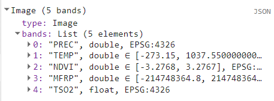

## Script
El script completo que se usará en esta sección esta disponible [aquí]().

# Índices y operaciones matématicas

En sesiones anteriores vimos como extraer información de productos disponibles en GEE. Uno de ellos fue el producto de MODIS Terra ["MODIS/061/MOD13Q1"](https://developers.google.com/earth-engine/datasets/catalog/MODIS_061_MOD13Q1) que entrega indices de vegetación (NDVI y EVI) cada 16 días a 250m / pixel.
Sin embargo, podemos usar cualquier colección con datos multiespectrales para calculor nuestros propios índices, ya sea para obtener mejor resolución espacial o temporal, o información que no esté disponible en GEE.

Para los siguientes ejemplos usaremos la colección de [Landsat-8 L2](https://developers.google.com/earth-engine/datasets/catalog/LANDSAT_LC08_C02_T1_L2#description), para lo cual vamos a precargar algunas funciones primero:

```javascript
// Funciones precargadas:

// Función enmascarar nubes Landsat-8:
function maskL8clouds(image) {
  var qa = image.select('QA_PIXEL'); //Select the QA band

  // Bits 5 is clouds.
  var cloudBitMask = 1 << 3;  

  // Both flags should be set to zero, indicating clear conditions.
  var mask = qa.bitwiseAnd(cloudBitMask).eq(0);

  return image.updateMask(mask);
}

// Función para aplicar factores de escala Landsat-8:
function applyScaleFactors(image) {
  var opticalBands = image.select('SR_B.').multiply(0.0000275).add(-0.2);
  var thermalBands = image.select('ST_B.*').multiply(0.00341802).add(149.0);
  return image.addBands(opticalBands, null, true)
              .addBands(thermalBands, null, true);
}
```

## NDVI - Normalized Difference Vegetation Index:

El índice de diferencia de vegetación normalizada (NDVI) tiene un rango de valores entre -1 a +1. Típicamente, cuando hay valores negativos existe alta probabilidad que se trate de un cuerpo de agua. Por otro lado, si los valores son cercanos a +1 es probable que se trate de vegetación muy densa. Cuando el NDVI es cercano a cero es probable que se trate de un área urbana.

Para calcular el NDVI usamos la siguiente fórmula:


```javascript

```


