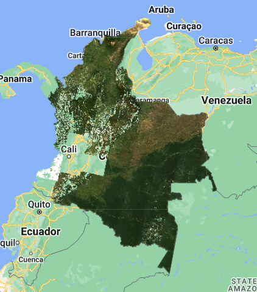
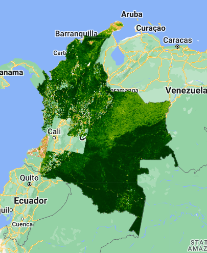
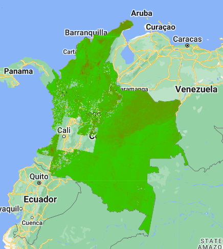
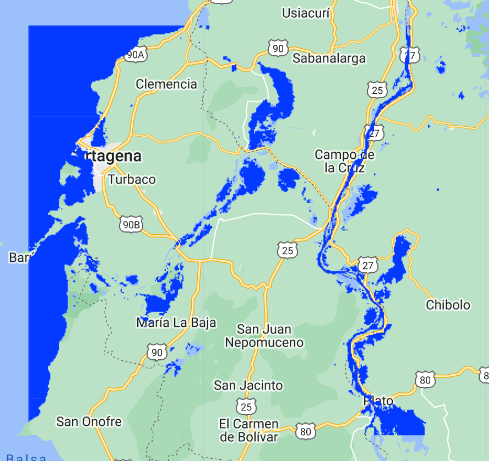
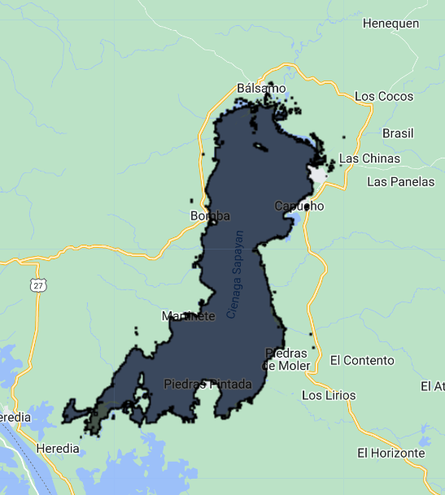
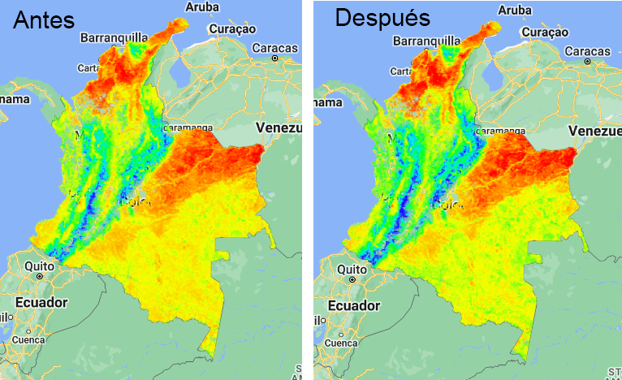
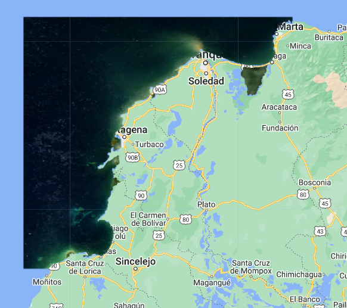
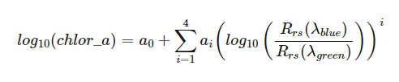
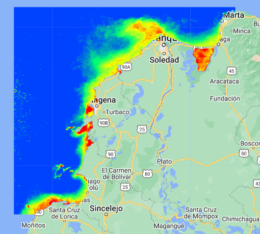

## Script
El script completo que se usará en esta sección esta disponible [aquí](https://code.earthengine.google.com/a4779b6b5c99ee19153033f4663a41ac).

# Índices y operaciones matématicas

En sesiones anteriores vimos como extraer información de productos disponibles en GEE. Uno de ellos fue el producto de MODIS Terra ["MODIS/061/MOD13Q1"](https://developers.google.com/earth-engine/datasets/catalog/MODIS_061_MOD13Q1) que entrega indices de vegetación (NDVI y EVI) cada 16 días a 250m / pixel.
Sin embargo, podemos usar cualquier colección con datos multiespectrales para calculor nuestros propios índices, ya sea para obtener mejor resolución espacial o temporal, o información que no esté disponible en GEE.

Para los siguientes ejemplos usaremos la colección de [Landsat-8 L2](https://developers.google.com/earth-engine/datasets/catalog/LANDSAT_LC08_C02_T1_L2#description), para lo cual vamos a precargar algunas funciones primero:

```javascript
// Funciones precargadas:

// Función enmascarar nubes Landsat-8:
function maskL8clouds(image) {
  var qa = image.select('QA_PIXEL'); //Select the QA band

  // Bit 3 es nubes.
  var cloudBitMask = 1 << 3;  
  var mask = qa.bitwiseAnd(cloudBitMask).eq(0);

  return image.updateMask(mask);
}

// Función para aplicar factores de escala Landsat-8:
function applyScaleFactors(image) {
  var opticalBands = image.select('SR_B.').multiply(0.0000275).add(-0.2);
  var thermalBands = image.select('ST_B.*').multiply(0.00341802).add(149.0);
  return image.addBands(opticalBands, null, true)
              .addBands(thermalBands, null, true);
}
```

Adicionalmente, vamos a preparar una colección de imágenes, filtrando, aplicando factores de escala y limpiando nubes:

```javascript
// Polígono de Colombia
var colombia = ee.FeatureCollection("USDOS/LSIB/2017").filter(ee.Filter.eq('COUNTRY_NA','Colombia'));

// Cargar imagenes Landsat-8 y pre-procesar:
var coleccion = ee.ImageCollection("LANDSAT/LC08/C02/T1_L2")
                .filterBounds(colombia)
                .filterDate('2022-01-01','2022-12-31')
                .filter(ee.Filter.lt('CLOUD_COVER',30))
                .map(maskL8clouds)
                .map(applyScaleFactors);

// Generar mosaico compuesto y recortar:
var compuesto = coleccion.median().clip(colombia);

// Visualizar mapa:
Map.addLayer(compuesto,{bands:['SR_B4','SR_B3','SR_B2'],min:0,max:0.2},'Compuesto');
```

Vamos a obtener un mosaico como el siguiente, con algunos vacios de información en la zona Andina de Colombia, pero con buena calidad en sur, este y norte.



## NDVI - Normalized Difference Vegetation Index:

El índice de diferencia de vegetación normalizada (NDVI) tiene un rango de valores entre -1 a +1. Típicamente, cuando hay valores negativos existe alta probabilidad que se trate de un cuerpo de agua. Por otro lado, si los valores son cercanos a +1 es probable que se trate de vegetación muy densa. Cuando el NDVI es cercano a cero es probable que se trate de un área urbana.

Para calcular el NDVI usamos la siguiente fórmula:

$$\frac{(NIR-Rojo)}{(NIR+Rojo)}$$

La relación entre las bandas NIR (infrarrojo cercano o Near-Infrared) y Rojo van a proporcionar un índice de vegetación.


```javascript
// Calcular NDVI:
// NDVI = (NIR - RED) / (NIR + RED)
var NIR = compuesto.select('SR_B5');
var Red = compuesto.select('SR_B4');
var ndvi = NIR.subtract(Red).divide(NIR.add(Red));

// Paleta de verdes:
var palette = [
    'FFFFFF', 'CE7E45', 'DF923D', 'F1B555', 'FCD163', '99B718', '74A901',
    '66A000', '529400', '3E8601', '207401', '056201', '004C00', '023B01',
    '012E01', '011D01', '011301'];

// Visualizar:
Map.addLayer(ndvi, {'palette': palette}, "NDVI");
```

Otra alternativa para calcular indices normalizados es usar la función `normalizedDifference`. Para este ejemplo, nuestro NDVI podría ser calculado como `var ndvi = composite.normalizedDifference(['SR_B4', 'SR_B3'])`.



## EVI - Enhanced Vegetation Index:

El índice de vegetación aumentada es similar al NDVI, pero es usado para cuantificar la "verdura" de la vegetación. Este índice puede corregir algunas condiciones atmosféricas, ruido de fondo, y es más sensible en áreas de vegetación densa. 

Para calcular el EVI usamos la siguiente fórmula:

$$2.5 * \frac{NIR-Rojo}{NIR + 6 * Rojo - 7.5 * Azul + 1}$$

Esta formula es un poco distinta a los típicas diferencias normalizadas, y puede ser aplicada en GEE usando la función `expression` que permite crear expresiones matemáticas y aplicarlas sobre una imágen.

```javascript
// Calcular EVI usando expresiones:
// EVI = 2.5 * [(NIR-RED) / (NIR + 6*RED - 7.5*BLUE)+1]
var evi = compuesto.expression(
    '2.5 * ((NIR - RED) / (NIR + 6 * RED - 7.5 * BLUE + 1))', {
      'NIR': compuesto.select('SR_B5'),
      'RED': compuesto.select('SR_B4'),
      'BLUE': compuesto.select('SR_B2')
});

// Visualizar EVI:
Map.addLayer(evi, {'min': -1, 'max': 1, 'palette': ['FF0000', '00FF00']}, 'EVI');
```



## NDWI - Normalized Difference Water Index:

Este índice permite detectar cuerpos de agua usando las bandas Verde y NIR. Las propiedades opticas del agua permiten mayor penetración de la longitud de onda verde, en comparación con el infrarrojo, el cual es absorbido inmediatamente en superficie. Sin embargo, los cuerpos de agua pueden contener diversos elementos disueltos que pueden alterar la eficacia de detección por el índice, por ejemplo alto contenido de algas, material suspendido, o materia orgánica disuelta. El umbral para detección de agua está alrededor de 0.3, donde valores más altos que este indican presencia de agua. 

La fórmula para calcular el NDWI es:

$$\frac{(Verde-NIR)}{(Verde+NIR)}$$

En GEE vamos a crear una función donde se incluya el cálculo del NDWI y otras variables para limpiar la máscara y visualizar solo píxeles de agua usando un umbral definido, pero que puede ser modificado. Adicionalmente, aplicaremos el NDWI sobre un área de interés más pequeña, que en este ejemplo será en el noroccidente de Colombia.

```javascript
// NDWI Función
function calcularNdwi(Image){
  var getNdwi = Image.normalizedDifference(['SR_B3', 'SR_B5']);
  getNdwi = getNdwi.select(['nd'],['ndwi']);
  var ndwiUmbral = getNdwi.gt(0.1);
  var ndwiMask = ndwiUmbral.updateMask(ndwiUmbral);
  return ndwiMask;
}

// Aplicar NDWI y crear mosaico:
var ndwi = coleccion.map(calcularNdwi).mosaic().clip(aoi);

// Visualizar:
Map.addLayer(ndwi,{palette:'#0439ff'},'Agua');
}
```



Vamos a extraer una porción de nuestra capa de cuerpos de agua y la convertiremos en polígono usando la función `reduceToVectors`. Este es un proceso que puede ser computacionalmente intenso y no se recomienda hacerlo en tiempo real sobre cuerpos de agua extensos o que puedan terminar en geometrías con muchos vértices, ya que podriamos obtener un error. Por lo tanto, lo aplicaremos sobre una ciénaga la cual llamaremos `aoi2`.

```javascript
// Extraer cuerpo de agua y convertirlo a vector (polígono):
var vector = ndwi.reduceToVectors({
  reducer: ee.Reducer.countEvery(),
  geometry: aoi2,
  geometryType: 'polygon',
  crs: 'EPSG:4326',
  scale:30
});

// Visualizar
Map.addLayer(vector, {}, 'Cienaga')
```



## Calibrar datos

Suponiendo que tenemos datos de temperatura (promedio de Marzo 2023) en 15 estaciones dispersas a lo largo de Colombia, y queremos calibrar la temperatura satélital para obtener datos más precisos y confiables. Se debe empezar por tomar valores de temperatura satélital en cada punto correspondiente a la estación en tierra. La imagen debe corresponder a la fecha o escala de tiempo de los datos en tierra, es decir que debe ser un promedio del mes de Marzo de 2023. 

```javascript
//Estaciones
var estaciones = 
    /* color: #d63000 */
    /* shown: false */
    ee.Geometry.MultiPoint(
        [[-69.03056640625002, 5.566695145563868],
         [-74.08647496384208, 9.224421547975846],
         [-75.80034215134208, 7.093023536097247],
         [-75.55864293259208, 5.050215319499798],
         [-73.81181676071708, 4.683500923873923],
         [-70.07111501312893, 2.562425710926286],
         [-73.27912282562893, 0.058397511297669374],
         [-74.66340016937893, 1.2448230149694066],
         [-70.53254079437893, -0.44696903874969995],
         [-77.93732595062893, 2.1233410123532996],
         [-76.35529470062893, 1.46448803197826],
         [-73.04427825166749, 7.835579705236751],
         [-72.06620473179319, 3.7596362111559505],
         [-73.57133168491819, 6.243838487056281],
         [-72.30790395054319, 6.516795235008629]]),

// Cargar producto de Modis Terra MOD11A1.061 y seleccionar banda de temperatura
var mod11a1 = ee.ImageCollection("MODIS/061/MOD11A1").select('LST_Day_1km');

// Filtrar colección, sumar precipitaciones del mes, y recortar:
var temp = mod11a1
            .filterDate('2023-03-01','2023-03-31')
            .filterBounds(colombia);

// Aplicar factor de escala, convertir a Celsius, obtener promedio, y recortar figura:
var tempEscala = temp
                  .map(function(x){return x.multiply(0.02).subtract(273.15)})
                  .mean()
                  .clip(colombia);

// Cargar paleta de color y visualizar capa:
var tempPaleta = ['#1b00ff','#00eaff','#00ff27','#f6ff00','#ff9200','#ff0000'];
Map.addLayer(tempEscala,{min:10, max:40, palette:tempPaleta},'Temperatura');

// Muestrear valores espectrales en cada punto
var muestras = tempEscala.sampleRegions({
  collection: estaciones,
  scale: 1000
});
```

La ecuación de mejor ajuste entre los datos en tierra y los datos satelitales debe ser aplicada a la imagen ráster y así obtendremos una nueva imagen calibrada. La ecuación que vamos a usar es polinómica `y = 0.0062x^2 + 0.7886x`.

```javascript
// Suponiendo que el mejor ajuste fue una ecuación polinomica
// y = 0.0062x^2 + 0.7886x, la aplicamos dentro de una expresion: 
var calibrar = tempEscala.expression(
  '0.0062 * x**2 + 0.7886 * x', 
  {'x': tempEscala.select('LST_Day_1km')});
Map.addLayer(calibrar, {min:10, max:40, palette:tempPaleta},'Temperatura Calibrada');
```




## EJERCICIO

En este ejercicio aplicaremos una ecuación desarrollada por la NASA para estimar [concentración de clorofila](https://oceancolor.gsfc.nasa.gov/atbd/chlor_a/) en aguas costeras usando datos de MODIS. Para esto vamos a usar algunas funciones para preparar los datos.

```javascript
// Función anidada para recortar 'continente' en cada imagen con una geometría dada:
var tierraMask = function(geometry) {
  var function2 = function(image) {
    var mask = ee.Image.constant(1).clip(geometry).mask().not()
    return image.updateMask(mask)
  }
  return function2
}

// Function to mask cloud of MODIS data
function maskModclouds(image) {
  var qa = image.select('state_1km'); //Select the QA band

  // Bits 0 and 1 are clouds.
  var cloudBit1 = 1 << 0;
  var cloudBit2 = 1 << 1;

  // Both flags should be set to zero, indicating clear conditions.
  var mask = qa.bitwiseAnd(cloudBit1).eq(0)
      .and(qa.bitwiseAnd(cloudBit2).eq(0));
  //Map.addLayer(mask,{},'mask')
  return image.updateMask(mask);
}

var costa = 
    /* color: #98ff00 */
    /* shown: false */
    /* displayProperties: [
      {
        "type": "rectangle"
      }
    ] */
    ee.Geometry.Polygon(
        [[[-76.32827601227055, 11.380532624886323],
          [-76.32827601227055, 9.305555010512242],
          [-74.07607874664555, 9.305555010512242],
          [-74.07607874664555, 11.380532624886323]]], null, false);


//// Cargar colección de MODIS
var modis = ee.ImageCollection("MODIS/061/MYD09GA");

// Process modis images from January 2020
var image = modis.filterDate('2020-01-01','2020-01-31').map(maskModclouds)
            .map(tierraMask(colombia)).mean().clip(costa).multiply(0.0001);

Map.addLayer(image,{bands:['sur_refl_b01','sur_refl_b04','sur_refl_b03',], min:0,max:0.15},'MODIS RGB');
```



A partir de aqui aplicar la ecuación:



donde:

* a0 = 0.26294
* a1 = -2.64669
* a2 = 1.28364
* a3 = 1.08209
* a4 = -1.76828

El resultado deberá verse similar a este, usando `var vis = {min:0,max:1.5,palette:['#0043ff','#00ff72','#fbff00','#ff0000']}`



## SOLUCION
```javascript
var red = image.select('sur_refl_b01')
var green = image.select('sur_refl_b04')
var blue = image.select('sur_refl_b03')


// OC3M algorithm
var a1 = ee.Image.constant(-2.64669).multiply(blue.divide(green).log10())
var a2 = ee.Image.constant(1.28364).multiply(blue.divide(green).log10()).pow(2)
var a3 = ee.Image.constant(1.08209).multiply(blue.divide(green).log10()).pow(3)
var a4 = ee.Image.constant(-1.76828).multiply(blue.divide(green).log10()).pow(4)

var ocx = ee.Image.constant(0.26294).add(a1.add(a2.add(a3.add(a4))))

Map.addLayer(ocx,{min:0,max:1.5,palette:['#0043ff','#00ff72','#fbff00','#ff0000']},'OC3M')
```

