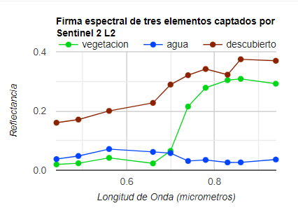
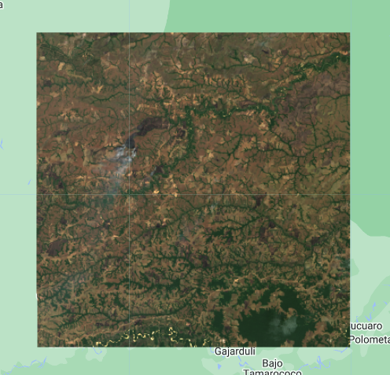
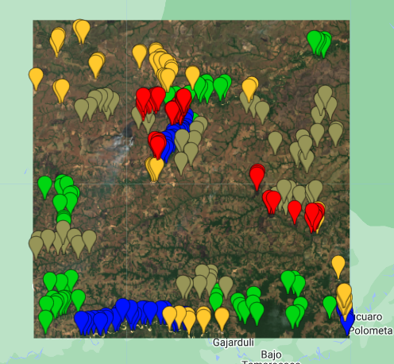
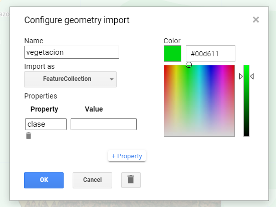
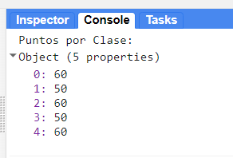
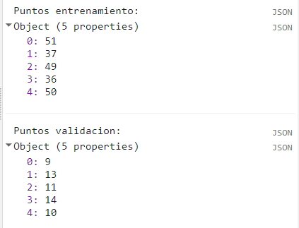
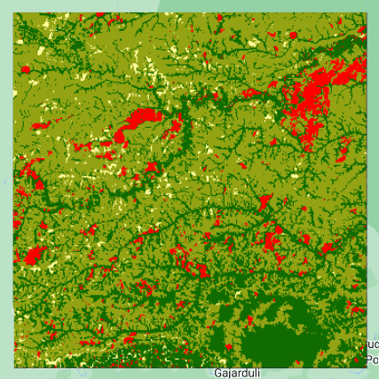

## Script
El script completo que se usará en esta sección esta disponible [aquí]().

# Clasificación Supervisada

Las imágenes satelitáles con propiedades espectrales permiten agrupar o clasificar los diferentes objetos visibles según sus firmas espectrales. Para esto es necesario establecer cuáles elementos se desean clasificar y proporcionar datos georeferenciados que respalden a esos elementos en la imagen satelital. Esos datos se conocen en inglés como "ground-truth". Esto hace que la clasificación que se hará sea llamada "supervisada", debido a que se conocen los elementos a clasificar. Las clasificaciones son útiles para la elaboración de mapas sobre el uso de la tierra, cobertura vegetal, o habitats. Además, si se realizan clasificaciones en distintos periodos de tiempo se pueden incluso detectar cambios temporales.



### 1. Preparar imagen

Para el siguiente ejercicio de clasificación supervisada vamos a cargar la colección de Sentinel-2 L2 y seleccionar una imágen que será la que vamos a clasificar.

```javascript
// Preparar colección de Sentinel-2
var coleccion = ee.ImageCollection("COPERNICUS/S2_SR_HARMONIZED")
                .filterDate('2022-01-01','2023-06-06')
                .filterBounds(pin)
                .filter(ee.Filter.lt('CLOUDY_PIXEL_PERCENTAGE',30));

// Lista de IDS
print(coleccion.aggregate_array('system:index'));

// Cargar imagen y visualizar
var imagen = coleccion.filter(ee.Filter.eq('system:index','20220107T150719_20220107T150929_T19NDF')).first();
Map.addLayer(imagen,{bands:['B4','B3','B2'],min:0,max:2000},'Imagen');
```


### 2. Preparar datos

Luego de seleccionar nuestra imagen, debemos preparar los datos que vamos a usar para la clasificación. En este ejemplo, podremos colectar algunos datos visualmente punto por punto, clase por clase. Vamos a considerar las siguientes clases:
* Vegetación
* Agua
* Pasto
* Área sin vegetación
* Área quemada

Seleccionamos algunos puntos (entre 50 y 60) para cada una de estas clases. En este ejemplo usamos un conjunto de puntos relativamente pequeño, ya que en las clasificaciones supervisadas más puntos robustecen los resultados y mejoran la clasificación.



Al crear un conjunto de puntos por clase en GEE vemos que son almacenados en variables diferentes. Pero, los vamos a unir en una sola colección de Features, por eso los cambiamos de `Geometry` a `FeatureCollection`, y les asignamos una propiedad en comun, que en este caso la llamaremos "clase" y se le asignará un valor númerico entre 0 y 4 para identificar cada clase.



El código será:

```javascript
// Luego de convertir los puntos de geometrias a FeatureCollection procedemos a unir
// cada conjunto de puntos en un solo grupo diferenciados por la propiedad 'clase':
var puntos = vegetacion.merge(agua).merge(pasto).merge(noVegetacion).merge(quemado);

// Preseleccionar lista de bandas para clasificación
var bandas = ['B1','B2', 'B3', 'B4', 'B5', 'B6', 'B7','B8','B8A','B9','B11'];

// Especificar nombre de propiedad indicando clases.
var propiedad = 'clase';

/* 
Las clases son:
  0: Vegetación
  1: Agua
  2: Pasto
  3: No Vegetación
  4: Area Quemada
*/

// Imprimir numero de puntos por clase:
print('Puntos por Clase:',puntos.aggregate_histogram('clase'));
```

Verificamos el numero de puntos por clase, que en su totalidad son 280 puntos.



### 3. Muestras espectrales + Partición de datos de entrenamiento y validación

El conjunto de puntos los vamos a usar para muestrear las firmas espectrales, es decir que de cada punto se tomarán los valores de cada banda espectral. Luego procedemos a particionar el conjunto de datos en 80% para entrenamiento y 20% para validación. Para esto aplicamos la función `randomColumn`, la cual añadirá una columna nueva asignando valores aleatorios únicos entre 0 y 1 a cada clase. Esto es parecido a una indexación. Posteriormente filtramos los valores por encima y por debajo de 0.8 en la columna `random`, para separar los datos de validación y entrenamiento, respetivamente.

```javascript
// Muestrear valores espectrales en cada punto
var muestras = imagen.select(bandas).sampleRegions({
  collection: puntos,
  properties: [propiedad],
  scale: 10
});

// Añadir columna con valores aleatorios en cada observación.
// Esto servirá para dividir los datos de entrenamiento y validación
var random = muestras.randomColumn('random');

// Dividir datos entre entrenamiento y validacion.
// Aproximadamente 80% para entrenamiento y 20% para validación.
var fraccion = 0.8;  
var entrenamiento = random.filter(ee.Filter.lt('random', fraccion));
var validacion = random.filter(ee.Filter.gte('random', fraccion));
```



### 4. Entrenar modelo y clasificar imagen

Luego de tener nuestros datos de entrenamiento, procedemos a entrenar un clasificador que en este ejemplo será Random Forest. Luego aplicaremos ese modelo a nuestra imagen para obtener un mapa clasificado.

```javascript
// Entrenar clasificador Random Forest con 10 arboles.
var clasificador = ee.Classifier.smileRandomForest(10).train({
   features: entrenamiento,
   classProperty: propiedad,
   inputProperties: bandas
});

// Clasificar imagen con modelo y Visualizar clasificación
var mapa = imagen.classify(clasificador);
Map.addLayer(mapa, {min: 0, max: 4, palette: ['#106c00','#004dff','#93a313','#fffc9d','#ff0000']},'RF');
```



