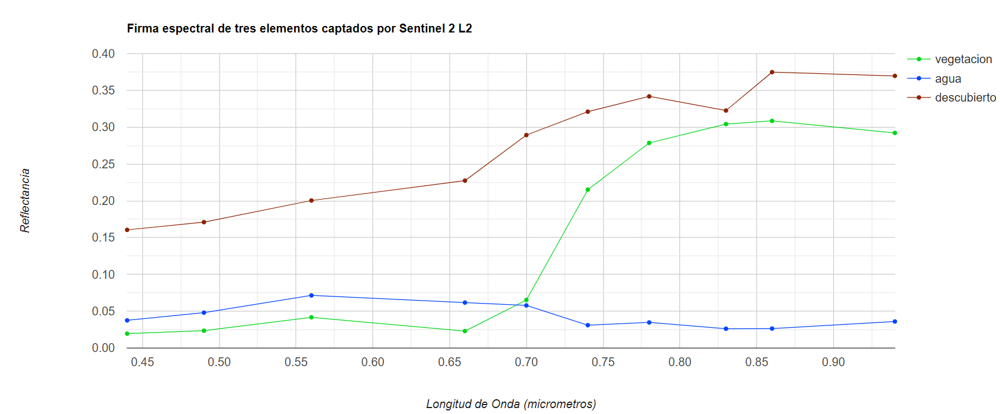

## Script
El script completo que se usará en esta sección esta disponible [aquí]().

# Clasificación Supervisada

Las imágenes satelitáles con propiedades espectrales permiten agrupar los diferentes objetos visibles según sus firmas espectrales.

