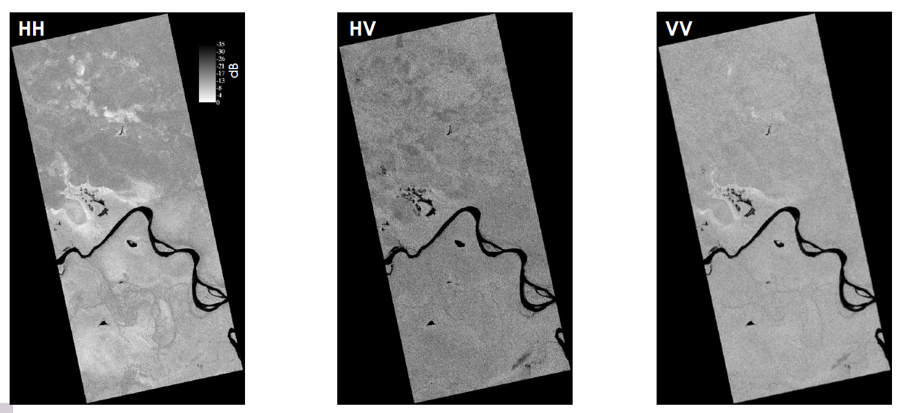
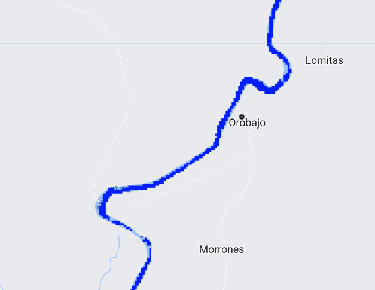
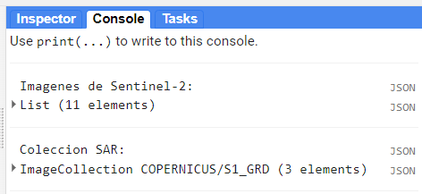
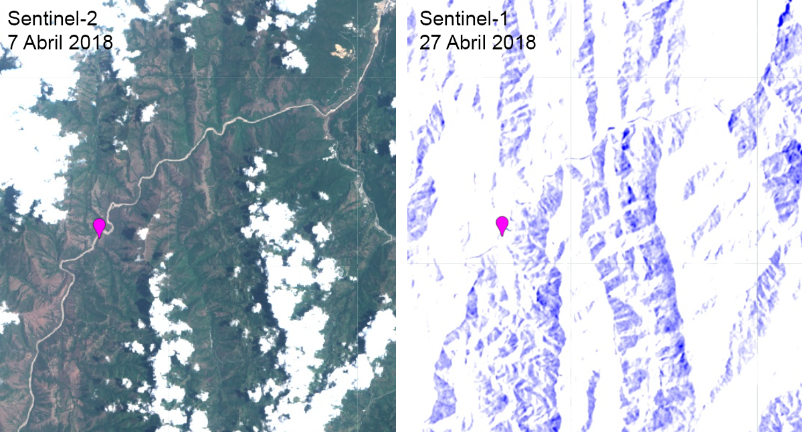
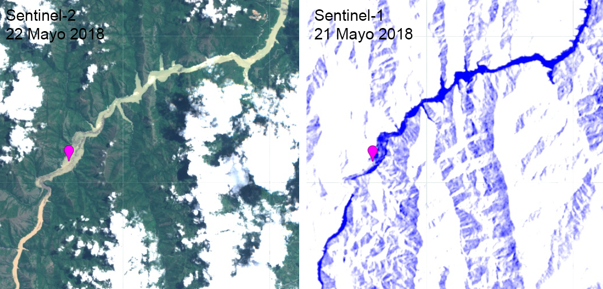
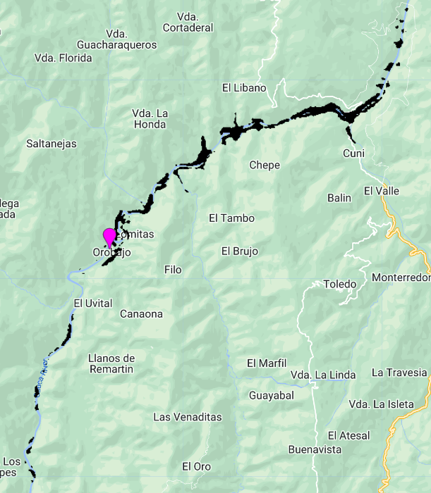
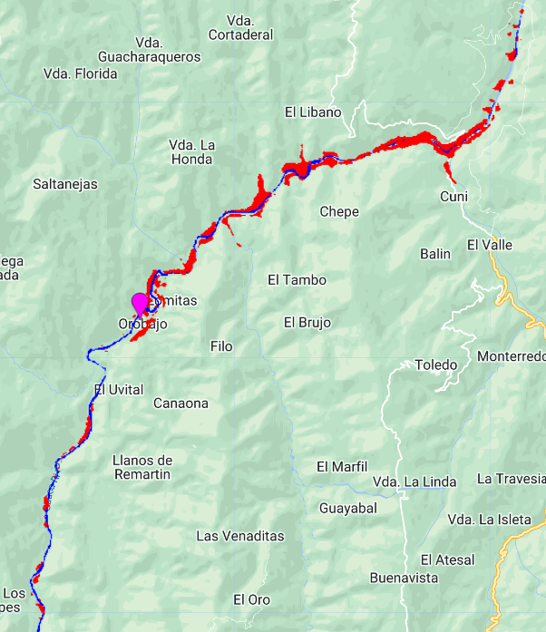

## Script
El script completo que se usará en esta sección esta disponible [aquí]().

# Mapeo de Inundaciones

Mapear areas inundadas puede ser logrado con imágenes multiespectrales, sin presencia de nubes y si los cuerpos de agua son directamente observados (no cubiertos por vegetación). Estas son limitaciones para las imágenes espectrales, pero no para las imágenes de radar de apertura sintética (SAR), ya que esta señal de radar es capaz de ir y volver a través de nubes y vegetación no tan densa para detectar cuerpos de agua o zonas inundadas. En GEE se encuentra la colección de [Sentinel-1](https://developers.google.com/earth-engine/datasets/catalog/COPERNICUS_S1_GRD) que desde 2014 provee datos a una frecuencia de 5.4 GHz (C-Band), a tres resoluciones de 10, 25, o 40 m por pixel, diferentes polarizaciones (HH, VV, VH, HV), y entrega una imagen cada 16 días, aproximadamente.



En esta práctica vamos a estudiar el evento de inundación causado por la Hidroeléctrica de Ituango (Hidroituango) en Colombia, ocurrido en Abril de 2018. La hidroeléctrica se situa sobre el cauce del río Cauca en el Municipio de Ituango (7.1345, -75.6624), la cual se empezó a construir en 2008 y el 28 de Abril de 2018 se empezaron operaciones sin haber sido terminada. Esto provocó un inundamiento descontrolado cauce arriba. Se estimó que el nivel del río cauce arriba subió más de 100 m en solo unos días, afectando poblaciones como la de Orobajo. 


Preparamos algunas variables y colecciones que usaremos a lo largo del script. Cargamos también la [colección JRC de cuerpos de agua](https://developers.google.com/earth-engine/datasets/catalog/JRC_GSW1_4_GlobalSurfaceWater) para visualizar el cauce del río Cauca. Esta colección provee la 'occurrencia' de un cuerpo de agua, por lo tanto los vamos a enmascarar con valores más altos de 40% de occurrencia para visualizar lo mejor posible el río.

```javascript
// Identificamos rango de fechas de interes
var ini = '2018-04-25';
var fin = '2018-05-25';

// Punto sobre Orobajo
var orobajo = ee.Geometry.Point([-75.794, 7.026]);

// Poligono de Colombia
var colombia = ee.FeatureCollection("USDOS/LSIB/2017").filter(ee.Filter.eq('COUNTRY_NA','Colombia'));

// Cargar coleccion JRC de cuerpos de agua superficial:
var rios = ee.Image("JRC/GSW1_4/GlobalSurfaceWater")
            .select('occurrence')
            .clip(colombia)
            .gt(40).selfMask();

Map.addLayer(rios,{palette:['#001eff']},'Cuerpos de Agua');
```



Ahora, cargamos y preparamos la colección de Sentinel-1

```javascript
// Preparar colección de Sentinel-2
var coleccion = ee.ImageCollection("COPERNICUS/S2")
                .filterDate('2018-04-01','2018-05-30')
                .filterBounds(orobajo);
                //.filter(ee.Filter.lt('CLOUDY_PIXEL_PERCENTAGE',50));

// Lista de IDS
print('Imagenes de Sentinel-2:',coleccion.aggregate_array('system:index'));

// Preparar colección de Sentinel-1
var sar = ee.ImageCollection("COPERNICUS/S1_GRD")
          .filterBounds(orobajo)
          .filterDate(ini,fin)
          .filter(ee.Filter.listContains('transmitterReceiverPolarisation', 'VV'))
          .filter(ee.Filter.eq('instrumentMode', 'IW'))
          .filterMetadata('resolution_meters', 'equals', 10)
          .select('VV');
print('Coleccion SAR:', sar);
```



Debido a que las imágenes son un poco "ruidosas" vamos a aplicar un kernel para la imagen SAR, preparamos una imagen de Sentinel-2 y otra de Sentinel-1 previas al evento de inundación, y visualizamos.

```javascript
//Crear kernel para suavizar imagenes de Sentinel-1
var kernel = ee.Kernel.gaussian({
  radius:3,
  units:'pixels',
  normalize:false
});

// Cargar imagenes ANTES de inundación:
// Imagen post-colapso de muro: 20180522T153621_20180522T153621_T18NVN
var imgAntes = coleccion.filter(ee.Filter.eq('system:index','20180407T153619_20180407T153815_T18NVN')).first();
var sarAntes = sar.first().convolve(kernel);

// Visualizar imagenes ANTES:
var rgbVis = {bands:['B4','B3','B2'],min:0,max:2000};
var sarVis = {min:-20, max:0, palette:['blue','white', 'white']};
Map.addLayer(imgAntes, rgbVis, 'RGB_Antes');
Map.addLayer(sarAntes, sarVis, 'SAR_Antes');
```



Posteriormente, procedemos a identificar las imagenes posteriores al evento de inundación y visualizamos.

```javascript
// Cargar imagenes DESPUES de inundación:
var imgDespues = coleccion.filter(ee.Filter.eq('system:index','20180522T153621_20180522T153621_T18NVN')).first();
var sarDespues = sar.filterDate('2018-05-20','2018-05-22').first().convolve(kernel);

// Visualizar imagenes DESPUES:
Map.addLayer(imgDespues, rgbVis, 'RGB_Despues');
Map.addLayer(sarDespues, sarVis, 'SAR_Despues');
```



## Detección de Cambios

Como se ha podido observar hay cambios en dos periodos de tiempo distintos. Esto se conoce como detección de cambios (Change detection), que es identifcar, mapear, y cuantificar las áreas que cambiaron, ya sean pérdidas o ganancias. Procedemos a sustraer a la capa posterior a la perturbación la capa del estado anterior.

```javascript
// Obtener la diferencia entre las capas antes y después,
// y establecer un umbral para pixeles de inundación
var diff = sarDespues.subtract(sarAntes);
var thr = diff.lt(-10).clip(aoi);
Map.addLayer(thr.selfMask(),{palette:'black'},'Area inundada');
```
Se puede observar en negro las zonas detectadas como inundación, usando imágenes SAR.



Sin embargo, debido al ruido que puede haber en estas imágenes SAR, vamos a tratar de "refinar" estas áreas sustrayendo y sobreponiendo pixeles identificados como el cauce del río en un estado anterior a la perturbación por la colección de JRC de cuerpos de agua. Con este paso reducimos un poco el sesgo al cuantificar las áreas inundadas.

```javascript
// Refinar las areas inundadas
var rioClip = rios.clip(aoi).mask();
var diffRef = thr.subtract(rioClip).eq(1);

// Unir los pixels del rio antes con pixeles inundados
var cambios = rioClip.add(diffRef.multiply(2)).selfMask();
Map.addLayer(cambios,{palette:['blue','red'],min:1,max:2},'Area inundada Refinada');
```


