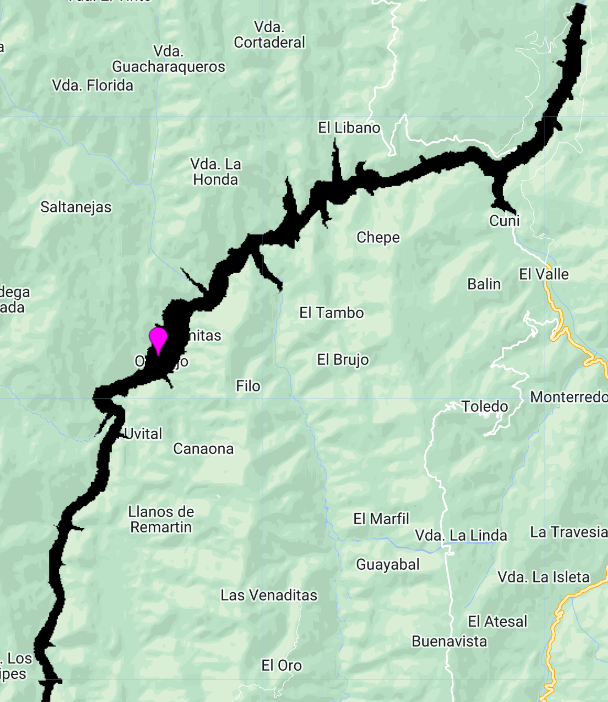
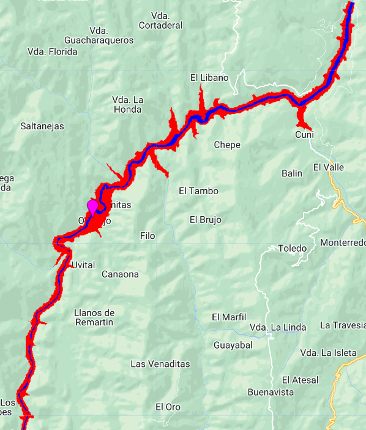
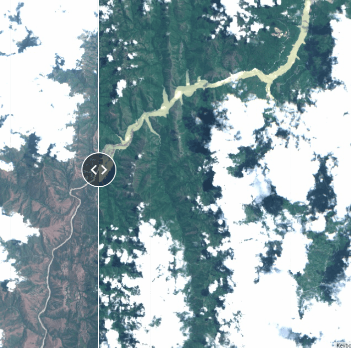
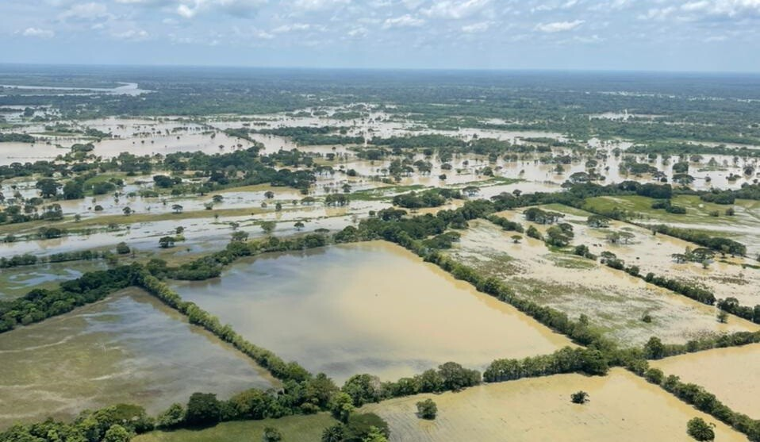

## Script
El script completo que se usará en esta sección esta disponible [aquí]().

# Mapeo de Inundaciones

Mapear areas inundadas puede ser logrado con imágenes multiespectrales, sin presencia de nubes y si los cuerpos de agua son directamente observados (no cubiertos por vegetación). Estas son limitaciones para las imágenes espectrales, pero no para las imágenes de radar de apertura sintética (SAR), ya que esta señal de radar es capaz de ir y volver a través de nubes y vegetación no tan densa para detectar cuerpos de agua o zonas inundadas. En GEE se encuentra la colección de [Sentinel-1](https://developers.google.com/earth-engine/datasets/catalog/COPERNICUS_S1_GRD) que desde 2014 provee datos a una frecuencia de 5.4 GHz (C-Band), a tres resoluciones de 10, 25, o 40 m por pixel, diferentes polarizaciones (HH, VV, VH, HV), y entrega una imagen cada 16 días, aproximadamente.


En esta práctica vamos a estudiar el evento de inundación causado por la Hidroeléctrica de Ituango (Hidroituango) en Colombia, ocurrido en Abril de 2018. La hidroeléctrica se situa sobre el cauce del río Cauca en el Municipio de Ituango (7.1345, -75.6624), la cual se empezó a construir en 2008 y el 28 de Abril de 2018 se empezaron operaciones sin haber sido terminada. Esto provocó un inundamiento descontrolado cauce arriba. Se estimó que el nivel del río cauce arriba subió más de 100 m en solo unos días, afectando poblaciones como la de Orobajo. 


Preparamos algunas variables y colecciones que usaremos a lo largo del script. Cargamos también la [colección JRC de cuerpos de agua](https://developers.google.com/earth-engine/datasets/catalog/JRC_GSW1_4_GlobalSurfaceWater) para visualizar el cauce del río Cauca. Esta colección provee la 'occurrencia' de un cuerpo de agua, por lo tanto los vamos a enmascarar con valores más altos de 40% de occurrencia para visualizar lo mejor posible el río.

```javascript
// Identificamos rango de fechas de interes
var ini = '2018-04-25';
var fin = '2018-05-25';

// Punto sobre Orobajo
var orobajo = ee.Geometry.Point([-75.794, 7.026]);

// Poligono de Colombia
var colombia = ee.FeatureCollection("USDOS/LSIB/2017").filter(ee.Filter.eq('COUNTRY_NA','Colombia'));

// Cargar coleccion JRC de cuerpos de agua superficial:
var rios = ee.Image("JRC/GSW1_4/GlobalSurfaceWater")
            .select('occurrence')
            .clip(colombia)
            .gt(40).selfMask();

Map.addLayer(rios,{palette:['#001eff']},'Cuerpos de Agua');
```


Ahora, cargamos y preparamos la colección de Sentinel-1

```javascript
// Preparar colección de Sentinel-2
var coleccion = ee.ImageCollection("COPERNICUS/S2")
                .filterDate('2018-04-01','2018-05-30')
                .filterBounds(orobajo);
                //.filter(ee.Filter.lt('CLOUDY_PIXEL_PERCENTAGE',50));

// Lista de IDS
print('Imagenes de Sentinel-2:',coleccion.aggregate_array('system:index'));

// Preparar colección de Sentinel-1
var sar = ee.ImageCollection("COPERNICUS/S1_GRD")
          .filterBounds(orobajo)
          .filterDate(ini,fin)
          .filter(ee.Filter.listContains('transmitterReceiverPolarisation', 'VV'))
          .filter(ee.Filter.eq('instrumentMode', 'IW'))
          .filterMetadata('resolution_meters', 'equals', 10)
          .select('VV');
print('Coleccion SAR:', sar);
```


Debido a que las imágenes son un poco "ruidosas" vamos a aplicar un kernel para la imagen SAR, preparamos una imagen de Sentinel-2 y otra de Sentinel-1 previas al evento de inundación, y visualizamos.

```javascript
//Crear kernel para suavizar imagenes de Sentinel-1
var kernel = ee.Kernel.gaussian({
  radius:3,
  units:'pixels',
  normalize:false
});

// Cargar imagenes ANTES de inundación:
// Imagen post-colapso de muro: 20180522T153621_20180522T153621_T18NVN
var imgAntes = coleccion.filter(ee.Filter.eq('system:index','20180407T153619_20180407T153815_T18NVN')).first();
var sarAntes = sar.first().convolve(kernel);

// Visualizar imagenes ANTES:
var rgbVis = {bands:['B4','B3','B2'],min:0,max:2000};
var sarVis = {min:-20, max:0, palette:['blue','white', 'white']};
Map.addLayer(imgAntes, rgbVis, 'RGB_Antes');
Map.addLayer(sarAntes, sarVis, 'SAR_Antes');
```


Posteriormente, procedemos a identificar las imagenes posteriores al evento de inundación y visualizamos.

```javascript
// Cargar imagenes DESPUES de inundación:
var imgDespues = coleccion.filter(ee.Filter.eq('system:index','20180522T153621_20180522T153621_T18NVN')).first();
var sarDespues = sar.filterDate('2018-05-20','2018-05-22').first().convolve(kernel);

// Visualizar imagenes DESPUES:
Map.addLayer(imgDespues, rgbVis, 'RGB_Despues');
Map.addLayer(sarDespues, sarVis, 'SAR_Despues');
```


## Detección de Cambios

Como se ha podido observar hay cambios en dos periodos de tiempo distintos. Esto se conoce como detección de cambios (Change detection), que es identifcar, mapear, y cuantificar las áreas que cambiaron, ya sean pérdidas o ganancias. Procedemos a sustraer a la capa posterior a la perturbación la capa del estado anterior.

```javascript
// Obtener la diferencia entre las capas antes y después,
// y establecer un umbral para pixeles de inundación
var diff = sarDespues.subtract(sarAntes);
var thr = diff.lt(-10).clip(aoi);
Map.addLayer(thr.selfMask(),{palette:'black'},'Area inundada');
```
Se puede observar en negro las zonas detectadas como inundación, usando imágenes SAR.


Sin embargo, debido al ruido que puede haber en estas imágenes SAR, vamos a tratar de "refinar" estas áreas sustrayendo y sobreponiendo pixeles identificados como el cauce del río en un estado anterior a la perturbación por la colección de JRC de cuerpos de agua. Con este paso reducimos un poco el sesgo al cuantificar las áreas inundadas.

```javascript
// Refinar las areas inundadas
var rioClip = rios.clip(aoi).mask();
var diffRef = thr.subtract(rioClip).eq(1);

// Unir los pixels del rio antes con pixeles inundados
var cambios = rioClip.add(diffRef.multiply(2)).selfMask();
Map.addLayer(cambios,{palette:['blue','red'],min:1,max:2},'Area inundada Refinada');
```


Al calcular las áreas inundadas detectadas por imagénes SAR, obtenemos un estimado de 7.25 km^2.

```javascript
// Calcular area inundada
var Area = cambios.eq(2).multiply(ee.Image.pixelArea());

// Aplicamos reductor para sumar el area de todos los pixeles
var reducerArea = Area.reduceRegion({
  reducer: ee.Reducer.sum(),
  geometry: aoi,
  scale: 10,
  crs: 'EPSG:4326',
  maxPixels: 1e15
  });

// Convertir m^2 a km^2
var areaSqKm = ee.Number(reducerArea.get('occurrence')).divide(1e6);
print('Area Inundada (km^2):',areaSqKm);
```

## Detección de Riesgo

Para detectar riesgos por inundación podemos usar datos de elevación para simular o proyectar los niveles de un cuerpo de agua en determinados casos, y cuantificar las áreas en potencial riesgo por inundación. Esto es útil antes de que sucedan las emergencias, pero para esta demostración trabajaremos sobre el evento que ocurrió en Hidroituango. Asumiendo que la mayor parte afectada del río estaba a 280 m de altitud antes y que el nivel del río subió 120 m después de la inundación, podemos visualizar y cuantificar las potenciales áreas en riesgo.

```javascript
// Cargar colección de elevación y recortar con área alrededor del río.
var dem = ee.ImageCollection("COPERNICUS/DEM/GLO30")
          .filterBounds(aoi)
          .select('DEM')
          .mosaic();

// La altitud a la que se encontraba el nivel del rio ANTES
// en la mayor parte del area afectada es de ~280 m.
var altitud = 280;
var demMask = dem.lt(altitud).selfMask().clip(aoi);
Map.addLayer(demMask,{min:235, max:1760},'DEM');

// Predecir el area afectada subiendo el nivel del rio 120 m
var inundar = 120;
var demRiesgo = dem.lt(altitud + inundar).selfMask().clip(aoi);
Map.addLayer(demRiesgo,{min:235, max:1760},'DEM inundado');
```



Podemos refinar un poco el resultado sobreponiendo el cauce del río sobre las potenciales áreas en riesgo si el nivel sube 120 m.

```javascript
// Crear capa con zona de riesgo
var rioDEM = demMask.unmask().add(rioClip.unmask()).eq(0).not(); // Completar el cauce del rio
var riesgo = demRiesgo.add(rioDEM); // Sumar la capa de riesgo con el cauce anterior del rio
Map.addLayer(riesgo,{min:1, max:2, palette:['red','blue']},'DEM Riesgo');
```



Al cuantificar las áreas en potencial riesgo de inundación obtenemos un área de 17.35 km^2, aproximadamente. Este es casi 10 km^2 más alto que el estimado por las imágenes SAR. En términos generales, es positivo sobrestimar y no subestimar áreas en riesgo para prevenir desatres. Esta área encaja con el cauce del río posterior al evento de inundación, observado en la imágen de Sentinel-2.

```javascript
// Calcular area de riesgo
var Area = riesgo.eq(1).multiply(ee.Image.pixelArea());

// Aplicamos reductor para sumar el area de todos los pixeles
var reducerArea = Area.reduceRegion({
  reducer: ee.Reducer.sum(),
  geometry: aoi,
  scale: 10,
  crs: 'EPSG:4326',
  maxPixels: 1e15
  });

// Convertir m^2 a km^2
var areaSqKm = ee.Number(reducerArea.get('DEM')).divide(1e6);
print('Area en riesgo (km^2):',areaSqKm);
```

## Bonus: Creación de un Split Panel

El siguiente ejemplo es el primer acercamiento hacia los objetos UI (User Interface) de GEE. El spli panel permite obtener una vista independiente de dos mapas separados por una barra deslizante. Este tipo de objetos son muy útiles para permitir la interacción y comparación de dos mapas.

Inicialmente se debe "poner" un mapa dentro dos variables. Estas dos variables representaran alojarán las imagenes de antes y después de la inundación.

```javascript
// Poner en variables un mapa "vacio" para los lados izquierdo y derecho:
var mapIzq = ui.Map();
var mapDer = ui.Map();

// Añadir capas respectivas a cada mapa:
mapIzq.addLayer(imgAntes, rgbVis, 'RGB_Antes');
mapDer.addLayer(imgDespues, rgbVis, 'RGB_Despues');
```
Posteriormente hay que definir y configurar el split panel:

```javascript
// Crear Split Panel y definir las posiciones de los mapas
var split = ui.SplitPanel({
  firstPanel: mapIzq,
  secondPanel: mapDer,
  orientation: 'horizontal',
  wipe: true,
  style: {stretch: 'both'}
});
```

Por último "reseteamos" las capas cargadas anteriormente y cargamos la variable split que contiene el panel con los dos mapas asignados. Luego hay que enlazar los mapas de ambos lados para que se sincronizen cada vez que desplacemos la vista. Con esto queda terminado nuestro panel de comparación.

```javascript
// Asegurarse de resetear todas las capas previas y solo dejar las nuevas:
ui.root.widgets().reset([split]);

// Enlazar la vista de los dos mapas con cada desplazamiento:
var linker = ui.Map.Linker([mapIzq, mapDer]);

// Centrar vista:
mapIzq.centerObject(orobajo, 12);
```



## Ejercicio

El 20 de Abril de 2022 se registraron inundaciones en el Municipio de Guarandá (Sucre) y alrededores, inundando poblados enteros por varios días. En este caso, las inundaciones se presentaron por desbordamientos del río Cauca y rupturas en los jarillones que lo bordean, afectando a toda la región conocida como La Mojana. El casco urbano de Guarandá se situa en lat: 8.47, lon: -74.55. Para este ejercicio, realizar el mismo procedimiento para mapear inundaciones, detectar cambios, y detectar areas en riesgo.


