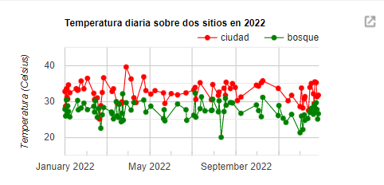
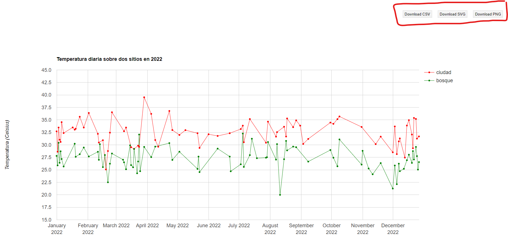
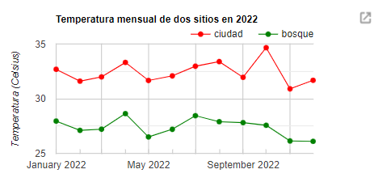
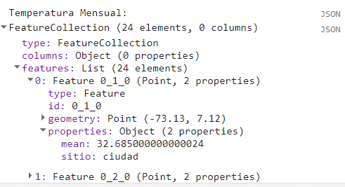
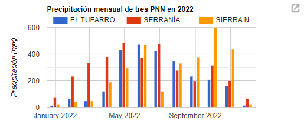
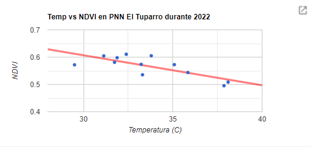
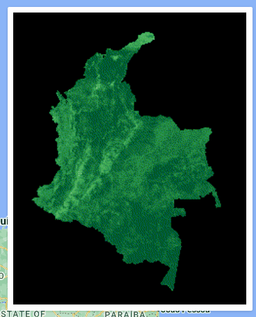
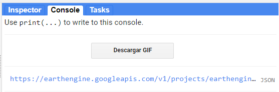

## Script
El script completo que se usará en esta sección esta disponible [aquí]().

# Series de Tiempo & Objetos UI

Las series de tiempo se pueden obtener de colecciones de imágenes o features, sobre pixeles individuales o regiones, en modo de gráficos o tablas. En los siguientes ejemplos se mostrará como procesar y obtener datos mensuales de variables ambientales. Adicionalmente, es necesario familiarizarse con los objetos UI de GEE, en especial `ui.Chart`, que nos permitrá hacer gráficas dentro de la interfaz de GEE. Documentación adicional sobre las gráficas pueden encontrarse [aquí](https://developers.google.com/earth-engine/guides/charts_overview).

Inicialmente cargaremos algunas variables que serán usados a lo largo del script:

```javascript
// Precargar variables:

// Poligono de Colombia
var colombia = ee.FeatureCollection("USDOS/LSIB/2017").filter(ee.Filter.eq('COUNTRY_NA','Colombia'));

// PNN
var pnn = ee.FeatureCollection('users/lsandoval-sig/PNN_Colombia_2023');

// Fechas de interés:
var fechaIni = '2022-01-01';
var fechaFin = '2022-12-30';

// Crear lista númerica de meses:
var months = ee.List.sequence(1, 12);

// Función para obtener promedios mensuales
function datosMes(coleccion, mes, reducer){ 
  //Extraer año y para introducirlo automaticamente en la imagen saliente
  var fecha = coleccion.first().get('system:time_start');
  var yr = ee.Date(fecha).get('year');
  // Aplicar reductor a grupo de imagenes mes por mes.
  var calculo = coleccion
                .filter(ee.Filter.calendarRange(mes, mes, 'month'))
                .reduce(reducer)
                .set('month', mes)
                .set("system:time_start", ee.Date.fromYMD(yr, mes, 1).millis());
  return calculo;
}
```

## Serie de tiempo por pixel y localidades:

Para este ejercicio usaremos la colección de ["MODIS/061/MOD11A1"](https://developers.google.com/earth-engine/datasets/catalog/MODIS_061_MOD11A1). Vamos a procesar esta colección para observar cómo varía la temperatura a lo largo del año 2022 en la zona urbana y en zona de bosque en la ciudad de Bucaramanga. Estas dos localidades serán variables de tipo `ee.Features` con una propiedad llamada "sitio", respectivamente.

```javascript
var ciudad = /* color: #999900 */ee.FeatureCollection(
        [ee.Feature(
            ee.Geometry.Point([-73.12524872642457, 7.120345156458741]),
            {
              "sitio": "ciudad",
              "system:index": "0"
            })]),
    bosque = /* color: #009999 */ee.FeatureCollection(
        [ee.Feature(
            ee.Geometry.Point([-73.0902941785425, 7.120259987689842]),
            {
              "sitio": "bosque",
              "system:index": "0"
            })]),
```

Luego, es necesario tener las dos localidades en un solo `ee.FeatureCollection`, y se pre-procesará la colección de temperatura:

```javascript
// Unir puntos en una colección, que se usará para tomar datos de temperatura
var puntos = ciudad.merge(bosque);

// Cargar producto de Modis Terra MOD11A1.061 y seleccionar banda de temperatura
var mod11a1 = ee.ImageCollection("MODIS/061/MOD11A1").select('LST_Day_1km');

// Filtrar colección, sumar precipitaciones del mes, y recortar:
var temp = mod11a1
            .filterDate(fechaIni,fechaFin)
            .filterBounds(colombia);

// Aplicar factor de escala, convertir a Celsius, obtener promedio, y recortar figura:
var tempEscala = temp
                  .map(function(x){return x.multiply(0.02).subtract(273.15)
                    .copyProperties(x,['system:time_start','system:time_end']); // Importante copiar las fechas
                  });
```

Ahora, tenemos una colección pre-procesada con datos diarios. En este momento podemos realizar una gráfica con datos diarios en dos localidades usando `ui.Chart.image.seriesByRegion`. Adicionalmente, damos un poco de formato y estilo:

```javascript
// Elaborar gráfico con datos diarios de temperatura en dos puntos.
var tempChart = ui.Chart.image.seriesByRegion({
  imageCollection: tempEscala,
  regions: puntos,
  reducer: ee.Reducer.mean(),
  scale: 1000,
  seriesProperty: 'sitio'
});

// Configurar gráfica
tempChart.setOptions({
  title: 'Temperatura diaria sobre dos sitios en 2022',
  vAxis: {
    title: 'Temperatura (Celsius)',
    viewWindow: {min: 15, max: 45}
  },
  lineWidth: 1,
  pointSize: 4,
  interpolateNulls: true,
  series: {
    0: {color: 'red'},
    1: {color: 'green'},
  }
});

// Imprimir gráfico en consola
print(tempChart);
```

Esta gráfica debe ser imprimida para poder visualizarla. 



La flecha en la esquina superior derecha nos permite abrir la gráfica en una ventana independiente y habilitará opciones para descargar los datos en formato CSV, SVG, y PNG, disponibles en la esquina superior derecha.



Sin embargo, estos datos diarios presentan vacíos de información y no son continuos. Un análisis más robusto sobre la temporalidad de la temperatura requiere procesar los datos para obtener promedios mensuales. Por lo tanto, aplicaremos la función para obtener estos datos:

```javascript
// Aplicar función para calcular promedios mensuales
var mean = ee.Reducer.mean();
var tempMes = ee.ImageCollection.fromImages(months
              .map(function(m){
                var operacion =  datosMes(tempEscala, m, mean);
                return operacion;
              }).flatten());
```

Como resultado tendremos un `ImageCollection` de doce imágenes que contienen los promedios de cada mes respectivo. Luego, usaremos esta colección para obtener una gráfica con datos mensuales.

```javascript
// Elaborar gráfico con datos mensuales de temperatura en dos puntos.
var tempChartMes = ui.Chart.image.seriesByRegion({
  imageCollection: tempMes,
  regions: puntos,
  reducer: ee.Reducer.mean(),
  scale: 1000,
  seriesProperty: 'sitio'
});

// Configurar gráfica
tempChartMes.setOptions({
  title: 'Temperatura mensual de dos sitios en 2022',
  vAxis: {
    title: 'Temperatura (Celsius)',
    viewWindow: {min: 25, max: 35}
  },
  lineWidth: 1,
  pointSize: 4,
  interpolateNulls: true,
  series: {
    0: {color: 'red'},
    1: {color: 'green'},
  }
});

// Imprimir gráfico en consola
print(tempChartMes);
```



Opcionalmente, existe la posibilidad de obtener estos datos en forma de tabla `FeatureCollection`, los cuales pueden ser exportados a nuestro GDrive. Esta opción es la más recomendada si se desea trabajar con más datos, y datos que requieran análisis más profundos. La opción de visualizar datos en la consola de GEE es muy exploratorio y más intereactiva para el público.

```javascript
// Obtener datos como un Feature Collection:
// Creamos una función anidada para obtener valores de un reductor dado.
function getStats(features,reducer){
  function applyReducer(img){
    var stats = ee.Image(img).reduceRegions({
      collection: features,
      reducer: reducer,
      scale: 1000
    });
    return stats;
  }
  return applyReducer;
}

// Aplicar función sobre colección
var tempTabla = tempMes.map(getStats(puntos,mean)).flatten();

// Imprimir tabla
print('Temperatura Mensual:',tempTabla);
```




## Serie de tiempo por área

En el siguiente ejemplo vamos utilizar la colección de precipitación ["UCSB-CHG/CHIRPS/DAILY"](https://developers.google.com/earth-engine/datasets/catalog/UCSB-CHG_CHIRPS_DAILY) para obtener y comparar la precipitación mensual en tres Parques Naturales.

```javascript
// Cargar colección CHIRPS de precipitación diaria:
var chirps = ee.ImageCollection("UCSB-CHG/CHIRPS/DAILY");

// Filtrar colección, sumar precipitaciones del mes, y recortar:
var prec = chirps
            .filterDate(fechaIni,fechaFin)
            .filterBounds(colombia);

// Filtrar tres PNN
var nombresPNN = ['EL TUPARRO','SERRANÍA DE CHIRIBIQUETE','SIERRA NEVADA DE SANTA MARTA'];
var regiones = pnn.filter(ee.Filter.inList('Nombre',nombresPNN));
```

Luego de preparar la colección de imágenes y las regiones de interes, calcumos los datos mensuales de precipitación:

```javascript
// Aplicar función para calcular valores mensuales
var sum = ee.Reducer.sum();
var precMes = ee.ImageCollection.fromImages(months
              .map(function(m){
                var operacion =  datosMes(prec, m, sum);
                return operacion;
              }).flatten());
```

Ahora, obtendremos el gráfico usando `ui.Chart.image.seriesByRegion`, pero en esta ocasión lo formateamos para obtener un gráfico de columnas.

```javascript
// Calcular precipitación mensual (promedio de areas)
var precChartMes = ui.Chart.image.seriesByRegion({
  imageCollection: precMes,
  regions: regiones,
  reducer: ee.Reducer.mean(),
  scale: 100,
  seriesProperty: 'Nombre'
});

// Definir tipo de gráfico
precChartMes.setChartType('ColumnChart');

// Configurar gráfica
precChartMes.setOptions({
  title: 'Precipitación mensual de tres PNN en 2022',
  vAxis: {
    title: 'Precipitación (mm)',
  }
});

// Imprimir gráfico
print(precChartMes);
```




## Correlación (Scatter plot)

En este ejemplo realizaremos un gráfico de puntos entre dos variables: Temperatura vs NDVI en el PNN El Tuparro durante 2022, y obsersevaremos si existe alguna tendencia. Los coeficientes de correlación pueden ser calculados en GEE, pero puede ser más complejo hacerlo con las colecciones que generaremos, por lo tanto solo nos enfocaremos en la parte gráfica.

```javascript
// Cargar producto de vegetación MOD13Q1 de Modis y seleccionamos banda NDVI:
var mod13q1 = ee.ImageCollection('MODIS/061/MOD13Q1').select('NDVI');

// Filtrar colección, sumar precipitaciones del mes, y recortar:
var ndvi = mod13q1
           .filterDate(fechaIni,fechaFin)
           .filterBounds(colombia);

// Escalar colección
var ndviEscala = ndvi
                  .map(function(x){return x.clip(colombia)})
                  .map(function(x){return x.multiply(0.0001)
                    .copyProperties(x,['system:time_start','system:time_end']);
                  });

// Obtener promedios mensuales
var ndviMes = ee.ImageCollection.fromImages(months
              .map(function(m){
                var operacion =  datosMes(ndviEscala, m, mean);
                return operacion;
              }).flatten());
```

Despues de haber preparado la colección de NDVI, vamos a calcular promedios mensuales dentro del PNN El Tuparro. Posteriormente, renombramos las bandas a conveniencia y alojamos los datos en una lista (Array):

```javascript
// Creamos una función anidada para obtener valores de un reductor dado.
function getStats2(feature,reducer){
  function applyReducer(img){
    var stats = ee.Image(img).reduceRegion({
      reducer: reducer,
      geometry: feature.geometry(),
      scale: 1000
    });
    return ee.Feature(null,stats);
  }
  return applyReducer;
}

// Aplicar función sobre colección y renombrar bandas
var tempTabla = tempMes.select(['LST_Day_1km_mean'],['Temperatura'])
                .map(getStats2(regiones.first(),mean));
var ndviTabla = ndviMes.select(['NDVI_mean'],['NDVI'])
                .map(getStats2(regiones.first(),mean));

// Obtener lista de valores (array)
var tempArray = tempTabla.aggregate_array('Temperatura');
var ndviArray = ndviTabla.aggregate_array('NDVI');
```

Con los datos listos podemos realizar la gráfica usando `ui.Chart.array.values`:

```javascript
// Realizar gráfica
var corrChart = ui.Chart.array.values({
  array: ndviArray,
  axis: 0,
  xLabels: tempArray})
  .setChartType('ScatterChart')
  .setOptions({
    legend: {position: 'none'},
    title: 'Temp vs NDVI en PNN El Tuparro durante 2022',
    hAxis: {'title': 'Temperatura (C)', viewWindow: {min: 28, max: 40}},
    vAxis: {'title': 'NDVI'},
    trendlines: {
    0: {  // Añadir linea de tendencia
      type: 'linear',  // or 'polynomial', 'exponential'
      color: 'red',
      lineWidth: 3,
      opacity: 0.5,
      visibleInLegend: true,
      }
    },
    series: {
      0: {
        pointSize: 3,
      },
    }
  });
  
print(corrChart);
```




## BONUS: GIF animado y botón

Los GIF permiten visualizar las imágenes dentro de una colección en forma de animación a una velocidad constante. Puede ser útil para mostrar de manera visual cambios temporales en una región. Para crear un GIF usaremos la función `ui.Thumbnail`, y agregaremos parametros de visualización.
```javascript
// Parametros de visualización:
var args = {
  crs: 'EPSG:3857',  // Maps Mercator
  dimensions: '300',
  region: geometry,
  min: -0.8,
  max: 0.8,
  palette: ['#edf8e9','#c7e9c0','#a1d99b','#74c476','#41ab5d','#238b45','#005a32'],
  framesPerSecond: 12,
};

// Crear icono animado y añadirlo al mapa
var icono = ui.Thumbnail({
  image: ndviMes,
  params: args,
  style: {
    position: 'bottom-right',
    width: '320px'
  }});

Map.add(icono);
```



Otras funciones interactivas que nos ofrece GEE son los botones. Estos botones sirven para ejecutar acciones específicas. En este caso crearemos un botón y le asignaremos la función de generar un link para visualizar nuestro GIF en una ventana independiente y poder descargarlo si deseamos.

```javascript
// Crear botón que imprimirá enlace de descarga de GIF
var boton = ui.Button({
  label: 'Descargar GIF',
  onClick: function(){
    print(ndviMes.getVideoThumbURL(args))},
  style: {width: '300px', padding: '0px 0px 0px 150px'}
});

print(boton);
```


