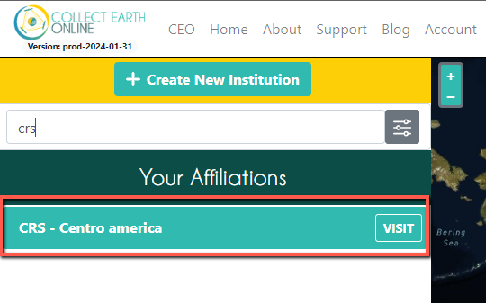
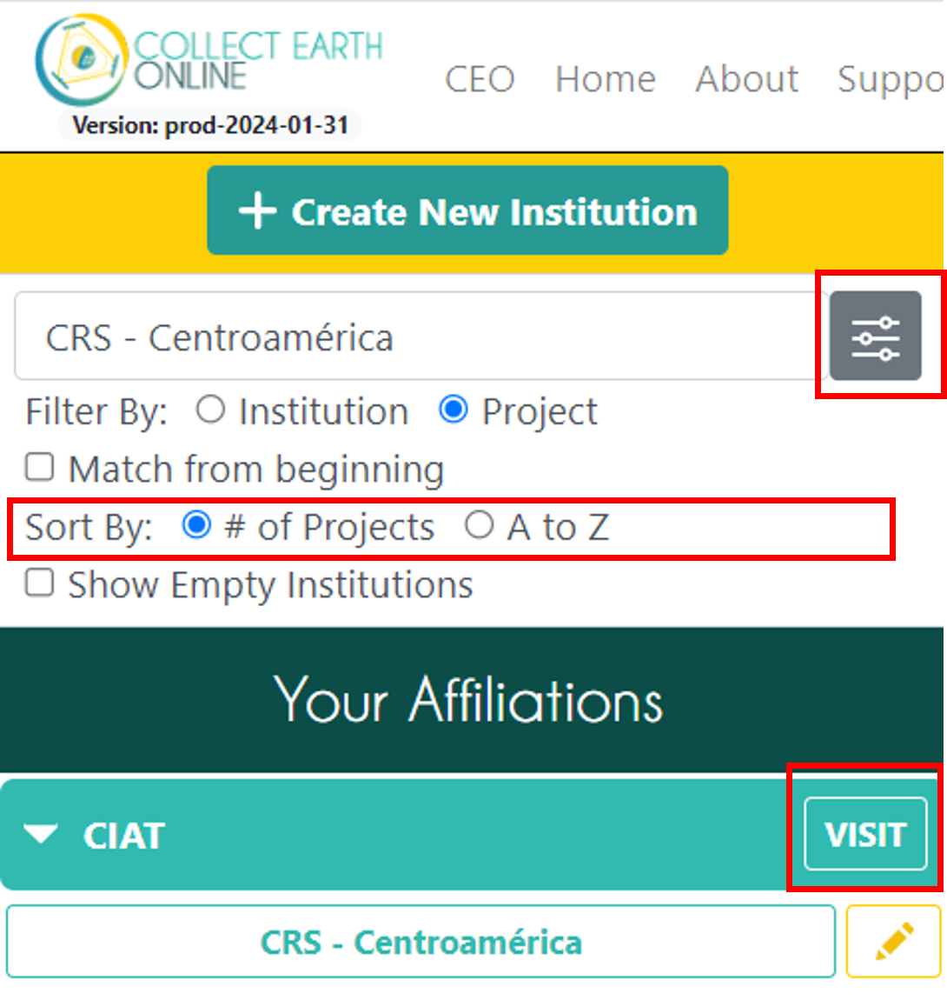
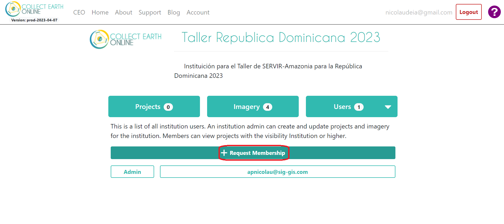
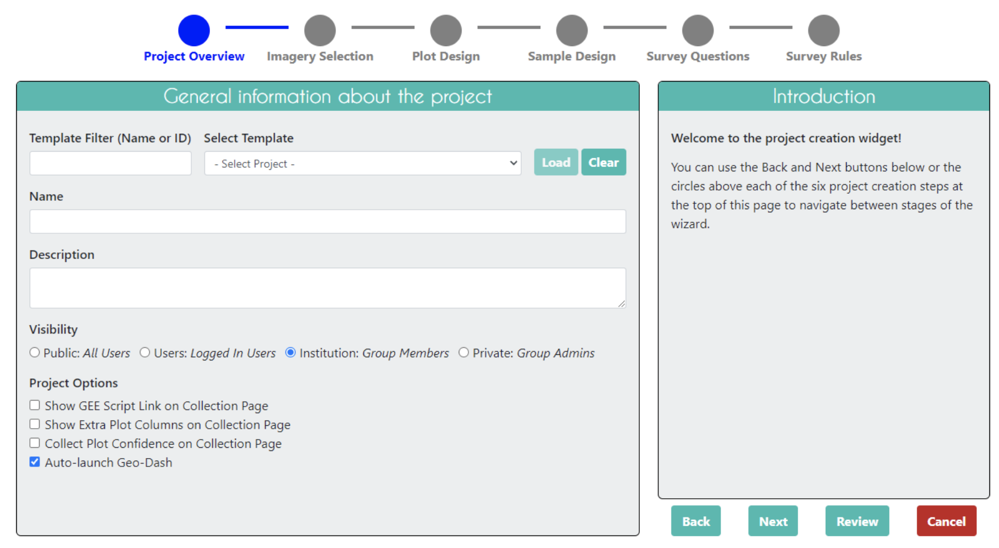

# Introducción

¡Bienvenido a Collect Earth Online - Evaluación de mapas! Este taller ofrecerá una visión general del CEO y de cómo utilizarlo para la recogida de datos para validación de mapas. También aprenderá a realizar una muestra aleatoria estratificada y a calcular los parámetros de precisión.

## Configuración prévia

**Creación de una cuenta CEO**

1. En la ventana de su navegador, vaya a [https://collect.earth/](https://collect.earth/). CEO es compatible con Google Chrome, Mozilla Firefox y Microsoft Edge.
2. Haz clic en `Register` en la parte superior derecha.
3. Rellene los datos, acepte las condiciones y haga clic en `Register`.
4. Recibirá un correo electrónico de bienvenida si el registro se ha realizado correctamente.
5. Cuando haya creado una cuenta, inicie sesión con su correo electrónico y contraseña utilizando el `Login`.

**Inscripción e Institución**

1. En la página de inicio ([https://app.collect.earth/home](https://app.collect.earth/home)) aparece una lista de todas las instituciones.
2. Si ha iniciado sesión, esta lista se divide en dos: `Your Affiliations` y `Other Institutions`. `Your Affiliations` son las instituciones a las que usted pertenece.
3. Busque el proyecto creado para este taller `CRS - Centroamérica` en la herramienta de búsqueda.

    

4. Para buscar un proyecto específico, utilice la herramienta de filtrado y marque la casilla "Filter by project". Verás el proyecto "CRS - Centroamérica" (en `Other Institutions` si está con su sesión iniciada). Haga clic en `VISIT` junto al nombre de la institución. Al hacer clic en él se abrirá la página de la institución.

    

5. **Ejemplo si no es miembro de la institución:** Haga clic en el botón del usuario (solamente si está con su sesión iniciada).

    

6. Haga clic en el botón `Request Membership` si aún no se ha afiliado a la institución.

    

7. **Otra manera de acceder:** Solicitar al administrador que agregue su usuario a la institución.

## Objetivos

1. Comprender los usos y ventajas del CEO.
2. Configurarse en CEO con una cuenta y una institución.
3. Aprender a crear un proyecto CEO para la recopilación de datos.
4. Aprender las mejores prácticas de interpretación en CEO.

## ¿Qué es CEO y por qué utilizarlo?

>Collect Earth Online (CEO) es una **plataforma de visualización e interpretación de imágenes de satélite**, de código abierto y construida a medida, creada para recopilar los datos de referencia necesarios para clasificar y supervisar los cambios en la cobertura y el uso del suelo. CEO pretende ayudar a organizaciones de todo el mundo a obtener **una imagen precisa de lo que ocurre sobre el terreno**, detectando los efectos de la deforestación, la degradación forestal, la pérdida de cultivos y otros cambios en el uso del suelo.

CEO marca un nuevo enfoque en la recopilación de datos. Para cualquier inventario o cartografía de observación de la Tierra, es esencial recopilar datos de referencia. Recurrir a expertos locales para interpretar las imágenes de satélite ofrece una forma rentable de calibrar los datos y evaluar la precisión de los mapas, eliminando la necesidad de una laboriosa recogida de datos sobre el terreno.

CEO puede utilizarse para una gran variedad de proyectos relacionados con la teledetección, la elaboración de mapas y los inventarios de recursos. Algunos de los usos más comunes de CEO son:

* Producción de datos de referencia para la estimación de áreas por muestreo
* Producción de datos de referencia para la validación de mapas
* Producción de datos de entrenamiento para métodos de modelización

CEO acerca la ciencia a los no especialistas proporcionando una plataforma gratuita, de código abierto e intuitiva para interpretar imágenes de satélite y responder a preguntas críticas desde el punto de vista medioambiental sobre la cubierta terrestre, el uso del suelo, la silvicultura y la agricultura. CEO ha atraído a una comunidad mundial de usuarios que confían en la plataforma para llevar a cabo una labor de gran impacto en el seguimiento de la deforestación y otros tipos de cambios en el uso del suelo. Desarrollado inicialmente por SERVIR -una iniciativa conjunta de la Agencia Nacional de Aeronáutica y del Espacio (NASA) y la Agencia de los Estados Unidos para el Desarrollo Internacional (USAID)-, CEO cuenta ahora con el apoyo de una amplia base de socios.  

Collect Earth Online (CEO) está disponible en https://collect.earth/.

 

## Principales ventajas de CEO

* Fácil de usar, incluso para personas con poca experiencia en teledetección.
* Se implementa en línea, por lo que los usuarios no tienen que preocuparse de la instalación en el escritorio ni de las copias de seguridad de los datos.
* Software basado en la nube, gratuito y accesible para todos
* Permite que varios usuarios trabajen simultáneamente en el mismo proyecto de recogida de datos.
* El software promueve la coherencia en la localización, interpretación y etiquetado de las parcelas de datos de referencia, junto con opciones automatizadas de control de calidad para evaluar la concordancia de los intérpretes. 
* Acceso a múltiples fuentes de imágenes por satélite para cualquier lugar de la Tierra, incluidos conjuntos de datos como las imágenes Planet de alta resolución de la Iniciativa Internacional sobre Clima y Bosques de Noruega (NICFI).
* Integración con herramientas de clasificación de la cubierta terrestre y estimación de la superficie, como SEPAL y GEE.
* Los datos de muestra pueden utilizarse para la estimación de superficie requerida por REDD+ e iniciativas similares

## Ejemplos de aplicaciones de CEO

* Validación de mapas, datos de referencia para cálculos de precisión
* Datos de referencia para la calibración de modelos
* Estimación insesgada del área y de la incertidumbre
* MRV (Monitoring reporting and verification)
* Verificación para modelos de seguimiento en tiempo casi real

## Recorrido rápido por el uso de CEO

1. **Cree un proyecto personalizado**: Seleccione las opciones de imágenes y elija su área de interés, el diseño del muestreo y las preguntas que desea formular.

     

2. **Colaborar**: Trabaje con colegas de su organización o con científicos de la comunidad de todo el mundo: la nube facilita la colaboración. También puede utilizar CEO para organizar la carga de trabajo de su equipo, asignando proporciones de las muestras a los miembros del equipo y especificando cuántas muestras deben ser revisadas por más de una persona.

    

     
     
    

3. **Recoger datos**: La interfaz intuitiva facilita la recopilación de información estandarizada sobre los paisajes que te interesan.

    

     
     
    
    

