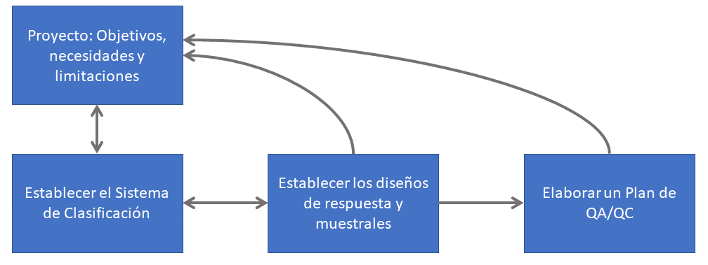
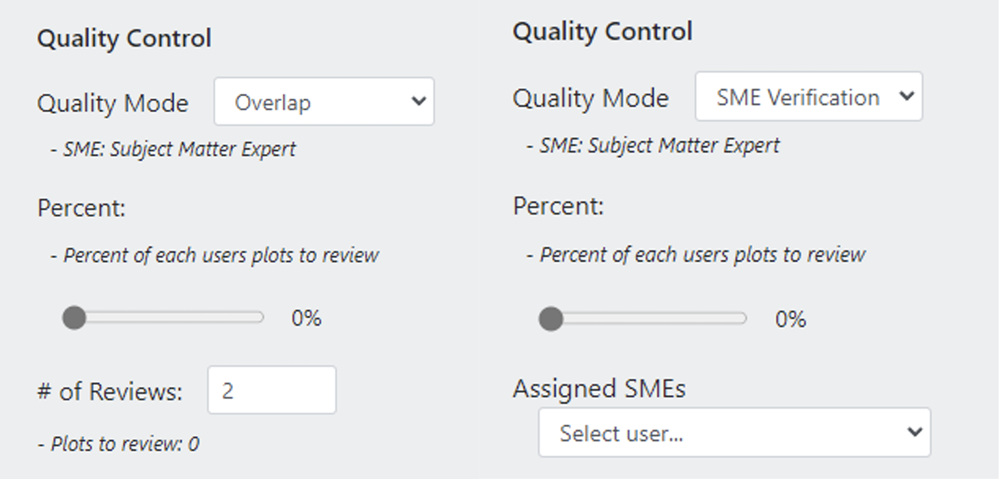

# Diseño/planificación de un proyecto CEO y protocolos de recogida de datos

## Procedimiento general de planificación de proyectos

*Las siguientes directrices de planificación de proyectos están disponibles con más detalle en este [Manual de desarrollo de proyectos para Collect Earth Online](https://www.collect.earth/ceo-guides/#:~:text=Project%20Development%20Theory), que está enlazado bajo la página de Ayuda del sitio web de CEO (`CEO Help - Guides`).*

Deberá preparar cierta información para diseñar y utilizar un proyecto en CEO.

Los pasos recomendados incluyen:

1. Identificar los objetivos, las necesidades, los recursos disponibles y las limitaciones del proyecto:
    - Conocer el objetivo principal del proyecto y describir cómo lo apoyará CEO. ¿Qué se medirá? ¿Qué datos y/o herramientas se necesitan en CEO para realizar sus interpretaciones?
2. Crear un sistema de uso y cobertura del suelo (LULC) para su proyecto
    - Un sistema de clasificación de la cubierta LULC debe cumplir ciertos criterios para ser útil y estar correctamente definido. Los criterios más importantes son que la clasificación sea exhaustiva y exclusiva; es decir, que todas las zonas de la zona de estudio puedan asignarse a una categoría (exhaustiva) y sólo puedan colocarse en una categoría (exclusiva). Si una clasificación no es exhaustiva, algunas zonas quedarán sin clasificar al final. Esto creará problemas a la hora de estimar el error y la incertidumbre. Si la clasificación no es exclusiva, entonces puede resultar ambiguo en qué categoría debe colocarse un área, y esto se convierte en una cuestión de interpretación individual.  
3. Creación de una clave de fotointerpretación
    - Las claves son el conjunto de reglas, imágenes y orientaciones utilizadas para clasificar los elementos de la cubierta terrestre en las imágenes de observación de la Tierra. Las claves completas y bien elaboradas son la piedra angular de un trabajo eficaz de interpretación de imágenes, y permiten obtener resultados mucho más coherentes y fiables.  Las claves suelen incluir imágenes de ejemplo que representan cada clase. Éstas deben seleccionarse de forma que muestren la variabilidad de esa clase dentro de la gama de diferentes áreas que cubrirá el proyecto. 
    - [Ejemplo de Clave de Interpretación](https://docs.google.com/document/d/1-e07xtSU-hOo0PRQ0zoTdCfKav0jZjQJ/edit).
4. Establecimiento del diseño de la muestra y la respuesta 
    - Determine el tamaño total deseado de la muestra, teniendo en cuenta el tiempo necesario para revisar estas muestras más de una vez. También debe determinar cómo se distribuirán las muestras, por ejemplo en una cuadrícula o como una muestra estratificada, y si las ubicaciones de las muestras se generarán dentro o fuera del CEO.
5. Elaborar un plan de garantía y control de calidad (GC/CC)
    - La garantía de calidad es un sistema de prácticas que debe emplearse a lo largo de todo el proceso de planificación de un proyecto y recogida de datos para garantizar un buen resultado, y parte de ese proceso debe ser el control de calidad o las comprobaciones, que verifican activamente si los datos son buenos o malos.

Este proceso puede presentarse como si fuera estrictamente lineal, comenzando en el primer paso y terminando con la recogida de datos tras el quinto paso. En realidad, cada uno de estos pasos influirá en los demás. A menudo es útil haber desarrollado el diseño de la respuesta y la unidad de evaluación antes de elaborar una clave, por ejemplo. Sin embargo, es posible que no pueda determinar cuál será su diseño de respuesta hasta después de haber revisado una gran cantidad de imágenes durante la creación de la clave. En última instancia, lo mejor es considerar el proceso presentado aquí como un proceso iterativo; probablemente querrá revisar cada paso de nuevo después de haberlo hecho una vez. Si repite el proceso de creación del proyecto, obtendrá un proyecto más sólido y meditado.  

En cada fase, las decisiones se toman y evalúan en función de los objetivos, las necesidades y las limitaciones. En algunos casos, puede ser necesario revisar los objetivos. Por eso es muy útil diseñar un pequeño proyecto piloto para el proyecto de mayor envergadura. Ejecutar todo el proceso de creación del proyecto y recopilar datos le ayudará a revelar cualquier posible problema, obstáculo imprevisto y otras consideraciones que le ayudarán a revisar su enfoque para producir los mejores resultados posibles.

 

 Proceso iterativo de planificación de proyectos Collect Earth Online. (fuente: Manual teórico de CEO). 

En este resumen vamos a profundizar en los pasos 3 y 5 del proceso de planificación de proyectos. Estos son especialmente importantes para asegurar que los datos de alta calidad son recogidos por su equipo cuando se utiliza CEO. La clave de interpretación estará íntimamente ligada a los objetivos y al diseño de su proyecto CEO y debe ser el recurso al que se remitan continuamente los intérpretes cuando recojan datos en su proyecto. Este documento de clave de interpretación forma parte del control de calidad de su recopilación de datos, pero también hay algunas funciones de control de calidad integradas en CEO que puede utilizar.

## Creación de una clave de interpretación

Ser capaz de identificar los tipos de cobertura del suelo utilizando datos de teledetección e información de series temporales es una habilidad importante para crear datos de entrenamiento, verificar los resultados de los algoritmos y crear estimaciones de área basadas en muestras. Una clave de interpretación es importante para apoyar todas estas tareas y sirve para múltiples propósitos, incluyendo:

1. Crear consenso. La clave de interpretación ayuda a su equipo a llegar a un entendimiento común sobre qué es cada tipo de cubierta terrestre y cómo identificarlo. Esto significa que si hay varios intérpretes, deberían ser capaces de clasificar las categorías de cubierta terrestre de la misma manera.
2. Creación de documentación. Registra lo que tu equipo considera los tipos de cubierta terrestre de tu región y el aspecto de cada tipo. Esto es importante para la financiación y la publicación.
3. Crear conocimiento institucional. Una clave de interpretación permite a los nuevos miembros del equipo comprender lo que los miembros existentes del equipo consideran características definitorias de cada tipo de cubierta terrestre. Esto ayuda a los nuevos miembros del equipo a empezar a recopilar datos y contribuir al proyecto de forma rápida y precisa.

Además, la propia elaboración de la clave fomenta el debate y el pensamiento crítico sobre cómo se realizará la interpretación. Si el proceso de interpretación se repite en una fecha posterior, para que la clave sea útil debe revisarse, actualizarse según sea necesario para hacer referencia a la nueva información disponible y utilizarse para formar a nuevos intérpretes.

> No dedicaremos mucho tiempo al tema de la elaboración de una clave de interpretación durante este taller, pero este paso es **MUY IMPORTANTE** y debe dedicarse tiempo a hacerlo bien. Desarrolle en colaboración este recurso para que sea útil a su equipo y pueda ser **referenciado y mejorado** repetidamente a lo largo de su recolección de datos.

## Planificación de la GC/CC en CEO

Recuerde estas herramientas integradas en el CEo para el control de calidad. ¿Utilizará una o una combinación de estas herramientas?

 

 
