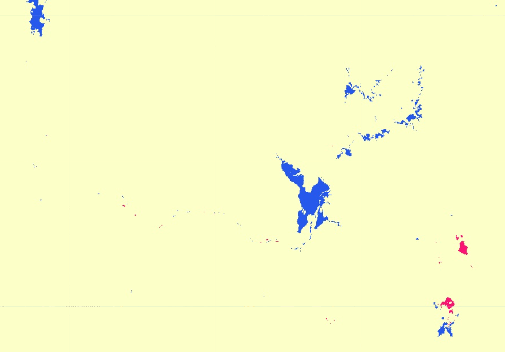
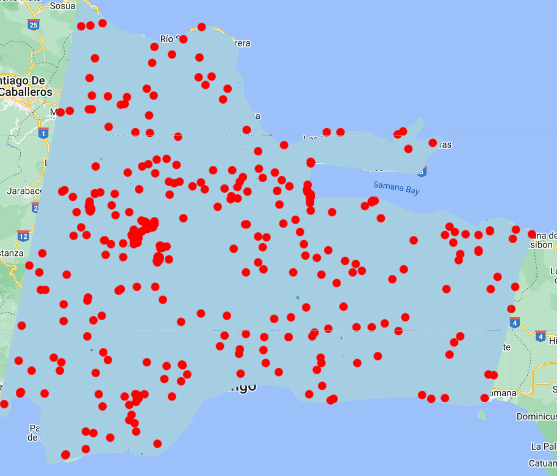

# Introducción al Muestreo Aleatorio Estratificado

Existen varias formas de muestrear una zona para conseguir una muestra representativa del paisaje y de las variaciones que existen en él. Los datos de muestreo recogidos en CEO pueden utilizarse para diversos fines, incluida la validación de mapas.

 

**Muestreo sistemático**: las observaciones se colocan a intervalos iguales según una estrategia.

 

**Muestreo aleatorio simple**: observaciones colocadas aleatoriamente independiente de las clases.

 

**Muestreo aleatorio estratificado**: Utilizando un mapa para informar el diseño, un número mínimo de observaciones colocadas aleatoriamente en cada clases.

El muestreo aleatorio estratificado tiene dos ventajas fundamentales:

* Actualiza las áreas basadas en el mapa para aumentar la precisión (reduce la incertidumbre)
* Ayuda a aumentar la probabilidad de tener parcelas en clases poco frecuentes

Utilizaremos el muestreo aleatorio estratificado para realizar un análisis de validación de mapas. Puede utilizar diferentes herramientas, como Google Earth Engine, para generar las ubicaciones de los puntos de muestreo.

Utilizaremos el mapa que desarrollamos en la última sección (T5) para ilustrar este proceso. Recuerde que se trata de una imagen de diferencias MNDWI de dos fechas con umbrales de clasificación, en la que se destacan las regiones de ganancia de agua en azul y pérdida de agua en rosa. Este producto fue generado con una diferencia de imágenes de 2015-2016 y 2022-2023.

 

Hemos calculado previamente los recuentos aproximados de píxeles de las clases de mapas utilizando Google Earth Engine.

| Valor mapa | Clase     | Área (m2)   | % Area total |
|------------|-----------|-------------|--------------|
| 0          | No cambio | 20595572899 | 99.91        |
| 1          | Ganancia  | 17196112.61 | 0.08         |
| 2          | Perdida   | 2133022.105 | 0.01         |

Si hubiéramos utilizado un muestreo sistemático o aleatorio, sólo obtendríamos un punto de ganáncia o pérdida de agua en menos de 1 de cada 100 puntos recogidos. Eso es súper ineficiente para analizar las clases de interés. Con el muestreo aleatorio estratificado puedo poner un valor mínimo al número de puntos de cada clase cartográfica, o estrato.

El muestreo aleatorio estratificado se realizó en GEE utilizando este [script](https://code.earthengine.google.com/bdf75ed7bfde4024268dee12e3842225), que exporta un CSV de las ubicaciones de las muestras listo para ser importado en CEO.

Definimos precisiones de usuário deseadas como 80% para cada clase y un error estimado para la precisión general de 2%. Eso generó un tamaño de muestreo de 400 puntos. Como las áreas de las clases de interés son muy pequeñas, la asignación proporcional resultó en cero para esas clases. Pero podemos definir una asignación de 200 puntos para la clase "No cambio", 100 puntos para la clase "Ganancia" y 100 puntos para clase "Perdida".

*Descargue ese archivo CSV [aquí](https://drive.google.com/file/d/1S3gsy77cTqVqhypm4URjlNAp813DHQi1/view?usp=sharing).*

Las 400 muestras incluidas se distribuyen dentro de los estratos cartográficos asignados.

