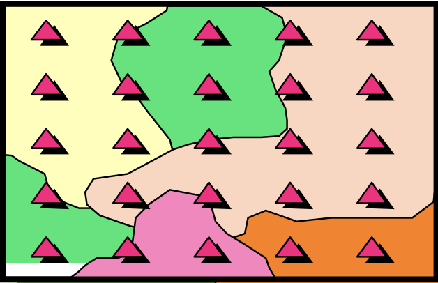
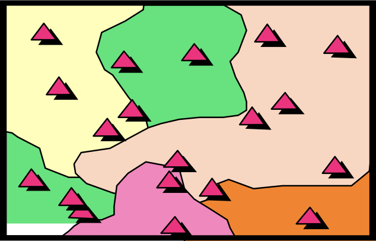
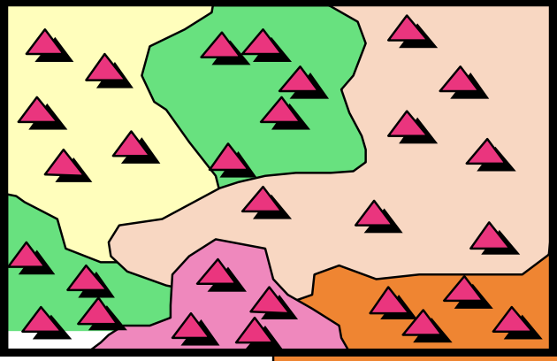
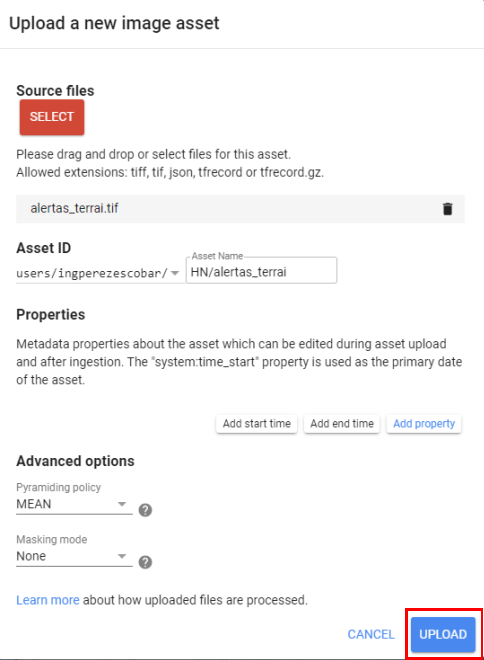
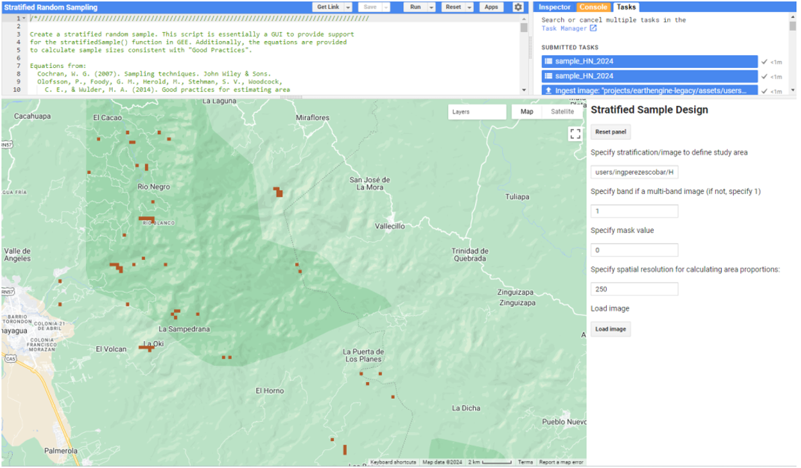
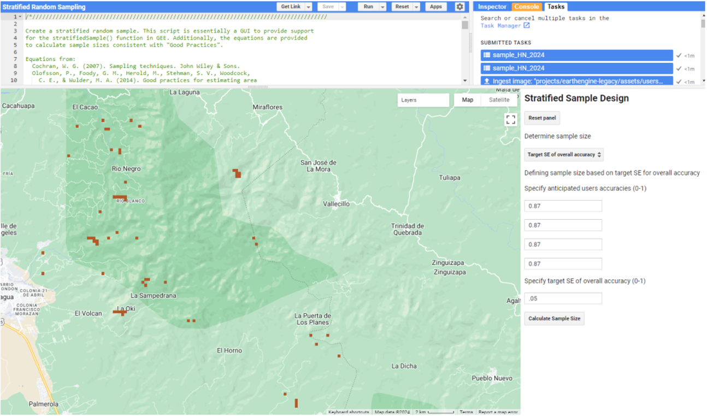
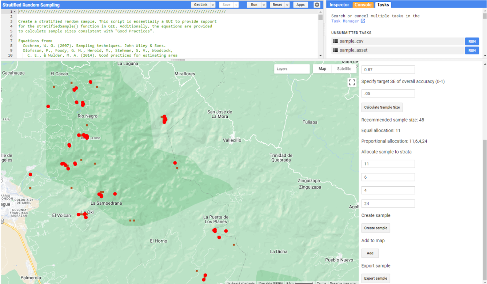

# Introducción al Muestreo Aleatorio Estratificado

Existen varias formas de muestrear una zona para conseguir una muestra representativa del paisaje y de las variaciones que existen en él. Los datos de muestreo recogidos en CEO pueden utilizarse para diversos fines, incluida la validación de mapas.

 

**Muestreo sistemático**: las observaciones se colocan a intervalos iguales según una estrategia.

 

**Muestreo aleatorio simple**: observaciones colocadas aleatoriamente independiente de las clases.

 

**Muestreo aleatorio estratificado**: Utilizando un mapa para informar el diseño, un número mínimo de observaciones colocadas aleatoriamente en cada clases.

El muestreo aleatorio estratificado tiene dos ventajas fundamentales:

* Actualiza las áreas basadas en el mapa para aumentar la precisión (reduce la incertidumbre)
* Ayuda a aumentar la probabilidad de tener parcelas en clases poco frecuentes

 **Muestreo Aleatorio estratificado de alertas Terra-i para el periodo 2020-2023:**
 
Utilizaremos el muestreo aleatorio estratificado para realizar un análisis de validación de alertas de pérdida de cobertura Terra-i. Puede utilizar diferentes herramientas, como Google Earth Engine, para generar las ubicaciones de los puntos de muestreo.

Se emplea las alertas Terra-i para los años 2020-2021-2022-2023.

Se ha calculado previamente los recuentos  de píxeles de las clases/año.

| Valor mapa | Clase     | Conteo de píxeles | 
|------------|-----------|-------------|
| 2020       | 2020 | 13 |
| 2021       | 2021  | 9|
| 2022       | 2022   | 2 | 
| 2023       | 2023   | 24 | 

Si se hubiera empleado un muestreo sistemático o aleatorio, sólo obtendríamos puntos para el año 2023, ya que tiene la mayor cantidad de alertas, y no se realizaría de forma balanceada para todos los años. Con el muestreo aleatorio estratificado se puede poner un valor mínimo al número de puntos de cada clase cartográfica, o estrato.

El muestreo aleatorio estratificado se realizó en GoogleEarthEngine utilizando este [script](https://code.earthengine.google.com/bdf75ed7bfde4024268dee12e3842225), que exporta un CSV de las ubicaciones de las muestras listo para ser importado en CEO.

Definimos precisiones de usuário deseadas como 87% para cada clase y un error estimado para la precisión general de 5%. Eso generó un tamaño de muestreo de 45 puntos. Cuando las áreas de las clases de interés son muy pequeñas, la asignación proporcional resulta en cero para esas clases. Pero podemos definir una asignación mayor a 30.

A continuación se presenta el paso a paso para realizar el muestreo estartificado aleatorio empleando Google Earth Engine:

* Subir la información raster de alertas de pérdida de vegetación Terra-i al Asset de GEE

* Abrir link de AREA2: https://code.earthengine.google.com/3400a6f1f9197ad92a273c194b71e4f7
* Ejectuar script de AREA2: Presionar "RUN"
* Cambiar ruta de la imagen del área de estudio (Ruta del ID Asset del raster de pérdida de vegetación de Terra-i que subió a GEE, en el paso anterior: users/ingperezescobar/HN/alertas_terrai)
* Cargar imagen: 'Load image'

* Seleccionar el método de muestreo: "Target SE of overall accuracy"
* Especificar la exactitud de usuario por clase: 0.87 para todas
* Especificar el error estándar de la exactitud global: 0.05
* Calcular tamaño de muestra: "Calculate sample size"
* Introducir el tamaño de muestra sugerido: 11, 6, 4, 24 (Obeservar el que aparece en GEE)
* Crear muestreo >> Adicionar al mapa >> exportar muestras

Descargue el archivo con las muestras aleatorias por estratos [aquí](https://drive.google.com/file/d/1VHdvvx3_d8WOMF5EzBqaLRodUrV6ydeS/view?usp=sharing).
