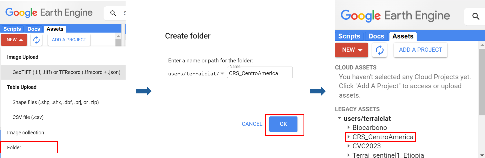
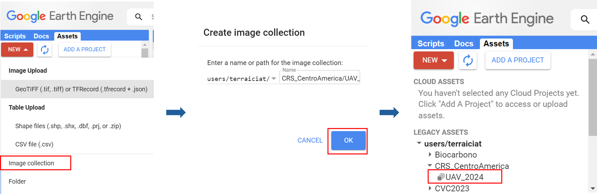
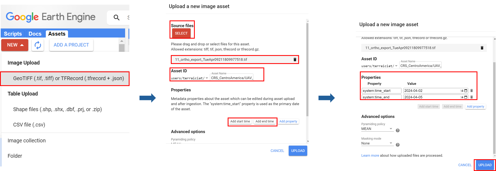
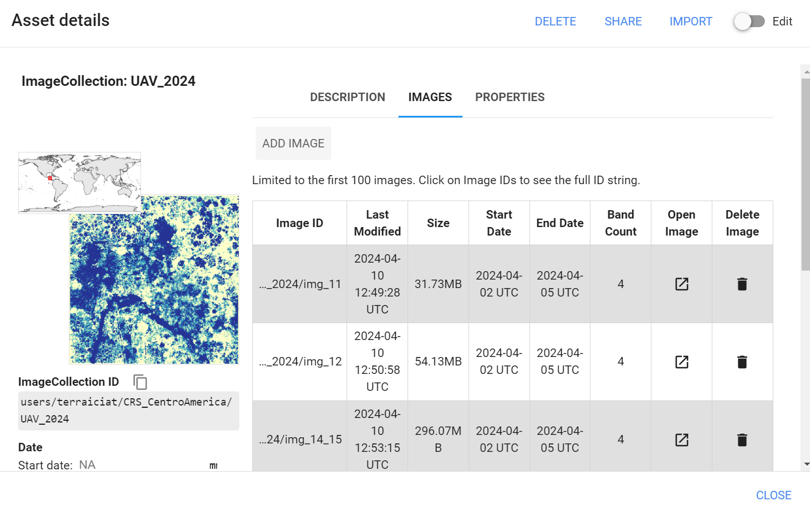
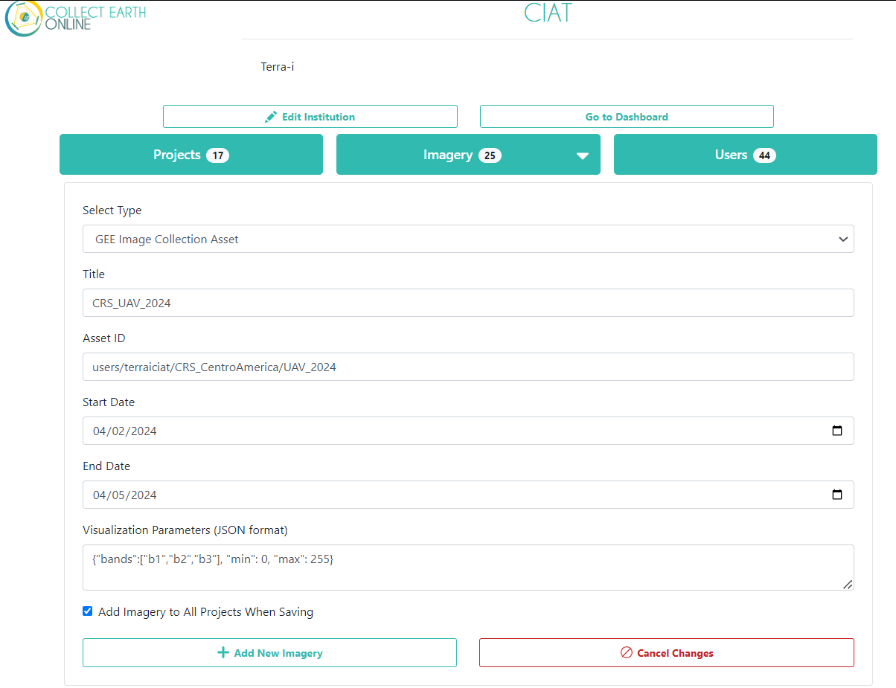
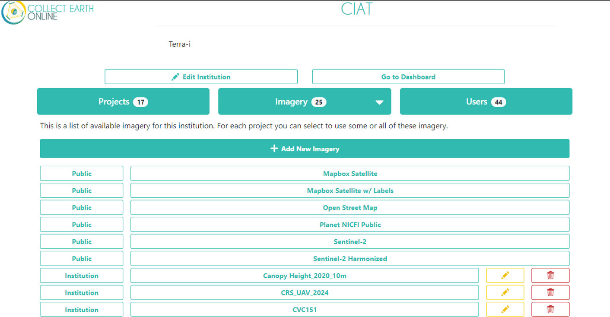
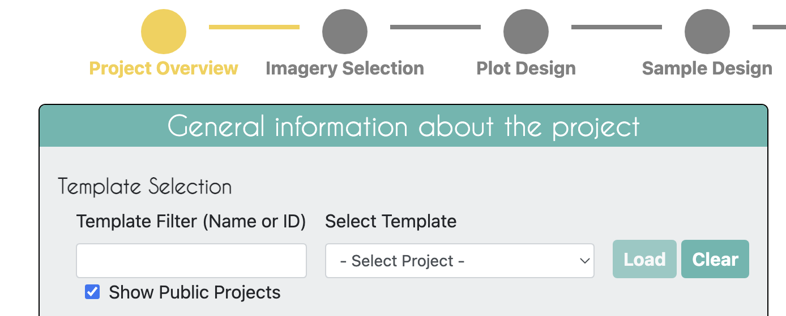

# Demostración práctica - Creación de un proyecto CEO

## Imágenes en CEO

Antes de empezar a crear un proyecto, eche un vistazo a las imágenes establecidas para su institución CEO. Determine si desea añadir más opciones de imágenes a su institución para poder utilizarlas en su proyecto. Algunas imágenes ya están integradas en CEO y otras (BingMaps, Planet Monthly, Planet Daily, Planet NICFI, SecureWatch y los productos MapBox) requieren una clave API. Se le pedirá que proporcione esta clave en el panel de configuración de imágenes de CEO. puede acceder si la tiene. Puede añadir sus propias imágenes a CEO a través de Web Map Service (WMS) / Web Map Tile Service (WMTS), o conectándose a sus imágenes compartidas públicamente alojadas en Google Earth Engine (GEE).

*Nota: hemos creado una amplia guía de procedimientos y resolución de problemas para añadir activos de imágenes GEE y activos de colecciones de imágenes a CEO. Está disponible en el blog de CEO [aquí](https://blog.collect.earth/index.php/2022/04/21/connecting-gee-raster-data/). También creamos un blog para como agregar capas por WMS/WMST que está disponibel [aquí](https://www.collect.earth/utilice-sus-propios-datos-en-ceo-conexion-con-wms-wmts-espanol/). A continuación se proporcionan instrucciones generales sobre cómo añadir sus propias imágenes utilizando GEE, que puede probar después de este taller.*

>*Material de bonificación para después del taller* - Añadir un activo de imagen GEE

>* Los `Assets` de Google Earth Engine (GEE) incluyen activos subidos por el usuario junto con assets proporcionados por otros usuarios y GEE. Puedes encontrar información sobre los Assets [aquí](https://developers.google.com/earth-engine/guides/asset_manager). Más abajo encontrarás más detalles sobre cómo subir tus propios activos. Tenga en cuenta que `Image Asset` se refiere a una sola imagen (por ejemplo, una capa GeoTIFF), mientras que `ImageCollection Asset` se refiere a una pila de imágenes (por ejemplo, capas GeoTiff de la misma ubicación en diferentes fechas).
>* **Title**: Este será el nombre que se mostrará de la imagen.
>* **Asset ID**: El identificador de la imagen. Tendrá un formato similar a: USDA/NAIP/DOQQ/n_4207309_se_18_1_20090525
>* **Parámetros de visualización (formato JSON)**: Cualquier parámetro de visualización para su capa. Por ejemplo, `{"bands":["R", "G", "B"], "min":90, "max":210}`
>* Si desea añadir esta fuente de imágenes a todos los proyectos de su institución, marque la casilla `Add Imagery to All Projects When Saving`.
>* Una vez rellenados todos los campos, haga clic en `Add New Imagery`.

> 

Si no está familiarizado con GEE, a continuación encontrará instrucciones para cargar sus propias imágenes en GEE. Debe tener una cuenta GEE para completar este proceso.

>*Material de bonificación para después del taller* - Añadir un activo de colección de imágenes GEE

>* **Creación de la colección de imágenes desde GEE**: Crear una carpeta en el Asset con el nombre del proyecto "`CRS_CentroAmerica`"

> 

>* Despues crear la ImageCollection con el nombre `UAV_2024` dentro de la carpeta `CRS_CentroAmerica`

> 

>* Subir las imágenes a la ImageCollection `UAV_2024`

> 

> 

>* **Title**: Este será el nombre que se mostrará de la imagen.
>* **Asset ID**: El ID de activo para su activo de imagen. Tendrá un formato similar a LANDSAT/LC08/C01/T1_SR
>* **Start Date**: La fecha de inicio predeterminada de las imágenes que se mostrarán.
>* **End Date**: Fecha de finalización por defecto de las imágenes que se mostrarán.
>* **Parámetros de visualización (formato JSON)**: Cualquier parámetro de visualización para su capa. Por ejemplo, `{"bands":["B4", "B3", "B2"], "min":0, "max":2000}`.
>* Si desea añadir esta fuente de imágenes a todos los proyectos de su institución, marque la casilla `Add Imagery to All Projects When Saving`.
>* Cuando haya rellenado todos los campos, haga clic en `Add New Imagery`.
>* Tenga en cuenta que para mostrar la GEEImageCollection, CEO utiliza el reductor `mean` en Earth Engine. Este toma la media de cualquier imagen de la colección de imágenes durante el periodo de tiempo especificado.

> 

> 

## Tutorial para crear un proyecto CEO sin plantilla

* Acceda a su cuenta CEO. Si ya es administrador, navegue a la página de aterrizaje de su institución escribiendo el nombre de la institución y haciendo clic en el botón `Visit`.
* Si no es administrador, deberá solicitar privilegios de administrador a otros miembros de su equipo que estén registrados como administradores de su institución CEO. **Sólo los administradores pueden crear proyectos de CEO**.
* Cuando esté en la página de la institución, en la pestaña `Projects`, puede hacer clic en el botón `Create New Project` para crear un nuevo proyecto. Se encuentra en la parte superior de la página, seguido de la lista de proyectos existentes pertenecientes a la institución.

     

* Esto le dirigirá a la interfaz de Crear Proyecto. Ahora hablaremos de lo que hace cada una de las secciones de esta página.

### Página de descripción general del proyecto

 

1. Omita por ahora la función `Select Template`. Lo probaremos en la próxima demostración.
2. A continuación, introduzca el `Nombre` y la `Descripción del proyecto`. El Nombre debe ser corto pero informativo para que pueda distinguirlo de otros proyectos de su institución. La Descripción también debe ser breve pero informativa.
    - *Nota, si estás haciendo este proyecto CEO para practicar junto a otros compañeros de equipo es una buena idea incluir tu nombre y 'Prueba' en el título. Debes asegurarte de borrar el proyecto que crees más tarde, si sólo lo estás haciendo para practicar, para que la institución CEO de tu organización no se sature.*
3. Seleccione la `Visibilidad del proyecto`. El botón de opción nivel de privacidad cambia quién puede ver su proyecto, contribuir a la recopilación de datos y si los administradores de su institución u otras personas que creen nuevos proyectos pueden utilizar su proyecto como plantilla.
    - **Public**: Todos. Todos los usuarios (con o sin cuenta CEO) pueden ver y aportar datos a su proyecto. Los administradores pueden utilizar su proyecto como plantilla.
    - **Users**: Usuarios registrados. Cualquier usuario conectado a CEO puede ver y contribuir a su proyecto. Los administradores pueden utilizar su proyecto como plantilla.
    - **Institution**: Miembros del grupo. Los miembros de su institución pueden ver y contribuir a su proyecto. Los administradores de otras instituciones no pueden utilizar su proyecto como plantilla.
    - **Private**: Administradores de grupo. Sólo los administradores de su institución pueden ver y contribuir a su proyecto. Los Admins de otras instituciones no pueden utilizar su proyecto como plantilla.
4. Seleccione Opciones del proyecto.
    - La primera opción es **Show GEE Script Link on the Collection Page (Mostrar enlace de script GEE en la página de recopilación)**. Esto permite a los usuarios de la Recopilación de datos hacer clic en un botón denominado `Go to GEE Script`. Este botón les llevará a una herramienta del sitio web GEE con información adicional sobre la parcela, incluyendo imágenes anuales y gráficos de series temporales. Aquí se muestra un ejemplo:

     

    - La segunda opción es **Show Extra Plot Columns on Collection Page (Mostrar columnas extra en la página de colección)**. Esta opción sólo es útil si está utilizando archivos `.csv` o `.shp` para definir el diseño de su gráfico y ese archivo tiene columnas adicionales de información. Los recolectores de datos podrán verlas en la página de Recolección de Datos bajo Información de Parcela.

     

    - La tercera opción es **Collect Plot Confidence on Collection Page (Recoger Confianza de Parcela en la Página de Recogida)**. Si quiere que los usuarios le digan lo seguros que están de sus respuestas a las preguntas de la encuesta, el control deslizante de confianza les permitirá asignar un valor de 1 a 100, donde 100 significa que están completamente seguros de sus respuestas; este valor se aplica a todo el gráfico. Esta información se incluirá en las descargas del gráfico y del CSV de muestra. También se puede utilizar durante QA / QC, ya que puede utilizar esto para filtrar las parcelas en CEO y sólo revisar aquellos con confianza por debajo de un cierto valor.

     
     

    - La cuarta opción es **Auto-launch Geo-Dash**. Esto abrirá automáticamente la interfaz Geo-Dash en una nueva ventana o nueva pestaña cuando el recolector de datos navegue a un nuevo gráfico. Desmarcar esta opción significa que los recolectores de datos tendrán que hacer clic en el ícono Geo-Dash bajo `External Tools` (Herramientas externas) en la interfaz "Data Collection" (Recolección de datos).
5. Haga clic en `Next` cuando haya terminado.

### Selección de imágenes

1. Haga clic en la casilla de verificación junto a cada fuente de imágenes que le gustaría tener disponible para su proyecto. Sus usuarios podrán cambiar entre todas las capas de imágenes disponibles durante el análisis.
2. Puede cambiar las Imágenes por defecto (Default Imagery), que especifican las imágenes por defecto que los usuarios verán cuando comiencen la recogida de datos en su proyecto.
    - Puede elegir cualquiera de las opciones de imágenes disponibles en su institución. Las opciones por defecto (públicas) son MapBox Satellite, Mapbox Satellite w/Labels, y Planet NICFI Public. PlanetMonthly, PlanetDaily, y SecureWatch no permiten extraer datos de grandes áreas, por lo que no debería ser su mapa base por defecto (los usuarios sólo verán una pantalla blanca).

### Diseño de Parcelas

1. La página de "Plot Design" (Diseño de Parcela) tendrá un aspecto ligeramente diferente en función del tipo de Distribución Espacial (Aleatoria, Cuadriculada, Archivo CSV o Archivo SHP) que haya seleccionado.

     
     

2. Si utiliza las opciones de distribución de parcelas incorporadas en CEO, `Random` o `Gridded`, las ubicaciones de sus parcelas se generarán automáticamente a partir de un área de interés (AOI).
    - La forma más sencilla de seleccionar el AOI de su proyecto es dibujando un recuadro en la ventana del mapa en el panel derecho ("Collection Map Preview": Vista previa del mapa de la colección).
        - Localice su área de interés acercándose o alejándose con la rueda de desplazamiento del ratón, o con las casillas + y - de la ventana del mapa. Puede desplazar el mapa haciendo clic sobre él y arrastrando la ventana del mapa.
        - Mantén pulsada la tecla CRTL (command en Mac) y dibuja un recuadro mientras mantienes pulsada la tecla izquierda del ratón.
        - Mantén pulsada la tecla SHIFT y dibuja un recuadro para hacer zoom.
        - Los cuadros de coordenadas se rellenarán una vez que hayas dibujado el cuadro y sueltes la tecla del ratón. Las coordenadas se muestran en lat/long utilizando WGS84 EPSG:4326.
    - También puede introducir manualmente las coordenadas de los límites en las casillas correspondientes.
    - La tercera opción consiste en cargar un archivo shapefile de los límites del proyecto. Para utilizar esta opción, haga clic en `Upload project boundary`. Navegue hasta su archivo y haga clic en `Open`. El archivo shape debe ser una carpeta comprimida con los componentes necesarios (.shp, .prj, etc.). Una vez que haga clic en `Open`, debería ver que el texto Archivo: se rellena con el nombre de su archivo y que los límites de su proyecto aparecen en el panel "Collection Map Preview" (Vista previa del mapa de la colección).
        - *Note, if you have multi-part polygons each one will be assigned the number of plots indicated. Esto se indica en el texto verde.*
        - Esto es diferente de usar la opción Archivo SHP para la Distribución Espacial, donde cada punto o polígono en su archivo shape será una Parcela diferente, que puede contener uno o más puntos de muestra que serán interpretados por un individuo.
3. Dadas sus selecciones para los detalles de la distribución autogenerada, como número de parcela, espaciado de parcela y ancho de parcela, CEO proporcionará una estimación de cuántas parcelas se generarán para su proyecto basándose en su diseño de muestreo.
    - Utilizando el muestreo de CEO, el número máximo de parcelas para un proyecto es de 5.000. Para el muestreo en cuadrícula, es posible que tenga que aumentar el espacio entre parcelas para evitar superar las 5.000 parcelas.
4. Si desea cargar ubicaciones conocidas para sus parcelas, deberá seleccionar las opciones Archivo CSV o SHP para Distribución espacial. Su archivo debe estar en el sistema de coordenadas WGS84 EPSG:4326.
    - *Puede descargar archivos CSV y SHP de ejemplo. Cuando se utilicen para crear un proyecto, deben indicar "OK" en el mapa*.
        - Si utiliza un archivo CSV, en la siguiente sección podrá generar automáticamente puntos de muestra aleatorios o cuadriculados dentro de cada gráfico. Si utiliza un archivo SHP, no dispondrá de estas funciones integradas de generación de muestras. Con cualquiera de las dos opciones, podrá tener un punto por parcela o proporcionar otro archivo CSV o archivo SHP en la siguiente sección sobre Generación de Muestras.
        - Si descarga el archivo SHP de ejemplo, observará que en realidad es un archivo zip que contiene (que contiene archivos SHP, SHX, DBF y PRJ). Este formato zip es necesario.
    - Las ubicaciones de las parcelas de los archivos CSV o SHP pueden generarse en un programa independiente como GEE, ArcGIS o QGIS.
    - **Para este tutorial utilizaremos el archivo CSV pre-descargado de GEE [link](https://drive.google.com/file/d/1S3gsy77cTqVqhypm4URjlNAp813DHQi1/view?usp=sharing).** Descárguelo en su ordenador y échele un vistazo. **El archivo CSV que subas debe contener al menos columnas con los nombres específicos de PLOTID, LON, y LAT, como este**. Puede tener columnas adicionales con metadatos.
        - Si está utilizando un formato de archivo CSV, a menudo es más fácil utilizar un solo archivo. Así que tendría un archivo con las columnas PLOTID, SAMPLEID, LON, y LAT. Vea el siguiente paso sobre Diseño de Muestras.
5. Cargue el Archivo CSV de Ejemplo. El nombre del fichero aparecerá junto al botón `Upload plot file` para indicar que se ha cargado correctamente.
    - Deberá especificar la `Plot Shape` (Forma de la parcela) y el `Diámetro` correspondiente.
6. Este es también el punto del proyecto en el que puede optar por utilizar las funciones de asignación de parcelas y control de calidad.
7. Asignar parcelas - Hay tres opciones: Sin asignaciones, Asignaciones iguales y Porcentaje de parcelas.
    - **Sin asignaciones** permite a todos los usuarios completar tantas parcelas como quieran hasta que todas las parcelas hayan sido interpretadas.
    - **Igualdad de asignaciones** reparte el número total de gráficos entre los usuarios.
    - **Porcentaje de parcelas** permite repartos desiguales.

      
8. Control de calidad: esta función está configurada como `None` (Ninguna) por defecto y no puede implementarse a menos que se hayan asignado usuarios al proyecto por su dirección de correo electrónico (opciones "Asignaciones iguales" o "Porcentaje de parcelas" para Asignación de usuarios). Las siguientes opciones de Control de Calidad permiten que varios usuarios recopilen datos para la misma parcela con fines de QA/QC. Si esta función está activada, el proyecto ya no puede admitir "muestras de Usuario" (véase la siguiente sección).
    - **Solapamiento**: Un cierto porcentaje de las parcelas de cada usuario son revisadas por los otros usuarios.
    - **Verificación por expertos en la materia (Verificación por SME)**: Un porcentaje de las parcelas de cada usuario son revisadas por uno o más SME. Por ejemplo, el SME podría ser alguien con un profundo conocimiento del paisaje local, o un administrador del proyecto.

     

### Diseño de la muestra

1. Aquí determinamos cuántos puntos de muestreo hay dentro de cada parcela y si se muestrean mediante muestreo aleatorio, muestreo en cuadrícula, sólo un punto central o con ubicaciones predefinidas con un archivo CSV o un archivo SHP. Utilizando el muestreo incorporado de CEO, el número máximo de puntos de muestra por parcela es 200 y el número máximo de puntos de muestra para todo el proyecto es 50.000, pero puede tener más si está cargando ubicaciones de muestra a través de un archivo CSV o un archivo SHP.
2. Para esta demostración podemos elegir simplemente `Center` del desplegable `Spatial Distribution`.

### Preguntas de la encuesta

1. En esta sección usted diseña las preguntas que sus recolectores de datos/fototografías contestarán para cada una de sus parcelas de encuesta. Cada pregunta crea una columna de datos poblada con las respuestas de los intérpretes.
2. Recomendaciones generales a la hora de diseñar las preguntas de la encuesta
    - Las preguntas y las respuestas deben ser breves. Puede resultar difícil ver un bloque de texto largo en una pantalla más pequeña.
    - Evite, en la medida de lo posible, el uso de comas y signos de puntuación en sus preguntas y respuestas, ya que a veces puede causar problemas en función de cómo se analice el archivo CSV resultante.
    - Piense en ser el intérprete y en qué preguntas generales le gustaría responder primero para familiarizarse con la muestra antes de responder a preguntas más en profundidad.
    - Para ahorrar tiempo durante la interpretación, utilice subpreguntas para aquellas preguntas que sólo sería necesario formular si una pregunta anterior de la encuesta se responde de una determinada manera. (Por ejemplo, sólo como en qué año se produjo una pérdida de bosque si el intérprete dijo que se produjo un evento de pérdida de bosque, pero no si dijo que no se produjo ninguna perturbación en el período de tiempo de interés).
    - Trate de evitar preguntas que puedan dar lugar a datos contradictorios en los resultados finales debido a errores humanos, o utilice la herramienta Reglas de la encuesta para evitar que se produzcan estas contradicciones problemáticas. (Por ejemplo, no permita que un intérprete diga que se ha producido una pérdida de bosque si previamente ha dicho que la cubierta terrestre al principio del período de interés no era forestal. Haga que la pregunta sobre la pérdida de bosque sea una subpregunta o añada una Regla de encuesta para enviar al usuario un mensaje de advertencia si intentara introducir esta combinación de respuestas).
3. En la pestaña `Survey Question` (Pregunta de la encuesta), el panel izquierdo le permite introducir preguntas, mientras que el panel derecho ofrece una vista previa de cómo aparecerán estas preguntas a sus recopiladores de datos.
4. `Survey Cards` (Tarjetas de encuesta) son la unidad básica de organización. Cada tarjeta de encuesta crea una página de preguntas en la interfaz de recogida de datos. El flujo de trabajo básico es el siguiente:
    - Crear una nueva pregunta de nivel superior (nueva tarjeta de encuesta)  
    - Rellenar las respuestas
    - Crear preguntas y respuestas secundarias
        - *Las preguntas secundarias sólo se formulan si se ha dado una respuesta específica a una pregunta anterior*.
    - Pase a la siguiente pregunta de nivel superior (nueva tarjeta de encuesta) y repita el proceso
5. Existen varios tipos diferentes de preguntas de encuesta. Estos tipos de componentes incluyen combinaciones de cuatro tipos de preguntas y tres tipos de datos. La opción `button-text` (botón-texto) es una de las más utilizadas.
    
    *Los cuatro tipos de pregunta son:*

    > - **Botón**: Crea botones en los que se puede hacer clic y que permiten a los usuarios seleccionar una de las muchas respuestas para cada punto de muestra.
    > - **Input**: Permite a los usuarios introducir las respuestas en la casilla correspondiente. 
    > - **Radiobutton**: Crea botones de radio que permiten a los usuarios seleccionar una de las muchas respuestas para cada punto de muestra. 
    > - **Dropdown**: Permite a los usuarios seleccionar entre una lista de respuestas.

    *Los tres tipos de datos permitidos son:*
    
    > - **Boolean**: Utilícelo cuando tenga dos opciones para una pregunta (sí/no).
    > - **Texto**: Utilícelo cuando tenga varias opciones que sean cadenas de texto. Pueden incluir letras, números o símbolos.
    > - **Número**: Utilícelo cuando tenga múltiples opciones que sean números, que no contengan letras o símbolos.
6. Para crear una pregunta:
    - Seleccione el tipo de pregunta. Por ahora, pruebe con `button-text` (Texto de botón).
    - Escriba su pregunta en la casilla `Question Text` (Texto de la pregunta). Recuerda que debe ser breve y evita los caracteres especiales si es posible.
    - Añade una respuesta, ajusta el color del rectángulo si lo deseas, y haz clic en el signo más verde para añadir esa respuesta antes de hacer otra opción de respuesta.
    - Puede eliminar o editar sus preguntas y respuestas después de crearlas, pero debe hacer clic en el botón verde del icono Guardar junto a cada pregunta o respuesta editada.

     
     
7. Para crear una pregunta hija, junto a `Parent Question` (Pregunta Padre) seleccione la pregunta que desee utilizando el menú desplegable.
    - A continuación, puede asignar una o más 'Respuestas Padre' a través del menú desplegable. Mantenga pulsada la tecla ctrl para seleccionar varias respuestas. Cuando seleccione una de las respuestas principales, aparecerá la pregunta secundaria. Si desea que la pregunta hija aparezca independientemente de la respuesta, seleccione todas las respuestas para 'Respuesta Padre'.
    - Una vez que haya terminado de añadir las preguntas secundarias con sus respuestas, puede crear una segunda tarjeta de encuesta estableciendo el campo "Parent Question" en `None` (Ninguna).
    - Puede tener varias preguntas secundarias que dependan de diferentes respuestas de la pregunta principal.

### Reglas de la encuesta

1. Esta sección es opcional. Las reglas de la encuesta ayudan a garantizar que los usuarios recopilen respuestas lógicas y correctas. Si no desea añadir ninguna regla, puede hacer clic en Siguiente.
2. Hay varias opciones para las reglas de la encuesta.

 

> - **Concordancia Regex de texto**: Esta regla sólo se aplica a las preguntas de entrada de texto y sus respuestas. Le permite verificar si el valor introducido encaja, utilizando expresiones regulares. Sin embargo, a menos que tenga una razón específica para utilizar el tipo de pregunta Texto de entrada, considere la posibilidad de utilizar Texto de botón o Texto de radiobotón. Estas opciones son más sencillas para los usuarios y siempre proporcionarán el texto exacto. Esta regla utiliza la función RegExp de JavaScript, la documentación para escribir una expresión regular se puede encontrar [aquí](https://developer.mozilla.org/en-US/docs/Web/JavaScript/Guide/Regular_Expressions). 
> - **Rango numérico**: Esta regla se aplica a las preguntas numéricas de entrada y a sus respuestas. Con esta regla, puede verificar que la entrada numérica se encuentra dentro de un rango predefinido.
> - **Suma de Respuestas**: Esta regla se aplica a cualquier pregunta de tipo numérico & sus respuestas. Seleccione varias preguntas (2 o más) y especifique el resultado de la suma de las preguntas.
> - **Suma de respuestas**: Esta regla se aplica a cualquier pregunta numérica y sus respuestas. Con esta regla, especifica dos conjuntos de preguntas múltiples (2 o más) que deben tener sumas iguales.
> - **Respuestas incompatibles**: Esta regla puede aplicarse a cualquier tipo de pregunta. Permite al usuario definir conjuntos de respuestas incompatibles. Esta puede ser especialmente útil cuando tienes muchas preguntas de opción múltiple y necesitas prevenir combinaciones lógicamente imposibles que pueden ocurrir debido a un error del usuario.

### Revisión

1. Una vez finalizada la configuración del proyecto, haga clic en `Review` en la parte inferior derecha.
2. Ahora verá un resumen de los detalles de su proyecto.
3. Desplácese para comprobar que todo está correcto.
4. Si todo es correcto, haga clic en Crear proyecto. Tendrá que aceptar los términos y condiciones de CEO. Si observa algún error, haga clic en `Continue Editing` (Continuar editando) para corregirlo.
5. Después de hacer clic en Crear proyecto, una ventana emergente le preguntará "¿Realmente desea crear este proyecto?". Haga clic en `OK`.
6. Una vez que esté totalmente satisfecho con su proyecto y no crea que vaya a necesitar más cambios. Puede hacer clic en `Publish Project` (Publicar Proyecto). Una vez publicado el proyecto, sólo es posible realizar algunas modificaciones. Ya es posible la recogida oficial de datos.

## Tutorial para crear un proyecto CEO a partir de una plantilla

La creación de un proyecto CEO a partir de una plantilla es igual que en la sección anterior, salvo que muchas o todas las piezas estarán rellenadas previamente y sólo tendrá que hacer las modificaciones que desee. Por ejemplo, tal vez cometió un error al crear un proyecto y sólo desea duplicarlo para poder modificar algunas preguntas de la encuesta. O tal vez usted estaba contento con un proyecto anterior y desea utilizar exactamente el mismo formato, pero recoger datos para un nuevo conjunto de parcelas.

1. Inicie sesión en su cuenta CEO. Si ya es el administrador, navegue a la página de aterrizaje de su institución escribiendo el nombre de la institución y haciendo clic en el botón `Visit`.
2. Si no es administrador, deberá solicitar privilegios de administrador a otros miembros de su equipo que estén registrados como administradores de su institución CEO. **Sólo los admins pueden hacer proyectos CEO.**
3. Cuando esté en la página de la institución, en la pestaña `Projects`, puede hacer clic en el botón `Create New Project` para crear un nuevo proyecto. Se encuentra en la parte superior de la página, seguido de la lista de proyectos existentes pertenecientes a la institución.
4. Para utilizar una plantilla, en la sección `Project Overview` puede utilizar el menú desplegable `Select Template` para ver todos los proyectos que pertenecen a su institución. Puede hacer clic en la opción `Show Public Projects` (Mostrar proyectos públicos) si busca un proyecto público creado por otra institución.
5. Puede utilizar el `Template Filter` (Filtro de plantillas) para buscar mediante una palabra clave o un ID de proyecto tanto proyectos públicos como proyectos de su institución.

     
6. Una vez que haya seleccionado un proyecto, haga clic en `Load` y todas las partes de ese proyecto se autocompletarán en su nuevo proyecto. Vea el siguiente ejemplo, en el que se ha seleccionado y cargado un proyecto público con la clave parcial "temp" en su título.

     
7. Si selecciona la opción `Copy Template Plots and Samples` (Copiar plantillas de puntos y muestras), las ubicaciones de los puntos y las muestras se cargarán previamente. Desmarque esta opción si desea cargar sus propias ubicaciones de parcelas nuevas.
    - Para este taller, desmarque esta opción para que pueda intentar cargar el archivo CSV pre-preparado del script de muestreo aleatorio simple ó estratificado GEE.
8. Si selecciona `Copy Template Widgets` (Copiar widgets de plantilla), se copiarán los widgets de Geo-Dash. Desmarque esta opción si desea un Geo-Dash en blanco.
    - También puede cargar una plantilla de Geo-Dash de otro proyecto cuando llegue a `Configure Geo-Dash` en la página de revisión final del proyecto, o incluso después de publicarlo.
9. Asegúrese de actualizar el nombre y la descripción del proyecto para poder distinguirlo del que está copiando.
10. Realice los ajustes necesarios en el proyecto CEO.
    - Cargue los nuevos archivos de diseño de parcela y de muestra. - Para este taller, intente utilizar el archivo CSV de diseño de parcela preparado previamente y exportado desde GEE en las pestañas Diseño de parcela (Plot Design) y Diseño de muestra (Sample Design).
    - Si ajusta alguna pregunta de la encuesta o las respuestas a las preguntas de la encuesta, asegúrese de hacer clic en el icono `Save` junto a cada cambio que realice.
11. Cuando haya terminado, haga clic en `Create Project` y luego en `Publish Project`.
