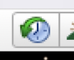
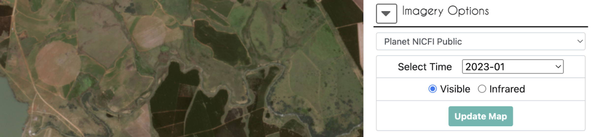
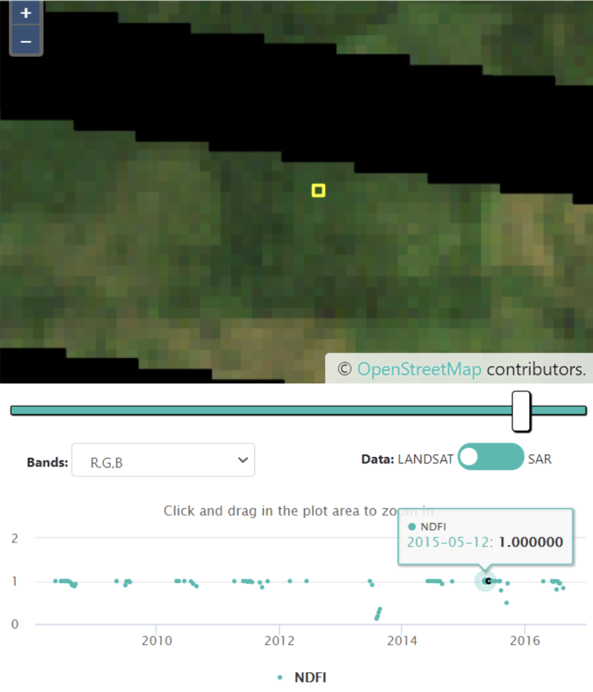

# Buenas Prácticas de Interpretación

*Vídeo en inglés sobre [Interpretación de muestras del CEO](https://www.youtube.com/watch?v=ldmvBI965WM) - disponible en el sitio web del CEO*.

Los siguientes pasos son algunas directrices generales para la interpretación de muestras. No obstante, deben adaptarse a cada proyecto concreto. En general, conviene:

* Hacerse una idea general de la ubicación de su muestra en el contexto medioambiental en el espacio y en el tiempo alejando el zoom y observando la ubicación a lo largo del tiempo en Google Earth Pro.
* Utilizar múltiples fuentes de información para responder a las preguntas de la encuesta, incluidos los gráficos de series temporales en el Geo-Dash y las opciones de imágenes con fechas de observación conocidas (como los datos del Planet NICFI, no MapBox).
* Consulte su clave de interpretación durante todo el proceso de interpretación.
* A continuación, asegúrese de dejar una nota sobre la confianza en su interpretación y el razonamiento que la sustenta para su posterior consulta.

A continuación se ofrecen recomendaciones más detalladas para un procedimiento de interpretación paso a paso que fomente la calidad y la coherencia.

1. Haga clic en los botones para abrir el Geo-Dash, ir al script GEE y descargar el archivo KML. Deje que se carguen y continúe con los demás pasos.
2. En la ventana principal, aleje y acerque el zoom para ver la parcela en su contexto utilizando las imágenes de Mapbox.
3. A continuación, observa las imágenes de alta resolución en Google Earth Pro utilizando el deslizador de tiempo de la herramienta de imágenes históricas.  Busca una fecha dentro o cerca del periodo de tiempo de interés utilizando la herramienta de imágenes históricas.

     
4. Si no se dispone de suficiente información en Google Earth Pro para responder a todas las preguntas, utilice a continuación el menú desplegable de imágenes de CEO. (Los datos de Planet y Sentinel sólo están disponibles en los últimos años).
    - Los mosaicos Planet NICFI le ayudarán a interpretar el tipo de cobertura del suelo. Asegúrese de utilizar el botón Actualizar mapa cada vez que cambie la fecha. 
    - Si todavía no está seguro, intente utilizar la opción de imágenes Sentinel-2 o mire también las imágenes Landsat 8 en GeoDash o GEE.
    - La opción de imágenes Sentinel-1 puede ser útil en áreas con dificultad de nubosidad significativa. Tenga en cuenta que, además de la cubierta terrestre, el ángulo de visión del satélite y el grado de humedad también pueden afectar a las imágenes de radar.
5. Responda a las primeras preguntas de la encuesta sobre la cubierta terrestre / tipo de uso del suelo. *(Actualícelas para que coincidan con las preguntas de su encuesta y bórrelas si no son relevantes para su proyecto)* Para determinar el LU/LC intente buscar imágenes ópticas de Planet, Sentinel-2, Sentinel-1 y Landsat en Opciones de Imágenes. También puede utilizar los gráficos de series temporales en la herramienta Geo-Dash y/o GEE. Consulte ejemplos de imágenes y patrones para cada tipo de LU/LC en su clave de interpretación.
    - Deberá hacer clic en `Update Map` cada vez que cambie el tipo de imagen, la fecha o la combinación de bandas. Hay varias formas de observar los datos.
        - Las combinaciones de bandas de color natural/verdadero son sencillas de utilizar, ya que muestran la imagen tal y como la vería con su vista natural. La mayoría de las opciones de imágenes precargadas tienen la opción de color verdadero como botón.
         
             

              
        - Algunas opciones de imágenes pueden requerir que configure los parámetros de visualización para la combinación de bandas que desee.
            - Por ejemplo, color verdadero para Landsat 8: `{"bands": ["B4", "B3", "B2"], "min":0, "max":3000}`. Tenga en cuenta que sólo verá la imagen más reciente del periodo de tiempo seleccionado, como la carta superior de una pila de cartas. En este ejemplo Landsat 8 01/01/2010-12/31/2020 está seleccionado, pero lo que estás viendo es una escena de finales de 2022.

                
        - La combinación de bandas infrarrojas de falso color sirve para resaltar la vegetación sana y la malsana, y puede utilizarse para evaluar la densidad o la salud de las plantas. La vegetación es roja, el crecimiento vegetal más denso es rojo más oscuro, las zonas urbanas y el suelo expuesto son grises o tostados, y el agua aparece azul o negra.

                   
    - La opción de imágenes Sentinel-2 tiene muchas otras combinaciones de bandas menos utilizadas precargadas en su menú desplegable.
        - Directrices generales para identificar tipos de superficies con SAR:
            - **Agua**: Las masas de agua abiertas y generalmente tranquilas (y otras superficies lisas) aparecen muy oscuras en las imágenes debido a la reflexión especular que provocan.
            - **Superficies rugosas**: En general, cuanto más rugosa es la superficie, más brillante aparece. Las superficies rugosas húmedas son las más brillantes debido a las propiedades dieléctricas del agua.
            - **Zonas urbanas**: Estas zonas tienden a aparecer más brillantes en las imágenes debido al efecto reflectante de doble rebote que provocan las estructuras verticales. Los edificios perpendiculares a la trayectoria de vuelo del satélite serán los más brillantes, mientras que los edificios no perpendiculares lo serán menos.
            - **Inundación**: Las zonas inundadas aparecen más brillantes debido al efecto de doble rebote causado por el agua subterránea sobre la vegetación u otras estructuras.
        - Si está utilizando la combinación de bandas VV, VH, VV/VH (falso color SAR) entonces (Nota, el estiramiento de las bandas puede no ser adecuado para su área si utiliza la opción Sentinel-1 incorporada, pero puede utilizar una imagen compuesta importada ---- Ver ejemplos de imágenes en este [recurso](https://pro.arcgis.com/en/pro-app/latest/help/analysis/image-analyst/interpret-sar-data-for-flood-mapping.htm)):
            - **Agua**: Las masas de agua permanentes aparecerán normalmente de color azul muy oscuro.
            - **Vegetación**: Las plantas provocarán la dispersión de la señal y aparecerán de color verde o amarillo verdoso.
            - **Zonas urbanas**: Los edificios aparecerán de color amarillo o rosa.
            - **Inundación**: Las zonas inundadas aparecerán de color rosa debido a la dispersión de doble rebote. Observar estas zonas a lo largo del tiempo puede ser útil para ver el cambio de una señal diferente, como el verde de la dispersión de volumen de la vegetación, a la fuerte señal rosa.
    - Los gráficos de series temporales en el Geo-Dash también pueden ayudar con preguntas sobre LU/LC porque pueden mostrar patrones de estabilidad, cambios estacionales o cambios por la cosecha. *(Asegúrese de añadir a su clave de interpretación ejemplos de estos patrones para LU/LC de su región de interés)*.
6. Para responder a las preguntas sobre si se han producido cambios en la cubierta terrestre y en qué momento, es útil utilizar conjuntamente los gráficos de series temporales, Google Earth Pro y las imágenes del CEO. Trate de no utilizar sólo una fuente para responder a las preguntas sobre el momento en que se produjo un evento, a menos que una fuente proporcione una respuesta definitiva y justificable. *(Actualiza esta sección para que sea relevante para tu proyecto y elimínala si no tienes preguntas sobre eventos de cambio)*
    - En primer lugar, vaya al Geo-Dash y compruebe si se han producido cambios notables en los gráficos NDFI, NDVI o NDWI (es posible que no todos estos gráficos estén presentes o no sean necesarios para su proyecto). Es más probable que los valores atípicos que duran más de una observación sean un cambio verdadero. Anote estas fechas de interés para poder examinarlas en las imágenes.
        - Si el Geo-Dash tarda en cargarse, actualice toda la página. A veces los gráficos se cargan más rápido de esta manera.
        - Dentro del gráfico NDFI, si hace clic en un punto de medición, la imagen Landsat correspondiente aparecerá en el panel del mapa de arriba. Esta es una buena manera de ver los posibles cambios en la cobertura del suelo frente a los valores atípicos debidos a las nubes, los datos que faltan, o eventos temporales como las inundaciones.  
               
    - Vaya al GEE Script, si es necesario, y utilice el deslizador en las series temporales de Landsat 5 y Landsat 7 para examinar los cambios en los mosaicos anuales 2000-2010. También puede examinar imágenes Landsat individuales haciendo clic en una fecha determinada en los gráficos de la derecha. Los mapas se actualizarán automáticamente a la fecha seleccionada para todos los Landsats disponibles en ese momento. Anote las fechas en las que sospecha que se ha producido un cambio para poder cruzarlas con las imágenes.
        - Deslizadores de tiempo en mosaicos anuales 

               
        - Imagen individual seleccionada pulsando fecha en el tiempo en un gráfico, 11 de diciembre de 2004
        
            
    - Vuelve a examinar las imágenes históricas en Google Earth Pro y/o en las Opciones de imágenes, cruzando las fechas que has anotado en los gráficos de series temporales para ver si se aprecia algún cambio en las imágenes.
    - Si las imágenes no son claras o no están disponibles en el momento exacto del suceso en el que estás interesado, utiliza pistas contextuales para tomar tu decisión.
        - Por ejemplo, si cree que se produjo un evento de deforestación debido a una caída en el gráfico NDFI, pero no hay imágenes disponibles en Google Earth Pro hasta 3 años después, entonces busque crecimiento joven en recuperación, o evidencia cercana de deforestación causada por el hombre, como caminos de tala u otros claros.
7. En la pregunta de la encuesta en la que puedes dejar notas, proporciona información sobre tu razonamiento y/o puntos de confusión en la casilla de respuesta corta y haz clic en "Guardar". Incluye cualquier cosa que quieras recordar más tarde para justificar tu razonamiento si otro intérprete no estuviera de acuerdo.  
    
    
8. Si dispone de él, asegúrese de indicar en el deslizador su nivel de confianza en las respuestas, de modo que aquellas con poca confianza puedan ser revisadas por el grupo u otro intérprete.

    
9. Haga clic en `Save` al final de todas las preguntas, haciendo que todas las casillas numeradas se hayan vuelto azules para indicar que las ha completado. A continuación, puede pasar a otro punto para su interpretación.
10. Sólo debe hacer clic en `Flag Plot` si el punto de muestra es inutilizable por algún motivo. Cualquier respuesta que haya proporcionado para esta parcela no se guardará.
11. Si desea volver a una parcela previamente analizada para ajustar sus respuestas, cambie la opción `Navegate through` (Navegar a través de) en la parte superior derecha de la pantalla de `Unanalyzed plots` (Parcelas no analizadas) a `My analyzed plots` (Mis parcelas analizadas) y vaya al número de parcela deseado.  

