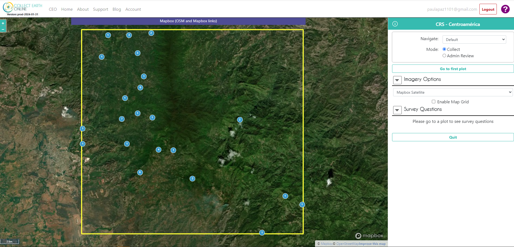

# Práctica de interpretación y debate en grupo

## Práctica de interpretación del CEO

En el tiempo restante del taller podemos realizar algunas prácticas de interpretación y debatir nuestras conclusiones en grupo. Trabajar juntos en el siguiente proyecto CEO dentro de su institución CEO.
- Abrir proyecto CEO https://app.collect.earth/collection?projectId=41845 
- Ir a interpretar la primera muestra.
 

- Responder cuestionario.
- Examen en grupo de interpretaciones difíciles.
- Descarga de interpretación

## Discusión en grupo

- ¿En qué le será útil CEO?
- ¿Qué herramientas/datos sería útil incluir en su proyecto?

## Ayuda general

>Si alguna vez necesita ayuda con su trabajo en CEO, un buen lugar para empezar son las páginas `Support` y `Blog` enlazadas en la parte superior del sitio web de CEO. Se ofrecen tutoriales para la creación e interpretación de proyectos.
