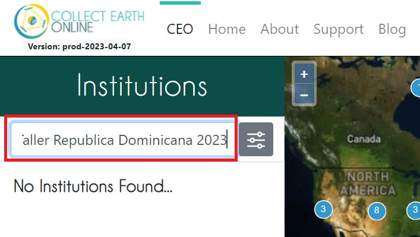
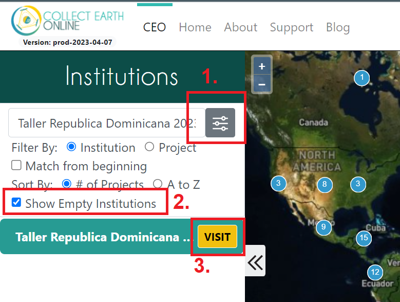

# Introducción

¡Bienvenido a Collect Earth Online - Evaluación de mapas! Este taller ofrecerá una visión general del CEO y de cómo utilizarlo para la recogida de datos para validación de mapas. También aprenderá a realizar una muestra aleatoria estratificada y a calcular los parámetros de precisión.

## Configuración prévia

**Creación de una cuenta CEO**

1. En la ventana de su navegador, vaya a [https://collect.earth/](https://collect.earth/). CEO es compatible con Google Chrome, Mozilla Firefox y Microsoft Edge.
2. Haz clic en `Register` en la parte superior derecha.
3. Rellene los datos, acepte las condiciones y haga clic en `Register`.
4. Recibirá un correo electrónico de bienvenida si el registro se ha realizado correctamente.
5. Cuando haya creado una cuenta, inicie sesión con su correo electrónico y contraseña utilizando el `Login`.

**Inscripción e Institución**

1. En la página de inicio ([https://app.collect.earth/home](https://app.collect.earth/home)) aparece una lista de todas las instituciones.
2. Si ha iniciado sesión, esta lista se divide en dos: `Your Affiliations` y `Other Institutions`. `Your Affiliations` son las instituciones a las que usted pertenece.
3. Busque la institución creada para este taller `Taller Republica Dominicana 2023` en la herramienta de búsqueda.

    

4. Para que aparezca la institución, utilice la herramienta de filtrado y marque la casilla "Show Empty Institutions". Verás la institución "Taller Republica Dominicana 2023" (en `Other Institutions` si está con su sesión iniciada). Haga clic en `VISIT` junto al nombre de la institución. Al hacer clic en él se abrirá la página de la institución.

    

5. Haga clic en el botón del usuario (solamente si está con su sesión iniciada).

    

6. Haga clic en el botón `Request Membership` si aún no se ha afiliado a la institución.

    

## Objetivos

1. Comprender los usos y ventajas del CEO.
2. Configurarse en CEO con una cuenta y una institución.
3. Aprender a crear un proyecto CEO para la recopilación de datos.
4. Aprender las mejores prácticas de interpretación en CEO.
