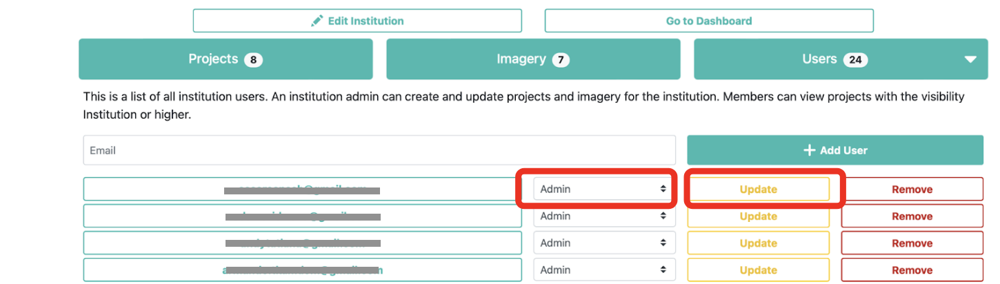
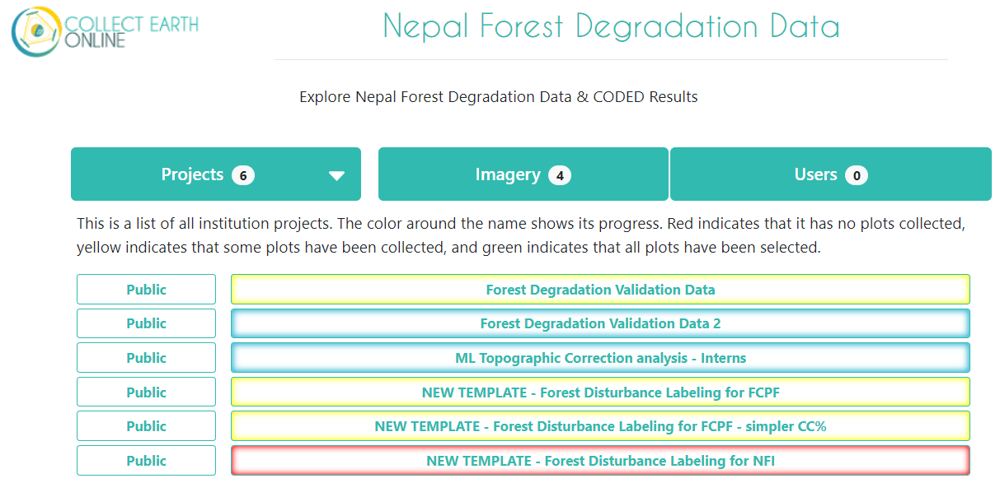
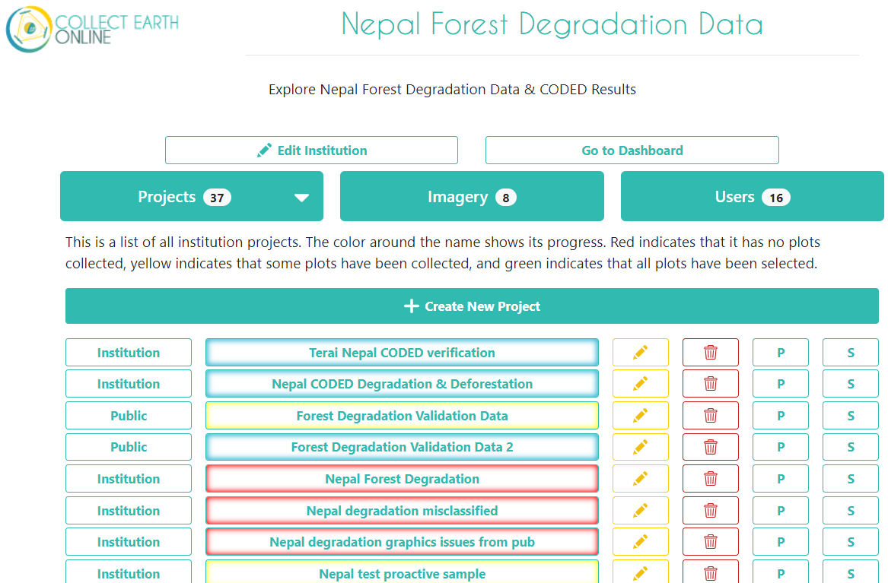

# Demostración práctica - Visita introductoria al CEO 

## Ayuda general

Si alguna vez necesita ayuda con su trabajo en CEO, un buen lugar para empezar son las páginas `Support` y `Blog` enlazadas en la parte superior del sitio web de CEO. Se ofrecen tutoriales para la creación e interpretación de proyectos.

## Creando una institución

Si su institución aún no está registrada en CEO, puede crear una nueva institución a la que puedan unirse todos los miembros de su equipo. (Ya se ha creado una institución para este taller: **"Taller Republica Dominicana 2023"**)

1. Inicie sesión en CEO.
2. Navegue hasta la página de inicio y haga clic en `+ Create New Institution` en el panel izquierdo.
3. Introduzca el nombre, la URL y la descripción de su institución.
4. Cargue un logotipo desde su ordenador para su institución haciendo clic en `Browse`.
5. Aceptar los condiciones del servicio.
6. Haga clic en `Create Institution` cuando haya terminado.
7. Los miembros del equipo con acceso a CEO pueden añadirse manualmente a la institución a través de su dirección de correo electrónico o pueden solicitar unirse a la institución.

Un usuario administrador puede entonces convertir a todos los nuevos usuarios de `Miembro` a `Admin`.

El estado `Admin` permite crear/editar proyectos y revisar puntos en modo QA/QC
Después de cambiar el usuario a `Admin` debe pulsar el botón `Update`.

Puede editar los otros elementos de su institución más adelante. Si alguna vez decide eliminar la institución, se perderán todos los proyectos que contenga.

## Página de inicio de la institución

La página de inicio de Proyectos de su institución contendrá una lista de los proyectos de su grupo. Los proyectos completados aparecerán en verde, los parcialmente completados en amarillo y los que no hayan recogido datos en rojo. A la izquierda se indicarán los niveles de privacidad de los proyectos.

- **Public - Todos**: Todos los usuarios pueden ver y aportar datos a tu proyecto. Los administradores pueden utilizar su proyecto como plantilla.
- **Users - Usuarios registrados**: Cualquier usuario conectado a CEO puede ver y contribuir a su proyecto. Los administradores pueden utilizar su proyecto como plantilla.
- **Institution - Miembros del grupo**: Los miembros de su institución pueden ver y contribuir a su proyecto. Los administradores de otras instituciones no pueden utilizar su proyecto como plantilla.
- **Private - Administradores del grupo**: Sólo los administradores de su institución pueden ver y contribuir a su proyecto. Los Admins de otras instituciones no pueden usar su proyecto como plantilla.

Si es administrador de su institución, también verá más botones a la derecha de cada proyecto. El botón con el icono del lápiz le permite editar un proyecto. Puede editar todo sobre un proyecto antes de que se publique, pero sólo algunas cosas una vez que se publique y esté abierto para la recogida oficial de datos. El botón de la basura borra un proyecto, lo que no se puede deshacer. Los botones `P` y `S` sirven para descargar los datos recogidos de un proyecto. Hay dos opciones de descarga de datos: Descargar datos de parcela, que descarga los datos resumidos por parcela, y Descargar datos de muestra, que descarga los datos sin procesar, con información para cada punto dentro de cada parcela como su propia fila. Ambas opciones se descargan en formato `.csv`, que puede abrirse en programas como Microsoft Excel o importarse en software de análisis de datos. Los datos descargados de CEO estarán en formato WGS84 EPSG:4326.

 

Si hace clic en el botón `Imagery` situado cerca de la parte superior de la página de la institución, verá una lista de las imágenes incorporadas a CEO, incluidos los datos de MapBox y Planet NICFI, así como cualquier otra imagen que se haya añadido a su institución. CEO ofrece dos formas sencillas de añadir sus propias imágenes a sus proyectos. La primera es conectando tus propias imágenes a través de Web Map Service (WMS) o Web Map Tile Service (WMTS), y la segunda es conectando tus imágenes alojadas en Google Earth Engine (GEE). Encontrará más información sobre cómo añadir sus propias imágenes en este [CEO Blog sobre GEE](https://blog.collect.earth/index.php/2022/04/21/connecting-gee-raster-data/), este [CEO Blog sobre WMS/WMTS](https://www.collect.earth/utilice-sus-propios-datos-en-ceo-conexion-con-wms-wmts-espanol/) y en el [Project Creation Manual](https://www.collect.earth/wp-content/uploads/2022/11/CEO_Manual_DataCollector_SP_20210720.pdf).

En la pestaña `Users` encontrará una lista completa de todas las direcciones de correo electrónico que forman parte de su institución CEO. Estos usuarios tendrán diferentes permisos basados en su estatus como `Administrador (Admin)` o `Miembro (Member)` de la institución. Puede añadir más usuarios CEO a su institución desde esta página.

## Como usuario administrador: ¿Qué encontrará dentro de un proyecto CEO?

Al crear un proyecto, un usuario administrador comenzará en una página parecida a esta.

 

## Como Intérprete: ¿Qué encontrará dentro de un proyecto CEO?

Puede empezar a recopilar datos en cualquier proyecto publicado haciendo clic en el botón con el nombre de ese proyecto en la página del proyecto de su institución. Varios usuarios pueden recopilar datos en el mismo proyecto al mismo tiempo, ya que serán dirigidos automáticamente a diferentes parcelas dentro del proyecto.

Este es un ejemplo de lo que un recolector de datos verá en cada interpretación de muestra.

