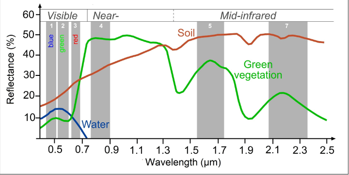
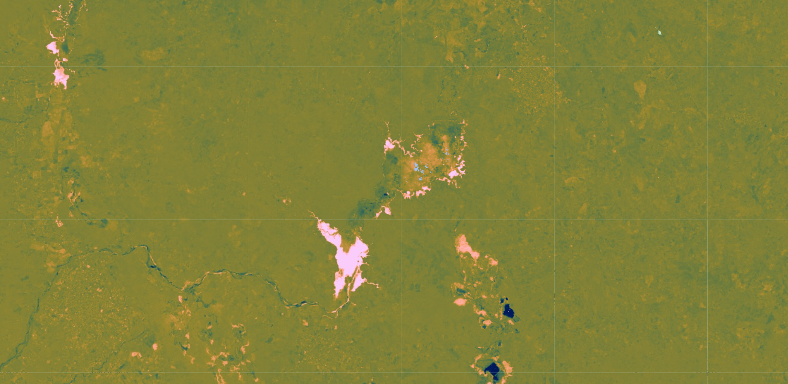
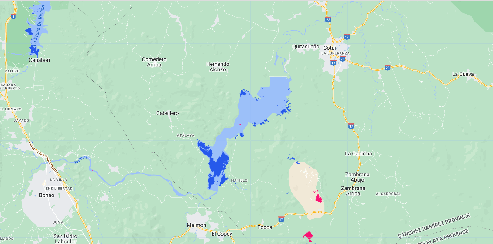

# Resumen

Para la práctica, seleccionará escenas de imágenes anteriores y posteriores al evento, crearás composiciones e investigará las condiciones de estas composiciones en una visualización de color verdadero. A continuación, calculará el índice NDWI para cada composición y creará una imagen de diferencia utilizando los dos mapas NDWI. Por último, aplicará un umbral a la imagen de diferencia para establecer categorías de zonas modificadas frente a zonas estables. Para esta demostración capturaremos la diferencia en los niveles de agua superficial entre 2014-2015 y 2020-2021.

# Paso-a-paso

## Sección 1. Preparación de las imágenes

Antes de iniciar un flujo de trabajo de detección de cambios, es esencial preprocesar las imágenes. El objetivo es garantizar que cada píxel registre el mismo tipo de medición en la misma ubicación a lo largo del tiempo. Estos pasos incluyen el registro multitemporal de la imagen y las correcciones radiométricas y atmosféricas, que son especialmente importantes. Gran parte de este trabajo se ha automatizado y ya se aplica a las imágenes disponibles en Earth Engine. La selección de imágenes también es importante. Las consideraciones de selección incluyen encontrar imágenes con poca nubosidad y que representen la misma fenología (por ejemplo, con o sin hojas).

Vamos empezar creando un punto en la área de interés, centrando el mapa y definindo funciones de escalonamiento y enmascaramiento de nubes como ya vimos en otras secciones.

```javascript
// Definir punto para área de interés y central el mapa.
var punto = ee.Geometry.Point([-70.2312, 18.9942]);
Map.centerObject(punto, 12);

// Definir función para escalonamiento.
function escalonamiento(imagen) {
  var bandasOpticas = imagen.select('SR_B.').multiply(0.0000275).add(-0.2);
  var bandasTermicas = imagen.select('ST_B.*').multiply(0.00341802).add(149.0);
  return imagen.addBands(bandasOpticas, null, true)
               .addBands(bandasTermicas, null, true);
}

// Definir función de enmascaramiento de nubes.
function mascaraNubes(image) {
    // Bit 0 - Llenar
    // Bit 1 - Nubes dilatadas
    // Bit 2 - Cirrus
    // Bit 3 - Nubes
    // Bit 4 - Sombra de la nubes
    var mascaraQA = image.select('QA_PIXEL').bitwiseAnd(parseInt('11111',
        2)).eq(0);
    var mascaraSat = image.select('QA_RADSAT').eq(0);

    return image.updateMask(mascaraQA)
                .updateMask(mascaraSat);
}
```

Ahora, creamos dos composiciones medianas, una para un período previo (`antes`) y otra para un período más reciente (`despues`). Filtramos la colección USGS Landsat 8 Level 2, Collection 2, Tier 1 por fechas, puntos y cobertura de nubes. Aplicamos las funciones definidas y agregamos esas dos imágenes al mapa en color verdadero.

```javascript
// Definir imágen de antes (composición mediana).
var antes = ee.ImageCollection('LANDSAT/LC08/C02/T1_L2')
    .filterBounds(punto)
    .filterDate('2014-01-01', '2016-01-01')
    .filter(ee.Filter.lt('CLOUD_COVER', 20))
    .map(escalonamiento)
    .map(mascaraNubes)
    .median();

// Definir imágen de después (composición mediana).
var despues = ee.ImageCollection('LANDSAT/LC08/C02/T1_L2')
    .filterBounds(punto)
    .filterDate('2020-01-01', '2022-01-01')
    .filter(ee.Filter.lt('CLOUD_COVER', 20))
    .map(escalonamiento)
    .map(mascaraNubes)
    .median();

// Parámetros de visualización para imágenes de antes y después.
var paramVis = {
  bands: ['SR_B4', 'SR_B3', 'SR_B2'],
  min: 0,
  max: 0.15
};

// Agregar imágenes al mapa.
Map.addLayer(antes, paramVis, 'Imagen de antes');
Map.addLayer(despues, paramVis, 'Imagen de después');
```


<font size=2> Imagen Antes y Imagen Despues. </font>

Toma en cuenta los cambios en la paisaje. ¿Qué notas?

## Sección 2. Cálculo de NDWI

El siguiente paso es la transformación de los datos, como el cálculo de la NDWI. La ventaja de utilizar estas técnicas es que los datos, junto con el ruido inherente a los mismos, se han reducido para simplificar la comparación entre dos imágenes. La diferenciación de imágenes se realiza restando el valor espectral de la imagen de la primera fecha del de la imagen de la segunda fecha, píxel a píxel. La diferenciación de imágenes de dos fechas puede utilizarse con una sola banda o con índices espectrales, dependiendo de la aplicación. Identificar la banda o el índice correctos para identificar el cambio y encontrar los umbrales correctos para clasificarlo es fundamental para producir resultados significativos. Un buen punto de partida es trabajar con índices que destaquen las condiciones de la cubierta terrestre antes y después de un cambio de interés. Por ejemplo, el índice de diferencia normalizada de agua sería bueno para cartografiar los cambios del nivel del agua durante las inundaciones; el NBR es bueno para detectar el brillo del suelo; y el NDVI puede utilizarse para rastrear los cambios en la vegetación (aunque este índice se satura rápidamente). En algunos casos, se sugiere utilizar combinaciones de bandas derivadas que se hayan personalizado para representar el fenómeno de interés, como el uso del Índice de Fracción de Diferencia Normalizada (NDFI) para controlar la degradación forestal. 

Examine los cambios en el paisaje causados por las inundaciones utilizando el NDWI, que mide la intensidad de la señal del agua, como vimos en el taller anterior.


Estas bandas se eligieron porque responden con mayor intensidad a la señal del agua superficial en comparación con otros tipos de cubierta terrestre. Podemos ver un pico en la reflectancia verde emparejado con una depresión en la reflectancia NIR para la curva espectral del Agua en la siguiente figura.



En primer lugar, calcule el NDWI para cada periodo de tiempo utilizando la función de diferencia normalizada incorporada. Para Landsat 8, asegúrese de utilizar las bandas verde y NIR para calcular la NDWI. Para visualizar un contraste suficiente dentro de las imágenes NDWI, fijamos los valores mínimo y máximo más estrechos que el rango de valores global de -1 a 1 de NDWI.

```javascript
// Calcular NDWI.
var ndwiAntes = antes.normalizedDifference(['SR_B3', 'SR_B5'])
    .rename('ndwiAntes');
var ndwiDespues = despues.normalizedDifference(['SR_B3', 'SR_B5'])
    .rename('ndwiDespues');

// Parámetros de visualización para NDWI.
var ndwiVis = {min: -0.9, max: 0.4, palette: ['red', 'yellow', 'green', 'blue']};

// Agregar imágenes NDWI al mapa.
Map.addLayer(ndwiAntes, ndwiVis, 'NDWI de antes');
Map.addLayer(ndwiDespues, ndwiVis, 'NDWI de después');
```


Elegimos una paleta de color donde píxeles con valores bajos de NDWI presentan color rojo, píxeles con valores medianos de NDWI presentan colores amarillo y verde y píxeles con valores altos de NDWI presentan color azul. ¿Qué notas?

## Sección 3. Transformación de dos imágenes

A continuación, examinaremos los cambios que se han producido al comparar dos fechas concretas en el tiempo.

Sustrae la imagen anterior de la imagen posterior utilizando la función de sustracción. Añada la imagen de cambio de dos fechas (`diferencia`) al mapa con la rampa de color especializada Fabio Crameri batlow (Crameri et al. 2020). Esta rampa de color es un ejemplo de una combinación de colores diseñada específicamente para ser legible por los espectadores daltónicos y con deficiencia de color. Ser consciente de las opciones cartográficas es una parte importante de la elaboración de un buen mapa de cambio.

La rampa de colores tiene azules oscuros para los valores más bajos, verdes y naranjas en la gama media y rosas para los valores más altos. Utilizamos `ndwiAntes` sustraído de `ndwiDespues` para identificar los cambios en cada píxel. Dado que los valores de NDWI son más altos cuando hay agua, las áreas que son negativas en la imagen de cambio representarán píxeles que eran más altos en la imagen `ndwiAntes` que en la imagen `ndwiDespues`. Por el contrario, las diferencias positivas significan que una zona ganó agua.

```javascript
// Diferencia entre imágenes.
var diferencia = ndwiDespues.subtract(ndwiAntes).rename('cambio');

// Paleta de colores para cambios.
var paleta = [
    '011959', '0E365E', '1D5561', '3E6C55', '687B3E',
    '9B882E', 'D59448', 'F9A380', 'FDB7BD', 'FACCFA'
];

// Parámetros de visualización para las diferencias entre imágenes.
var paramVisDif = {
    palette: paleta,
    min: -1,
    max: 1
};
Map.addLayer(diferencia, paramVisDif, 'Diferencias');
```



Intenta interpretar la imagen resultante antes de seguir. ¿Qué patrones de cambio puedes identificar? ¿Puedes encontrar zonas que parezcan pérdidas o ganancias de agua?

## Sección 4. Clasificación de los cambios

Una vez que las imágenes se han transformado y diferenciado para resaltar las zonas que experimentan cambios, el siguiente paso es la clasificación de las imágenes en un mapa temático compuesto por clases estables y de cambio. Esto puede hacerse de forma bastante simple, umbralizando la capa de cambio, o utilizando técnicas de clasificación como los algoritmos de aprendizaje automático vistos en talleres anteriores. Uno de los retos de trabajar con umbralización simple de la capa de diferencias es saber cómo seleccionar un umbral adecuado para dividir las áreas cambiadas de las clases estables. Por otro lado, las técnicas de clasificación que utilizan algoritmos de aprendizaje automático dividen el paisaje utilizando ejemplos de datos de referencia que usted proporciona para entrenar al clasificador. Esto puede dar mejores resultados o no, pero requiere un trabajo adicional para recopilar datos de referencia y entrenar al clasificador. Al final, los recursos, el tiempo y los patrones del fenómeno que se intenta cartografiar determinarán qué enfoque es el adecuado, o tal vez la actividad que se intenta rastrear requiera algo más avanzado, como un enfoque de series temporales que utilice más de dos fechas de imágenes.

Clasificaremos nuestra imagen en categorías utilizando un sencillo método manual de umbralización, lo que significa que decidiremos los valores óptimos para cuando un píxel se considerará cambio o no cambio en la imagen. Encontrar el valor ideal es una tarea considerable y será única para cada caso de uso y conjunto de entradas (por ejemplo, los valores de umbral para un cambio de banda única SWIR2 serían diferentes de los umbrales para NDVI o NDWI).

En primer lugar, definirá dos variables para los valores umbral de ganancia y pérdida. A continuación, cree una nueva imagen con un valor constante de 0. Esta será la base de nuestra clasificación. Reclasifique la nueva imagen utilizando la función `where`. Clasifique las áreas de pérdida como 2 donde la imagen de diferencia es menor o igual que el valor umbral de pérdida. Reclasificar las áreas de ganancia como 1 donde la imagen de diferencia es mayor o igual que el valor del umbral de ganancia. Por último, enmascare la imagen por sí misma y añada la imagen clasificada al mapa. Nota: No es necesario enmascarar la imagen por sí misma, y en muchos casos puede estar tan interesado en las áreas que no cambiaron.

```javascript
// Definir umbrales para detección de cambios. 
var umbralGanancia = 0.7;
var umbralPerdida = -0.8;

// Crear imagen "cerada".
var difClasificada = ee.Image(0);

// Detección de cambios.
var difClasificada = difClasificada.where(diferencia.lte(umbralPerdida), 2);
var difClasificada = difClasificada.where(diferencia.gte(umbralGanancia), 1);

// Parámetros de visualización para los cambios.
var cambioVis = {
    palette: ['fcffc8', '2659eb', 'fa1373'],
    min: 0,
    max: 2
};

// Agregar imagen de cambios al mapa.
Map.addLayer(difClasificada.selfMask(), cambioVis, 'Cambios clasificados por umbrales');
```



## Código completo

Script "`1 Detección de cambios simples de dos fechas`" del repositorio y carpeta `T5` o link directo:
[https://code.earthengine.google.com/dd745727cfcf247be9d43cf139f7c054](https://code.earthengine.google.com/dd745727cfcf247be9d43cf139f7c054).

# Desafíos

## Desafío 1

Pruebe a utilizar un índice diferente, como el MNDWI (Modified Normalized Difference Water Index), para ejecutar los pasos de detección de cambios, y compare los resultados con los obtenidos al utilizar el NDWI.

## Desafío 2

Experimente ajustando los valores `umbralPerdida` y `umbralGanancia`.

## Desafío 3

Utilice lo aprendido en los talleres de Mapeo de Manglares y Mapeo de Inundaciones para ejecutar una clasificación supervisada en la capa de diferencias (o capas, si ha creado capas adicionales). Sugerencia: Para completar una clasificación supervisada, necesitará ejemplos de referencia tanto de las clases estables como de las clases de cambio de interés para entrenar el clasificador.

## Desafío 4

Piensa en cómo cosas como las nubes y las sombras de las nubes podrían afectar a los resultados de la detección de cambios. ¿Qué crees que detectaría el método de diferenciación de dos fechas para imágenes del mismo año en diferentes estaciones?
