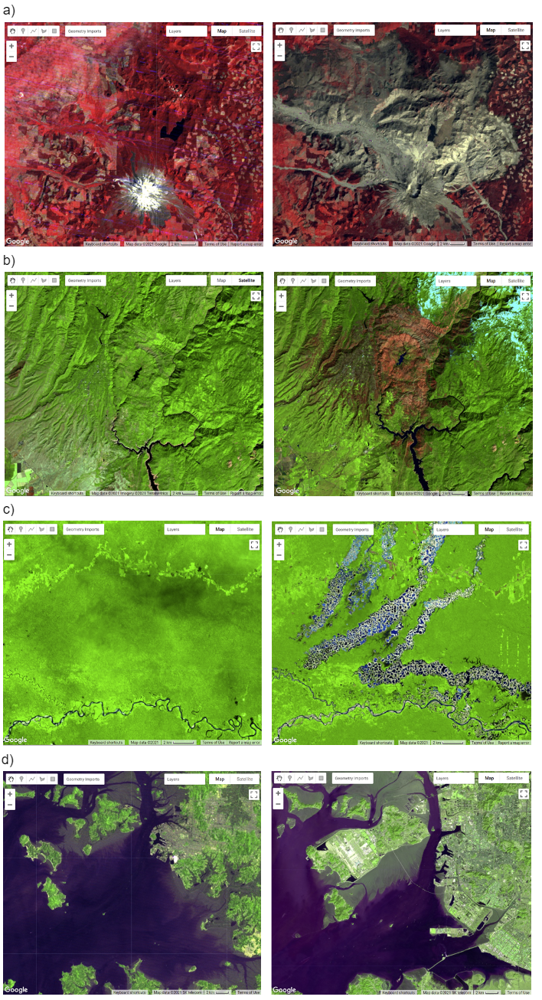
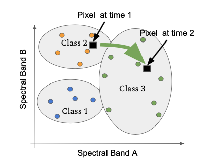
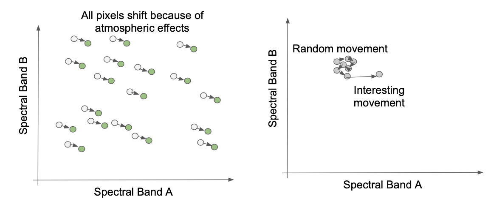

# Introducción

¡Bienvenido a Avanzado en Google Earth Engine - Detección de cambios! Este taller contiene varios casos prácticos de Google Earth Engine. Nos centraremos en la detección de cambios en el agua aprovechando los datos ópticos de Landsat con una detección simples de dos fechas. Después, exploraremos detección de cambios utilizando un algoritmo avanzado de séries temporales que también aprovecha imágenes Landsat: LandTrendr.

Esta sesión de capacitación fue adaptada de [Cloud-Based Remote Sensing with Google Earth Engine: Fundamentals and Applications](https://www.eefabook.org/) (libro EEFA) y [OpenMRV](https://www.openmrv.org/).

## Configuración prévia

1. Crear una [cuenta de Google Earth Engine](https://code.earthengine.google.com/register). Necesitas una [cuenta Google](https://accounts.google.com/signup). Crear una cuenta GEE para fines no comerciales.
2. Haga clic en este enlace para aceptar el repositorio de GEE de la Republica Dominicana: [https://code.earthengine.google.com/?accept_repo=users/an-sig/republica-dominicana](https://code.earthengine.google.com/?accept_repo=users/an-sig/republica-dominicana). Una vez en esta página, verás este repositório bajo `Reader` en la pestaña `Scripts` de GEE.
3. Cree un nuevo script en su propio repositorio; asígnele el nombre que desee.

## Objetivos

Detección de cambios de dos fechas:

1. Cálculo de índices espectrales para extraer patrones
2. Creación de una diferencia de dos imágenes para ayudar a localizar las zonas de cambio
3. Elaboración de un mapa de cambios y clasificación de los cambios mediante umbralización

LandTrendr:

1. Evaluación de las series temporales anuales de valores espectrales para distinguir entre cambios reales y artefactos.
2. Reconocimiento de señales de perturbación y crecimiento en las series temporales de valores espectrales anuales de píxeles individuales.
3. Interpretar segmentos de cambio y traducirlos a mapas.
4. Aplicación de parámetros en una interfaz gráfica de usuario para crear mapas de perturbaciones en los bosques.

# Teoría

La detección de cambios es el proceso de evaluar cómo están cambiando las condiciones del paisaje observando las diferencias en las imágenes adquiridas en diferentes momentos. Esto se puede utilizar para cuantificar los cambios en la cubierta forestal - como los que se producen tras una erupción volcánica, una actividad maderera o un incendio forestal - o cuando se cosechan los cultivos (Figure 1). Por ejemplo, utilizando métodos de detección de cambios en series temporales, Hansen et al. (2013) cuantificaron los cambios anuales en la pérdida de bosques y el rebrote. La cartografía de detección de cambios es importante para observar, controlar y cuantificar los cambios en los paisajes a lo largo del tiempo. Entre las preguntas clave que pueden responderse mediante estas técnicas se incluyen la identificación de si se ha producido un cambio, la medición del área o la extensión espacial de la región que está experimentando el cambio, la caracterización de la naturaleza del cambio y la medición del patrón (configuración o composición) del cambio (MacLeod y Congalton 1998).

 Figura 1. Imágenes del antes y el después de (a) la erupción del Monte St. Helens en el estado de Washington, EE.UU., en 1980 (antes, 10 de julio de 1979; después, 5 de septiembre de 1980); (b) el incendio Camp Fire en California, EE.UU., en 2018 (antes, 7 de octubre de 2018; después, 16 de marzo de 2019); (c) la minería ilegal de oro en la región Madre de Dios de Perú (antes, 31 de marzo de 2001; después, 22 de agosto de 2020); y (d) los cambios en la costa de Incheon, Corea del Sur (antes, 29 de mayo de 1981; después, 11 de marzo de 2020). 

Muchas técnicas de detección de cambios utilizan la misma premisa básica: que la mayoría de los cambios en el paisaje dan lugar a valores espectrales que difieren entre las imágenes anteriores y posteriores al evento (Figura 2). El reto puede consistir en separar los verdaderos cambios de interés - los debidos a las actividades en el paisaje - del ruido en la señal espectral, que puede estar causado por la variación estacional y la fenología, los errores de registro de la imagen, las nubes y las sombras, las incoherencias radiométricas, la variabilidad de la iluminación (por ejemplo, el ángulo del sol, la posición del sensor) y los efectos atmosféricos (Figura 3).

 Figura 2. 

 Figura 3. 

Las actividades que provocan cambios pronunciados en los valores de radiancia durante un periodo de tiempo suficientemente largo son más fáciles de detectar mediante técnicas de detección de cambios por teledetección que los cambios sutiles o de corta duración en las condiciones del paisaje. Pueden surgir problemas de cartografía si el cambio es de corta duración, ya que es difícil captarlo con instrumentos de satélite que sólo observan un lugar cada varios días. Otros tipos de cambios se producen tan lentamente o son tan amplios que no se detectan fácilmente hasta que se observan mediante imágenes de satélite recogidas durante un intervalo de tiempo suficientemente largo. Los cambios sutiles que se producen lentamente en el paisaje pueden ser más adecuados para métodos más exigentes desde el punto de vista computacional, como el análisis de series temporales. Kennedy et al. (2009; 2018) ofrecen una buena visión general de los conceptos y las ventajas y desventajas a la hora de diseñar enfoques de seguimiento del paisaje. Singh (1989), Coppin et al. (2004), Lu et al. (2004) y Woodcock et al. (2020) ofrecen otros resúmenes de métodos de detección de cambios y avances recientes.

Para los cambios en la cubierta terrestre que se producen de forma abrupta en grandes áreas del paisaje y son de larga duración, es adecuado un enfoque simple de diferenciación de imágenes de dos fechas. Las técnicas de diferenciación de imágenes de dos fechas son métodos establecidos desde hace tiempo para identificar cambios que producen resultados fácilmente interpretables (Singh 1989). El proceso suele constar de cuatro pasos: (1) selección y preprocesamiento de imágenes; (2) transformación de datos, como el cálculo de la diferencia entre los índices de interés (por ejemplo, el índice de vegetación de diferencia normalizada (NDVI)) en las imágenes anteriores y posteriores al evento; (3) clasificación de las imágenes diferenciadas mediante técnicas de umbralización o clasificación supervisada; y (4) evaluación.

## Referencias

Cohen WB, Healey SP, Yang Z, et al (2017) How similar are forest disturbance maps derived from different Landsat time series algorithms? Forests 8:98. https://doi.org/10.3390/f8040098

Coppin P, Jonckheere I, Nackaerts K, et al (2004) Digital change detection methods in ecosystem monitoring: A review. Int J Remote Sens 25:1565–1596. https://doi.org/10.1080/0143116031000101675

Crameri F, Shephard GE, Heron PJ (2020) The misuse of colour in science communication. Nat Commun 11:1–10. https://doi.org/10.1038/s41467-020-19160-7

Fung T (1990) An assessment of TM imagery for land-cover change detection. IEEE Trans Geosci Remote Sens 28:681–684. https://doi.org/10.1109/TGRS.1990.572980

Hansen MC, Potapov PV, Moore R, et al (2013) High-resolution global maps of 21st-century forest cover change. Science 342:850–853. https://doi.org/10.1126/science.1244693

Kennedy RE, Townsend PA, Gross JE, et al (2009) Remote sensing change detection tools for natural resource managers: Understanding concepts and tradeoffs in the design of landscape monitoring projects. Remote Sens Environ 113:1382–1396. https://doi.org/10.1016/j.rse.2008.07.018

Kennedy RE, Yang Z, Gorelick N, Braaten J, Cavalcante L, Cohen WB, Healey S. (2018) Implementation of the LandTrendr algorithm on google earth engine. Remote Sensing. 10(5):691. https://doi.org/10.3390/rs10050691

Lu D, Mausel P, Brondízio E, Moran E (2004) Change detection techniques. Int J Remote Sens 25:2365–2401. https://doi.org/10.1080/0143116031000139863

Macleod RD, Congalton RG (1998) A quantitative comparison of change-detection algorithms for monitoring eelgrass from remotely sensed data. Photogramm Eng Remote Sensing 64:207–216

Singh A (1989) Digital change detection techniques using remotely-sensed data. Int J Remote Sens 10:989–1003. https://doi.org/10.1080/01431168908903939

Stehman SV, Czaplewski RL (1998) Design and analysis for thematic map accuracy assessment: Fundamental principles. Remote Sens Environ 64:331–344. https://doi.org/10.1016/S0034-4257(98)00010-8

Woodcock CE, Loveland TR, Herold M, Bauer ME (2020) Transitioning from change detection to monitoring with remote sensing: A paradigm shift. Remote Sens Environ 238:111558. https://doi.org/10.1016/j.rse.2019.111558