# Resumen

En esta práctica, trataremos de entender cómo se puede utilizar una serie temporal de imágenes para detectar y clasificar el cambio. Aprenderemos a utilizar LandTrendr para detectar cambios en el paisaje durante un periodo de tiempo más largo a partir de imágenes Landsat.

Esta sesión de capacitación fue adaptada de [Cloud-Based Remote Sensing with Google Earth Engine: Fundamentals and Applications](https://www.eefabook.org/) (libro EEFA) y [OpenMRV](https://www.openmrv.org/) y basada en [Kennedy et al. (2010)](http://osu-wams-blogs-uploads.s3.amazonaws.com/blogs.dir/2108/files/2015/05/Kennedy_etal2010.pdf) y [Kennedy et al. (2018)](https://www.mdpi.com/2072-4292/10/5/691).

## Objetivos

1. Comprender de forma general qué son las series temporales de imágenes basadas en píxeles y por qué son útiles para la detección de cambios.
2. Practicar la ejecución de LandTrendr utilizando la interfaz gráfica de LandTrendr.

## Detección de cambios por series temporales

Si se elige un índice espectral que coincida con el tipo de cambio que se busca, el cambio en la superficie puede inferirse a partir de los cambios en los valores del índice espectral. Con el tiempo, la progresión de los valores espectrales observados en cada píxel cuenta una historia de los procesos de cambio, como el crecimiento y las perturbaciones. Los algoritmos de series temporales están diseñados para aprovechar muchas observaciones de valores espectrales a lo largo del tiempo con el fin de aislar y describir los cambios de interés, ignorando al mismo tiempo los cambios sin interés o el ruido.

Utilizaremos el algoritmo de series temporales de LandTrendr para cartografiar el cambio. LandTrendr (Landsat-Based Detection of Trends in Disturbance and Recovery) aplica estrategias de "segmentación temporal" para destilar una serie temporal de varios años en segmentos secuenciales de línea recta que describen los procesos de cambio que se producen en cada píxel.

A continuación, aislamos el segmento de interés en cada píxel y elaboramos mapas de cuándo, durante cuánto tiempo y con qué intensidad se produjo cada proceso. De acuerdo con los desarrolladores, LandTrendr "es un conjunto de algoritmos de segmentación espectral-temporal útiles para la detección de cambios en una serie temporal de imágenes de satélite de resolución moderada (principalmente Landsat) y para la generación de datos de series temporales espectrales basados en trayectorias, en gran medida ausentes de ruido de señal interanual."

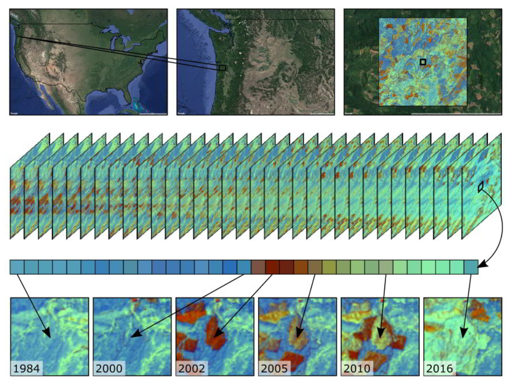

En la práctica, LandTrendr toma un único punto de vista de la historia espectral de un píxel, como una banda o un índice, y sigue un proceso para identificar los puntos de ruptura que separan los periodos de cambio duradero o de estabilidad en la trayectoria espectral y registra el año en que se ha producido el cambio. Estos puntos de ruptura, definidos por el año y el valor del índice espectral, nos permiten representar la historia espectral de un píxel como una serie de vértices que delimitan segmentos de línea.

Cuando trabaje con LandTrendr por primera vez en su zona, hay dos cuestiones que debe abordar.  

En primer lugar, ¿es detectable el cambio de interés en el registro de reflectancia espectral? Si el cambio que le interesa no deja un patrón en el registro de reflectancia espectral, un algoritmo no podrá encontrarlo.  

En segundo lugar, ¿puede identificar los parámetros de ajuste que permiten al algoritmo capturar ese registro? Los algoritmos de series temporales aplican reglas a una secuencia temporal de valores espectrales en un píxel y simplifican las numerosas observaciones en formas más digeribles, como los segmentos lineales con los que trabajaremos con LandTrendr. Los algoritmos que realizan la simplificación suelen guiarse por parámetros que controlan la forma en que el algoritmo realiza su trabajo.

Para más informaciones, acceda: [https://emapr.github.io/LT-GEE/](https://emapr.github.io/LT-GEE/).

# Paso-a-paso - LandTrendr

## Sección 1. Opciones de series temporales de píxeles

En nuestro repositorio, abra y ejecute el script que genera la GUI de LandTrendr para desplegar fácilmente los algoritmos de LandTrendr: "`2 LandTrendr GUI`" del repositorio y carpeta `T5` o link directo:
[https://code.earthengine.google.com/370839ee7e8dafef311c4a4d5fbb24d5](https://code.earthengine.google.com/370839ee7e8dafef311c4a4d5fbb24d5). Ejecute el script y debería ver una interfaz parecida a la siguiente:

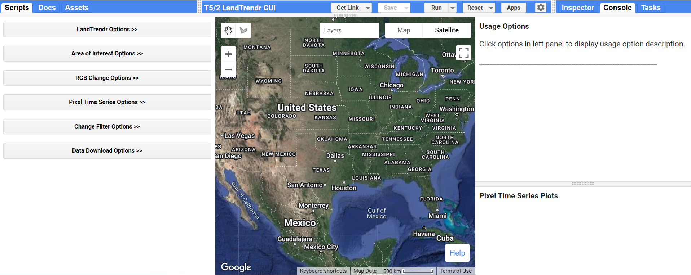

 La interfaz gráfica de LandTrendr, con el panel de control a la izquierda, el panel de mapas en el centro y el panel de informes a la derecha. 

La interfaz gráfica de LandTrendr consta de tres paneles: un panel de control a la izquierda, un panel de informes a la derecha y un panel de Mapa en el centro. El panel de control es donde reside toda la funcionalidad de la interfaz. Hay varios módulos, a cada uno de los cuales se accede haciendo clic en la flecha doble situada a la derecha del título. El panel Mapa está situado por defecto en los Estados Unidos, pero puede moverse manualmente a cualquier parte del mundo. El panel de informes muestra mensajes sobre cómo utilizar las funciones, además de proporcionar salidas gráficas.

A continuación, despliegue la función "Pixel Time Series Options". Por ahora, simplemente utilice el ratón para hacer clic en algún lugar del mapa. En este taller utilizaremos un ejemplo en Oregon. Espere unos segundos aunque parezca que no pasa nada - ¡¡¡tenga paciencia!!! La interfaz gráfica de usuario ha enviado información a Earth Engine para que ejecute los algoritmos de LandTrendr en la ubicación en la que ha hecho clic, y está esperando los resultados. Finalmente debería ver aparecer un gráfico en el panel de informes de la derecha. Este gráfico muestra el aspecto de un píxel en un área donde el bosque se quemó y comenzó a rebrotar. Su gráfico probablemente tendrá un aspecto diferente si ha clicado en un punto diferente.

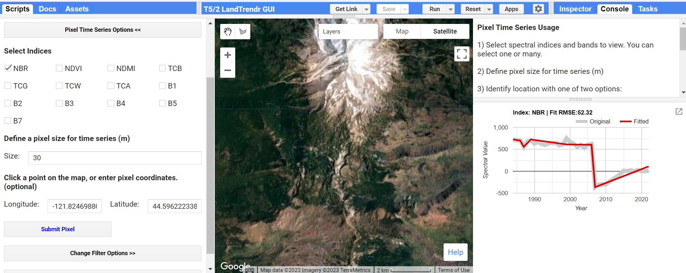

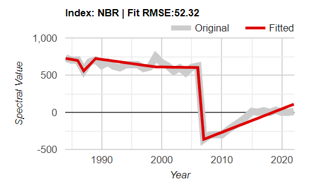

 Trayectoria típica de un píxel. El eje x muestra el año, el eje y el valor del índice espectral, y el título el índice elegido. La línea gris representa los valores espectrales originales observados por Landsat, y la línea roja el resultado de los algoritmos de segmentación temporal de LandTrendr. 

La clave del éxito con el algoritmo LandTrendr es interpretar estas series temporales. En primer lugar, examinemos los componentes del gráfico. El eje "x" muestra el año de observación. Con LandTrendr, sólo se utiliza una observación por año para describir la historia de un píxel; más adelante veremos cómo controlar ese valor. El eje "y" muestra el valor espectral del índice elegido. En el modo por defecto, el Normalized Burn Ratio. Tenga en cuenta que también tiene la posibilidad de elegir más índices utilizando las casillas de verificación del panel de control de la izquierda. Tenga en cuenta que los índices están en escala de punto flotante (decimales) de 1000. Así, un valor NBR de 1,0 se mostraría como 1000.

En la zona del gráfico, la línea gruesa gris representa los valores espectrales observados por el satélite durante el periodo del año seleccionado para un único píxel Landsat de 30 m en la ubicación que haya elegido. La línea roja es el resultado de la segmentación temporal que constituye el núcleo de los algoritmos de LandTrendr. El título del gráfico muestra el índice espectral, así como el error cuadrático medio del ajuste (RMSE).

Para interpretar las series temporales, primero hay que saber en qué dirección "sube" y "baja" el índice espectral que nos interesa. En el caso de la NBR, el índice aumenta de valor cuando hay más vegetación y menos suelo en un píxel. Disminuye cuando hay menos vegetación. Esto es útil para controlar las alteraciones de la vegetación.

A continuación, traduzca ese cambio en los cambios de interés para los procesos de cambio que le interesan. Por ejemplo, para los sistemas forestales de coníferas, el NBR es útil porque cae precipitadamente cuando se produce una perturbación, y aumenta a medida que crece la vegetación.

En el caso de la Figura abajo, interpretamos la caída abrupta como una perturbación, y el posterior aumento del índice como un rebrote o recuperación (aunque no necesariamente del mismo tipo de vegetación):

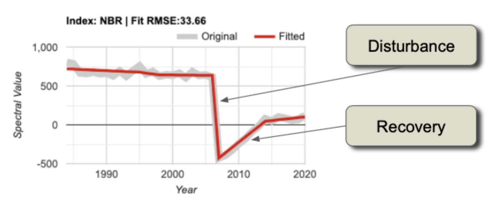

El objetivo con estos gráficos es determinar si:

- La trayectoria de los valores de la fuente capta los procesos que usted cree que están ocurriendo en la superficie.
- Los valores ajustados captan adecuadamente la "forma" general de la trayectoria de los valores de origen.

## Sección 2. Exploración de la dinámica con imágenes compuestas de tres colores

Aunque el modo puntual es la única forma de comprender y evaluar plenamente los valores de origen y de ajuste, es una forma ineficaz de explorar los patrones espaciales. Podemos encontrarnos con píxeles en los que los valores de origen indiquen un problema con las imágenes, o en los que los parámetros de ajuste probablemente no se hayan elegido adecuadamente, pero estos hallazgos se producen por casualidad. Sería útil disponer de una herramienta visual rápida para escanear el paisaje y evaluar tendencias y problemas potenciales.

La herramienta de visualización RGB de la interfaz gráfica de LandTrendr (RGB Change Options) está diseñada para evaluar rápidamente los patrones espaciales del ajuste espectral del algoritmo. En esta herramienta, ejecutamos LT en muchos píxeles y, a continuación, mostramos imágenes de los valores ajustados por LT en los píxeles, con diferentes años de imágenes ajustadas en los colores rojo, verde y azul en la pantalla. Teniendo en cuenta los años que se muestran y las propiedades de los valores espectrales que se muestran, es posible interpretar patrones espaciales en las imágenes RGB en términos de procesos de cambio de la cubierta terrestre o problemas con las imágenes o el ajuste.

En primer lugar, cargaremos o dibujamos un área de estudio para el análisis. Los algoritmos de LandTrendr son intensivos desde el punto de vista computacional y tardan cierto tiempo en ejecutarse. A efectos de entrenamiento, es útil restringir nuestro análisis a un dominio geográfico relativamente pequeño.

En el Panel de control, seleccione el menú "Area of Interest Options" y la opción "Draw option" para dibujar un polígono en Oregon cerca de Warm Springs Reservations y Salem como abajo:

A continuación, abra el menú "RGB Change Options" en la GUI y defina los parámetros como abajo:

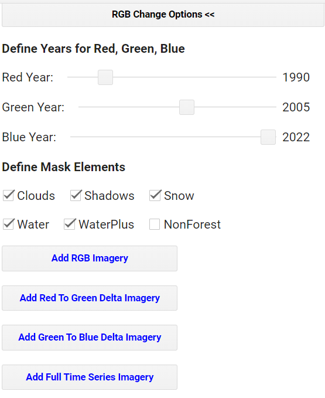

Haga clic en "Añadir imágenes RGB" y espere pacientemente. Puede tardar un minuto en cargar completamente la zona que hemos elegido.

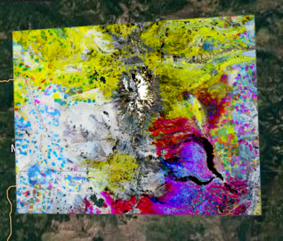

¿Cómo interpretamos los colores? Supongamos que trabajamos con un índice como NBR, TCW o NDVI, en el que los valores altos indican más vegetación y los bajos, menos. En primer lugar, consideremos un área sin colores: un área negra, blanca o con algún tono gris intermedio. Si una zona es de un tono entre negro y blanco, significa que la trayectoria de los valores espectrales es estable a lo largo de los años. En el siguiente esquema, las líneas horizontales negras representan tres trayectorias de píxeles diferentes, todas ellas perfectamente planas (es decir, estables a lo largo del tiempo):

Si tenemos una perturbación entre los años Verde y Azul, eso significa que el índice será alto en los colores Rojo y Verde, pero bajo en el azul. Siguiendo la teoría aditiva del color (véase [https://es.wikipedia.org/wiki/S%C3%ADntesis_aditiva_de_color](https://es.wikipedia.org/wiki/S%C3%ADntesis_aditiva_de_color)), esto daría como resultado un color amarillo.

Si, por el contrario, la perturbación se produjo antes del año verde y no se recuperó mucho en el año azul, tendríamos valores altos sobre todo en rojo.

Si hubiera recuperación en la época del año azul, entonces habría alto rojo y azul, haciendo algún tono de púrpura o magenta.

Hay un par de variantes más que se ven con frecuencia y que merece la pena conocer. Si un área experimenta un crecimiento constante de la vegetación a lo largo de todos los años, tendrá un rojo relativamente bajo, un verde ligeramente más alto y el azul más alto, lo que equivale a una especie de cian o azul.

Por último, si hay un declive persistente a lo largo de todo el periodo, el rojo será más alto, seguido del verde y luego del azul, lo que dará lugar a una versión de marrón o naranja.

Estas reglas de color pueden resultar algo abstractas hasta que las vemos en acción. La interfaz gráfica de LandTrendr nos da la oportunidad de hacerlo: ¡utilizar el mapa de color RGB para seleccionar píxeles y trazarlos en el modo de nivel de píxel! En primer lugar, compruebe que su imagen RGB se ha cargado en la vista de mapa. A continuación, en el menú Control de la izquierda, vuelva a seleccionar el menú "Pixel Time Series Options".

Ahora puede hacer clic en la imagen RGB para ver el aspecto de los píxeles en las distintas zonas de la imagen. Por ejemplo, puede ver un área donde hay una buena cantidad de "rayas" púrpuras. La siguiente imagen es un ejemplo de visualización de gráficos de índices NBR para los año R-1990, G-2005, B-2022:

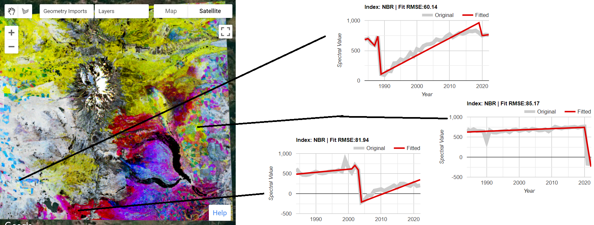

## Sección 3. Ajustando los valores del algoritmo

CLandTrendr es capaz de aceptar cualquier índice, y los usuarios avanzados son bienvenidos a utilizar índices de su propio diseño. Una consideración importante es saber qué dirección indica "recuperación" y "perturbación" para el tema que le interesa. Los algoritmos favorecen la detección de perturbaciones y pueden controlarse para limitar la rapidez con la que se supone que se produce la recuperación (véanse los parámetros más abajo).  

Para que LandTrendr tenga alguna esperanza de encontrar el cambio de interés, ese cambio debe manifestarse en la línea gris que muestra los valores espectrales originales. Si sabe que se está produciendo algún proceso y no es evidente en la línea gris, ¿qué puede hacer?

Una opción es cambiar el índice. Cualquier índice es simplemente una vista del espacio espectral más amplio de los sensores del Landsat. El cambio que le interesa puede causar un cambio espectral en una dirección diferente a la capturada con algunos índices. Intente elegir diferentes índices de la lista. Si hace clic en diferentes casillas de verificación y vuelve a enviar el píxel, aparecerán los ajustes para todos los índices diferentes.

Otra opción es cambiar el intervalo de fechas. LandTrendr utiliza un valor por año, pero el valor elegido puede ser controlado por el usuario. Es posible que el cambio de interés se identifique mejor en unas estaciones que en otras. Utilizamos un enfoque de composición de imágenes "medoid", que elige la mejor observación individual cada año de un rango de fechas de imágenes en una ImageCollection. En la GUI, puede cambiar el rango de fechas de las imágenes utilizadas para la composición en la parte de la **Colección de Imágenes** del menú de "LandTrendr Options".

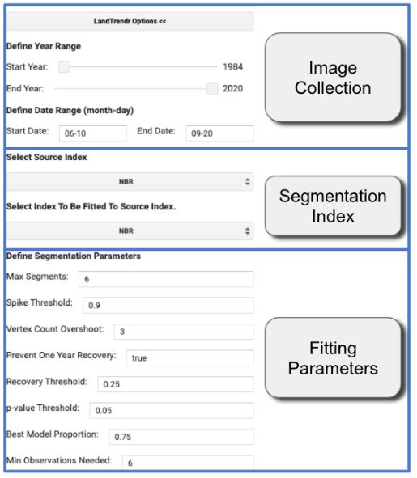

Cambie la **Fecha de inicio** y la **Fecha final** para encontrar una época del año en la que la distinción entre las condiciones de cobertura antes y durante el proceso de cambio de interés sea mayor.
 
Hay otras consideraciones a tener en cuenta. En primer lugar, la estacionalidad de la vegetación, el agua o la nieve a menudo puede afectar a la señal del cambio de interés. Y como usamos una ImageCollection que abarca un rango de fechas, es mejor elegir un rango de fechas en el que no es probable que haya un cambio sustancial en el estado vegetativo desde el principio hasta el final del rango de fechas. Las nubes también pueden ser un factor. Algunas estaciones tendrán más nubosidad, lo que puede dificultar la obtención de buenas imágenes. A menudo, con los sensores ópticos, nos vemos obligados a trabajar con periodos en los que las nubes son menos frecuentes, o a utilizar amplios intervalos de fechas para ofrecer muchas oportunidades de que un píxel esté libre de nubes.

Es posible que ninguna combinación de índice o rango de datos sea sensible al cambio de interés. En ese caso, hay dos opciones: intentar utilizar un sensor y una técnica de detección de cambios diferentes, o aceptar que el cambio no es perceptible. Esto puede ocurrir a menudo si el cambio de interés ocupa una pequeña porción de un píxel Landsat de 30 m por 30 m, o si la manifestación espectral del cambio es tan sutil que no es espectralmente separable de los píxeles no cambiados.

Incluso si usted, como ser humano, puede identificar el cambio de interés en la trayectoria espectral de la línea gris, un algoritmo puede no ser capaz de rastrearlo de forma similar. Para dar al algoritmo una oportunidad de luchar, es necesario explorar si se podrían utilizar diferentes parámetros de ajuste para hacer coincidir la línea roja ajustada con la línea gris de la imagen de origen.  

El proceso general de ajuste incluye pasos para reducir el ruido e identificar mejor la señal subyacente. Los algoritmos de segmentación temporal se controlan mediante parámetros de ajuste que se describen en detalle en Kennedy et al. (2010). Estos parámetros se ajustan mediante el bloque **Fitting Parameters** del menú "LandTrendr Options". A continuación se ofrece un breve resumen de los valores que suelen ser útiles, pero es probable que cambien a medida que utilice diferentes índices espectrales.
 
En primer lugar, el criterio de **minimum observations needed (observaciones mínimas necesarias)** se utiliza para evaluar si una trayectoria determinada tiene suficientes años sin filtrar (es decir, observaciones claras) para realizar el ajuste. Sugerimos dejarlo en el valor por defecto de 6 para este ejemplo en Oregon.

La segmentación comienza con un paso de atenuación del ruido para eliminar los picos que podrían ser causados por nubes o sombras no filtradas. El parámetro **spike threshold (umbral de picos)** controla el grado de filtrado. Un valor de 1.0 corresponde a ningún filtrado, y valores más bajos corresponden a un filtrado más severo. Sugerimos dejarlo en 0,9; si se cambia, un rango de 0,7 a 1,0 es apropiado.

El siguiente paso es encontrar los vértices. Se comienza con el año inicial y final como años de vértice, añadiendo progresivamente años de vértice candidatos basados en la desviación de los ajustes lineales. Para evitar una sobreabundancia de años vértice encontrados inicialmente usando este método, sugerimos dejar el **vertex count overshoot (exceso de recuento de vértices)** en un valor de 3. Un segundo conjunto de algoritmos utiliza el ángulo de desviación para reducir esta sobreabundancia a un número determinado de años vértice candidatos máximos.

Ese número de años de vértice está controlado por el parámetro **max_segments (segmentos máximos)**. Como regla general, el número de segmentos no debe ser superior a un tercio del número total de observaciones anuales probables. Los años de estos vértices (valores X) se pasan al paso de construcción del modelo. Suponiendo que se utilicen al menos 30 años de archivo y que la disponibilidad de imágenes en la zona sea razonable, un valor de 8 es un buen punto de partida.
 
En el paso de construcción del modelo, se construyen segmentos rectilíneos ajustando los valores Y (valores espectrales) para los periodos definidos por los años de los vértices (valores X). El proceso va de izquierda a derecha, de los primeros a los últimos años. Las regresiones de cada segmento posterior se conectan al final del segmento anterior. Las regresiones también están limitadas para evitar una recuperación poco realista tras una perturbación, controlada por el parámetro de **recovery threshold (umbral de recuperación)**. Un valor más bajo indica una mayor restricción: un valor de 1,0 significa que la restricción está desactivada; un valor de 0,25 significa que no se permiten segmentos que se recuperen totalmente en menos de cuatro años (4 = 1/0,25). Nota: Este parámetro tiene un fuerte control sobre el ajuste, y es uno de los primeros a explorar cuando se prueban parámetros.  Además, el parámetro **preventOneYearRecovery** no permitirá ajustes que tengan segmentos de recuperación de un año de duración.  Esto puede ser útil para evitar el sobreajuste de datos ruidosos en entornos en los que una recuperación vegetativa tan rápida no es ecológicamente realista.

Una vez encontrado un modelo con el máximo número de segmentos, se elaboran modelos sucesivamente más sencillos mediante la eliminación iterativa del vértice menos informativo. Cada modelo se puntúa utilizando un estadístico *pseudo-f*, que penaliza los modelos con más segmentos, para crear un pseudo /*p-valor* para cada modelo. El parámetro umbral del valor p se utiliza para identificar todos los ajustes que se consideran suficientemente buenos. Empiece con un valor de 0,05, pero compruebe si la línea ajustada parece capturar la forma y las características destacadas de la trayectoria de la fuente gris. Si observa patrones temporales en la línea gris que probablemente no sean ruido (basándose en su comprensión del sistema en estudio), considere cambiar el umbral del valor p a 0,10 o incluso 0,15.

Nota: debido a la autocorrelación temporal, estos valores no pueden interpretarse como verdaderos valores f y p, sino como escalares relativos para distinguir la bondad de ajuste entre modelos. Si no se pueden encontrar buenos modelos utilizando estos criterios basados en el parámetro de valor p establecido por el usuario, se utiliza un segundo enfoque para resolver el valor Y de todos los años de vértice simultáneamente. Si no se encuentra un buen modelo, se utiliza un modelo de valor medio rectilíneo.
 
De los modelos que superan el umbral del valor p, se elige uno como ajuste final. Puede ser el que tenga el valor p más bajo. Sin embargo, se hace un ajuste para permitir que se elijan modelos más complicados (los que tienen más segmentos) aunque su valor p esté dentro de una proporción definida del modelo con mejor puntuación. Esta proporción se establece mediante el parámetro de **best model proportion (proporción del mejor modelo)**. Por ejemplo, un valor de proporción del mejor modelo de 0,75 permitiría elegir un modelo más complicado si su puntuación fuera superior en un 75% a la del mejor modelo.

## Traducir píxeles en mapas

Aunque la serie temporal completa es la mejor descripción de la "historia vital" de cada píxel, normalmente nos interesa el comportamiento de todos los píxeles de nuestra zona de estudio. Sería a la vez ineficaz visualizarlos todos manualmente e ineficaz intentar resumir zonas y ubicaciones. Así pues, lo que buscamos es hacer mapas.

Para convertir una trayectoria segmentada en un mapa hay que seguir tres pasos. En primer lugar, identificamos los segmentos de interés; si nos interesan las perturbaciones, buscamos segmentos cuyo cambio espectral indique pérdida. En segundo lugar, filtramos los segmentos de ese tipo que no cumplen los criterios de interés. Por ejemplo, las perturbaciones de muy baja magnitud pueden producirse cuando el algoritmo encuentra por error un patrón en el ruido aleatorio de la señal, y por tanto no queremos incluirlo. En tercer lugar, extraemos del segmento de interés algo sobre su carácter para mapearlo píxel a píxel: su año de inicio, su duración, su valor espectral o el valor del cambio espectral.

Teoría: Empezaremos con un único píxel para aprender a Interpretar una serie temporal de píxeles de perturbación en términos del segmento de perturbación dominante. Para las series temporales de perturbación que hemos utilizado en las figuras anteriores, podemos identificar los parámetros clave del segmento asociado a la perturbación. Para el ejemplo anterior, hemos extraído los valores NBR reales de la serie temporal ajustada y los hemos anotado en una tabla abajo. Esto no es parte de la GUI - simplemente se utiliza aquí para trabajar a través de los conceptos.

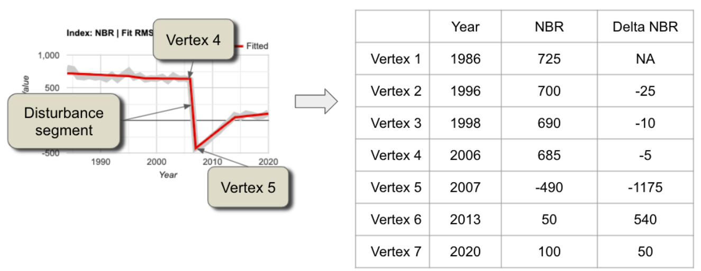

A partir de la tabla mostrada, podemos inferir varias cosas clave sobre este píxel:

- Probablemente fue perturbado entre 2006 y 2007. Esto se debe a que el valor NBR cae precipitadamente en el segmento delimitado por vértices (puntos de ruptura) en 2006 y 2007.
- La magnitud del cambio espectral fue grande: 1175 unidades NBR escaladas de un rango posible de 2000 unidades escaladas.
- Hubo pequeñas caídas en NBR anteriormente, lo que puede indicar alguna pérdida sutil de vegetación durante un largo periodo en el píxel. Estas caídas, sin embargo, tendrían que ser exploradas en un análisis separado debido a su naturaleza sutil.
- La principal perturbación tuvo una duración de sólo un año. Esta brusquedad, combinada con su gran magnitud, sugiere una perturbación vegetativa importante, como una tala o un incendio.
- Tras la perturbación, la vegetación se recuperó, pero no al nivel anterior a la perturbación. Nota: los ecólogos reconocerán la señal de crecimiento como una señal de sucesión, o revegetación activa por la intervención humana.

Siguiendo los tres pasos de post-procesamiento indicados en la introducción de esta sección, para cartografiar el año de la perturbación para este píxel identificaríamos primero los segmentos de perturbación potencial como aquellos con NBR negativo. A continuación, nos centraríamos en la perturbación de interés filtrando los segmentos de perturbación potencial que no sean abruptos y/o de pequeña magnitud. De este modo, sólo quedaría el segmento de gran magnitud y corta duración. Para ese segmento, el primer año en el que tenemos pruebas de perturbación es el primer año tras el inicio del segmento. El segmento comienza en 2006, lo que significa que 2007 es el primer año en el que tenemos pruebas de ello. Por tanto, asignaríamos 2007 a este píxel. 

Si quisiéramos mapear la magnitud de la perturbación, seguiríamos los mismos dos primeros pasos, pero luego informaríamos para el valor del píxel de la diferencia de magnitud entre el segmento inicial y el final. 

La GUI de LandTrendr proporciona un conjunto de herramientas para aplicar fácilmente las mismas reglas lógicas a todos los píxeles de interés y crear mapas. Haga clic en el menú "Change Filter Options":

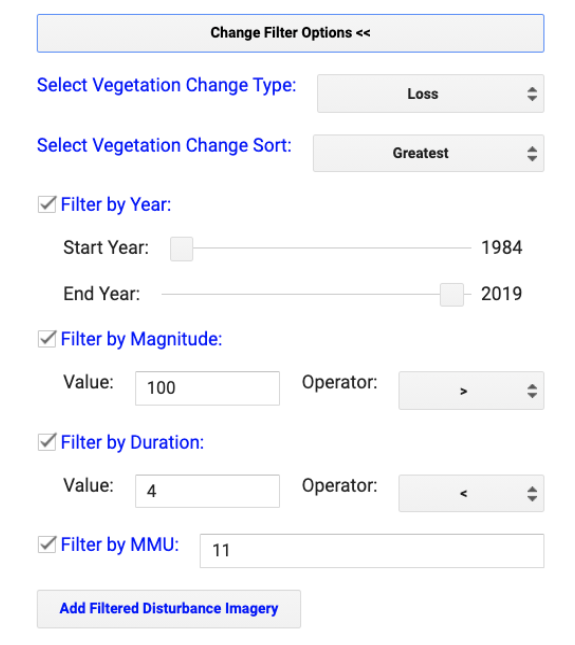

Las dos primeras secciones se utilizan para identificar los segmentos de interés.  

**Select Vegetation Change Type (Seleccionar Tipo de cambio de vegetación)** ofrece las opciones de ganancia o pérdida, que se refieren a la ganancia o pérdida de vegetación, asumiéndose que la perturbación está relacionada con la pérdida de vegetación. Nota: Los usuarios avanzados pueden buscar en la biblioteca landtrendr.js en la función "calcindex" para añadir nuevos índices con ganancia y pérdida definidos a su elección. El algoritmo subyacente está construido para encontrar perturbaciones en índices que aumentan cuando se producen perturbaciones, por lo que índices como NBR o NDVI necesitan ser multiplicados por (-1) antes de ser alimentados al algoritmo LandTrendr. Esto se realiza en la función *calcIndex*.

**Select Vegetation Change Sort (Seleccionar ordenación de cambios en la vegetación)** ofrece varias opciones que permiten elegir el segmento de interés en función del momento o la duración. Por defecto, se elige la perturbación de mayor magnitud.

Cada filtro (magnitud, duración, etc.) se utiliza para reducir aún más los posibles segmentos de interés. Todos los demás filtros se aplican a escala de píxel, pero el **Filtro por MMU** se aplica a grupos de píxeles basados en una determinada unidad mínima de mapeo (MMU). Una vez definidos todos los demás filtros, algunos píxeles se marcan como de interés y otros no. El filtro MMU busca cuántos píxeles conectados se han marcado como ocurridos en el mismo año, y omite los grupos más pequeños en número de píxeles que el indicado aquí (que por defecto es de 11 píxeles, o aproximadamente 1 hectárea).

Haga clic en **Add Filtered Disturbance Imagery (Añadir imágenes de perturbación filtradas)** para añadirlas al mapa:

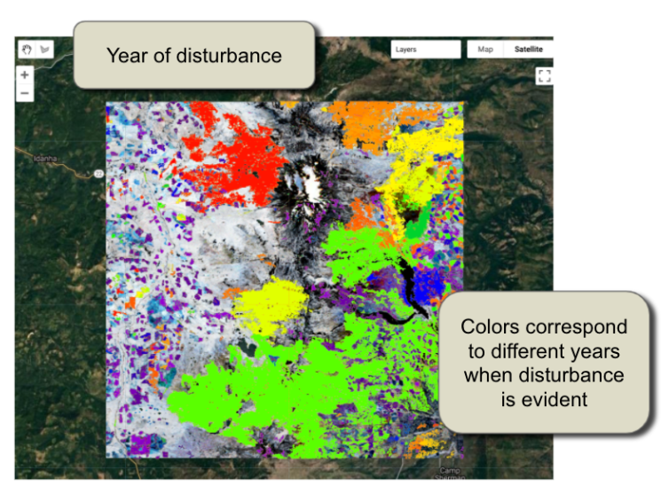

Hay varias capas de perturbación añadidas al mapa. Utilice las casillas de verificación de las capas del mapa para cambiar la que se muestra. La magnitud de la perturbación, por ejemplo, es un mapa del cambio delta entre los puntos inicial y final de los segmentos.

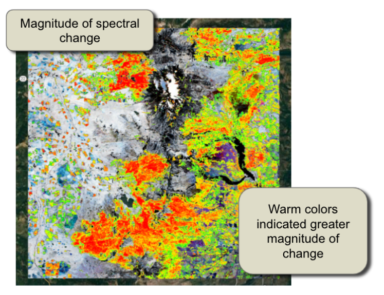

# Desafíos

## Desafío 1

Encuentre sus propios procesos de cambio de interés en la República Dominicana. En primer lugar, navegue por el mapa (haciendo zoom y arrastrando) hasta una zona de la RD que le interese un proceso de cambio y el índice espectral que lo capturaría. Asegúrese de que el panel de control de la interfaz de usuario está abierto en la sección **Pixel Time-Series Options**. A continuación, haga clic en el mapa en las zonas en las que sabe que se ha producido un cambio y observe las trayectorias espectrales en los gráficos. A continuación, describa si el cambio de interés es detectable en el registro de reflectancia espectral, y cuáles son sus características en las diferentes partes del área de estudio.

## Desafío 2

Encuentre un píxel en su área de interés que muestre un proceso de perturbación distintivo, tal y como usted lo defina para su tema de interés. Ajuste los intervalos de fechas, parámetros, etc. siguiendo los pasos descritos en la **Sección 1. Opciones de series temporales de píxeles** anterior, y luego responda a estas preguntas:

- Pregunta 1. ¿Qué índice y qué intervalo de fechas ha utilizado?
- Pregunta 2. ¿Ha tenido que cambiar los parámetros de ajuste para que el algoritmo encuentre la perturbación? En caso afirmativo, ¿cuáles y por qué?
- Pregunta 3. ¿Cómo sabes que se trata de una perturbación? ¿Cómo sabes que se trata de una perturbación?

## Desafío 3

Cambie el panel de control de la interfaz gráfica de usuario a **Change Filter Options**, y utilice la guía de la **Sección 3. Traducir píxeles en mapas** anterior para ajustar los parámetros y hacer mapas de perturbación.  

- Pregunta 4. ¿Coinciden el año y la magnitud de la perturbación que aparecen en la imagen con lo que cabría esperar de la propia trayectoria? 
- Pregunta 5. ¿Puede cambiar algunos de los filtros para crear un mapa en el que no aparezca su proceso de perturbación? En caso afirmativo, ¿qué has cambiado?  
- Pregunta 6. ¿Puede cambiar los filtros para crear un mapa que incluya un proceso de perturbación diferente, quizás más sutil, de mayor duración, etc.? Busque un píxel y utilice el trazador "Series temporales de píxeles" para ver las series temporales de esos procesos.