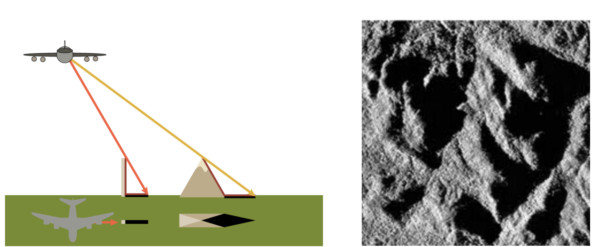
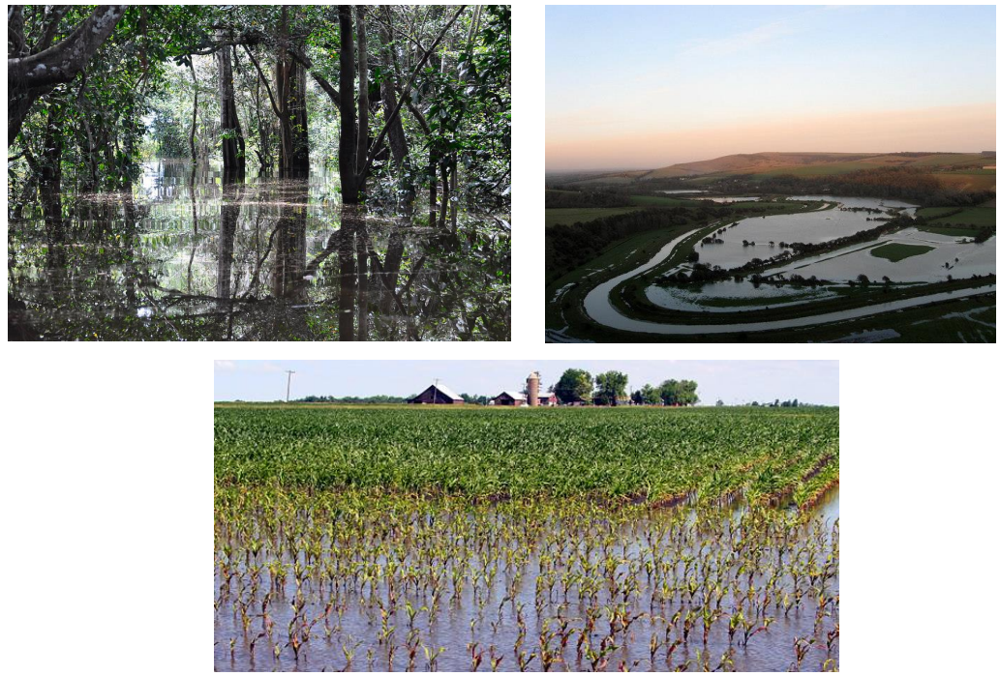
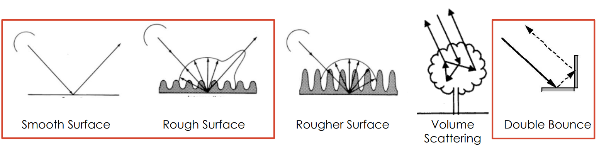
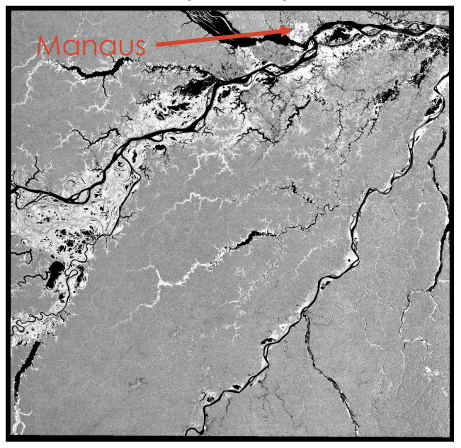
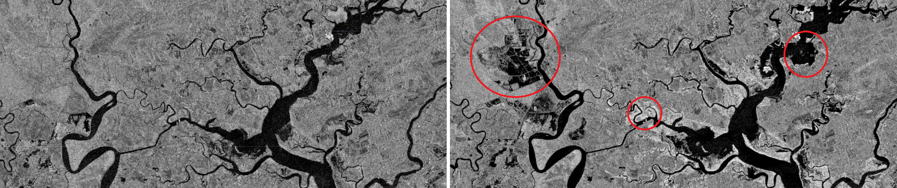
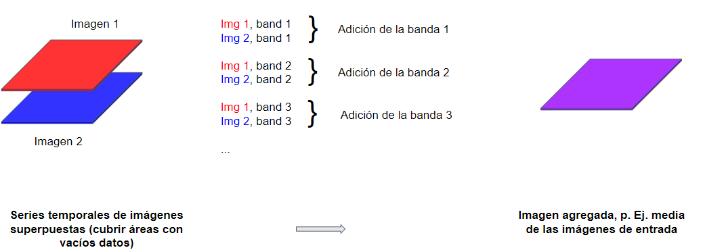
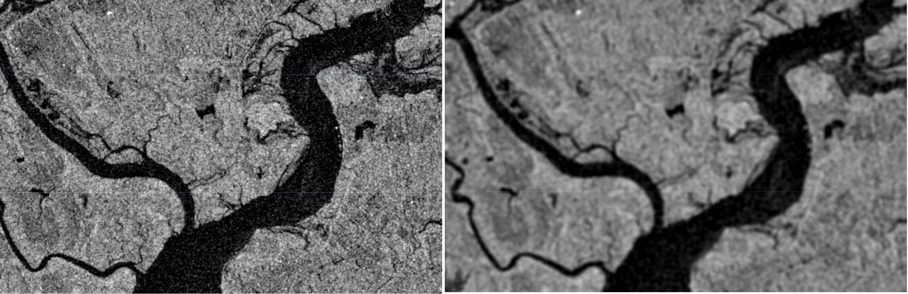

# Teoría de Radar

## ¿Qué es el RADAR?

A modo de recapitulación, la teledetección es el proceso de obtener información sobre un objeto o una zona sin estar directamente en contacto con ese objeto. Los sensores aprovechan la radiación electromagnética reflejada o emitida por la superficie terrestre para controlar y cartografiar los cambios que se producen en ella a lo largo del tiempo. Hasta ahora, hemos trabajado con datos de teledetección que utilizan energía en la porción visible e infrarroja del espectro electromagnético. El RADAR, acrónimo de Radio Detection and Ranging (detección y medición de distancias por radio), utiliza energía de microondas. Estas longitudes de onda más largas proporcionan a los datos de radar una serie de ventajas sobre los datos de teledetección óptica que exploraremos a lo largo de esta sección.

### Pros y contras del radar

Empecemos por lo positivo: ¿qué puede conseguir el radar que no consiga la teledetección óptica?

1. **"Vigilancia" todo tiempo**. Las microondas pueden penetrar a través de la nubosidad, la niebla y el humo, lo que convierte a los radares en una fuente de imágenes más fiable y constante en cualquier lugar. En la mayor parte del planeta hay al menos un 50% de nubes al año, por lo que esta mayor capacidad de vigilancia es de gran ayuda. Esta ventaja también brinda la oportunidad de mejorar la gestión de catástrofes e incendios forestales.
2. **Vigilancia diurna o nocturna.**. El radar no depende de la energía del sol para realizar sus mediciones, por lo que las imágenes pueden captarse durante el día o la noche.
3. **Penetración de la vegetación y el suelo.** Las microondas también pueden penetrar a través de la vegetación densa y el suelo, lo que permite a los sensores captar características de la Tierra que los sensores ópticos no pueden.
4. **Efectos atmosféricos mínimos**. ¿Recuerdas los numerosos niveles de procesamiento por los que deben pasar los datos de teledetección óptica antes de poder ser utilizados?** Los datos del radar también deben ser preprocesados, pero sus longitudes de onda más largas no se ven afectadas por las mismas condiciones atmosféricas que pueden hacer que las imágenes ópticas aparezcan brumosas o distorsionadas.
5. **Sensibilidad dieléctrica y estructural.** Los datos de radar pueden captar las propiedades dieléctricas y estructurales de un objeto, lo que puede facilitar la distinción entre agua líquida y congelada, por ejemplo.


<font size=2> Imágenes ópticas (izquierda) frente a imágenes de radar (derecha) del volcán Kliuchevskoi en erupción. Fuente: Michigan Tech Volcanology. </font>

Estas ventajas son muy poderosas, aunque siempre hay múltiples aspectos a tener en cuenta a la hora de seleccionar el tipo correcto de datos para su proyecto de investigación. Examinemos algunos de los contras de los datos de radar.

1. **Desafío a la interpretación**. A diferencia de las imágenes ópticas, que la mayoría de la gente puede interpretar intuitivamente, ya que su aspecto es muy similar al de una fotografía tomada con el teléfono móvil, las imágenes de radar no son tan fáciles de entender inmediatamente. Contienen información sobre energía fuera del espectro de luz visible, por lo que a menudo se requiere más formación para que un usuario entienda lo que está viendo en una imagen de radar.
2. **Moteado/Salpicado**. Las imágenes de radar suelen aparecer más granuladas que las imágenes ópticas.
3. **Efectos topográficos**. La topografía afecta más a las imágenes radar que a las ópticas, ya que el terreno puede reflejar la energía que miden los radares y distorsionar la imagen.

Dadas estas ventajas y desventajas, entendamos por qué existen en primer lugar. La principal causa de estas diferencias es la forma en que se recogen los datos.

## Recogida de datos

### Mediciones pasivas frente a activas

Este concepto debería resultarle familiar, ya que lo tratamos brevemente en la lección Introducción a la teledetección. Sin embargo, se trata de una diferencia clave, por lo que aquí la trataremos con mayor profundidad.

Los sensores ópticos se denominan sensores pasivos porque dependen únicamente de la energía de una fuente externa (por ejemplo, el sol) para capturar sus medidas. Esta dependencia de fuentes de energía externas limita a estos sensores por los efectos de la atmósfera. La energía que simplemente se refleja en la superficie de la Tierra no puede penetrar elementos como la nubosidad o la niebla y, por tanto, dificulta la recopilación de datos de forma consistente en zonas que experimentan este tipo de condiciones meteorológicas con frecuencia.


<font size=2> Esquema de la teledetección pasiva. Fuente: Programa de formación en teledetección aplicada de la NASA. </font>

El radar es una forma de teledetección activa. Estos sensores proporcionan su propia fuente artificial de energía para iluminar la superficie terrestre, que puede atravesar las nubes, la vegetación e incluso el suelo dependiendo del tipo de señal que envíen. Los radares miden la energía reflejada por su propia señal para generar una imagen de la superficie terrestre.

Los radares de formación de imágenes son laterales, lo que significa que transmiten energía en un ángulo de 90 grados para diferenciar entre dos objetos sobre el terreno. Al transmitir la energía en ángulo, permite que la energía rebote en los objetos del suelo y llegue al radar en momentos diferentes, de modo que se puedan distinguir los dos objetos.


<font size=2> Radar de barrido lateral. Fuente: Side looking airborne radar, Charly Whisky. </font>

### ¿Qué miden los radares?

**Componentes de un radar**. Hay cuatro partes principales en un sistema de radar que le permiten recopilar información:

1. **Transmisor**. Este dispositivo emite breves ráfagas de energía de microondas a intervalos regulares. (¡La parte "activa" de la teledetección activa!)
2. **Antenas.** Las antenas concentran la serie de impulsos del radar en un haz que ilumina la superficie en ángulo recto con el movimiento de la plataforma.
3. **Receptor**. La antena recibe la energía reflejada o retrodispersada de la superficie terrestre. El momento en que la energía es recibida por la antena permite al sistema localizar el objeto en el que se refleja.
4. **Sistema de procesamiento electrónico**. Este sistema procesa la señal retrodispersada para generar una imagen.

Además del momento en que se recibe la señal, que se denomina fase (un punto en el tiempo en la posición de la forma de onda) de la señal, los radares también miden la amplitud (fuerza) de la señal reflejada. La amplitud se denomina *coeficiente de retrodispersión*, o $\sigma_{0}$, y se expresa como la fracción de la energía que se retrodispersa al radar por unidad de superficie del blanco. El valor se mide en decibelios (dB) y puede oscilar entre -25 dB (muy poca energía reflejada) y 1 dB (gran cantidad de energía reflejada).

### ¿Qué es el SAR?
Los radares poseen dos tipos de resolución: (1) **La resolución de alcance (a través de la trayectoria)** define la capacidad del radar para distinguir entre dos blancos perpendiculares a la trayectoria del sensor que están próximos en alcance. Este tipo de resolución se determina por la longitud del pulso enviado por el transmisor. (2) **Resolución azimutal (a lo largo de la trayectoria)** define la capacidad del radar para distinguir entre dos objetos paralelos a la trayectoria del sensor que están próximos entre sí. Esta resolución viene determinada por la longitud del haz, que es inversamente proporcional a la longitud de las antenas, o apertura. 


<font size=2> Resolución SAR. Fuente: MathWorks. </font>

Por tanto, una antena más larga produce un haz más estrecho y, por tanto, una resolución más fina. Sin embargo, enviar antenas extremadamente largas al espacio es muy poco realista. En su lugar, los científicos aprovecharon el desplazamiento Doppler asociado al movimiento del avión para simular una antena muy larga. Esta simulación crea una "apertura sintética". El radar de apertura sintética, o SAR, es capaz de generar imágenes de mayor resolución en comparación con la longitud real de las antenas.

### Elegir el tipo de radar adecuado

Hay un montón de características diferentes que distinguen a unos sensores de otros, pero los tres factores más comunes a tener en cuenta se enumeran a continuación.

**Longitud de onda.** La longitud de onda determina realmente cómo interactuará el haz con la superficie de la Tierra y, por tanto, qué tipo de información se puede obtener de la imagen. El aspecto más significativo que afecta es la distancia a la que el haz puede penetrar en la superficie. Las longitudes de onda más largas pueden penetrar más eficazmente a través de la cubierta forestal o el suelo. La siguiente tabla muestra las diferentes bandas de longitud de onda utilizadas, el nombre de cada una y algunas aplicaciones comunes. Obsérvese que los nombres de las bandas de longitud de onda son algo aleatorios y difíciles de entender, ¡a propósito! Durante mucho tiempo, los datos de radar sólo los utilizaban los militares, por lo que seleccionaron los nombres de las bandas para que nadie pudiera averiguar qué representaba cada una de ellas. 

| Banda | Longitud de onda (cm) |                    Aplicación                   |
|:-----:|:---------------------:|:-----------------------------------------------:|
| Ka    | 0,8 a 1,1             | datos de alta   resolución                      |
| K     | 1,1 a 1,7             |                                                 |
| Ku    | 1,7 a 2,4             | glaciología,   cartografía de la capa de nieve  |
| X     | 2,4 a 3,8             | agricultura,   océano, datos de alta resolución |
| C     | 3,8 a 7,5             | océano,   agricultura                           |
| S     | 7,5 a 15,0            |                                                 |
| L     | 15,0 a 30,0           | agricultura,   silvicultura, humedad del suelo  |
| P     | 30,0 a 100,0          | biomasa, humedad del suelo, penetración         |


<font size=2> Penetración superficial en función de la longitud de onda. Fuente: SAR 101: Introducción al radar de apertura sintética, Daniel Hogan. </font>

**Polarización**. Las señales de radar están polarizadas y suelen denominarse **horizontal (H)** o **vertical (V)**. Estas polarizaciones afectan a la forma en que se transmite y recibe la señal y a las propiedades físicas de un objeto que se detecta. Existen cuatro combinaciones de polarización típicas:

* HH: transmisión horizontal, recepción horizontal
* VV: transmisión vertical, recepción vertical
* HV: transmisión horizontal, recepción vertical
* VH: transmisión vertical, recepción horizontal

**Ángulo de incidencia.** El último factor a considerar es el ángulo de incidencia, &theta;, que es el ángulo entre la dirección del haz del radar y el plano perpendicular a la superficie de la Tierra.


<font size=2> Ángulo de incidencia. Fuente: Programa de formación en teledetección aplicada de la NASA. </font>

Cuanto mayor sea el ángulo de incidencia, mayor será la sensibilidad a la rugosidad de la superficie. Estos haces podrán penetrar menos profundamente que los haces que tienen ángulos de incidencia más pequeños, y también darán lugar a niveles más bajos de retrodispersión.

**Efectos topográficos**

Ejemplo abajo de como la geometría de radar puede afectar la imagen. Es necesario un procesamiento para corrigir estos efectos.



<font size=2> Fuente: ARSET. </font>

### Efectos de la superficie

Todos los factores que hemos comentado anteriormente son propiedades del radar que afectarán a la retrodispersión recibida por el radar. También hay propiedades de la superficie que afectan a la retrodispersión. La combinación de estos efectos repercute en los datos que recoge el sensor y, por lo tanto, los datos proporcionan información sobre los dos parámetros siguientes de la superficie.

**Rugosidad de la superficie.** La rugosidad de la superficie se define como las variaciones medias de altura de la cubierta superficial del orden de centímetros. Este factor es el que más influye en los tonos de una imagen de radar y en el nivel de retrodispersión. Las superficies lisas, o aquellas en las que las variaciones de altura son mucho menores que la longitud de onda del radar, aparecen más oscuras en las imágenes de radar, mientras que las superficies rugosas aparecen más claras. Esta diferencia se debe al tipo de **mecanismo de retrodispersión** que desencadena el tipo de superficie. Existen cuatro tipos principales de retrodispersión:

1. **Retrodispersión especular**. Las superficies lisas tienden a reflejar toda la energía lejos del radar. Estas zonas aparecen muy oscuras en las imágenes de radar. Ej: aguas abiertas
2. **Retrodispersión difusa**. Las superficies rugosas, en las que el nivel de rugosidad se aproxima a la longitud de la microonda, empiezan a reflejar parte de la energía hacia el radar. Estas zonas aparecen algo más brillantes. Ej: zonas rocosas abiertas, praderas.
3. **Retrodispersión de doble rebote**. Este tipo de reflexión se produce cuando la energía rebota en una superficie más lisa y luego rebota de nuevo en un objeto vertical cercano, de modo que la mayor parte de la energía se dispersa de vuelta al radar. Estas zonas aparecen muy brillantes. Ej: zonas urbanas, inundaciones
4. **Dispersión de volumen**. Este tipo de dispersión se produce dentro de un volumen o medio. La energía rebota en una serie de elementos diferentes dentro del medio para causar grandes cantidades de dispersión, parte de la cual vuelve al radar. El brillo puede variar, pero suele ser moderadamente brillante. Ej: manto de nieve, bosques.


<font size=2> Mecanismos de retrodispersión. Fuente: Advantages and Applications of Synthetic Aperture Radar as a Decision Support Tool, Molthan et al., NASA. </font>


**Propiedades dieléctricas**. Las propiedades dieléctricas de un material tienen un gran efecto en la capacidad de la superficie para absorber o reflejar microondas, hasta el punto de que la magnitud de la retrodispersión es proporcional a la constante dieléctrica de la superficie. El agua líquida tiene una constante dieléctrica mucho mayor que otros materiales, incluida el agua congelada (una constante dieléctrica de 80 frente a un rango de 0-10), por lo que la presencia o ausencia de agua define las propiedades dieléctricas de una superficie. En la mayoría de los casos, las superficies con constantes dieléctricas altas tienen una reflectividad más alta y, por lo tanto, parecen más brillantes que las que tienen constantes dieléctricas más bajas.

## Instrumentos de radar

| Sistema de   radar | Banda | Longitud de onda (cm) | Resolución espacial (m) | Resolución temporal (days) |               Marco temporal               | Proveedor |
|:------------------:|:-----:|:---------------------:|:-----------------------:|:--------------------------:|:------------------------------------------:|:---------:|
| BIOMASS            |   P   |         ~69,0         |                         |              3             |                 Launch 2024                |    ESA    |
| ALOS-2   PALSAR-2  |   L   |         ~23,5         |           3-10          |             14             |               2014 - present               |    JAXA   |
| NISAR-L            |   L   |         ~23,5         |           3-10          |             12             |                 Launch 2024                | NASA/ISRO |
| NISAR-S            |   S   |          ~9,4         |           3-10          |             12             |                 Launch 2024                | NASA/ISRO |
| Sentinel-1         |   C   |          ~5,6         |          25-800         |              6             | 2014 - present   (1A), 2016 - present (1B) |    ESA    |
| Radarsat-2         |   C   |          ~5,6         |          3-100          |              1             |               2007 - present               |    CSA    |
| TerraSAR-X         |   X   |          ~3,1         |           1-5           |         11-22 days         |               2007 - present               |  ADS/DLR  |

# Paso-a-paso: Clasificación de inundaciones utilizando Sentinel-1

Este contenido fue adaptado de ARSET: [SAR for Disasters and Hydrological Applications](https://appliedsciences.nasa.gov/join-mission/training/english/arset-sar-disasters-and-hydrological-applications) y [Evaluación de Desastres Usando Radar de Apertura Sintética](https://appliedsciences.nasa.gov/join-mission/training/spanish/arset-evaluacion-de-desastres-usando-radar-de-apertura-sintetica).

## Definición de inundación desde la perspectiva del radar

La presencia de una agua:

- Bajo una cubierta de vegetación (vegetación alta o baja)
- Sin vegetación (denominada aguas abiertas)



La señal de SAR frente una inundación se da por:

- Retrodispersión especular
- Retrodispersión difusa
- Retrodispersión de doble rebote



En una imagen SAR, inundaciones de agua abierta terá un color más oscura mientras inundación de vegetación terá un color más brillante. Ejemplo de imagen PALSAR (banda L) de Manaus, Amazonas, Brasil:



Nota que una fuente de confusión en la imagen es la ciudad de Manaus que también se mostra muy brillante.

## Estudio de caso

Vamos analizar un script the clasificación de inundaciones causado por evento climatico extremo: el Huracán Matthew en la Carolina del Sur (Estados Unidos).

El huracán ocurrió los **días 7 y 8 de octubre de 2016** y fue la tormenta más poderosa de la
temporada de huracanes en el Atlántico. Tocó tierra por cuarta y última vez cerca de McClellanville, Carolina del Sur, como un huracán de categoría 1 en la mañana del 8 de octubre.

El paso-a-paso de la clasificación será:

1. Cargar las imágenes a clasificar (una antes del evento y otra despues del evento)
2. Recopilar los datos de entrenamiento:
    - Recoger datos de entrenamiento para enseñar al clasificador
    - Recoger muestras representativas de retrodispersión para cada clase de cubierta terrestre de interés
3. Crear el conjunto de datos de entrenamiento:
    - Superponer las áreas de entrenamiento sobre las imágenes de interés
    - Extraer la retrodispersión de esas áreas
4. Entrenar el clasificador y ejecutar la clasificación

### Identificar área de interés

Empeze un nuevo script.

1. Seleccione el icono de dibujar una línea en la parte superior izquierda
2. Dibuja tu área de interés
3. En `Geometry Imports` en la parte superior izquierda, seleccione geometría y cámbiele el nombre a `area`

### Cargar las imágenes a clasificar

Utilizaremos imágenes antes y despues del evento, entonces filtraremos las colección por fechas y por ubicación, utilizando la `area` definida. Agregaremos las imágenes al mapa.

```javascript
// Carga Sentinel-1 banda C SAR Ground Range recogida (escala logarítmica, VV, ascendente).
var coleccion = ee.ImageCollection('COPERNICUS/S1_GRD')
    .filter(ee.Filter.eq('instrumentMode', 'IW'))
    .filter(ee.Filter.eq('orbitProperties_pass', 'ASCENDING'))
    .filterMetadata('resolution_meters', 'equals' , 10)
    .filterBounds(area)
    .select('VV', 'VH');
  
// Filtrar por fechas.
var antes = coleccion.filterDate('2016-10-04', '2016-10-05').mosaic().clip(area);
var despues = coleccion.filterDate('2016-10-16', '2016-10-17').mosaic().clip(area);

// Definir parámetros de visualización.
var paramsVis = {bands: ['VV'], min: -20, max: 0};

// Mostrar en el mapa.
Map.centerObject(area, 9);
Map.addLayer(antes, paramsVis, 'Antes de la inundación');
Map.addLayer(despues, paramsVis, 'Despues de la inundación');
```

Vemos inundaciones de aguas abiertas (colores oscuros) y de vegetaciones (colores blancos) en la imágen despues del evento.



Nota que estamos utilizando la función `mosaic()` para crear un mosaico. Esta función funciona diferentemente de como um `ee.Reducer` funciona:




### Filtro de moteado

En la parte de teoría, las imágenes de radar suelen aparecer más granuladas que las imágenes ópticas. Por eso, aplicaremos un filtro de moteado para suavizar/alisar las imágenes. Utilizaremos la función `focal_mean()` que es una operación morfológica (ejemplo: operaciones focales), que puede introducir los píxeles en un núcleo (kernel) a cualquier reductor con una salida numérica. Utilizaremos un núcleo circular de 50 metros para suavizar las imágenes.

```javascript
// Aplicar filtro para reducir el moteado.
var radioAlisamiento = 50;
var antesAlisado = antes.focal_mean(radioAlisamiento, 'circle', 'meters');
var despuesAlisado = despues.focal_mean(radioAlisamiento, 'circle', 'meters');

// Mostrar imágenes alisadas en el mapa.
Map.addLayer(antesAlisado, paramsVis, 'Antes Alisado');
Map.addLayer(despuesAlisado, paramsVis, 'Despues Alisado');
```



<font size=2> Imagen de antes del evento antes y despues del filtro de moteado. </font>

### Selección de datos de entrenamiento

1. El primer paso para realizar una clasificación supervisada es recopilar datos de entrenamiento para "entrenar" al clasificador
    - Esto implica recoger muestras representativas de retrodispersión para cada clase de cubierta terrestre de interés
2. Visualice la imagen después de VV y vaya a la casilla `Geometry Imports` (Importación de geometría) junto a las herramientas de dibujo de geometría y haga clic en + new layer (nueva capa).
3. Al lado seleccione el icono dibujar un polígono
4. Cada nueva capa representa una clase dentro de los datos de entrenamiento, por ejemplo
`aguaPermanente`
5. Definir la primera nueva capa como `aguaPermanente`
6. Localice en la nueva capa las zonas de ríos y lagos y haga clic para recogerlas
7. Recoja una muestra representativa de polígonos y renombre la geometría como
`aguaPermanente`
8. Configure la importación de la geometría `aguaPermanente` (rueda dentada, parte superior del script en la sección de importaciones)
9. Haga clic en el icono de la rueda dentada para configurarlo, cambie Importar como de `Geometry` a `FeatureCollection`
10. Utilice `Add property` 'clase' y establezca su valora 1. (Las clases siguientes serán 2, 3, 4, etc.) Cuando haya terminado, haga clic en OK.

### Fusionar las clases definidas y concatenar imágenes

Hemos identificado seis clases. El siguiente paso es fusionarlas en una única colección, denominada `datosRef`. También concatenaremos las imágenes (de antes y despues del evento), definindo las bandas de interés para el clasificador.

```javascript
// Fusionar FeatureCollections.
var datosRef = aguaPermanente.merge(aguaInundacion).merge(vegetacionInundacion).merge(urbano).merge(canalDeInundacion).merge(vegetacionBaja);

// Concatenar las imágenes.
var final = ee.Image.cat(antesAlisado, despuesAlisado);

// Define las bandas que se utilizarán para entrenar tus datos.
var bandas = ['VV', 'VH', 'VV_1', 'VH_1'];
```

Nota que despues de concatenadas, las bandas de la imagen `despuesAlisado` se renonbran `VV_1` y `VH_1`.

### Entrenamiento y clasificación

Ahora podemos entrenar el modelo, despues de extrair puntos de entrenamiento, y realizar la clasificación. El modelo toma en cuenta tanto los datos de retrodispersión de la imágen antes del evento como datos de despues del evento.

```javascript
// Crear muestra de entrenamiento.
var entrenamiento = final.select(bandas).sampleRegions({
  collection: datosRef,
  properties: ['clase'],
  scale: 30 });
  
// Entrenar el modelo.
var classifier = ee.Classifier.smileRandomForest(65).train({
  features: entrenamiento,
  classProperty: 'clase',
  inputProperties: bandas
});

// Hacer la clasificación.
var clasificacion = final.select(bandas).classify(classifier);

// Mostrar la imagen clasificada en el mapa.
Map.addLayer(clasificacion, 
{min: 1, max: 6, palette: ['112eff', '53ffe7', 'ff4ae9', 'f6ef0c', '68e818', '1c9235']},
'Clasificación');
```

¿ Qué les parece la clasificación?

### Agregando datos adicionales

Podemos agregar datos de población y carreteras para analizar impactos urbanos. 

```javascript
// Añadir capa de población.
var poblacion = ee.ImageCollection('CIESIN/GPWv4/population-density');
var densidadePoblacion = poblacion.select('population-density');
var visPob = {
  min: 200.0,
  max: 1500.0,
  palette: ['ffffff', 'ffcdc6', 'ff0000', '950000'],
};

Map.addLayer(densidadePoblacion, visPob, 'Densidade de Población');

// Añadir capa de carreteras.
var carreteras = ee.FeatureCollection('TIGER/2016/Roads');
var carreteras = carreteras.style({color: '#4285F4', width: 1});
Map.addLayer(carreteras, {}, 'TIGER/2016/Roads');
```

¿Las inundaciones se produjeron en zonas de alta densidad de población? ¿Ha afectado el suceso a las infraestructuras?

### Código completo

Script "`2 Clasificación Inundación - Sentinel-1`" del repositorio y carpeta `T4` o link directo:
[https://code.earthengine.google.com/e83ec21c016ce54e3e88f8136d06f487](https://code.earthengine.google.com/e83ec21c016ce54e3e88f8136d06f487).

## Desafío (Ejercício práctico)

Adaptar el script para la República Dominicana.

**Desafío 1**: Refinar la estratificación del mapa: ¿se le ocurren otras clases de mapas que serían útiles en lugar de la que se proporciona? Las clases pueden no ser las mismas en la República Dominicana.

**Desafío 2**: Dedicar un poco más de tiempo a recopilar más polígonos de referencia.

**Desafío 3**: Dividir datos de referencia para entrenamiento y prueba. Calcular las precisiones del modelo.

**Desafío 4**: Utilizando su clasificador entrenado, clasifique varias observaciones SAR en sucesión durante un corto período de tiempo en un área con la que esté familiarizado. Vea si puede visualizar un patrón en aguas abiertas o vegetación inundada.

*Consejo*: ¿Recuerdas `.map()`? Este sería un gran uso para él. El último bloque de código podría convertirse fácilmente en una función con la que mapear sobre otra colección SAR S1.

**Ejemplo República Dominicana hecho durante el taller**: Script "`2 Clasificación Inundación - Sentinel-1 - RD`" del repositorio y carpeta `T4` o link directo:
[https://code.earthengine.google.com/cd38db354ce41eb369359c91e41328bc](https://code.earthengine.google.com/cd38db354ce41eb369359c91e41328bc).