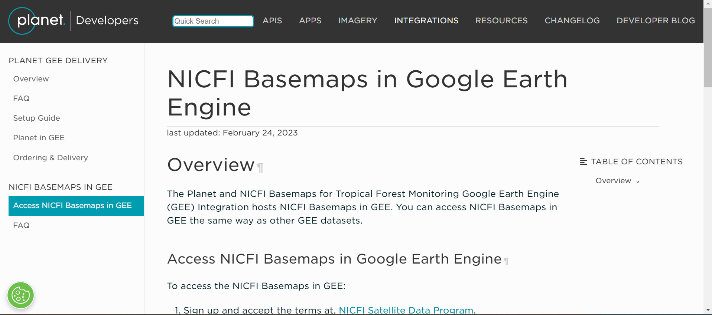
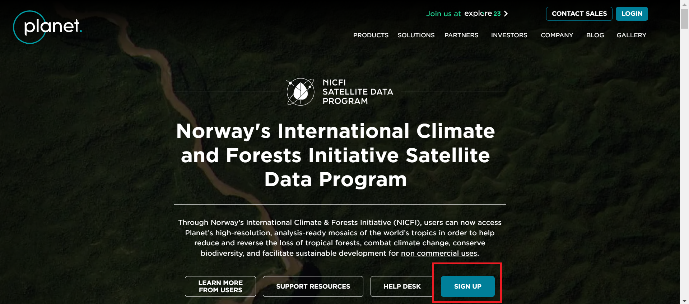
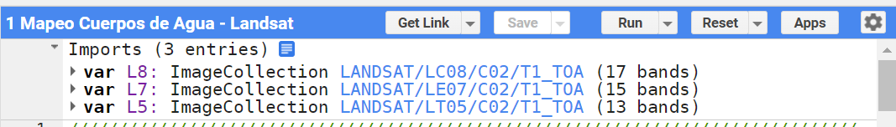

# Introducción

¡Bienvenido a Mapeo de Inundaciones usando imágenes satelitales! Este taller contiene varios casos prácticos de Google Earth Engine. Cubriremos el uso de índices espectrales para la extracción de agua superficial y un flujo de trabajo de clasificación de cobertura de suelo inundado.

## Configuración prévia

1. Crear una [cuenta de Google Earth Engine](https://code.earthengine.google.com/register). Necesitas una [cuenta Google](https://accounts.google.com/signup). Crear una cuenta GEE para fines no comerciales.
2. Haga clic en este enlace para aceptar el repositorio de GEE de la Republica Dominicana: [https://code.earthengine.google.com/?accept_repo=users/an-sig/republica-dominicana](https://code.earthengine.google.com/?accept_repo=users/an-sig/republica-dominicana). Una vez en esta página, verás este repositório bajo `Reader` en la pestaña `Scripts` de GEE.
3. Cree un nuevo script en su propio repositorio; asígnele el nombre que desee. Esta será su copia del script 'Clasificación de manglares' del repositorio de scripts arriba.
4. Opcional: Agregar imágenes Planet NICFI al GEE. Seguir los pasos de: [https://developers.planet.com/docs/integrations/gee/nicfi/](https://developers.planet.com/docs/integrations/gee/nicfi/)

    

    1. Hacer un clic en el link "[NICFI Satellite Data Program](https://planet.com/nicfi)" en punto 1.
    2. Verás la página de Norway's International Climate and Forests Initiative Satellite Data Program (NICFI). Crear una cuenta hacendo un clic en "Sign Up".
    
    

    3. Poner sus informaciones.
        1. Escribir su correo electrónico (preferencialmente que utilizas en Google Earth Engine) en "Email Address".
        2. Para "What would you be using the data for?" puedes elegir "LULC" (coberturas y usos de la tierra).
        3. Para "Can you describe the application of data from NICFI program in a brief?" puedes escribir "Use during a SERVIR capacity building workshop about Google Earth Engine and Earth Observations".
        4. Para "Please provide a link to your organization/lab/university that you might be working with:" ponga el sitio web de su instituición.
        5. Seleccione el tipo de su instituición en "Organization Type" (e.g. Education and Research).
        6. Seleccionar el box "By submitting this form with my contact information, I agree the information may be used to receive occasional communications from Planet about its products and services. I may unsubscribe at anytime."
        7. Hacer un click en "Submit" al final.
        
    4. Una vez creada su cuenta, haga su login en [https://www.planet.com/](https://www.planet.com/).
    5. En "[Account Settings](https://planet.com/account#/user-settings)", en la parte de "Access NICFI Data in Google Earth Engine", haga un clic en "Add to Earth Engine."
    6. En el cuadro de diálogo EE Image Collection, ingrese el correo electrónico asociado con su cuenta GEE.
    7. Seleccione los mapas bases de interés (todos).
    
    8. Haga la prueba correndo este código: [https://code.earthengine.google.com/?scriptPath=Examples%3ADatasets%2Fprojects_planet-nicfi_assets_basemaps_americas](https://code.earthengine.google.com/?scriptPath=Examples%3ADatasets%2Fprojects_planet-nicfi_assets_basemaps_americas).

## Objetivos

1. Comprender el proceso general para filtrar colecciones de imágenes, crear compuestos e índices y entrenar un modelo de clasificación utilizando los datos recopilados.
2. Comprender el proceso general para entrenar y aplicar un modelo en Google Earth Engine sobre datos satelitales
3. Adapte el flujo de trabajo proporcionado para un área de interés y un período de tiempo diferentes
4. Experimente con diferentes formas de mejorar la precisión de su clasificación

Contenido próximamente...