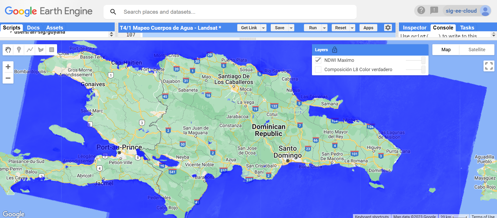
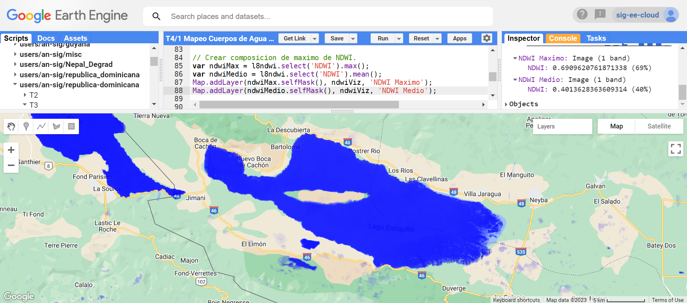
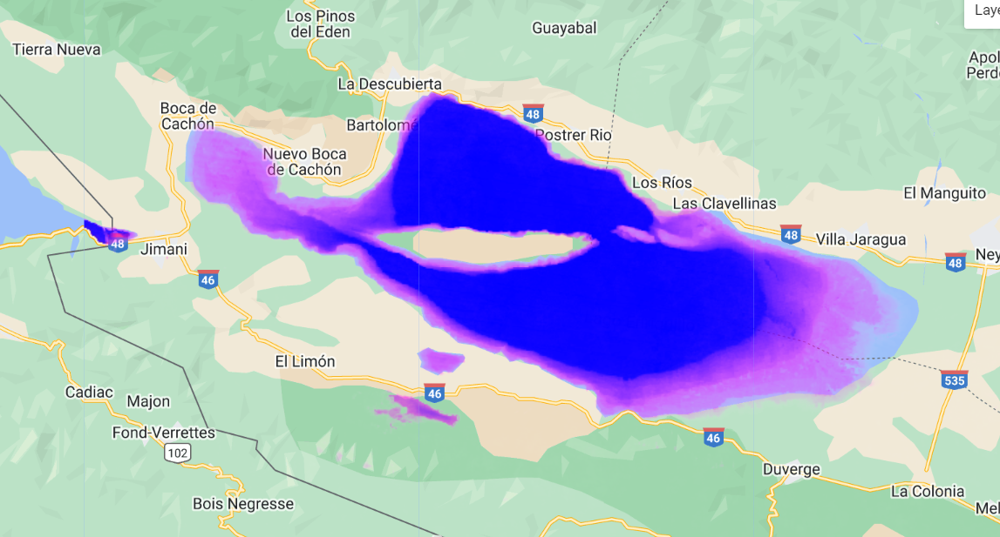

# Resumen

En este estudio de caso usted desarrollará un script que mapea áreas inundadas por agua para diferentes años basados en Landsat 5, 7 y 8.

Esta sesión de capacitación fue adaptada de [SERVIR Mekong Case Study 2 - Surface Water Mapping](https://docs.google.com/document/d/1uyFCMNi1mhiMvwEwFiqOflyUL__uKb7jwwsSLES3hQo/edit)

# Teoría

Las mediciones de alta resolución de la distribución y dinámica del agua superficial son esenciales para muchas aplicaciones medioambientales, como la previsión y alerta de inundaciones, la gestión del agua agrícola y urbana y la simulación del transporte de contaminantes en masas de agua. El agua puede detectarse mediante imágenes de satélite multiespectrales, ya que el agua absorbe significativamente la mayor parte de la radiación en longitudes de onda del infrarrojo cercano (NIR) y superiores. El índice de diferencia normalizada del agua (NDWI) es un índice espectral simple que utiliza la fuerte absorción del agua en el NIR para identificar masas de agua. 

# Paso-a-paso: Mapeo de Cuerpos de Agua

## Importar datos Landsat

Primero, crea un nuevo script en tu repositorio de scripts.

Abra el script e importe la reflectancia Landsat 5, 7 y 8 Top of Atmosphere (TOA) `ImageCollections`. En la barra de **Búsqueda** de la parte superior, escribe 'Landsat TOA', encontrarás múltiples conjuntos de datos.


Haga clic en "USGS Landsat 8 Collection 2 Tier 1 TOA Reflectance" y, en el cuadro de diálogo emergente, haga clic en "Import".


Nombre la `ImageCollection` importada `L8`. Ahora haga lo mismo para las `ImageCollections` Landsat 7 TOA, y Landsat 5 TOA, nombrándolas `L7` y `L5` respectivamente.


En tu script, establece las fechas de inicio y fin sobre las que filtraremos las `ImageCollections`.

```javascript
// Fecha de inicio y fin del filtro.
var fechaInicio = ee.Date('2015-01-01');
var fechaFin = ee.Date('2016-12-31');
```

Sólo queremos centrarnos en nuestro país. Por lo tanto, utilizamos la propiedad 'ADM0_NAME' para filtrar el conjunto de datos de la FAO GAUL Administrative Boundary `FeatureCollection`.

```javascript
// Derivar un Área de Interés.
var nombrePais = 'Dominican Republic';

var paises = ee.FeatureCollection("FAO/GAUL/2015/level0");
var area = paises.filter(
  ee.Filter.eq('ADM0_NAME', nombrePais));
```

Seleccionar imágenes Landsat 8 dentro del rango de tiempo y región especificados. Imprime el tamaño de la `ImageCollection` filtrada resultante.

```javascript
// Filtrar la colección de imágenes L8.
var imagenesL8 = L8.filterDate(fechaInicio, fechaFin)
    .filterBounds(area);
    
print('Número de imágenes Landsat 8 del filtro', imagenesL8.size());   
```

Haz una función para enmascarar las nubes (ajusta el umbral si es necesario).

```javascript
// Umbral de puntuación de nubes.
var umbralNubes = 20;

// Función de máscara de nube.
var funcionNubes = function(image){
  var puntaje = ee.Algorithms.Landsat.simpleCloudScore(image).select('cloud');
  var nuboso = puntaje.gt(umbralNubes);
  var mascara = nuboso.not();
  return image.updateMask(mascara);
};
```

Opcionalmente, podemos averiguar qué está haciendo la función aplicando la lógica de la función a la primera imagen de la colección Landsat 8. Pega este bloque de código en tu script, quita los comentarios de las líneas y pulsa **Run**. 

```javascript
// // ¿Cómo funciona la función? 
// // Calcula la función para la primera imagen fuera de la definición de la función.
// Map.addLayer(imagenesL8.first(), {}, 'Primera imagen en la collección L8');
// var puntaje = ee.Algorithms.Landsat.simpleCloudScore(imagenesL8.first()).select('cloud');
// var nuboso = puntaje.gt(umbralNubes);
// var mascara = nuboso.not();
// var resultado = imagenesL8.first().updateMask(mascara);
// Map.addLayer(puntaje,{}, 'Puntaje');
// Map.addLayer(nuboso,{}, 'Nuboso');
// Map.addLayer(mascara,{}, 'Máscara');
// Map.addLayer(resultado,{
//     min: 0, 
//     max: 0.5,
//     bands: ['B4', 'B3', 'B2'] // ¿Qué bandas usar para el color verdadero?
//   }, 'Resultado máscara nubes');
```

Vuelva a comentar el bloque de código anterior para eliminarlo de su análisis.

Ahora, mapea la función de enmascaramiento de nubes sobre la colección Landsat 8.

```javascript
// .map() aplica la función a cada imagen de la colección.
var colMascNubesL8 = imagenesL8.map(funcionNubes);
```

Muestra el compuesto mediano de la colección de imágenes de tu región para Landsat 8. ¿Qué bandas deberías usar para mostrar la imagen como una imagen en color verdadero?

```javascript
// Centrar mapa y añadir composición mediana de
//  imágenes enmascaradas al mapa.
Map.centerObject(area, 8);
Map.addLayer(colMascNubesL8.median().clip(area), {
    min: 0, 
    max: 0.3,
    bands: ['B4', 'B3', 'B2'] // ¿Qué bandas usar para el color verdadero?
  }, 'Composición L8 Color verdadero', false);
```

Busca las designaciones de banda de Landsat 8. Utiliza la barra **Buscar** de la parte superior como antes para buscar cada colección. Alternativamente, si el conjunto de datos dado ya está importado puedes hacer clic en tus importaciones en la parte superior de tu script (ver Figura 3 arriba).

Ahora vamos a calcular el Índice de Agua de Diferencia Normalizada (NDWI) utilizando las imágenes de Landsat 8. El NDWI puede utilizarse para identificar áreas cubiertas de agua y viene dado por:


Hacemos una función que calcula el NDWI para cada imagen de una colección.  La función necesita que las bandas Verde y NIR de la ecuación anterior se llamen 'verde' y 'nir'.  NDWI se añade como una banda a cada imagen.

```javascript
// Función de cálculo NDWI.
function agregarNdwi(img) {
  var ndwi = img.normalizedDifference(['verde', 'nir']).rename('NDWI');
  return img.addBands(ndwi);
}  
```

El siguiente paso es ejecutar la función para cada imagen de la colección Landsat 8. Primero, renombra las bandas como corresponda, luego usa la sentencia map:

```javascript
// Selecciona y renombra las bandas, luego asigna la función NDWI a cada imagen.
var bandas = ['verde', 'nir'];

var l8ndwi = colMascNubesL8
    .select(['B3', 'B5'], bandas)
    .map(agregarNdwi);
```

Imprime la primera imagen de la colección `l8ndwi`. Comprueba que se ha añadido la banda NDWI.

```javascript
print(l8ndwi.first());
```

Ahora vamos a visualizar los resultados para Landsat 8 tomando el valor máximo de la colección de imágenes.

```javascript
// Parametros visualizacion NDWI.
var ndwiViz = {bands: 'NDWI', min: 0.0, max: 0.3, palette: '0000FF'};

// Crear composicion de maximo de NDWI.
var ndwiMax = l8ndwi.select('NDWI').max();

Map.addLayer(ndwiMax.selfMask(), ndwiViz, 'NDWI Maximo');
```



¿Qué pasa si sustituyes `.max()` por `.mean()`? Pruébalo en una nueva línea - crea una variable `ndwimedio` y añádela también al mapa.

¿Para qué sirve `ndwimax.selfMask()`?

Acércate a una zona con la que estés familiarizado. Haz clic en la pestaña **Inspector** y luego haz clic en el mapa con el cursor. ¿Cuál es el NDWI medio? ¿Cuál es la máxima?



A continuación calcularemos el NDWI para Landsat 5 y Landsat 7. Tenga en cuenta que las designaciones de las bandas son diferentes. Abra la información del Catálogo de Datos de Landsat 5 y Landsat 7 para ver qué bandas corresponden a las longitudes de onda Verde y NIR. Recuerde que puede hacer clic en los conjuntos de datos importados de su script en la parte superior para abrir la información del Catálogo de Datos.

En el siguiente paso, haremos el filtrado, el enmascaramiento de nubes, la selección de bandas y el cálculo NDWI todo a la vez a las colecciones Landsat 5 y Landsat 7 (Los cortes de fechas son arbitrarios).

```javascript
// Crear imágenes NDWI para otros satelites Landsat.
var l5ndwi = L5
  .filterBounds(area)
  .filterDate('1984-01-01', '1998-12-31')
  .map(funcionNubes)
  .select(['B2', 'B4'], bandas)
  .map(agregarNdwi);

var l7ndwi = L7
  .filterBounds(area)
  .filterDate('1999-01-01', '2012-12-31')
  .select(['B2', 'B4'], bandas)
  .map(agregarNdwi);
```

Como ahora las bandas son homogéneas entre las tres `ImageCollections` de Landsat, podemos fusionarlas.

```javascript
// Combinar todas las colecciones Landsat.
var coleccion = ee.ImageCollection(
  l5ndwi.merge(l7ndwi).merge(l8ndwi)); 
```

Ahora puedes hacer una capa de agua para cualquier año de la colección fusionada filtrándola al rango de fechas deseado. Por ejemplo:

```javascript
// Eligir un año especifico para visualización.
var ano = 1990;

// NDWI maximo para el año eligido.
var ndwi1990 = coleccion.filterDate({
  start: ee.Date.fromYMD(ano, 1, 1),
  end: ee.Date.fromYMD(ano, 12, 31)
}).max();

Map.addLayer(ndwi1990.selfMask(), ndwiViz, '1990 NDWI');  
```

También puedes calcular cosas como la frecuencia de inundación (el umbral cero es arbitrario). Descomenta el código comentado para entender mejor qué hace la `frecuencia` con `aguaBinaria`.

```javascript
// También se pueden calcular cosas como la frecuencia de inundación.
// Crear imagenes que toma un umbral para pixeles de agua
// (el umbral cero es arbitrario).
var aguaBinaria = coleccion.select('NDWI').map(function(image) {
  return image.gt(0);
});

// // Añade aguaBinaria al mapa para ver las series.
// Map.addLayer(aguaBinaria, {}, 'Imagenes con umbral de agua');
// Map.addLayer(aguaBinaria.sum(), {min: 0, max: 277}, 'Suma de imagenes que estan en el umbral');
// Map.addLayer(aguaBinaria.count(), {min: 0, max: 277}, 'Número de imagenes existentes');

// Calcular frecuencia de inundación como suma de imágenes en el umbral
// dividida por número de imágenes.
var frecuencia = aguaBinaria.sum().divide(aguaBinaria.count());
Map.addLayer(frecuencia.selfMask(), 
  {palette: ['white', 'magenta', 'blue']}, 'Frecuencia de inundación');
```



### Código completo

Script "`1 Mapeo Cuerpos de Agua - Landsat`" del repositorio y carpeta `T4` o link directo:
[https://code.earthengine.google.com/3ba51797735456f775b2d81505e88e1b](https://code.earthengine.google.com/3ba51797735456f775b2d81505e88e1b).

### Desafío 1

Modificar los parámetros de inicio y fin para cartografiar el agua superficial detectada en una estación del año a lo largo de varios años.

*Sugerencia*: Utilice el filtro `ee.Filter.calendarRange`.

### Desafío 2

El satélite Sentinel-2 tiene una resolución espacial superior a la de los satélites Landsat. Calcule el NDWI para una imagen Sentinel-2.

Un ejemplo: [https://code.earthengine.google.com/ac0eb7ae646c5db397d6e3ec5fee7cf7](https://code.earthengine.google.com/ac0eb7ae646c5db397d6e3ec5fee7cf7)