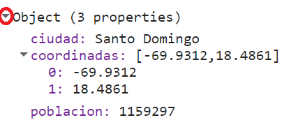
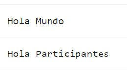
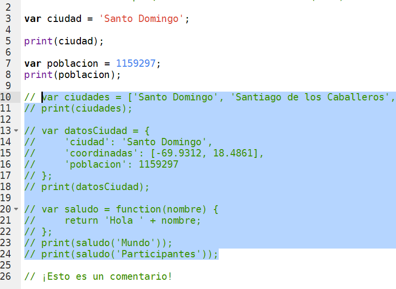

# Introducción al JavaScript y Conceptos de Earth Engine

Para poder construir un script para su análisis, necesitará usar JavaScript. Esta sección cubre la sintaxis de JavaScript y las estructuras de datos básicas en Earth Engine.

## JavaScript

### Variables

En un lenguaje de programación, las variables se utilizan para almacenar valores de datos. En JavaScript, una variable se define usando la palabra clave `var` seguida del nombre de la variable. El siguiente código asigna el texto "Santo Domingo" a la variable denominada `ciudad`. Tenga en cuenta que la cadena de texto en el código debe estar entre comillas. Puede usar ' (comillas simples) o " (comillas dobles), y deben coincidir al principio y al final de cada cadena. En sus programas, es recomendable ser coherente: use comillas simples o comillas dobles en todo una secuencia de comandos determinada. Cada declaración de su secuencia de comandos debe terminar normalmente con un punto y coma, aunque el editor de código de Earth Engine no lo requiere.

```javascript
var ciudad = 'Santo Domingo';
```

Si imprime la variable `ciudad`, obtendrá el valor almacenado en la variable (Santo Domingo) impreso en el Console.

```javascript
print(ciudad);
```

Cuando asigna un valor de texto, a la variable se le asigna automáticamente el tipo *string*. También puede asignar números a variables y crear variables de tipo *número*. El siguiente código crea una nueva variable llamada `poblacion` y le asigna un número como su valor.

```javascript
var poblacion = 1159297;
print(poblacion);
```

### Listas

Es útil poder almacenar múltiples valores en una sola variable. JavaScript proporciona una estructura de datos llamada "lista" que puede contener múltiples valores. Podemos crear una nueva lista usando los corchetes [] y agregando múltiples valores separados por una coma.

```javascript
var ciudades = ['Santo Domingo', 'Santiago de los Caballeros', 'Los Alcarrizos', 'La Vega'];
print(ciudades);
```

Si observa la salida en la Consola, verá "`List`" con una flecha de expansión (▹) al lado. Al hacer clic en la flecha, se expandirá la lista y se le mostrará su contenido. Notará que junto con los cuatro elementos de la lista, hay un número al lado de cada valor. Este es el índice de cada artículo. Le permite hacer referencia a cada elemento de la lista mediante un valor numérico que indica su posición en la lista.

### Objetos JavaScript

Las listas le permiten almacenar múltiples valores en una sola variable de contenedor. Si bien es útil, no es apropiado para almacenar datos estructurados. Es útil poder hacer referencia a cada elemento con su nombre en lugar de su posición. Los objetos en JavaScript le permiten almacenar pares clave-valor, donde se puede hacer referencia a cada valor por su clave. Puede crear un `diccionario` usando las llaves {}. El siguiente código crea un objeto llamado `datosCiudad` con información sobre Santo Domingo.

Tenga en cuenta algunas cosas importantes sobre la sintaxis de JavaScript aquí. Primero, podemos usar varias líneas para definir el objeto. Solo cuando ponemos el punto y coma (;) el comando se considera completo. Esto ayuda a formatear el código para que sea más legible. También tenga en cuenta la elección del nombre de variable `datosCiudad`. La variable contiene dos palabras. La primera palabra está en minúsculas y la primera letra de la segunda palabra en mayúsculas. Este tipo de esquema de nomenclatura de unir varias palabras en un solo nombre de variable se denomina "camel case" (case camello). Si bien no es obligatorio nombrar sus variables usando este esquema, se considera una buena práctica a seguir. Las funciones y los parámetros en la API de Earth Engine siguen esta convención, por lo que su código será mucho más legible si también la sigue.

```javascript
var datosCiudad = {
    'ciudad': 'Santo Domingo',
    'coordinadas': [-69.9312, 18.4861],
    'poblacion': 1159297
};
print(datosCiudad);
```

El objeto se imprimirá en el `Console`. Puede ver que en lugar de un índice numérico, cada elemento tiene una etiqueta. Esto se conoce como la clave y se puede utilizar para recuperar el valor de un objeto.



### Funciones

Mientras usa Earth Engine, deberá definir sus propias funciones. Las funciones toman las entradas del usuario, las usan para realizar algunos cálculos y envían una salida. Las funciones le permiten agrupar un conjunto de operaciones y repetir las mismas operaciones con diferentes parámetros sin tener que volver a escribirlas cada vez. Las funciones se definen utilizando la palabra clave `function`. El siguiente código define una función llamada `saludo` que toma una entrada llamada `nombre` y devuelve un saludo con el prefijo `Hola`. Tenga en cuenta que podemos llamar a la función con diferentes entradas y genera diferentes salidas con el mismo código.

```javascript
var saludo = function(nombre) {
    return 'Hola ' + nombre;
};
print(saludo('Mundo'));
print(saludo('Participantes'));
```



### Comentarios

Mientras escribe el código, es útil agregar un poco de texto para explicar el código o dejar una nota para usted. Es una buena práctica de programación agregar siempre comentarios en el código explicando cada paso. En JavaScript, puede prefijar cualquier línea con dos barras diagonales // para convertirlo en un comentario. El intérprete ignorará el texto del comentario y no se ejecutará.

```javascript
// ¡Esto es un comentario!
```

El Editor de código también proporciona un acceso directo (Ctrl + / en Windows, Cmd + / en Mac) para comentar o descomentar varias líneas a la vez. Puede seleccionar varias líneas y presionar la combinación de teclas para hacer que todos sean comentarios. Pulse de nuevo para invertir la operación. Esto es útil cuando se depura el código para detener la ejecución de ciertas partes del script.



### Código completo

Script "`2 Introducción al JS`" del repositorio y la carpeta `T2` o link directo:
[https://code.earthengine.google.com/7727b208111aa9c62d8f5c8392d8d29c](https://code.earthengine.google.com/7727b208111aa9c62d8f5c8392d8d29c)

## Conceptos básicos de la API de Earth Engine

La API de Earth Engine es amplia y proporciona objetos y métodos para hacer de todo, desde operaciones matemáticas sencillas hasta algoritmos avanzados para el procesamiento de imágenes. En el Editor de código, puede cambiar a la pestaña `Docs` para ver las funciones de la API agrupadas por tipos de objetos (o en la [documentación de Earth Engine](https://developers.google.com/earth-engine/apidocs)). Las funciones de la API tienen el prefijo `ee` (por Earth Engine).

 

Los conceptos fundamentales de Earth Engine con respecto a la teledetección incluyen:

- Imagen (`ee.Image`): El tipo de dato raster fundamental en Earth Engine. Imagen con una pila de bandas georreferenciadas. Cada banda tiene la suya Máscara, Proyección, Resolución, y una lista de propiedades que inclyen fecha, cuadro delimitador, etc.

    

- Colección de Imágenes (`ee.ImageCollection`): Una colección de imágenes

    

- Geometría (`ee.Geometry`): El tipo de dato vectorial fundamental en Earth Engine. Línea / Punto / Polígono / etc.

    

- Feature (`ee.Feture`): Una geometria con propriedades. Línea / Punto / Polígono / etc,
Lista de Propiedades

    

- Colección de Features (`ee.FeatureCollection`): Una colección de Features (geometrias con propriedades)

    

- Redutores (`ee.Reducer`): Objeto utilizado para agregaciones y cálculos numéricos (para bandas, séries temporales, features...)

    
    

Para más informaciones acceder al [sitio EE de objetos y métodos](https://developers.google.com/earth-engine/guides/objects_methods_overview).

Aprendamos a usar la API. Suponga que desea sumar dos números, representados por las variables a y b , como se muestra a continuación. Cree un nuevo script e ingrese lo siguiente:

```javascript
var a = 1;
var b = 2;
```

Anteriormente, aprendiste cómo almacenar números en variables, pero no cómo hacer ningún cálculo. Esto se debe a que cuando utiliza Earth Engine, no realiza sumas mediante operadores de JavaScript. Por ejemplo, no escribirías `var c = a + b` para sumar los dos números. En su lugar, la API de Earth Engine le brinda funciones para hacer esto, y es importante que use las funciones de la API siempre que pueda. Puede parecer incómodo al principio, pero usar las funciones, como lo describiremos a continuación, lo ayudará a evitar tiempos de espera y crear código eficiente.

Mirando la pestaña `Docs`, encontrará un grupo de métodos que se pueden llamar en un `ee.Number`. Expanda para ver las diversas funciones disponibles para trabajar con números. Verá la función `ee.Number` que crea un objeto de número de Earth Engine a partir de un valor. En la lista de funciones, hay una función de suma (`add`) para sumar dos números. Eso es lo que usas para sumar `a` y `b`.

 

Para sumar `a` y `b`, primero creamos un objeto `ee.Number` a partir de la variable a con `ee.Number(a)`. Y luego podemos usar la llamada `add(b)` para agregarle el valor de `b`. El siguiente código muestra la sintaxis e imprime el resultado que, por supuesto, es el valor 3.

```javascript
var resultado = ee.Number(a).add(b);
print(resultado);
```

Es posible que ya te hayas dado cuenta de que cuando aprendes a programar en Earth Engine, no necesitas aprender JavaScript o Python en profundidad, sino que son formas de acceder a la API de Earth Engine. Esta API es la misma ya sea que se llame desde JavaScript o Python.

Aquí hay otro ejemplo para llevar este punto a casa. Supongamos que está trabajando en una tarea que requiere que cree una lista de años desde 1980 hasta 2020 con un intervalo de cinco años. Si se enfrenta a esta tarea, el primer paso es cambiar a la pestaña `Docs` y abrir el módulo `ee.List`. Navegue a través de las funciones y vea si hay alguna función que pueda ayudar. Notará una función `ee.List.sequence`. Al hacer clic en él, aparecerá la documentación de la función.

 

La función `ee.List.sequence` puede generar una secuencia de números desde un valor inicial dado hasta el valor final. También tiene un paso de parámetro opcional para indicar el incremento entre cada número. Podemos crear una `ee.List` de números que representen los años desde 1980 hasta 2020, contando de 5 en 5, llamando a esta función predefinida con los siguientes valores: `start` = 1980, `end` = 2020 y `step` = 5.

```javascript
var listaAnos = ee.List.sequence(1980, 2020, 5);
print(listaAnos);
```

El resultado impreso en el `Console` mostrará que la variable yearList contiene la lista de años con el intervalo correcto.

 

Ahora vamos mirar un ejemplo de redución (`ee.Reducer`). Como vimos, `ee.Reducer` es el objeto utilizado para agregaciones y cálculos. Creamos una lista con números de 1 a 5 y queremos calcular la média destos números. Para eso, utilizamos la función `reduce()` para listas y elegimos el `ee.Reducer` (mire en el `Docs` el redutor `ee.Reducer.mean()`). Tenga en cuenta que podemos utilizar la misma función `ee.List.sequence` para crear la lista pero sin la necesidad de definir el `step` ya que `step` tiene el valor 1 como padrón.

```javascript
var listaNumeros = ee.List.sequence(1, 5);

var media = listaNumeros.reduce(ee.Reducer.mean());
print(media);
```

Acaba de realizar una tarea de programación moderadamente compleja con la ayuda de Earth Engine API.

### Desafío 1

Suponga que tiene las siguientes dos variables de cadena definidas en el código a continuación. Usa la API de Earth Engine para crear una nueva variable de cadena llamada `resultado` combinando estes dos `Strings`. Imprímelo en el `Console`. El valor impreso debe decir "Sentinel2A".

```javascript
var mision = ee.String('Sentinel');
var satelite = ee.String('2A');
```

*Sugerencia*: use la función `cat` del módulo `ee.String` para "concatenar" (unir) los dos `strings`. Encontrará más información sobre todas las funciones disponibles en la pestaña `Docs` del Editor de códigos.

 

### Desafío 2

Crear un diccionario llamado `misInformaciones` utilizando el objeto `ee.Dictionary` con sus informaciones personales: `nombre`, `edad`, y una lista de sus 3 películas preferidas `peliculas`. Imprímelo en el `Console`.

### Desafío 3

Obtener el valor guardado en el `edad` y guardarlo en una variable con un nuevo nombre (ejemplo: `miEdad`). Imprímelo en el `Console`.

*Sugerencia*: utilice la función `get()` del objeto `ee.Dictionary`.

Observe que el valor impreso es del tipo `Computed Object`. Eso significa que no es un objeto EE aún. Si tuviera que realizar una operación matemática con este número, necesitaría "lanzarlo" (cast) al objeto `ee.Number`.

### Desafío 4

Obtener el segundo valor de la lista abajo y guardarlo en una variable.
Dividir ese número por 2. Imprimir el resultado en el `Console`.

*Sugerencia*: busque informaciones para la función `get()` de `ee.List`. Tenga en cuenta que la indexación comienza en 0.

```javascript
var miLista = ee.List([1, 2, 5, 4]);
```

### Desafío 5

Multiplicar el segundo valor de `miLista` por 5 y guardarlo en una variable (ejemplo: `resultado`). Imprímelo en el `Console`.

*Sugerencia*: buscar por la función `multiply()` de `ee.Number`. Es necesario convertir (cast) el segundo valor de `miLista` a un `ee.Number` primero, antes de que se puedan usar las funciones numéricas. Tenga en cuenta que nos es necesário convertir (cast) el número 5 adentro de `multiply` - Earth Engine ya converte ese número para `ee.Number` una vez que estamos utilizando la función del API.

### Desafío 6

Multiplica cada número en `miLista` por 3. Guarda el resultado en una nueva variable llamada `nuevaLista` e imprímelo.

*Sugerencia*: complete la función `triplicar` a continuación. Use `map()` para aplicar la función a cada elemento de la lista. No te olvides del casting.

```javascript
function triplicar(numero) {
  return ; // completar esa función.
}
```

### Desafío 7

Calcula la suma de todos los Números en `nuevaLista`. Guardar y imprimir ese valor como `suma`.

### Código completo

Script "`3 API Earth Engine`" del repositorio y la carpeta `T2` o link directo:
[https://code.earthengine.google.com/f68358987ee1233c62f459e6ca9d0244](https://code.earthengine.google.com/f68358987ee1233c62f459e6ca9d0244).