# Acceso a los datos

El acceso a datos de teledetección se ha vuelto más fácil que nunca en los últimos años. Esta lección recorrerá dos métodos para acceder a algunos de los conjuntos de datos geoespaciales más utilizados.

## Objetivos

1. Usar Earth Explorer para encontrar escenas de Landsat 8 y 9 para una fecha y ubicación específicas.
2. Buscar escenas de Sentinel-2 para una fecha y ubicación específicas utilizando Copernicus Open Access Hub.

## Earth Explorer

**¿Qué es Earth Explorer?** USGS Earth Explorer es un portal de datos integral para acceder a conjuntos de datos geoespaciales de la colección de USGS. Los usuarios pueden interactuar con una interfaz de usuario para filtrar datos por ubicación a través del mapa que se muestra, ingresar coordenadas exactas o cargar un archivo de shapefile. Los datos se pueden filtrar aún más por rango de fechas, tipo de conjunto de datos y criterios adicionales.

### Ejercicio 1.1. Practique el uso de Earth Explorer

Este ejercicio demostrará cómo utilizar Earth Explorer para ubicar y descargar escenas de Landsat 8 y 9 para un rango de fechas y un área de interés en particular. Para esta lección, nuestra área de interés es la costa occidental de Jamaica y el rango de fechas es del 1 de septiembre de 2022 al 21 de septiembre de 2022.

1. Vaya a la página de inicio de Earth Explorer: [https://earthexplorer.usgs.gov/](https://earthexplorer.usgs.gov/)
2. **Filtrar por ubicación.** Seleccione la pestaña "Criterios de búsqueda" en la esquina superior izquierda. Ingrese el área de interés usando UNO de los siguientes métodos:
    1. **Buscar**
        1. Seleccione la pestaña Geocodificador y luego seleccione "Características mundiales" debajo de la descripción "Límites de búsqueda". Escriba "Negril" en el campo Nombre de la función y presione "Mostrar". Seleccione la segunda entrada que aparece.

        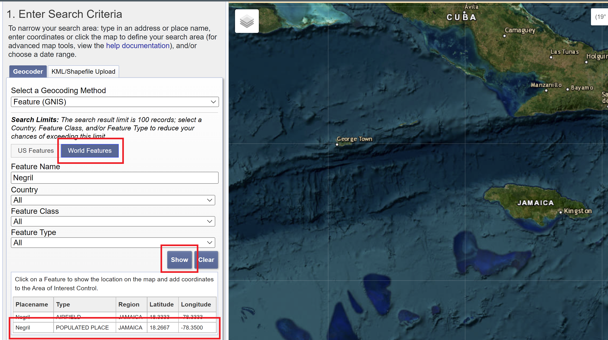

    2. **Mapa interactivo**
        1. Desplácese hacia abajo hasta la pestaña "Polígono". Arrastre el mapa y haga zoom en Negril. Seleccione "Usar mapa" para resaltar el área que se muestra en el mapa.
        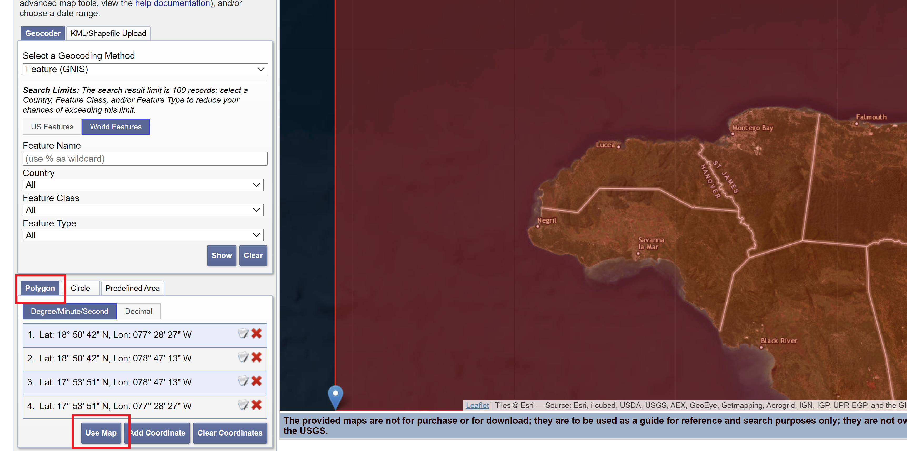
    3. **Coordenadas**
        1. Desplácese hacia abajo hasta la pestaña "Polígono". Seleccione "Agregar coordenada". Entrada 18° 16' 00" como latitud y 78° 21' 00" como longitud y presione “Agregar”.
        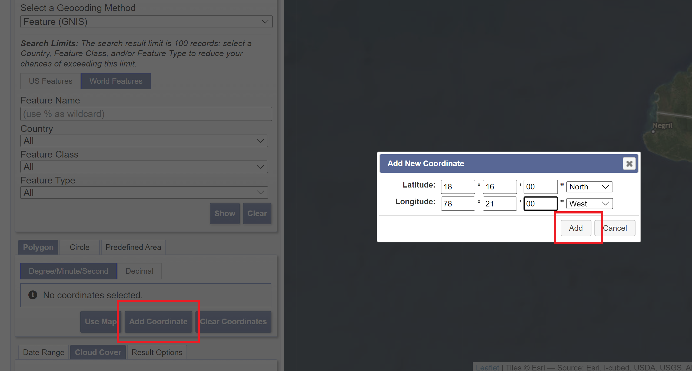
    4. **Archivo de Shapefile**
        1. Inicie sesión en su cuenta de Earth Explorer seleccionando "Iniciar sesión" en la esquina superior derecha.
        2. Seleccione la pestaña "Cargar KML/Shapefile". En el menú desplegable, elija la opción "Shapefile" y presione "Seleccionar archivo". Navega a la carpeta `intro-rs-data` y elige `negril-pa-shapefile.zip` y presiona "Abrir".
        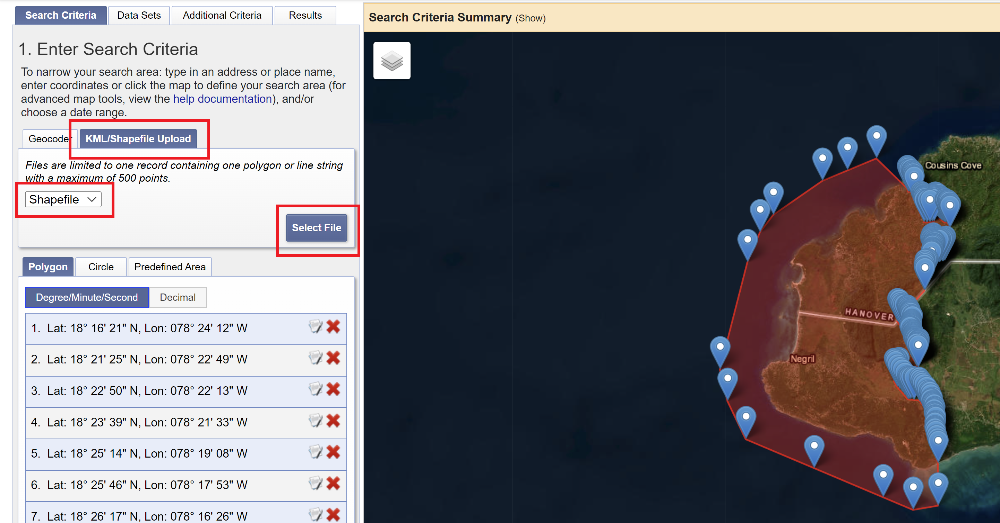
3. **Filtrar por fecha y cobertura de nubes.** Desplácese hacia abajo hasta la parte inferior de la pestaña "Criterios de búsqueda" e ingrese `09/01/2022` a `09/21/2022`. Luego, presione la pestaña "Cobertura de nubes" y mueva el control deslizante para que el rango se establezca entre "0% a 15%". Presione el botón "Conjuntos de datos >>" para pasar a la siguiente sección.
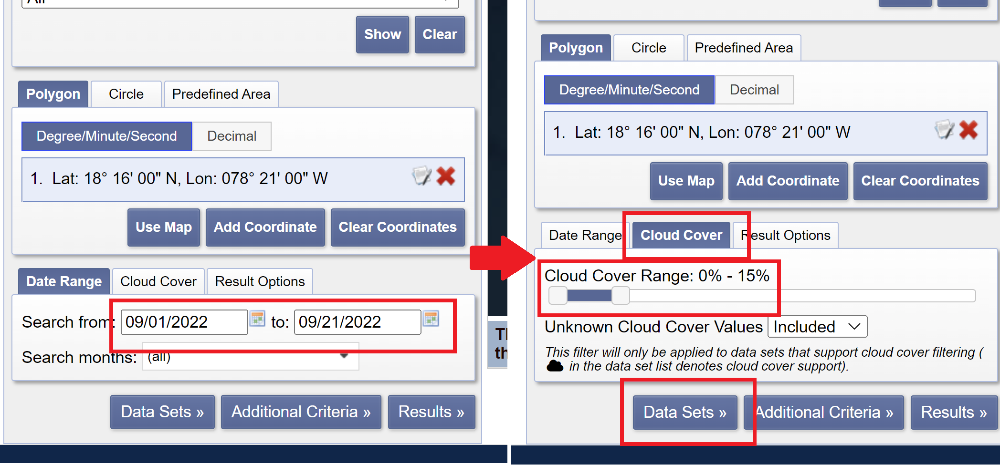

4. **Filtrar por conjunto de datos.** En la pestaña "Conjuntos de datos", expanda la sección denominada "Landsat". Queremos utilizar la recopilación más reciente de datos de Landsat, así que elija la opción "Landsat Collection 2 Level-1". Marque la opción de casilla “Landsat 8-9 OLI/TIRS C2 L1”. Seleccione el botón "Criterios adicionales >>" para pasar a la siguiente sección.
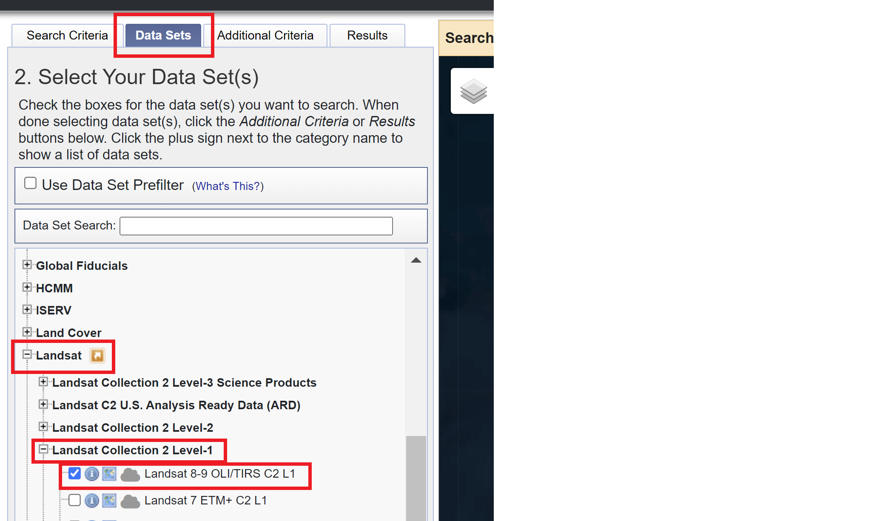

5. No necesitamos filtrar por ningún criterio adicional, pero puede explorar qué opciones están disponibles para el conjunto de datos Landsat 8-9 Collection 2 Level 1 en esta pestaña. Pulse “Resultados >>” para ver los datos disponibles.
6. Seleccione el resultado de la primera imagen. Puede ver cómo se ve la imagen y desplazarse hacia abajo para obtener información sobre los metadatos. La imagen debe tener las siguientes propiedades:
    1. **ID:** LC08_L1TP_012047_20220916_20220922_02_T1
    2. **Date Acquired:** 2022/09/16
    3. **Path:** 012
    4. **Row:** 047
    

7. Pulse el icono de descarga para ver las opciones de descarga. **Tenga en cuenta que debe iniciar sesión para completar este paso.** Puede explorar los diferentes formatos que puede elegir para descargar los datos. La mejor opción para el análisis es el "Paquete de productos". La descarga de datos a veces puede llevar un tiempo, por lo que todos los datos necesarios para el resto del taller se descargaron y se incluyeron en la carpeta `intro-rs-data`.
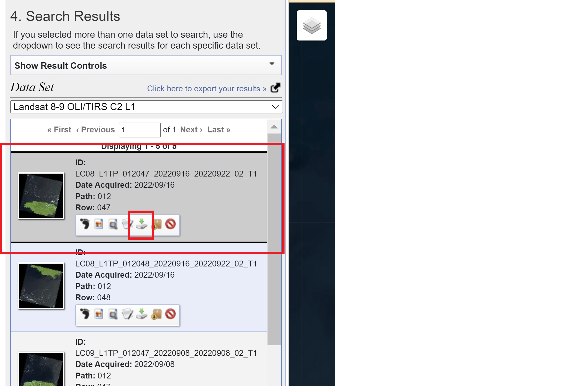
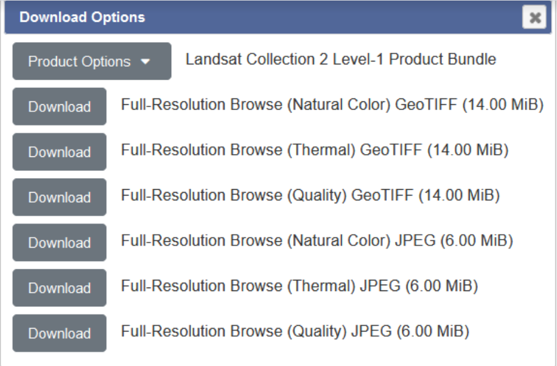

## Copernicus Open Access Hub

**¿Qué es Open Access Hub?** Copernicus Open Access Hub es una plataforma gratuita y de código abierto para acceder a cualquiera de los productos de datos Sentinel de la Agencia Espacial Europea. Los usuarios pueden elegir entre una interfaz gráfica de usuario (GUI) o una interfaz de programación de aplicaciones para interactuar y descargar datos, según las necesidades de su proyecto. La documentación para el uso de cada uno de los productos, así como una guía de usuario para el propio Hub, también está disponible en el sitio web del Hub.

### Ejercicio 1.2. Practique con Copernicus Open Access Hub.

Este ejercicio demostrará cómo usar Copernicus Open Access Hub para ubicar y descargar escenas de Sentinel-2 para un rango de fechas y un área de interés en particular. Para esta lección, nuestra área de interés es la costa occidental de Jamaica, y el rango de fechas es del 1 de septiembre de 2022 al 16 de septiembre de 2022.

1. Vaya a la página de inicio de Copernicus Open Access Hub: [https://scihub.copernicus.eu/](https://scihub.copernicus.eu/)
2. Seleccione el botón "Open Hub" para usar la opción GUI para explorar los datos disponibles. También se puede acceder a través de este enlace: [https://scihub.copernicus.eu/dhus/#/home](https://scihub.copernicus.eu/dhus/#/home)
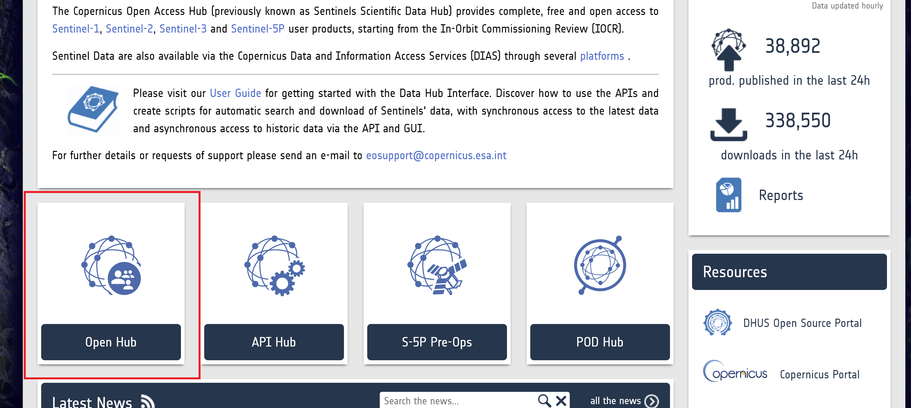

3. Inicie sesión en su cuenta haciendo clic en el icono de una persona con un signo de interrogación.
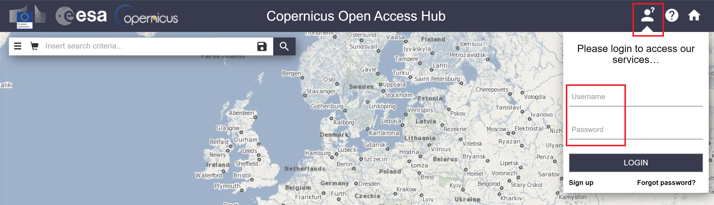

4. Puede buscar productos de datos utilizando una de dos formas: la primera es la búsqueda de texto, que utiliza si conoce el ID de la imagen deseada, y la segunda es la búsqueda avanzada, que puede utilizar para limitar los productos en función de un conjunto de criterios. El tutorial seguirá los pasos para la búsqueda avanzada.
5. Con el cursor, arrastre el mapa y acérquese a la costa occidental de Jamaica.
6. Haga clic con el botón derecho y arrastre el mouse sobre el área de interés para dibujar un rectángulo alrededor del área de interés.
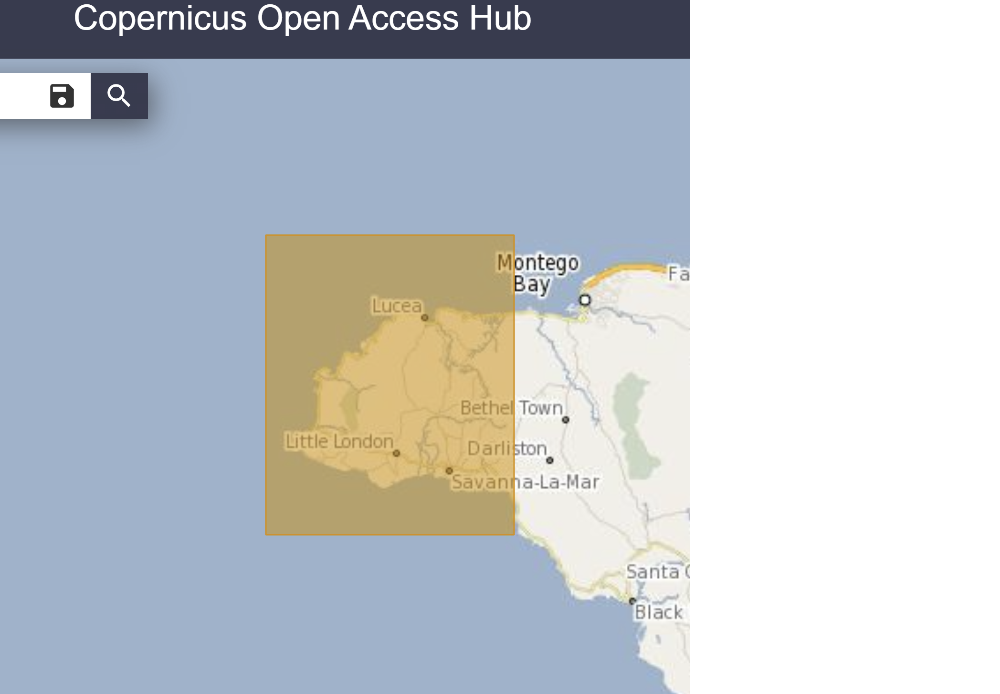

7. Haga clic en las 3 barras apiladas horizontalmente en el lado izquierdo de la barra de búsqueda para abrir el menú de búsqueda avanzada.
8. Introduzca los siguientes parámetros en el cuadro de búsqueda avanzada:
    1. **Período de detección:** 2022/09/01 a 2022/09/21
    2. **Misión:** Sentinel-2 (es posible que tengas que desplazarte hacia abajo para seleccionar esa casilla).
    3. Debajo de la casilla marcada Misión Sentinel-2:
        1. **Plataforma satelital:** `S2B_*`
        2. **Tipo de producto:** `S2MSI2A` (corresponde a Sentinel-2 MSI nivel 2A).
        3. **Cubierta de nubes%:** `[0 TO 30]`
9. Presione el icono de lupa en el lado derecho de la barra de búsqueda para buscar los productos de datos correspondientes.
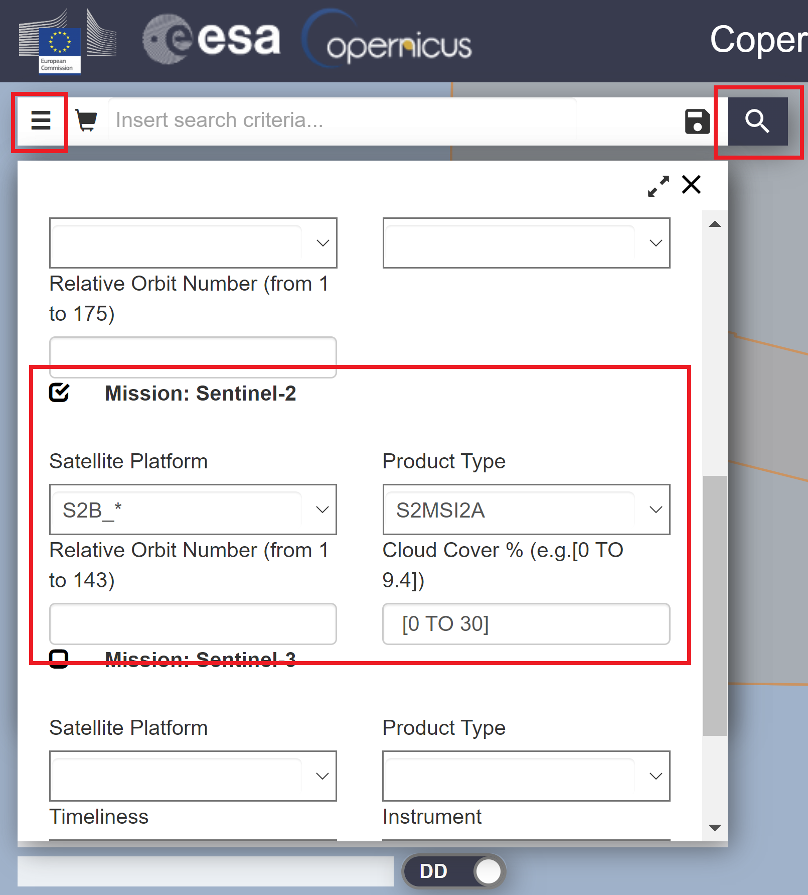

10. Puede seleccionar el ícono del ojo para inspeccionar los detalles sobre el mosaico de la imagen o presionar la flecha hacia abajo para descargar la imagen.
    1. Todos los datos que necesita ya se han descargado por usted, por lo que no necesita descargar las imágenes.
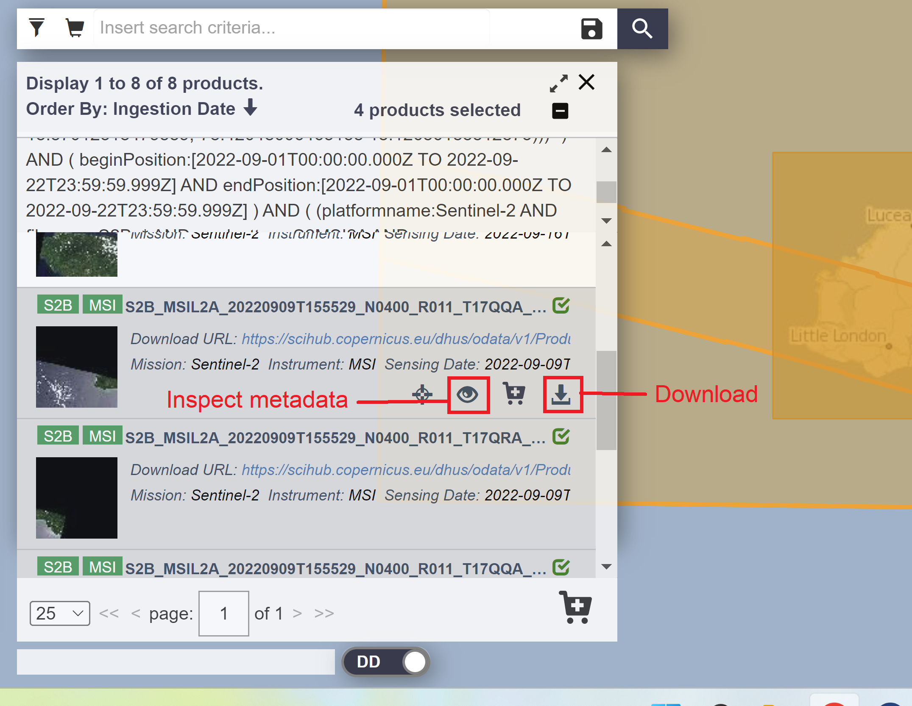