# Visualización de datos con Landsat

Los datos de teledetección son útiles para obtener información sobre una región en particular al extraer los valores almacenados en bandas de imágenes y combinarlos para calcular diferentes tipos de índices. Sin embargo, quizás aún más poderosa es la capacidad de usar imágenes para visualizar esos cálculos. Esta lección utilizará los datos de Landsat para calcular diferentes indicadores de salud de la vegetación y revisará cómo visualizar correctamente esos resultados.

## Objetivos

1. Comprender e implementar los pasos de preprocesamiento necesarios para los datos de Landsat.
2. Experimente con combinaciones de bandas comunes para visualizar datos de teledetección.
3. Calcule el NDVI con matemática de banda usando productos de datos de Landsat.
4. Obtener estrategias para crear productos de imagen visualmente efectivos y útiles.

## Preprocesamiento de imágenes
Antes de que las imágenes de teledetección se puedan utilizar para el análisis, deben pasar por una serie de pasos de corrección para garantizar que los datos sean lo más precisos posible para el proyecto de investigación de un usuario. La organización que proporciona los datos suele llevar a cabo varios de estos pasos antes de publicarlos:

1. **Corrección geométrica.** Este proceso alinea las capas de datos con su ubicación geográfica correcta y entre sí.
2. **Corrección solar.** Este proceso ajusta los valores de los píxeles para tener en cuenta los efectos solares. Las imágenes resultantes consisten en valores de reflectancia en la parte superior de la atmósfera.
3. **Corrección atmosférica.** Este proceso contrarresta los efectos de la atmósfera en las medidas de energía tomadas por el sensor. Algunos de estos efectos incluyen dispersión y absorción.
4. **Corrección topográfica.** Este proceso tiene en cuenta las variaciones de reflectancia debidas a la pendiente, la elevación y el aspecto. Es especialmente importante para áreas con terreno accidentado o montañoso.

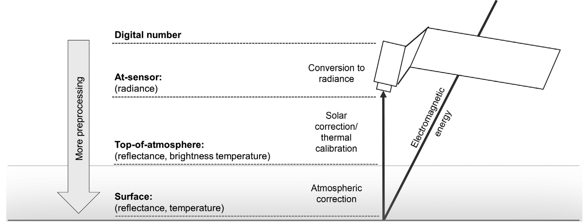

Figura 6. Niveles de preprocesamiento para datos de teledetección. Fuente de la imagen: Young et. al., 2017

El nivel de preprocesamiento que necesita un usuario depende del tipo de análisis que se esté realizando. El procesamiento previo afecta los valores y, por lo tanto, los resultados del análisis de los datos que se utilizan y tiene el potencial de introducir errores adicionales en un estudio. Es importante utilizar datos de teledetección con la cantidad adecuada de preprocesamiento para llevar a cabo el análisis más preciso y consistente posible.

### Ejercicio 2.1 Examine las diferencias entre los productos de datos.
Este ejercicio subrayará las diferencias entre los productos de datos Landsat 8 de reflectancia superficial (SR) y de la parte superior de la atmósfera (TOA).

1. Abra QGIS.
2. En "Plantillas de proyecto", seleccione "Nuevo proyecto vacío".
3. Una vez que se abra el proyecto, seleccione "Proyecto > Guardar como..." y guarde su proyecto como `intro-remote-sensing`.
4. Una vez que se guarde el proyecto, seleccione "Capa > Agregar capa > Agregar capa ráster..."
5. Primero, agregue la imagen SR. Haga clic en `...` junto al campo "Conjunto(s) de datos ráster". Navegue a la carpeta `intro-rs-data` y haga doble clic en `l8-sr-negril-example.tif`.

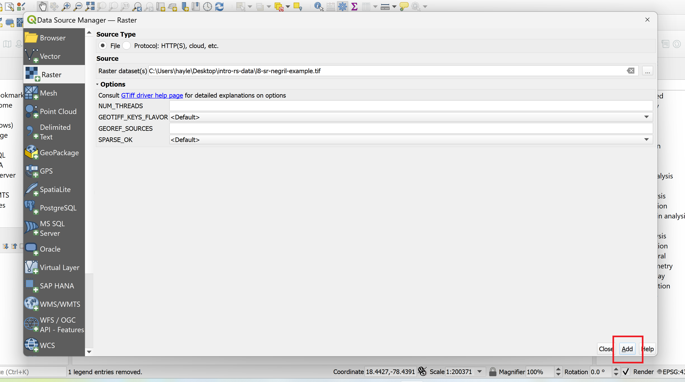

6. Presione "Agregar", cierre la ventana y luego guarde el proyecto.

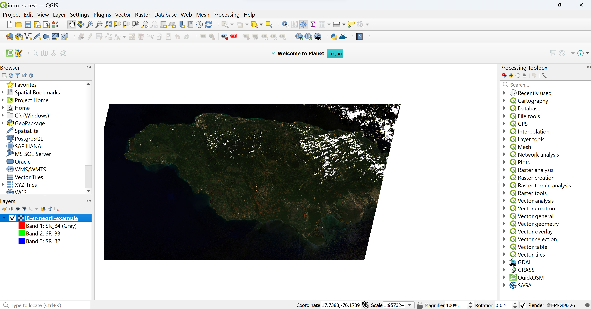

7. La imagen se ve un poco oscura, por lo que debe realizar algunas mejoras. Haga clic con el botón derecho en el nombre de la capa y seleccione "Propiedades... > Simbología".

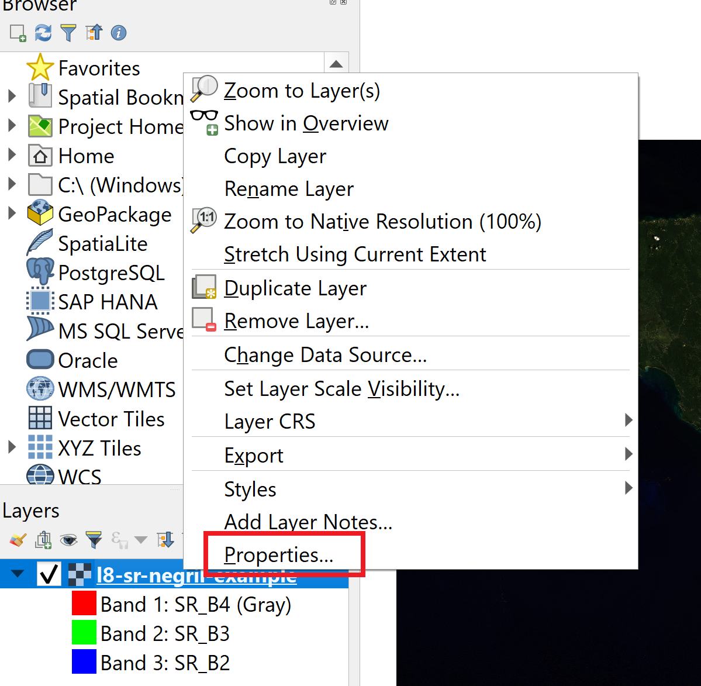

8. Expanda la sección "Configuración de valor mínimo/máximo". Seleccione la opción "Corte de conteo acumulativo" y ajuste los valores a 3.0 y 97.0. En el campo "Extensión de las estadísticas", seleccione la opción "Ráster completo".

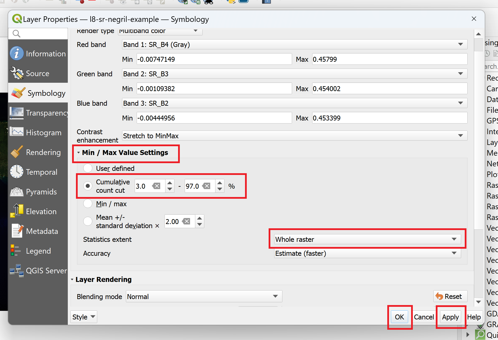

9. Presione “Aplicar” y cierre la ventana. Guarde el proyecto.

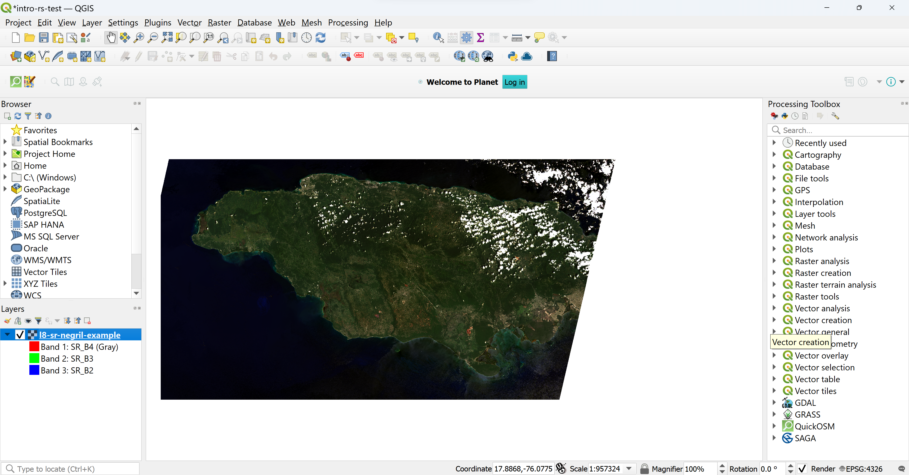

10. A continuación, agregue la imagen TOA. Repita los pasos 4-9, pero use "l8-toa-negril-example.tif" en lugar del archivo "l8-sr-negril-example.tif" en el paso 5.

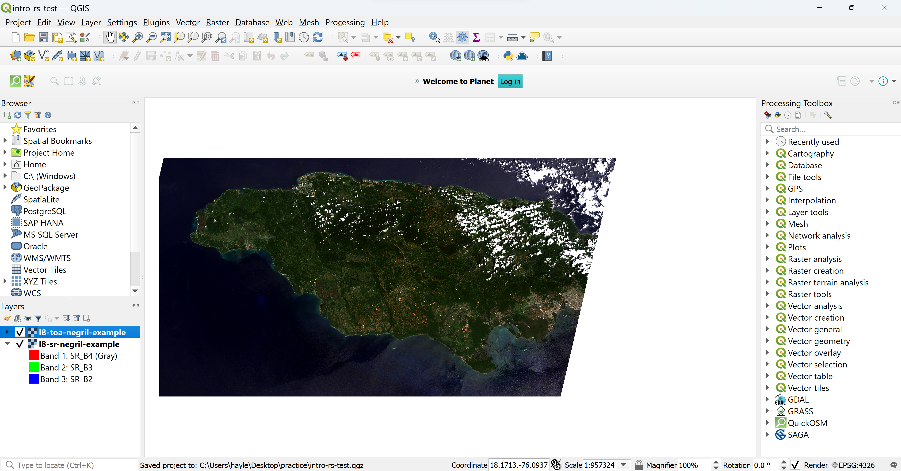

Examine las diferencias entre las dos imágenes. Observe cómo la imagen SR aparece más brillante y algo más clara que la imagen TOA debido a los pasos correctivos adicionales que se tomaron para crear el producto de reflectancia superficial. En general, se recomienda que los investigadores utilicen imágenes TOA para análisis de una sola fecha y una sola escena e imágenes SR para análisis de varias fechas o escalas geográficas más grandes. Usaremos imágenes SR durante el resto de la lección.

**Cubierto de nubes**. A menudo, particularmente en las regiones costeras o tropicales, una imagen contendrá nubes que deben eliminarse antes de poder analizar los datos. Las imágenes utilizadas en el Ejercicio 2.1 contienen tal cobertura de nubes. Si bien gran parte del preprocesamiento requerido ya se completó con los productos SR, el usuario debe realizar la eliminación de la nube o el enmascaramiento de la nube.

### Ejercicio 2.2 Cree una imagen en color verdadero sin nubes.

Este ejercicio explicará cómo crear una imagen compuesta de color verdadero usando bandas Landsat 8 y eliminará las nubes de la imagen usando el complemento Cloud Masking. Consulte el enlace solo para ver algunas de las especificaciones espectrales de L8 [https://www.usgs.gov/landsat-missions/landsat-8](https://www.usgs.gov/landsat-missions/landsat-8)

1. Abra QGIS
2. En "Proyectos recientes", seleccione "Introducción a la detección remota" y ábralo.
3. **Cree una imagen en color verdadero**. Este es el mismo proceso que se usó para crear las imágenes de color verdadero prefabricadas que se usaron en el Ejercicio 2.1.
    1. Seleccione "Ráster > Varios > Combinar..."
    2. Haga clic en "..." junto al campo "Capas de entrada".
    3. Haga clic en "Agregar archivo(s)..." y navegue hasta "intro-rs-data > l8-sr-negril-2022-09-16". Mantenga presionada la tecla Shift en su teclado y seleccione los archivos que terminan en "B4", "B3" y "B2". Haga clic en "Abrir" para agregar los archivos.
    4. En la ventana "Capas de entrada", asegúrese de que las bandas estén ordenadas correctamente. Las imágenes en color verdadero se crean combinando la banda roja (Landsat 8 Band 4), la banda verde (Landsat 8 Band 3) y la banda azul (Landsat 8 Band 2) de una imagen en una sola imagen en ese orden particular.

    Arrastre y suelte los nombres de los archivos para que el archivo B4 aparezca primero, seguido del archivo B3 y luego el archivo B2. Pulse "OK" para volver a la ventana "Fusionar".

    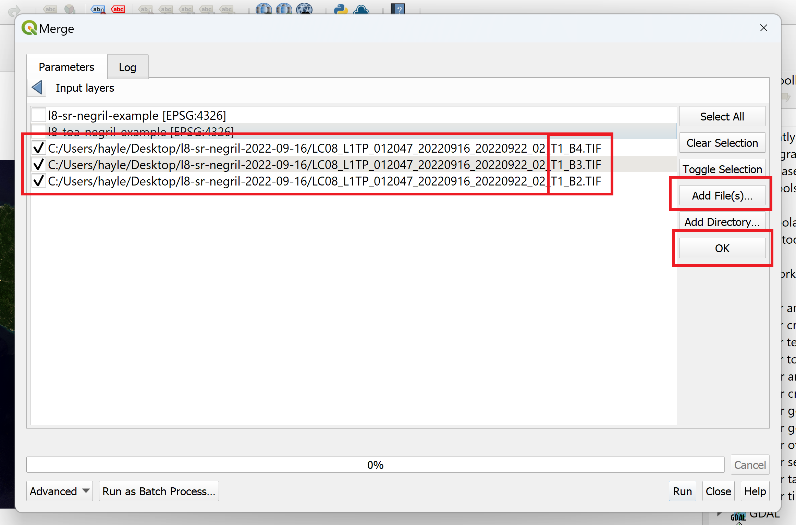

    5. En el campo "Capas de entrada...", marque la opción "Colocar cada archivo de entrada en una banda separada" para crear una imagen compuesta.
    6. Finalmente, junto al campo "Combinado", seleccione "... > Guardar en archivo..." para especificar dónde desea guardar la imagen. Guarde la imagen en "intro-rs-data > outputs" e ingrese "l8-sr-tc-negril" como nombre de archivo. Presiona "Guardar".

    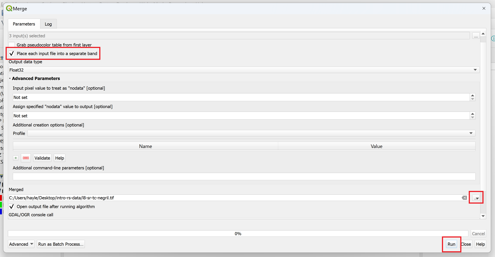

    7. Presione "Ejecutar" para crear y cargar la imagen en el lienzo y haga clic en "Cerrar" para cerrar la ventana "Combinar".

    

4. **Enmascare las nubes**. Usaremos Cloud Masking, un útil complemento de QGIS que enmascara las nubes para los datos de Landsat, para llevar a cabo este proceso.
    1. Vaya a "Complementos > Enmascaramiento de nubes para productos Landsat > Enmascaramiento de nubes". Debería aparecer un panel en el lado derecho.
    2. En la pestaña "Abrir y cargar", haga clic en "Examinar" junto al campo "Archivo de metadatos de Landsat". Navegue hasta "intro-rs-data > l8-sr-negril-2022-09-16" y seleccione el archivo que termina en "MTL". Presione "Abrir" para agregarlo y luego haga clic en el botón "Cargar". El archivo de metadatos debe seleccionarse automáticamente.

    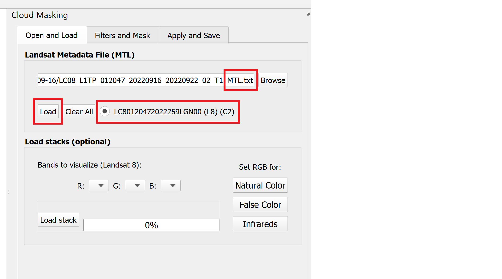

    3. En el campo "Cargar pilas", haga clic en el botón "Color natural" para configurar la disposición de la banda como una imagen de color verdadero.
    4. A continuación, seleccione la pestaña "Filtros y máscara". En el campo "Filtros para aplicar", seleccione la opción "FMask". Deja todas las opciones como están.

    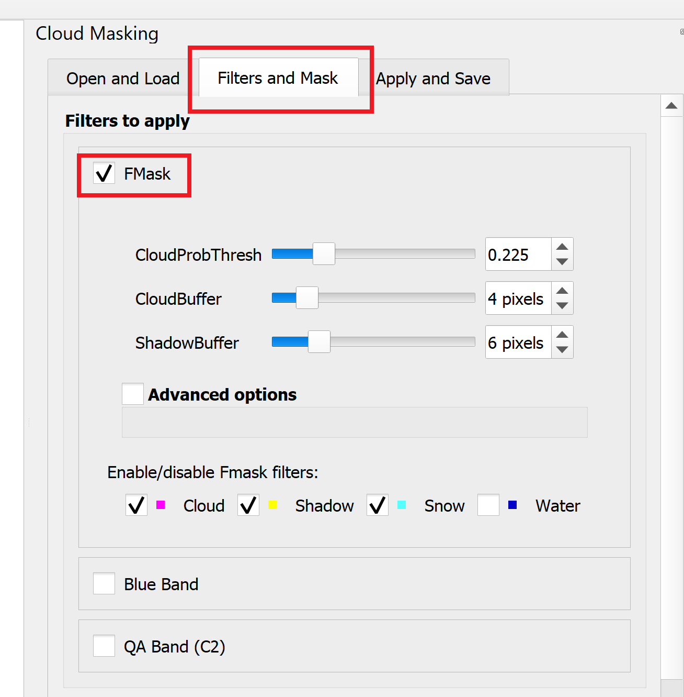

    5. **Asegúrese de guardar su proyecto antes de realizar este paso**. Haga clic en "Generar máscara". Puede tomar un par de minutos. Cuando haya terminado, debería aparecer una nueva capa de máscara de nube en el lienzo. Si la máscara no se ve bien, puede ajustar los parámetros en el campo "FMask" y generar una nueva máscara hasta que esté satisfecho con el resultado. Guarde el proyecto de nuevo.

    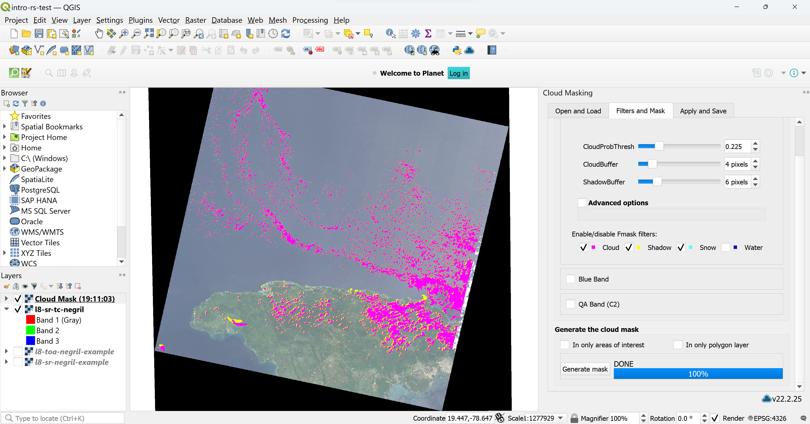

    6. Haga clic en la pestaña "Aplicar y guardar". Junto a la pestaña "Seleccionar archivo de salida para guardar resultado", haga clic en "...".
    7. Guarde el archivo en "intro-rs-data > outputs" y asígnele el nombre "l8-sr-tc-negril-cloudmasked". Presione Guardar.
    8. Haga clic en "Aplicar máscara". Puede tardar un par de minutos en ejecutarse.

    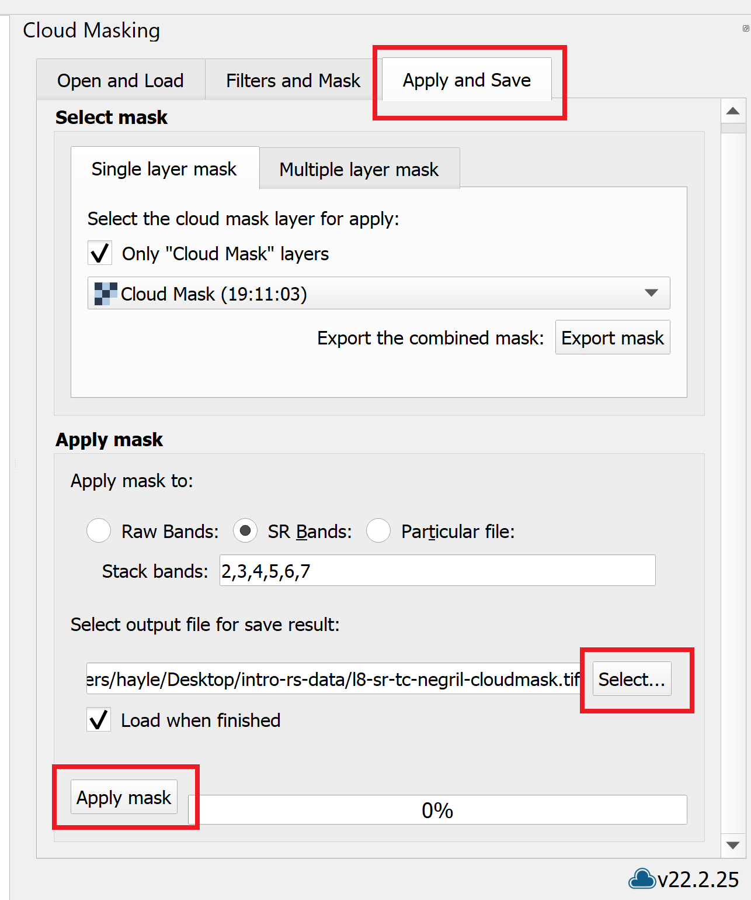

5. Repita los pasos 7 a 9 del Ejercicio 2.1 para mejorar la imagen, pero ajuste los valores de “Recorte de conteo acumulativo” a **1.0** y **99.0**. Guarde el proyecto.

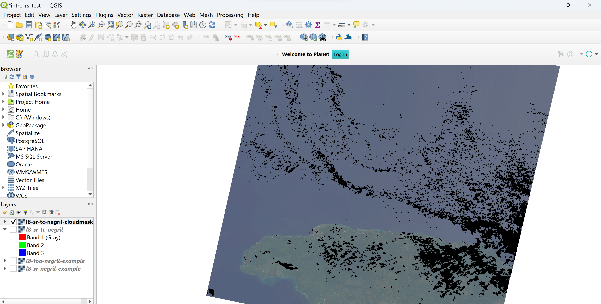

¡Ahora tenemos una imagen de reflectancia de superficie Landsat 8 sin nubes! Obviamente, hay algunas brechas significativas donde las nubes estaban presentes, por lo que generalmente es mejor enmascarar las nubes y crear una composición de imágenes de nubes durante una temporada en particular, o tratar de usar imágenes que tengan menos del 30% (o un umbral de su elección ) cobertura de nubes para minimizar la cantidad de eliminación de datos. El enmascaramiento de nubes no es una ciencia perfecta: a veces es necesario probar varios algoritmos diferentes para encontrar el que mejor se adapte a sus datos y área de estudio. Hay más información disponible sobre el enmascaramiento de nubes en la sección [Recursos](https://eos.com/blog/cloud-mask/).

## Análisis de vegetación: Parte 1

Paso 4.c. en el Ejercicio 2.2 mostró cómo la combinación de bandas en un orden particular permite a un usuario visualizar una escena Landsat 8 como aparecería al ojo humano (imagen en color verdadero). Las otras bandas de una imagen también se pueden combinar para ilustrar características particulares de una región. En las próximas secciones, intentaremos responder la siguiente pregunta: **¿Cómo difiere la cobertura vegetal entre áreas protegidas y no protegidas?** Esta lección se centrará en el Área de Protección Ambiental de Negril en la costa occidental de Jamaica.

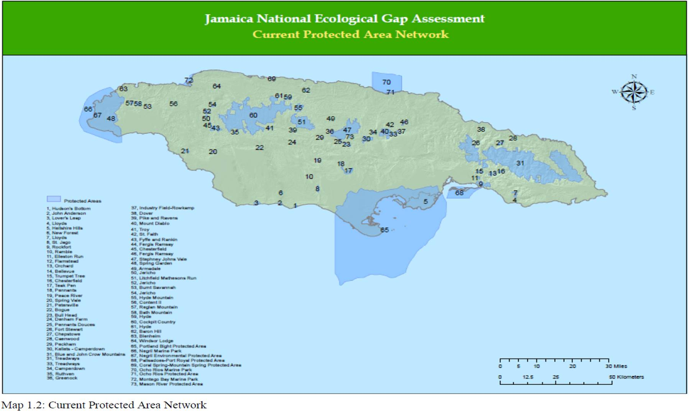

Un método para inspeccionar la cubierta vegetal en un área de interés es crear un tipo de compuesto de color falso llamado imagen **infrarroja cercana**, también conocida como imagen **infrarroja en color**. La vegetación saludable tiende a reflejar altos niveles de energía del infrarrojo cercano (NIR). Al organizar las bandas NIR, roja y verde en una sola imagen, es fácil ver la distribución general y la salud de las plantas en un espacio determinado.

### Ejercicio 2.3 Visualice la vegetación con imágenes infrarrojas en color

Este ejercicio ilustrará cómo crear una imagen compuesta de infrarrojos en color utilizando Landsat 8 para examinar la cubierta vegetal en el oeste de Jamaica.

1. Abra QGIS.
2. En "Proyectos recientes", seleccione "Intro-detección remota" y ábralo.
3. Seleccione "Ráster > Varios > Combinar..."
4. Haga clic en "..." junto al campo "Capas de entrada".
5. Haga clic en "Agregar archivo(s)..." y navegue hasta "intro-rs-data > l8-sr-negril-2022-09-16". Seleccione los archivos que terminan en "B5", "B4" y "B3". Haga clic en "Abrir" para agregar los archivos.
6. En la ventana "Capas de entrada", asegúrese de que las bandas estén **ordenadas correctamente**. Las imágenes infrarrojas en color se crean combinando la banda NIR (Landsat 8 Band 5), la banda roja (Landsat 8 Band 4) y la banda verde (Landsat 8 Band 3) de una imagen en una sola imagen en ese orden particular. Arrastre y suelte los nombres de los archivos para que el archivo "B5" sea el primero, seguido de "B4" y luego "B3". Pulse "OK" para volver a la ventana "Fusionar".

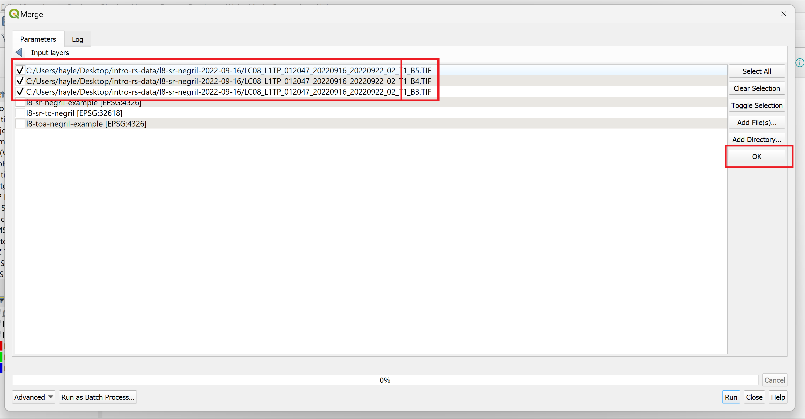

7. En el campo "Capas de entrada...", marque la opción "Colocar cada archivo de entrada en una banda separada" para crear una imagen compuesta.
8. Finalmente, junto al campo "Fusionado", seleccione "... > Guardar en archivo..." para especificar dónde desea guardar la imagen. Guarde la imagen en [NOMBRE DE CARPETA DE DATOS] e ingrese “l8-sr-nir-negril-2022-09-16” como nombre de archivo. Presiona "Guardar".

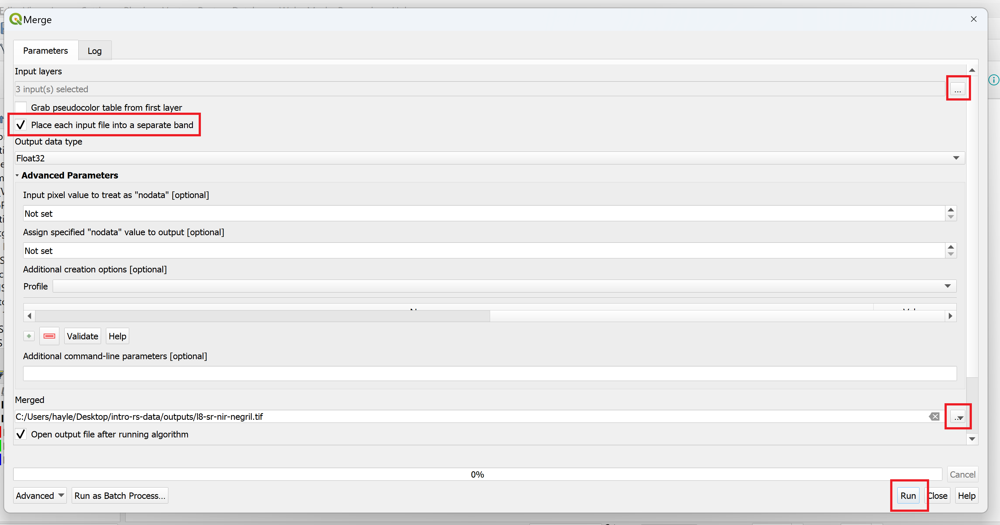

9. Presione "Ejecutar" para crear y cargar la imagen en el lienzo y haga clic en "Cerrar" para cerrar la ventana "Combinar".

Active y desactive la capa de infrarrojo cercano para comparar el compuesto de color falso con el compuesto de color verdadero. Las áreas con vegetación densa y verde deben aparecer de color rojo brillante, mientras que las áreas no productivas o sin vegetación deben aparecer entre un color marrón y azul blanquecino. El compuesto de color falso hace que sea mucho más fácil identificar rápidamente áreas con vegetación altamente productivas.

**Matemáticas de la banda**. Las visualizaciones infrarrojas del color verdadero y del color no requirieron ningún cálculo. En su lugar, las bandas podrían disponerse en un orden particular para que la imagen se viera diferente. [Awesome Spectral Indices](https://awesome-ee-spectral-indices.readthedocs.io/en/latest/) proporciona una referencia para otras combinaciones de bandas comunes para la visualización de datos de teledetección. Un análisis más complejo requiere más que una reorganización de las bandas: a menudo, las bandas deben combinarse mediante una ecuación cuyo resultado se almacena en una nueva banda y corresponde a algún tipo de métrica de análisis.

Uno de los índices más comunes para visualizar la vegetación en una imagen es el Índice de Vegetación de Diferencia Normalizada (NDVI). El NDVI se calcula utilizando la siguiente ecuación:

$NDVI = {NIR - Red \over NIR + Red}$

La banda NIR corresponde a la Banda 5 y la banda roja corresponde a la Banda 4 en las imágenes Landsat 8/9. Los valores de salida de NDVI oscilan entre -1 y +1, donde los valores más cercanos a -1 indican agua y los valores más cercanos a +1 indican vegetación densa y verde. Dado que la vegetación refleja las longitudes de onda del infrarrojo cercano y absorbe la luz roja, este indicador puede ser muy eficaz para resaltar la cubierta vegetal y señalar las zonas agrícolas, la extensión de los bosques y las áreas de sequía, entre otras aplicaciones.

### Ejercicio 2.4 Calcular NDVI utilizando Landsat 8

Este ejercicio proporciona un proceso paso a paso para crear y mostrar una nueva imagen de una sola banda de valores NDVI para la costa occidental de Jamaica utilizando productos de datos Landsat 8.

1. Abra QGIS.
2. En "Proyectos recientes", seleccione "Intro-detección remota" y ábralo.
3. Haga clic en "Capa > Agregar capa > Agregar capa ráster..." y haga clic en "..." junto al campo "Conjunto(s) de datos ráster" para buscar y seleccionar un archivo.
4. Navegue hasta “intro-rs-data > l8-sr-negril-2022-09-16” y seleccione los archivos que terminan en “B5” y “B4”. Haga clic en el botón "Abrir" y luego haga clic en "Agregar" para agregar la capa al lienzo.
5. Usaremos la fórmula de la sección anterior para crear una nueva imagen de una sola banda que muestre los valores NDVI para la región. Seleccione "Procesamiento > Caja de herramientas" para abrir la caja de herramientas de QGIS.
6. Escriba "Calculadora ráster" en el cuadro de búsqueda o navegue hasta "Análisis ráster > Calculadora ráster" y haga doble clic para abrir la herramienta.

7. En la calculadora, puede escribir su propia expresión o usar una expresión predefinida. NDVI está predefinido en QGIS, pero por el bien de la práctica, escribiremos nuestra propia expresión. En el campo “Expresión”, copie y pegue el siguiente texto: **(NIR - Red) / (NIR + Red)**
8. Ahora, resalte la primera instancia donde dice "NIR" y haga doble clic en "LC08_L1TP_012047_20220916_20220922_02_T1_B5@1" para reemplazarlo con la banda de imagen real. Repita para la otra instancia de "NIR".
9. A continuación, resalte la primera instancia donde dice "Rojo" y haga doble clic en "LC08_L1TP_012047_20220916_20220922_02_T1_B4@1" para reemplazarlo con la banda de imagen real. Repita para la otra instancia de "Rojo".

10. Desplácese hacia abajo hasta el campo "Capa(s) de referencia". Haga clic en "..." y marque la casilla junto a la banda B5 o la banda B4. Haga clic en Aceptar."

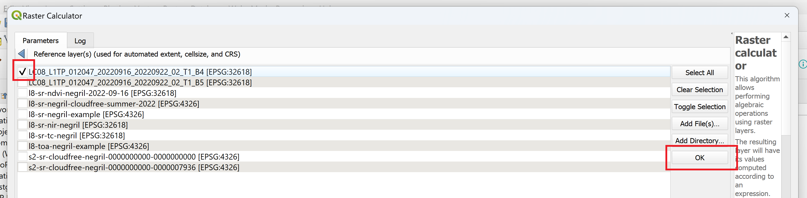

11. Haga clic en "... > Guardar en archivo..." junto al campo "Salida". Nombre el archivo "l8-sr-ndvi-negril-2022-09-16" y haga clic en "Guardar".
12. Haga clic en "Ejecutar". Una vez que el proceso haya terminado de ejecutarse, haga clic en "Cerrar" para cerrar la ventana. Guarde el proyecto.

¡Se ha agregado al lienzo una imagen con los valores NDVI de todo el ráster! Dado que es una imagen de una sola banda, se muestra automáticamente en escala de grises. Sin embargo, la mayoría de los parámetros son mucho más valiosos si se representan en color para que los datos puedan contar una historia impactante.

**Las reglas de oro de la visualización de datos.** La forma en que se presentan los datos puede ser tan importante como la forma en que se generaron. Si su audiencia no puede determinar ningún significado de sus datos, es poco probable que se tomen decisiones procesables a partir de ellos y se pueden dejar en los archivos para acumular polvo. Las imágenes a menudo transmiten un significado más poderoso que las palabras, lo que subraya la importancia de crear visualizaciones de datos bien pensadas. El proceso de hacer estas visualizaciones es una excelente oportunidad para la creatividad: la forma en que se deben mostrar los datos a menudo depende del contexto del proyecto y de los datos en sí, pero los siguientes consejos y trucos le darán algunas pautas generales para considerar mientras explora diferentes Técnicas y paletas de colores.

1. **Comience con una meta**. Comenzar con un objetivo proporciona la base para reunir los ingredientes de la visualización de datos con un propósito.
2. **Conoce tus datos**. Si bien casi cualquier cosa se puede convertir en datos y codificar visualmente, conocer el contexto detrás de los datos es tan importante como comprender los datos en sí. Este conocimiento también servirá para verificar que tiene los mejores datos para respaldar su objetivo.
3. **Pon a tu audiencia primero**. La visualización de datos rara vez es igual para todos, y su mensaje puede perderse si no se personaliza para su audiencia. Por lo tanto, enfócate en visualizar lo que tu audiencia necesita saber.
4. **Sea sensible a los medios**. Tener en cuenta cómo se verá la visualización lo ayudará a asegurarse de que su visualización llegue a su audiencia.
5. **Elige el gráfico correcto**. Conozca los puntos fuertes de cada tipo de gráfico y qué características clave de los datos visualizan mejor.
6. **Gráfico inteligente**. La capacidad de una visualización para llevar a su audiencia a las respuestas también puede conducir ocasionalmente a respuestas incorrectas. Las visualizaciones de datos no deben distorsionar, confundir o tergiversar.
7. **Use las etiquetas sabiamente**. Brinda contexto a tu audiencia al incluir un título simple y atractivo. Luego, etiquete los ejes para que sean fáciles de leer y apropiados para los datos que muestran. Minimizar el uso de leyendas.
8. **Diseño al grano**. El diseño excesivo hace que la información importante sea más difícil de encontrar, más difícil de recordar y más fácil de descartar. La clave para diseñar visualizaciones de datos es ser sencillo.
9. **Deja que los datos hablen**. El componente más importante de la visualización de datos son los datos. Use señales visuales estratégicamente para guiar a la audiencia y llamar su atención, pero deje que los datos cuenten la historia, no el diseño.
10. **La retroalimentación es algo bueno**. Tómese el tiempo para ajustar las visualizaciones interactuando con las partes interesadas para recopilar comentarios.

*Source: The Database, trends and applications (https://www.dbta.com)*

### Ejercicio 2.5 Personalizar la capa NDVI

Este ejercicio explora cómo elegir y personalizar una paleta de colores para visualizar más fácilmente la imagen NDVI creada en el Ejercicio 2.4.

1. Abra QGIS.
2. En "Proyectos recientes", seleccione "Intro-detección remota" y ábralo.
3. Haga clic derecho en “l8-sr-ndvi-negril-2022-09-16” y seleccione “Propiedades…”.
4. Seleccione la pestaña "Simbología" en el lado izquierdo de la ventana emergente.
5. Junto al campo "Tipo de procesamiento", seleccione "Pseudocolor de banda única" en el menú desplegable.

6. Junto al campo "Rampa de color", elija una de las siguientes opciones:
    1. Use una rampa de color preestablecida.
        1. Pase el cursor sobre "Todas las rampas de color" y seleccione una de las rampas de color prefabricadas. “RdYlGn” es una opción común para NDVI, donde el rojo indica valores bajos de NDVI y el verde indica valores altos de NDVI.

        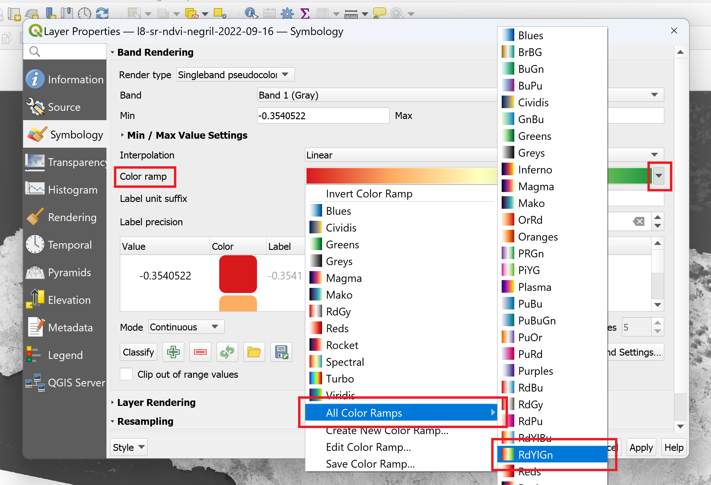

    2. Cree una rampa de color personalizada.
        1. Seleccione la opción "Crear nueva rampa de color...". Elija la opción "Gradiente" y haga clic en "Aceptar".

        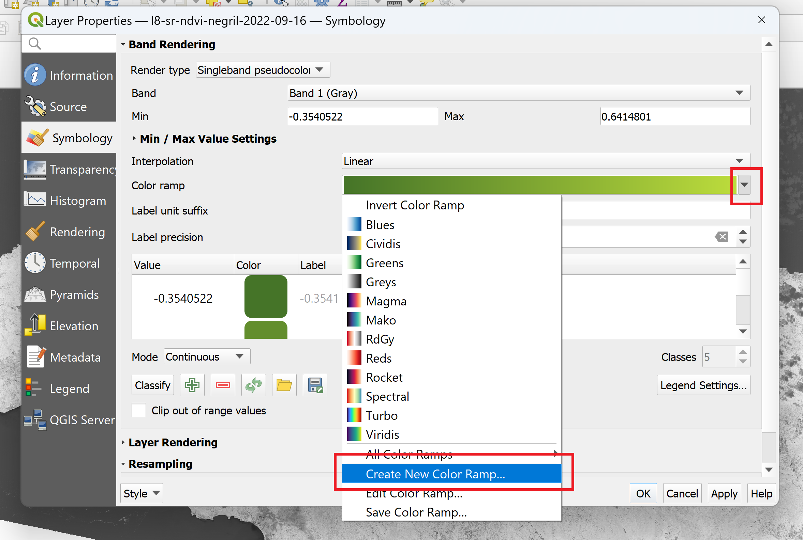

        2. Experimente con diferentes combinaciones de colores. Tenga en cuenta que el color elegido para el "Color 1" corresponderá a los valores mínimos de NDVI y el "Color 2" corresponderá a los valores máximos de NDVI.

        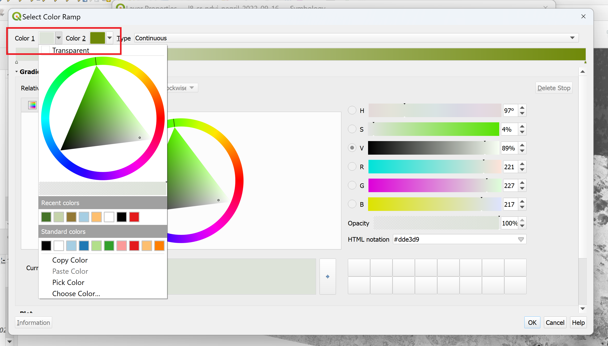

        3. Si desea agregar colores adicionales, haga doble clic en la barra de degradado en la posición donde desea agregar esos colores.
        4. Haga clic en "Aceptar".
7. Haga clic en "Aplicar". Si le gusta cómo aparece la imagen, haga clic en "Aceptar" para cerrar la ventana. Guarde el proyecto.

*NDVI con rampa de color RedYlGrn y mín./máx. ajustados a -1 y 1, respectivamente.*

Esta imagen es mucho más fácil de interpretar en comparación con la imagen en escala de grises. Dependiendo de la paleta de colores que elija, las áreas con mucha vegetación (valores altos de NDVI) aparecen de color más verde, mientras que las áreas sin vegetación y los cuerpos de agua (bajo NDVI) aparecen de color más rojo. Compare las áreas protegidas con las áreas no protegidas. ¿Parecen tener diferentes características de vegetación?

### Desafío 1: Cuantificar el NDVI derivado de Landsat 8

La inspección visual es útil para contar una historia con datos, pero los números también pueden contar una historia. Use QGIS para encontrar el valor medio y mediano de NDVI dentro del Área Ambiental Protegida de Negril y en las áreas no protegidas del oeste de Jamaica. Compare los valores para ver si hay una diferencia en los niveles de vegetación entre áreas protegidas y no protegidas.
*Sugerencia 1: deberá usar l8-sr-ndvi-negril-2022-09-16.tif, agregar negril_pa_shapefile.shp negril-pa-shapefile.zip y **non_protectedArea_savanna.shp** como dos capas en el proyecto.*
*Sugerencia 2: Usando todo el límite de Jamaica (jam_admbnda_adm0.shp), primero recorte **negril_pa_shapefile.shp** para obtener el área protegida solo en tierra (sin la porción de mar), y guarde el nuevo archivo de forma como **negril_pa_shapefile_NoSea .shp**. Utilice este nuevo archivo de formas para comparar los valores de NDVI.*
*Sugerencia 3: La herramienta Estadísticas zonales será útil en este ejercicio. Busque la Caja de herramientas de procesamiento → Análisis de ráster → Herramienta de estadísticas zonales. Podrá especificar las estadísticas que desee (media, máx., mín., etc.)... y luego los resultados se agregarán en la tabla de atributos de la capa del archivo de forma utilizada.*

### Desafío 2: Calcular un NDWI derivado de Landsat 8

El índice de agua de diferencia normalizada (NDWI) es una medida bien conocida para estimar el contenido de agua en la superficie de la Tierra. Use un proceso similar al que usamos para el ejercicio NDVI para obtener los valores NDWI.
