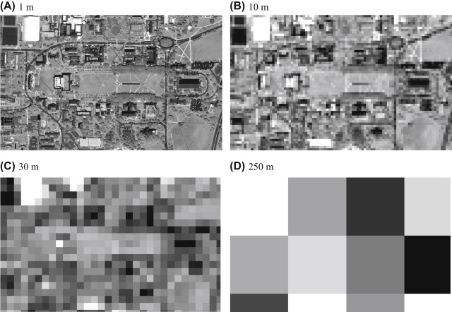
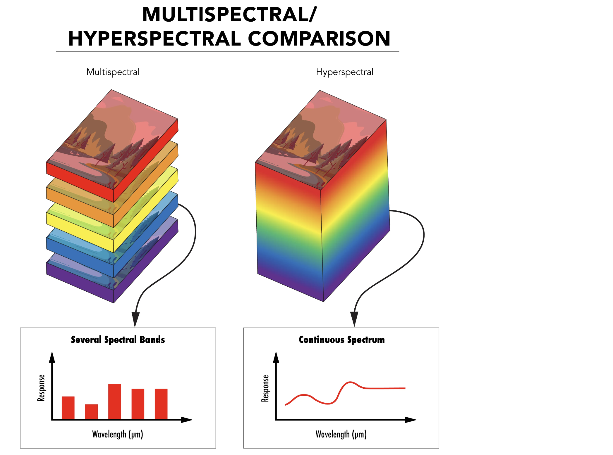
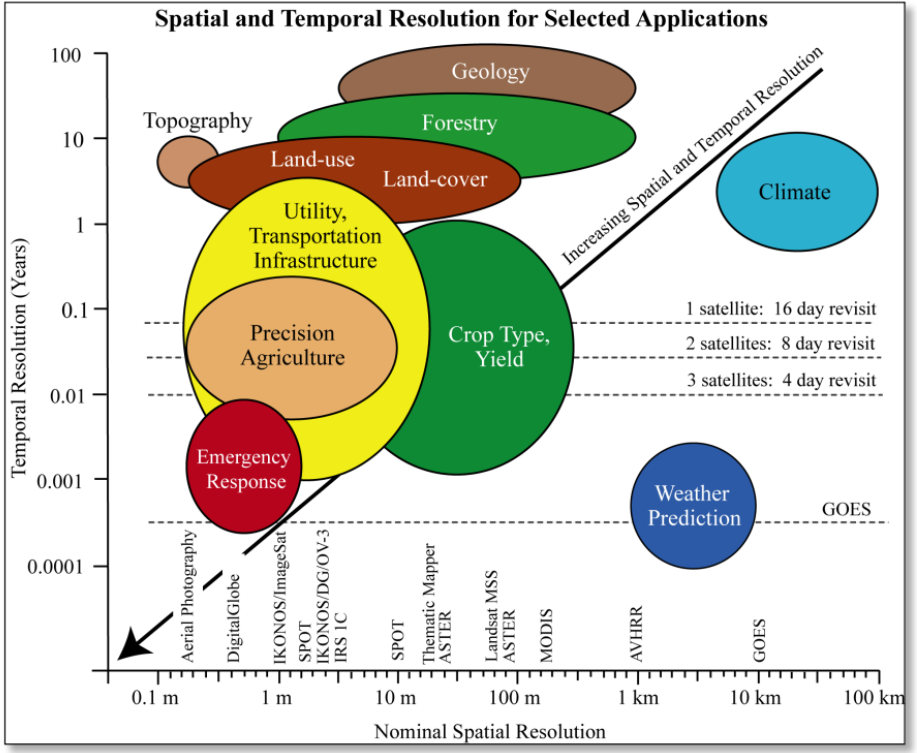

# Introducción

¡Bienvenido a la sesión de Introducción a SIG y Teledetección! Este taller brindará una descripción general de la teledetección y explorará algunos métodos para acceder y analizar estos datos. Para comenzar, esta sección cubrirá una serie de conceptos fundamentales de detección remota y brindará información de los satélites y sensores clave que se deben tener en cuenta a lo largo de los próximos módulos.

## Configuración prévia

1. [Instalar QGIS](https://www.qgis.org/en/site/forusers/download.html) si aún no está instalado.
2. Crear una [cuenta de Earth Explorer](https://ers.cr.usgs.gov/register).
3. Crear una [cuenta Copernicus Open Access Hub](https://scihub.copernicus.eu/dhus/#/self-registration)
4. [Descargar](https://drive.google.com/drive/folders/1p-ZAwhuVXRD-VzAujLk_IQ-gGmGq9ADQ?usp=share_link) y comprimir la carpeta de datos para la lección. Guarde la carpeta comprimida en su escritorio (Desktop). Asegúrese de que la carpeta se llame `intro-rs-data`.

## Objetivos

1. Comprender cómo se recopilan y almacenan los datos satelitales de detección remota.
2. Diferenciar entre resolución espacial y temporal.
3. Aprender datos clave sobre los satélites y sensores más utilizados.

## Recopilación de datos

**¿Qué es la teledetección?** La teledetección es el proceso de obtener información sobre un objeto o un área sin estar directamente en contacto con ese objeto. Este método permite a los científicos recopilar datos a través de distancias muy amplias o en áreas inaccesibles a intervalos regulares para monitorear y mapear los cambios a lo largo del tiempo. El nivel de detalle, precisión y frecuencia de los datos recopilados depende del satélite y el sensor que se utilizó para recopilarlos.

**¿Cómo se recopilan los datos?** Los satélites llevan uno o más sensores que miden el nivel de radiación electromagnética proveniente de la Tierra y su atmósfera. El nivel cambia según las diferentes condiciones atmosféricas y de la superficie. Esas variaciones nos dan información sobre las condiciones atmosféricas y superficiales dentro del sistema de la Tierra.

Figura 1. Componentes de la radiación terrestre. Fuente de la imagen: NASA ARSET.

Toda la radiación, o energía electromagnética, viaja en ondas o tamaños variables. Esas diferencias se pueden ver en el espectro electromagnético a continuación.

Figura 2. Espectro electromagnético. Fuente de la imagen: Google.

La radiación que miden los sensores se presenta en dos formas principales:

1. Radiación solar **reflejada**
2. Radiación infrarroja y microondas **emitida**

Diferentes tipos de objetos absorberán y emitirán energía en diferentes longitudes de onda. Un ejemplo común es el de la vegetación verde y saludable: las longitudes de onda rojas y azules se absorben, mientras que las longitudes de onda verdes e infrarrojas se reflejan o se emiten de vuelta. La cantidad de energía que se refleja o emite también difiere entre los objetos. La nieve, por ejemplo, refleja hasta el 90% de la radiación solar, mientras que el océano solo refleja alrededor del 6%. En cambio, el océano emite mucha más radiación infrarroja que la nieve, ya que la mayor parte de la energía que se absorbe se vuelve a emitir. Todas estas diferencias conforman la firma espectral única de un objeto que se puede medir y utilizar para un análisis posterior.

Figura 3. Firma espectral de la vegetación. Fuente de la imagen: Living Textbook, ITC, Universidad de Twente.

**Mediciones pasivas frente a activas.** Los sensores pueden ser pasivos o activos: los sensores pasivos utilizan la energía del sol para medir la energía reflejada, mientras que los sensores activos proporcionan su propia fuente de energía para realizar las mediciones. Los sensores pasivos tienden a operar dentro de las longitudes de onda visible, infrarroja, infrarroja térmica y de microondas (onda corta) del espectro electromagnético y miden índices como la temperatura de la superficie del mar, la calidad del agua, la vegetación y las propiedades de las nubes. Estos sensores, sin embargo, experimentan desafíos con la penetración de la cubierta de nubes. Los sensores activos operan principalmente en la longitud de onda de microondas (onda larga) del espectro electromagnético. El radar y el lidar son los ejemplos más comunes de este tipo de sensores y son útiles para medir características como la elevación. Estos sensores se pueden usar de día o de noche y pueden penetrar la capa de nubes, pero son más difíciles de procesar y pueden tener una disponibilidad limitada. 

El resto de la lección y los próximos talleres se centrarán en la percepción remota pasiva.

## Resolución

**¿Cuáles son los diferentes tipos de resolución?** La resolución define características particulares de un satélite que pueden ayudar a determinar la efectividad de su uso en diferentes aplicaciones científicas. Hay dos tipos fundamentales de resolución: (1) **Resolución espacial** determina el nivel de detalle que captura el satélite en cada píxel de medida. Por ejemplo, si un satélite tiene una resolución de 30 metros, eso significa que cada píxel cubre un área de superficie de 30 metros por 30 metros. (2) **Resolución temporal** indica la frecuencia con la que el satélite recopila sus datos para la misma ubicación. Un satélite con una resolución temporal de 5 días, recopila nuevas imágenes en un lugar determinado cada 5 días. La resolución temporal a menudo se denomina "tiempo de revisión" y la resolución espacial se denomina simplemente "resolución".

Figura 4. Imagen cuadriculada que indica la diferencia entre alta y baja resolución. Fuente de la imagen: Liang & Wang, 2020

**Rugosidad.** Los satélites pueden tener una resolución espacial y temporal baja, moderada o alta. Un satélite con una alta resolución espacial no significa que también vaya a poseer una alta resolución temporal, y viceversa. De hecho, con muchas de las observaciones de la Tierra de la NASA disponibles gratuitamente, es difícil obtener una alta resolución espacial y temporal, ya que una alta resolución espacial requiere una franja más estrecha, lo que da como resultado un tiempo de revisita menos frecuente. Si bien no hay rangos numéricos definitivos para los diferentes niveles de resolución, las sugerencias a continuación dan una idea de qué valores se consideran generalmente dentro de las categorías de resolución espacial y temporal baja, moderada o alta:

* Espacial
  * Bajo: > 100 metros
  * Moderado: 15-100 metros  
  * Alto: < 15 metros
* Temporal
  * Baja: > 5 días
  * Moderado: 3-5 días
  * Alta: < 3 días

## Cómo se almacenan los datos

**El almacenamiento depende del tipo de datos.** Hay cuatro tipos generales de imágenes de detección remota pasiva: visible, infrarroja, multiespectral e hiperespectral. Los datos visibles están formados por píxeles que se encuentran dentro de las longitudes de onda rojas, verdes o azules. Luego, esos píxeles se almacenan en una de las tres bandas rojas, verdes o azules correspondientes dentro de una imagen de trama. Las imágenes infrarrojas se expanden sobre las imágenes visibles al incluir píxeles dentro del rango infrarrojo del espectro que se almacenan en bandas separadas. Las imágenes ráster multiespectrales generalmente se componen de 7 a 12 bandas que incluyen las bandas visibles y múltiples bandas infrarrojas en todo el espectro electromagnético. Los datos hiperespectrales contienen la mayor cantidad de detalles, ya que esas imágenes ráster pueden estar formadas por cientos de bandas estrechas en todo el espectro electromagnético.

Figura 5. Banda multiespectral vs hiperespectral. Fuente de la imagen: *Imágenes hiperespectrales y multiespectrales*, Edmund Optics, 2022

Se accede a los valores almacenados en estas bandas y se analizan utilizando diferentes herramientas que cubriremos en los próximos talleres.

## Satélites y sensores clave

Varios de estos satélites y sensores son particularmente útiles para aplicaciones hidrológicas.

|   Satelite   |                  Sensor                 |      Fechas     |  Resolución  | Tiempo de revisita |  Provedor |
|:------------:|:---------------------------------------:|:---------------:|:------------:|:------------------:|:---------:|
| Landsat 4, 5 | TM                                      | 1982 - 2013     | 30 m         | 16 días            | NASA/USGS |
| Landsat 7    | ETM+                                    | 1999 - 2022     | 30 m         | 16 días            | NASA/USGS |
| Landsat 8    | OLI/TIRS                                | 2013 - presente | 30 m         | 16 días            | NASA/USGS |
| Landsat 9    | OLI-2/TIRS-2                            | 2021 - presente | 30 m         | 16 días            | NASA/USGS |
| Sentinel-2   | MSI                                     | 2015 - presente | 10 m         | 5 días             | ESA       |
| Terra, Aqua  | MODIS                                   | 2000 - 2025     | 250 m - 1 km | 1 día              | NASA      |
| Suomi NPP    | VIIRS                                   | 2013 - presente | 375-750 m    | 1 día              | NASA      |
| PlanetScope  | PS2/PS2.SD                              | 2016 - presente | 3 m          | 1 día              | Planet    |
| GPM          | GMI, DPR                                | 2014 - presente | 10 km        | 1-2 horas          | NASA/JAXA |
| SMAP         | Soil Moisture Active Passive            | 2015 - presente | 3 km         | 3 días             | NASA      |
| GRACE        | Gravity Recovery and Climate Experiment | 2002 - presente | 300-400 km   | 1 mes              | NASA      |

Figura 6. Ejemplo de Aplicaciones. Fuente de la imagen: *Universidad de Maryland*
