# Elaboración de mapas

Hacer y personalizar un mapa es un componente crucial del análisis GIS. Usaremos un conjunto de puntos de altura generados desde Google Earth para el área de estudio con el fin de crear un modelo de elevación digital (DEM).

Primero, generamos un conjunto de puntos (ruta) en Google Earth. Agregamos nuestro shapefile de área protegida de tierra única.

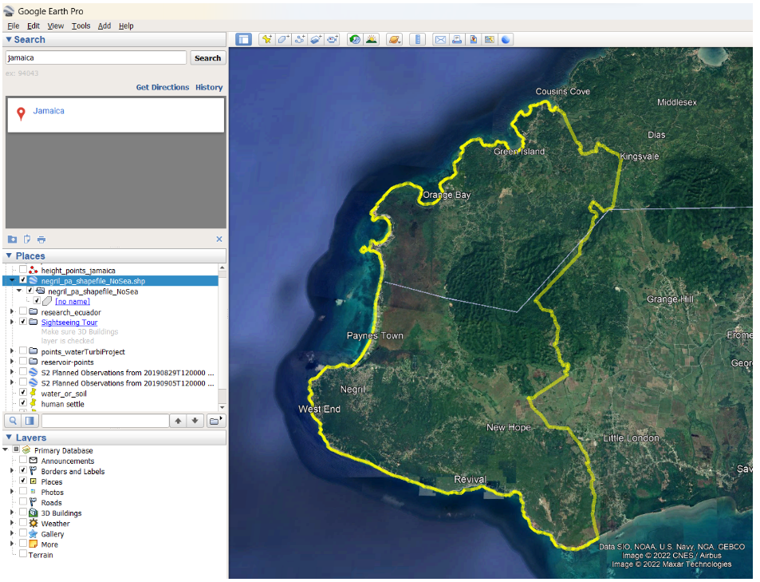

Agreguemos un camino sobre nuestra capa y rastreémoslo a través de toda el área de estudio:

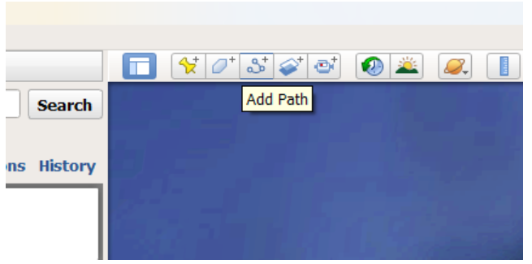

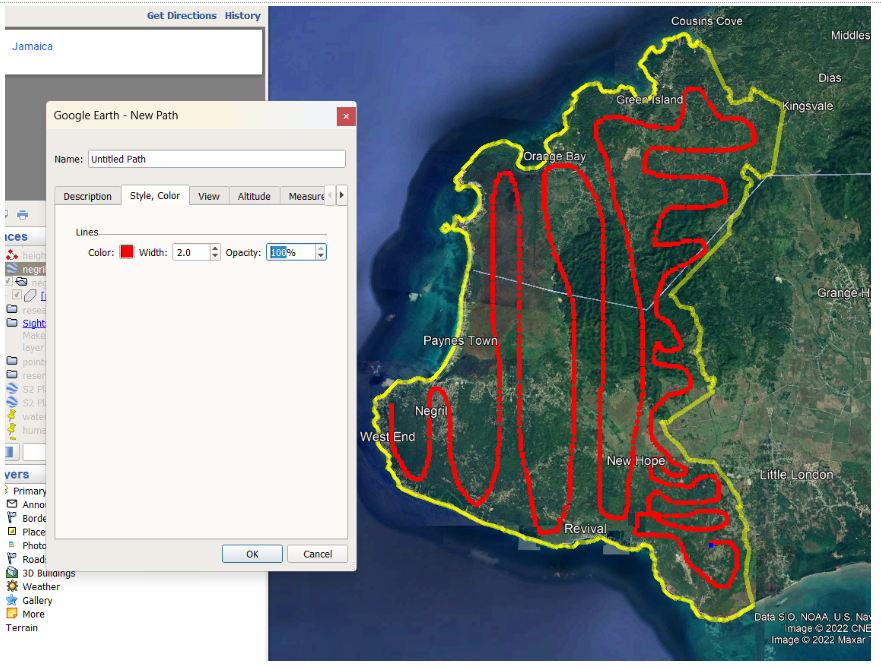

Llamemos a la ruta **points_jamaica_pa** y usemos la opción 'Guardar lugar como' con la extensión *.kml*.

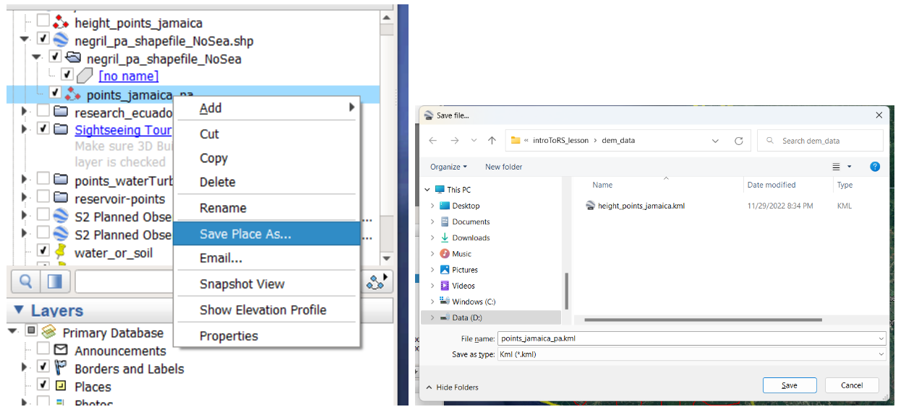

Ahora podemos usar cualquiera de los servicios web en línea disponibles, por ejemplo, el visualizador GPS [(https://www.gpsvisualizer.com/elevation)](https://www.gpsvisualizer.com/elevation) para convertir nuestro archivo Kml en un archivo GPX, que es un formato válido para la entrada de puntos de altura en QGIS. Usamos el botón Convertir y agregar elevación, luego descargamos el archivo.

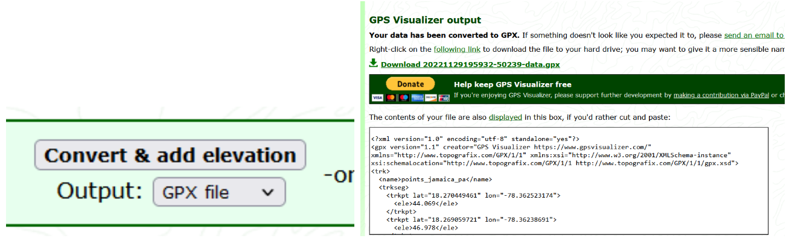

Podemos renombrar el archivo descargado. Ahora vamos a QGIS. Asegurémonos de haber instalado el Importador de segmentos GPX.

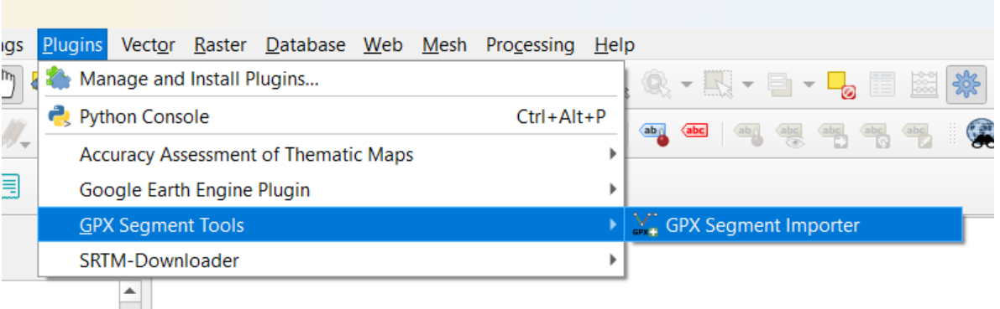

E importamos el archivo GPX.

Posteriormente, extraemos los vértices. Establecemos un nombre de archivo de salida como **points_jamaica_pa.shp**.

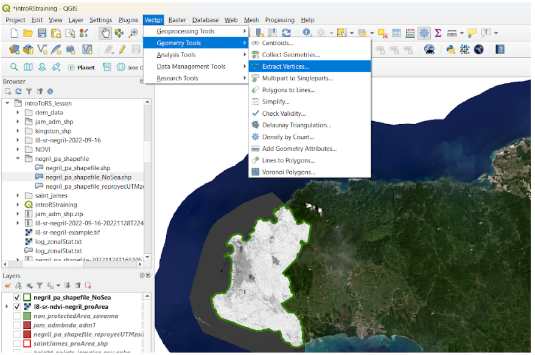

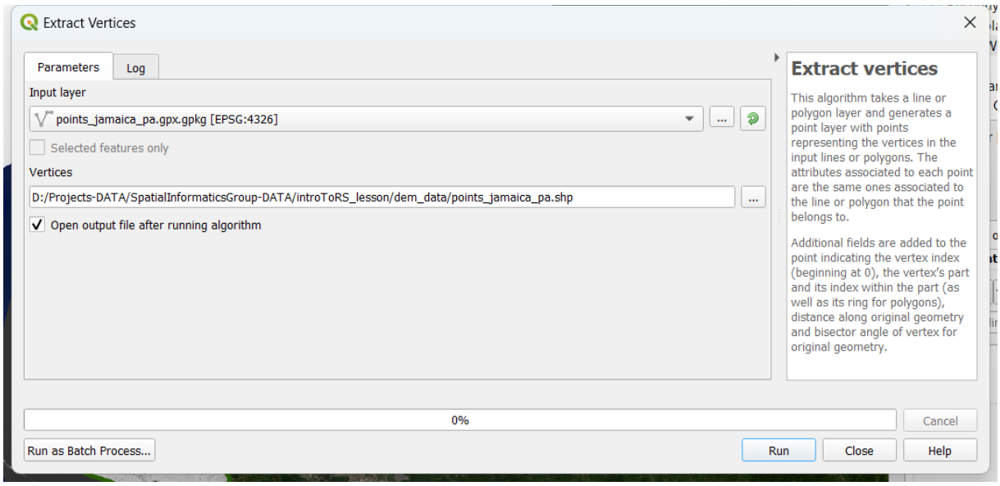

Ejecutamos el proceso y obtenemos nuestro shapefile de puntos de elevación. Abramos la tabla de atributos del archivo y podremos ver el campo de elevación con la información requerida para la creación del modelo digital de elevación (DEM).

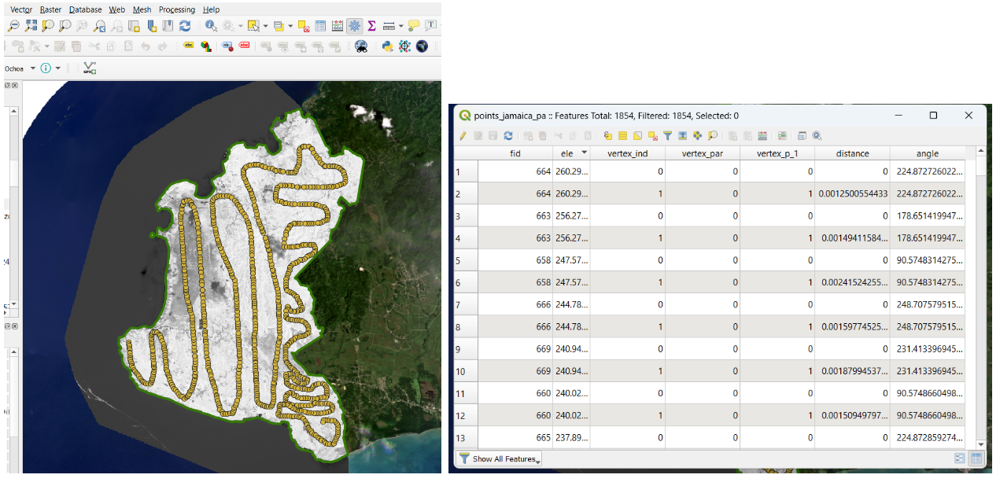

Ahora es el momento de generar nuestro DEM. Tenemos que abrir ToolBox y buscar la función Inverse Distance Weighted (IDW).

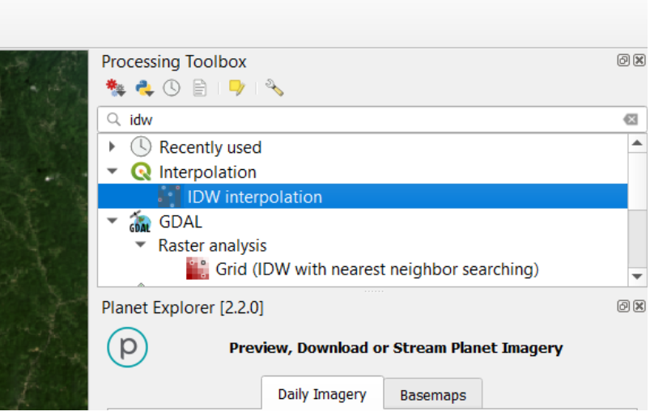

Seleccionamos nuestro shapefile de puntos o vértices y el atributo para la interpolación ***‘ele’***.

Hacemos clic en el botón más y se agrega la capa correspondiente. Establecemos la extensión desde nuestro archivo de forma **negril_pa_shapefile_NoSea**, definimos un nombre **dem_negril_pa.tif** y ejecutamos el proceso.

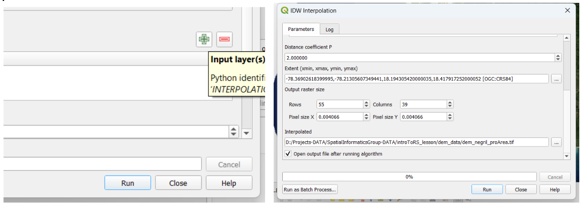

Nuestro DEM finalmente se crea. Se ve de color gris, por lo que debemos definir una configuración de visualización adecuada.

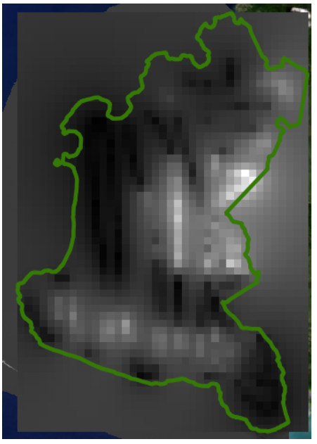

Vamos a Propiedades → Simbología → seleccionamos la opción de pseudo-color de banda única. Luego elegimos una Nueva rampa de color:

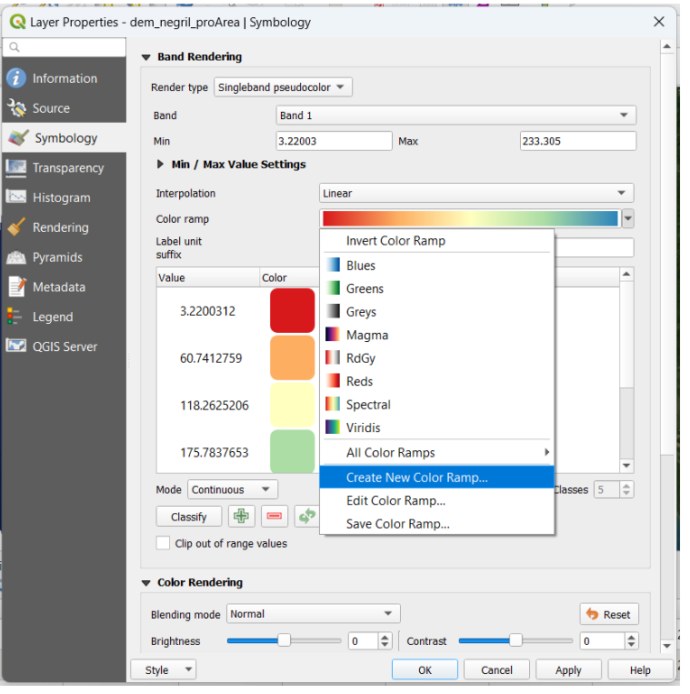

A continuación, seleccionamos la opción de tipo de rampa, la categoría Topografía, y elegimos la paleta de elevación.

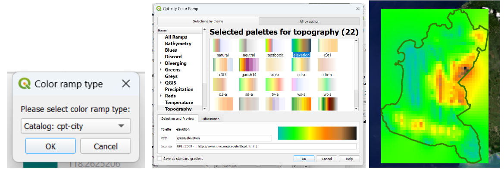

Ahora trabajemos en la creación de un mapa a partir de nuestras capas. Vamos al menú Proyecto. Necesitamos establecer un ***Nuevo diseño de impresión***:

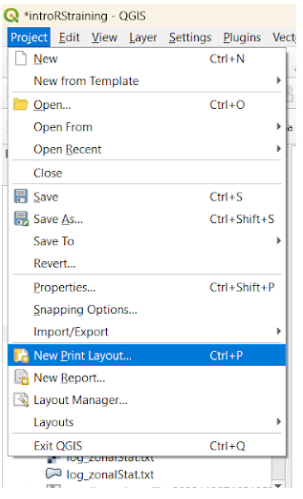

Luego, dentro del menú ***Agregar elemento***, usamos ***Agregar mapa***:

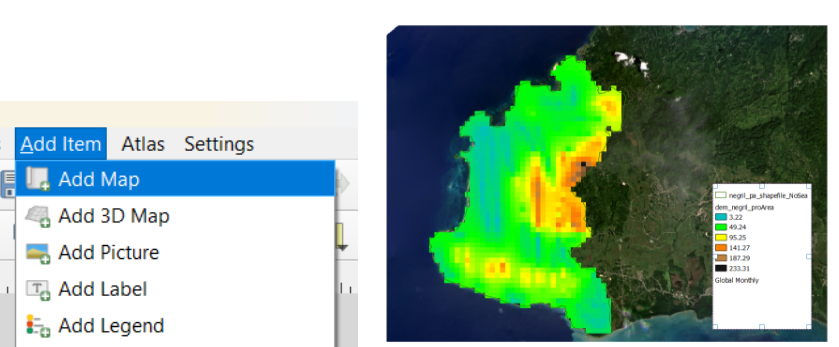

Debe incluir los elementos básicos para una creación cartográfica formal: leyenda, barra de escala, flecha de norte, título. Asegúrese de proporcionar un formato y una fuente apropiados para cada elemento.

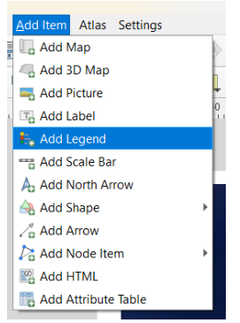

Finalmente obtuvimos nuestro mapa. Podemos usar ‘Exportar imagen’, elegir el tipo de archivo (png, jpeg, bmp, etc.) y guardarlo en nuestra carpeta de trabajo.

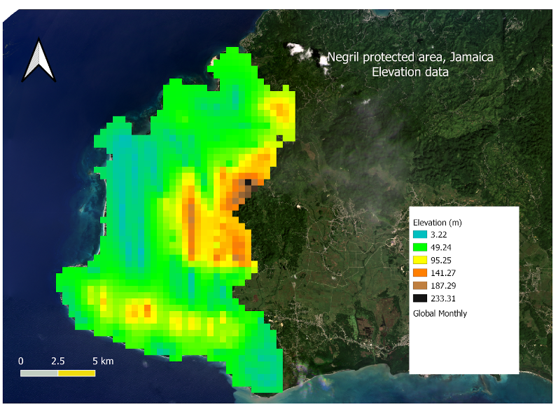

### Desafío 4: crear una capa de sombreado

Basado en el último DEM que acabamos de crear, cree un mapa de sombreado y luego cree un mapa con todos los elementos necesarios.

*Sugerencia: Use la herramienta HillShade del menú Ráster -> Análisis/Análisis del terreno*.

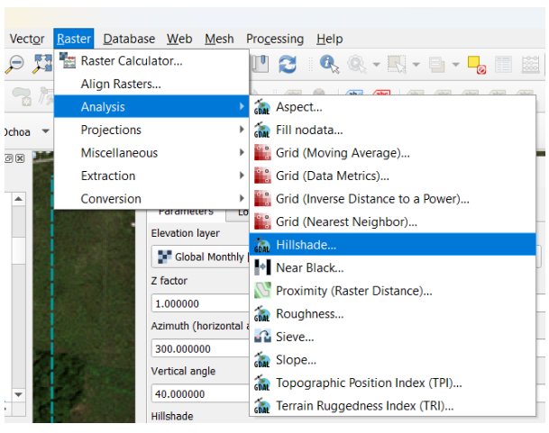
