# Soluciones de los Desafíos: Introducción a la Teledetección

## Desafío 1: Cuantificar el NDVI derivado de Landsat 8

La inspección visual es útil para contar una historia con datos, pero los números también pueden contar una historia. Use QGIS para encontrar el valor medio y mediano de NDVI dentro del Área Ambiental Protegida de Negril y en las áreas no protegidas del oeste de Jamaica. Compare los valores para ver si hay una diferencia en los niveles de vegetación entre áreas protegidas y no protegidas.

- *Sugerencia 1: deberá usar l8-sr-ndvi-negril-2022-09-16.tif, negril_pa_shapefile.shp y non_protectedArea_savanna.shp como dos capas diferentes en el proyecto.*
- *Sugerencia 2: Usando todo el límite de Jamaica (jam_admbnda_adm0.shp), primero recorte el negril_pa_shapefile.shp para obtener el área protegida solo en tierra (sin la porción de mar), y guarde el nuevo archivo de forma como negril_pa_shapefile_NoSea.shp. Utilice este nuevo archivo de formas para comparar los valores de NDVI.*
- *Pista 3: La herramienta Estadísticas zonales será útil en este ejercicio. Busque la Caja de herramientas de procesamiento → Análisis de ráster → Herramienta de estadísticas zonales. Podrá especificar las estadísticas que desee (media, máx., mín., etc.)... y luego los resultados se agregarán en la tabla de atributos de la capa del archivo de forma utilizada.*

1. Recortar el archivo de formas del área protegida. Añadimos el límite de Jamaica

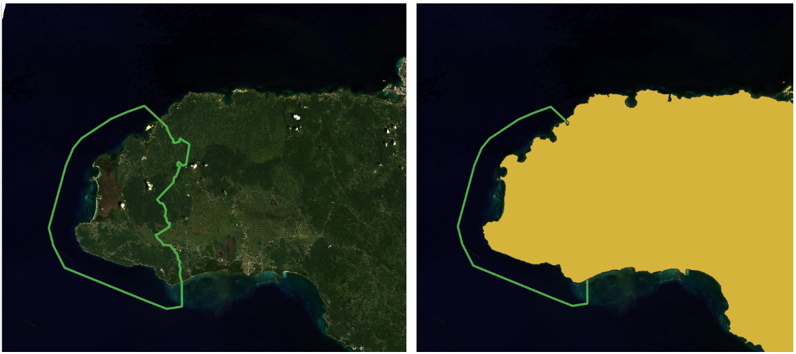

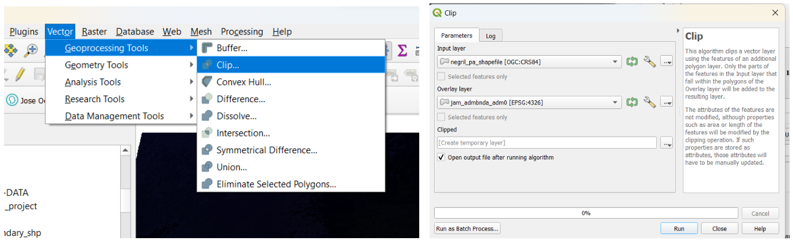

Guardemos el nuevo shapefile con el nombre *negril_pa_shapefile_NoSea.shp*.

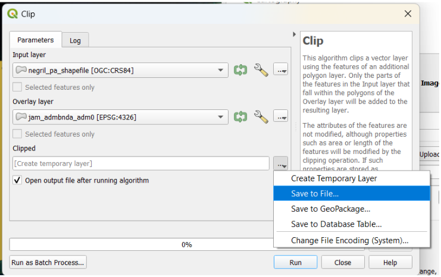

Finalmente obtuvimos nuestra área protegida exclusivamente sobre tierra, sin la porción de mar.

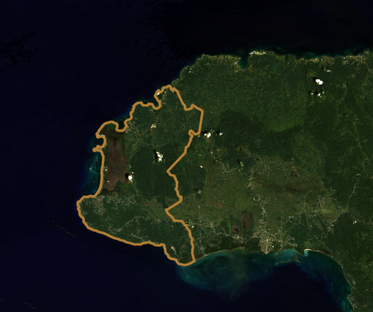

2. Cargamos el *non_protectedArea_savanna.shp* y la capa raster NDVI *l8-sr-ndvi-negril-2022-09-16.tif*.

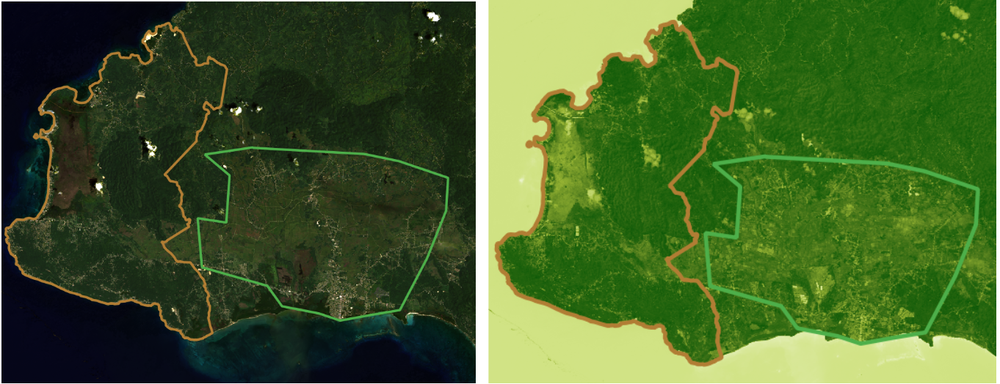

El rango de valores va desde -0.28 a 0.64 valores NDVI.

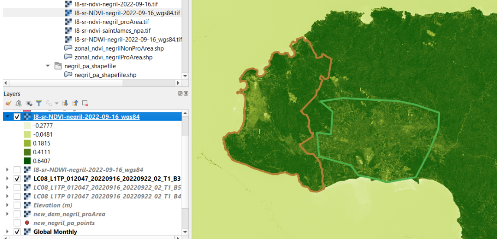

Usamos la herramienta Estadísticas zonales de la caja Herramienta de procesamiento.

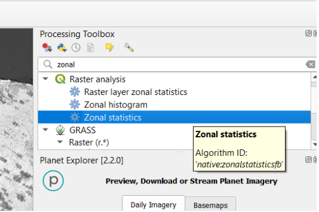

Seleccionamos como capa de entrada el shapefile correspondiente a la zona específica donde queremos calcular las estimaciones.

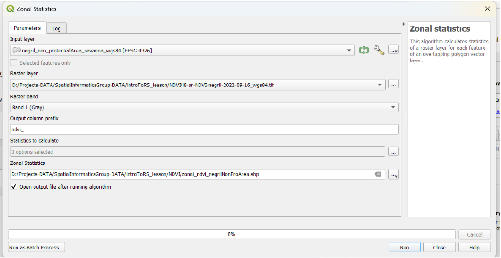

Como capa raster seleccionamos la capa general NDVI que compromete todo el territorio de Jamaica. Establecemos el prefijo como “ndvi_”. Más tarde, podemos elegir los valores de la media y la mediana para hacer una comparación adecuada entre las estimaciones totales del NDVI entre áreas protegidas y no protegidas.

Definimos los nombres de las nuevas capas como *zonal_ndvi_negrilProArea.shp* y *zonal_ndvi_negrilNonProArea.shp*. Los resultados se agregan en la tabla de atributos de la capa del archivo de forma. Las siguientes tablas muestran las estimaciones para los valores medios y medianos de NDVI de las áreas protegidas y no protegidas.

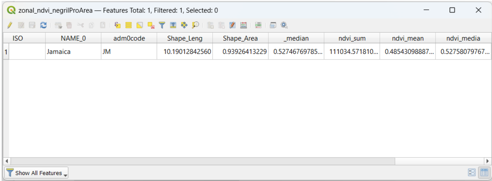

El área protegida representa una media de 0,49 y una mediana de 0,53 de NDVI.

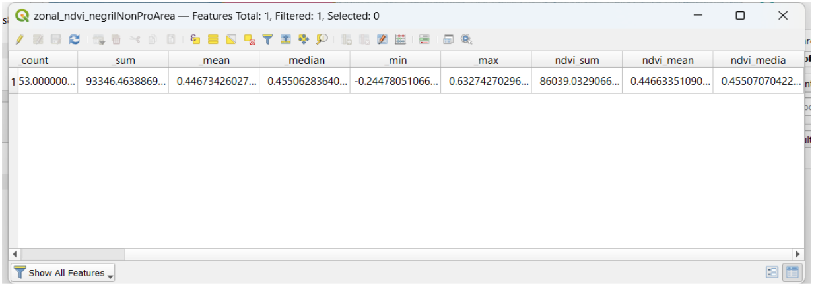

El área no protegida (sabana) representa una media de 0,45 y una mediana de 0,46 de NDVI.

Estos valores son más bajos de lo esperado. Los valores de NDVI en áreas protegidas deberían ser más altos debido a una mayor biomasa vegetal y políticas de conservación para áreas boscosas.

## Desafío 2: Calcular un NDWI derivado de Landsat 8

El índice de agua de diferencia normalizada (NDWI) es una medida bien conocida para estimar el contenido de agua en la superficie de la Tierra. Use un proceso similar al que usamos para el ejercicio NDVI para obtener los valores NDWI.

El NDWI se puede calcular utilizando la fórmula siguiente: NDWI = (Banda 3 – Banda 5) / (Banda 3 + Banda 5) (McFeeters (1996))

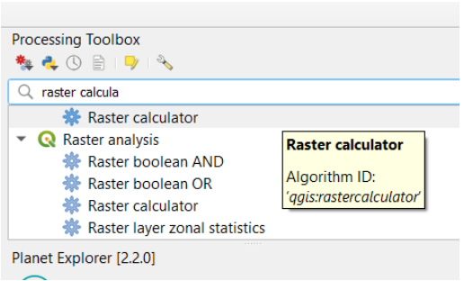

Elegimos las bandas adecuadas según la fórmula

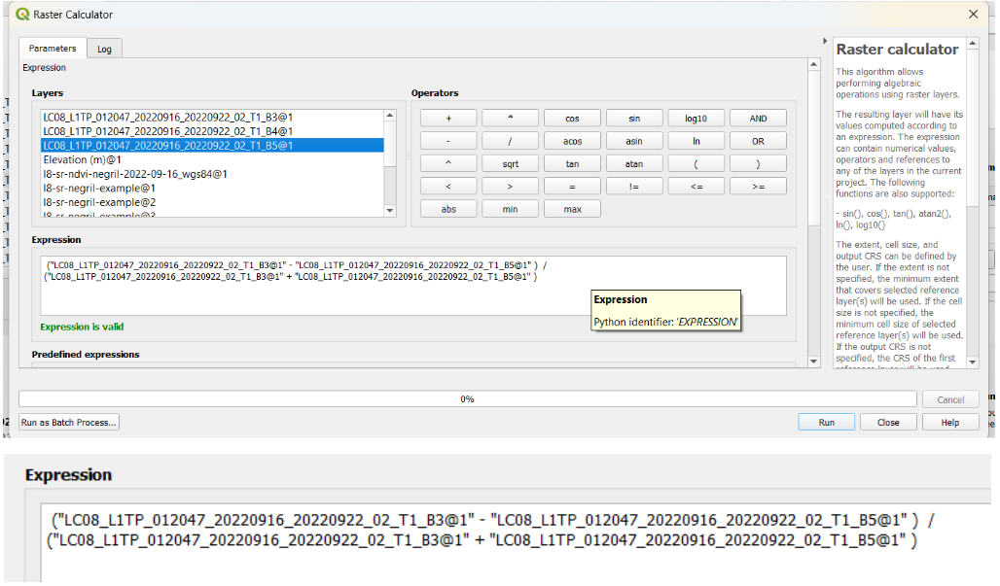

Para la capa de referencia elegimos B3 o B5. Guardamos los nuevos productos como *l8-sr-NDWI-negril-2022-09-16_wgs84.tif*. La extensión y el sistema de referencia de coordenadas de salida (CRS) se establecen con los valores predeterminados (extensión del lienzo del mapa).

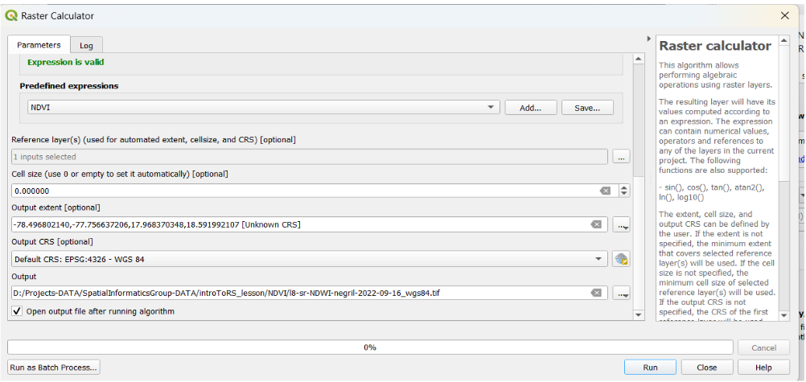

Nuestro resultado es una capa ráster de rango [-1, 1] que resalta el contenido de agua. Por ejemplo el océano luce un azul más intenso.

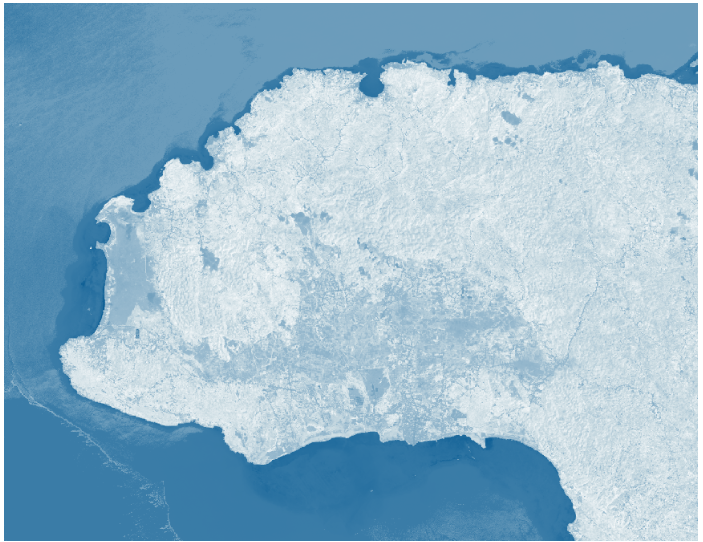

Los humedales aparecerán azulados, mientras que la tierra desnuda se verá más oscura.

## Desafío 3: Cuantificar el NDVI derivado de Sentinel-2

Use QGIS para encontrar los valores medios y medianos de NDVI dentro de las áreas protegidas dentro de Negril y en las áreas no protegidas de Negril. Compare los valores para ver si hay una diferencia en los niveles de vegetación entre áreas protegidas y no protegidas. ¿Estos valores difieren de los valores calculados en el Desafío 1?

- *Pista 1: Deberás agregar negril-pa-shapefile.zip y **non_protectedArea_savanna.shp** como dos capas diferentes en el proyecto.*
- *Sugerencia 2: la herramienta Estadísticas zonales será útil en este ejercicio.*

Aplicamos nuevamente la función de estadísticas zonales tanto a las áreas protegidas como a las no protegidas, esta vez con una imagen Sentinel a una resolución espacial de 10 m. Prefijo '_ndvi'.

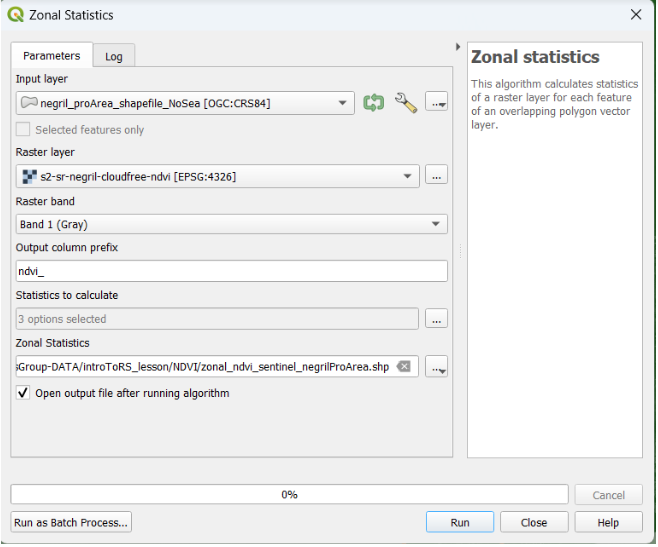

Guardamos el nuevo ráster con los nombres *zonal_ndvi_sentinel_negrilProArea.shp* y *zonal_ndvi_sentinel_nonProArea.shp*.

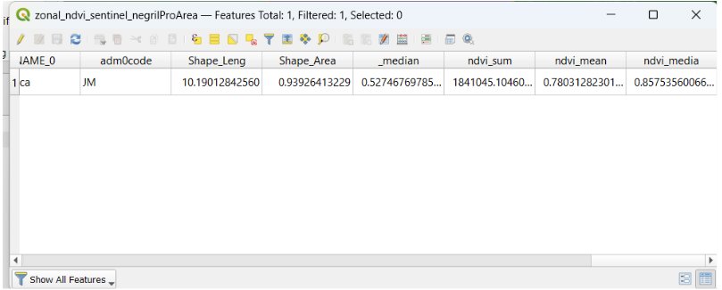

Nuevamente, los valores de NDVI en el área protegida son más altos que en el área no protegida, como esperábamos. PA NDVI media 0,78 mientras que NPA NDVI media es 0,71

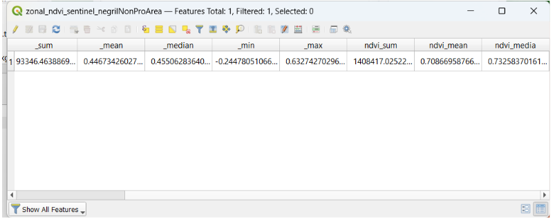

La diferencia entre las estimaciones de áreas protegidas y no protegidas no es grande, sin embargo, aún revela la mayor presencia de vegetación en el Área Ambiental Protegida de Negril.

## Desafío 4: Crear una capa de sombreado

Basado en el último DEM que acabamos de crear, cree un mapa de sombreado y luego cree un mapa con todos los elementos necesarios.
*Sugerencia: utilice la herramienta HillShade del menú Ráster -> Análisis/Análisis del terreno*

Vamos a Terreno de análisis, y usamos la herramienta Sombreado.

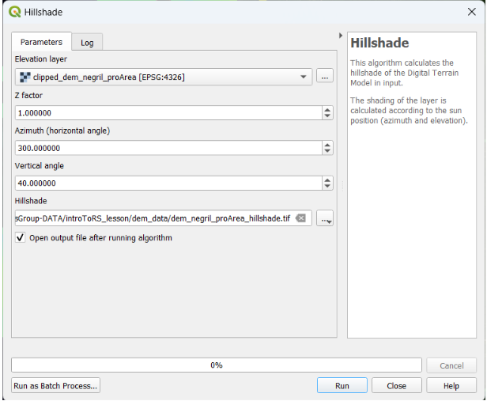

Podemos usar el factor Z como 1, y el ángulo azimutal y cenital (vertical) por defecto (300° y 40° respectivamente). Definimos el nombre del nuevo archivo como dem_negril_proArea_hillshade.tif.

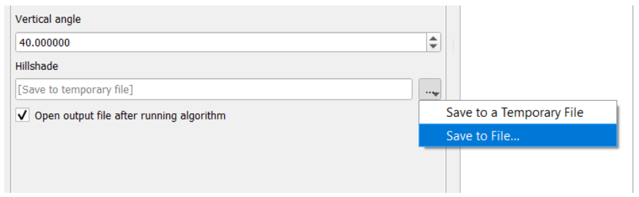

Obtenemos nuestra capa de sombreado. Sin embargo, es hora de proporcionar una simbología adecuada.

Vamos a Simbología de la capa.

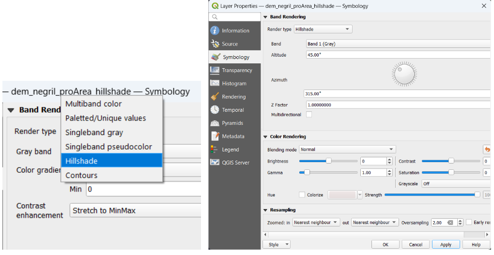

Aplicamos este tipo de render 'Hillshade'. Usamos los parámetros de visualización por defecto.

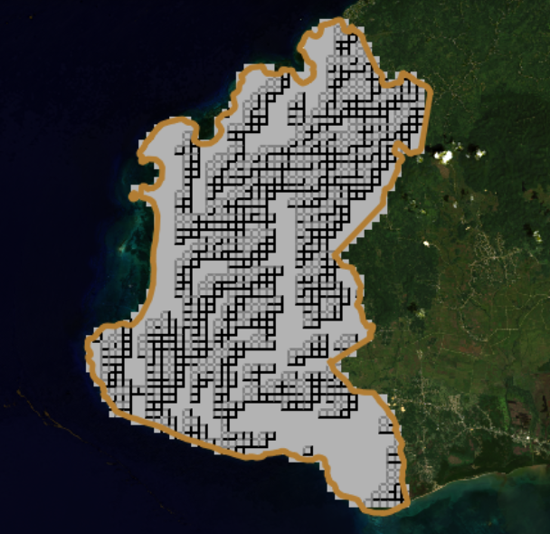

La capa de sombreado se ve pixelada. Esto se puede mejorar fácilmente aumentando el número de puntos de altura recopilados.
